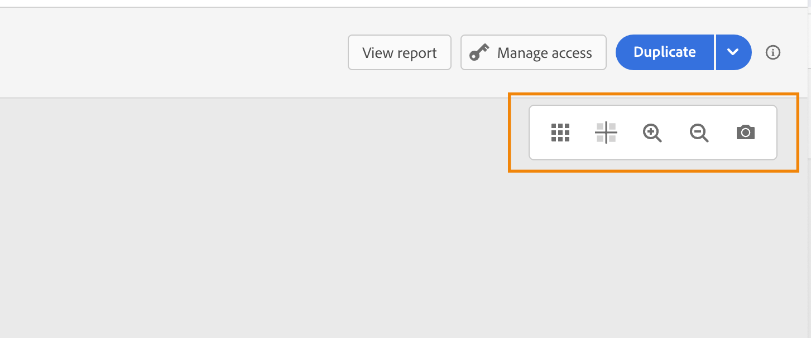
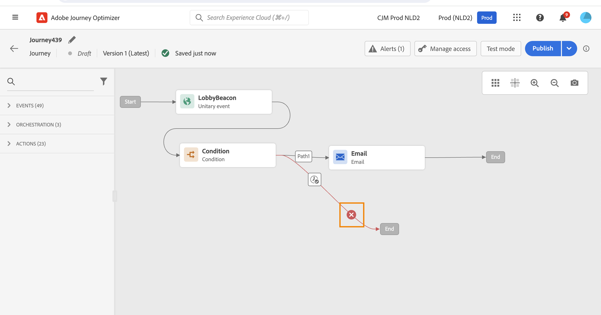

# Projetar a jornada {#design-your-journey}

>[!CONTEXTUALHELP]
>id="ajo_journey_canvas"
>title="Projetar a jornada"
>abstract="A interface de jornada permite arrastar e soltar facilmente as atividades da paleta na tela. Você também pode clicar duas vezes em uma atividade para adicioná-la à tela na próxima etapa disponível."

O Adobe Journey Optimizer inclui uma tela de orquestração omnicanal que permite aos profissionais de marketing harmonizar o alcance do marketing com o engajamento individual com clientes. A interface de usuário do permite arrastar e soltar facilmente as atividades da paleta na tela para criar sua jornada. Observe que você também pode clicar duas vezes em uma atividade para adicioná-la à tela na próxima etapa disponível.

Eventos, atividades de orquestração e ação têm um papel e um lugar específicos no processo. As atividades são sequenciadas: quando uma atividade é concluída, o fluxo continua e processa a próxima atividade e assim por diante.

## Introdução ao design do jornada {#gs-journey-design}

A variável **paleta** está no lado esquerdo da tela. Todas as atividades disponíveis são classificadas em várias categorias: [Eventos](#jo-event), [Orquestração](#jo-orch) e [Ações](#jo-actions). Você pode expandir/recolher as diferentes categorias clicando no nome delas. Para usar uma atividade na jornada, arraste-a e solte-a da paleta na tela.

Ao iniciar uma nova jornada, os elementos que não podem ser soltos na tela na primeira etapa ficam ocultos. Isso se refere a todas as ações, à atividade de condição, espera e reação.

A variável **[!UICONTROL Filtrar itens]** O ícone no canto superior esquerdo permite exibir os seguintes filtros:

* **Mostrar apenas itens disponíveis**: oculta ou exibe elementos indisponíveis na paleta, por exemplo, os eventos que usam um namespace diferente daqueles usados em sua jornada. Por padrão, os itens indisponíveis ficam ocultos. Se você optar por exibi-los, eles aparecerão esmaecidos.

* **Mostrar apenas itens recentes**: esse filtro permite exibir apenas os cinco últimos eventos e ações usados, além dos prontos para uso. Isso é específico para cada usuário. Por padrão, todos os itens são exibidos.

Você também pode usar a variável **[!UICONTROL Pesquisar]** campo. Somente eventos e ações são filtrados.

A variável **tela** é a zona central no designer do jornada. É nessa zona que você pode descartar suas atividades e configurá-las. Clique em uma atividade na tela para configurá-la. Isso abre o painel de configuração de atividade no lado direito.

A variável **barra de ferramentas**, localizada no canto superior direito da tela, permite mostrar/ocultar a grade, aumentar/diminuir o zoom e baixar uma captura de tela da tela. Consulte esta [seção](../building-journeys/journey-gs.md#timeout_and_error).

<!--and show/hide timeout and error paths-->

{width="70%" align="left"}

A variável **painel de configuração da atividade** é exibido quando você clica em uma atividade na paleta. Preencha os campos obrigatórios. Clique em **[!UICONTROL Excluir]** ícone para excluir a atividade. Clique em **[!UICONTROL Cancelar]** para cancelar as modificações ou **[!UICONTROL Ok]** para confirmar. Para excluir atividades, você também pode selecionar uma (ou várias) atividades e pressionar a tecla backspace. Pressionar a tecla Escape fechará o painel de configuração da atividade.

Por padrão, os campos somente leitura ficam ocultos. Para mostrar campos somente leitura, clique no link **Mostrar campos somente leitura** ícone na parte superior esquerda do painel de configuração da atividade. Essa configuração se aplica a todas as atividades em todas as jornadas.

Dependendo do status da jornada, você pode executar ações diferentes na jornada usando os botões disponíveis no canto superior direito: **[!UICONTROL Publish]**, **[!UICONTROL Duplicar]**, **[!UICONTROL Excluir]**, **[!UICONTROL Modo de teste]**, **[!UICONTROL Gerenciar acesso]**, **[!UICONTROL Alertas]**. Esses botões aparecem quando nenhuma atividade é selecionada. Alguns botões serão exibidos de forma contextual. O botão de log do modo de teste é exibido quando o modo de teste é ativado.

## Inicie sua jornada {#start-your-journey}

Quando você cria sua jornada, a primeira pergunta que deseja fazer é como os perfis entrarão na jornada. Há duas possibilidades:

1. **Iniciar com um evento**: quando uma jornada é definida para acompanhar eventos, os indivíduos entram na jornada **unitário** em tempo real. As mensagens incluídas na jornada são enviadas à pessoa que atualmente flui para a jornada. [Saiba mais sobre eventos](../event/about-events.md)

1. **Começar com um público-alvo de leitura**: você pode definir sua jornada para ouvir os públicos-alvo da Adobe Experience Platform. Nesse caso, todos os indivíduos pertencentes ao público-alvo especificado entram na jornada. As mensagens incluídas na sua jornada são enviadas aos indivíduos que pertencem ao público. Saiba mais sobre [ler público](read-audience.md).

## Definir as próximas etapas{#define-next-steps}

Após o primeiro evento ou Ler públicos-alvo, você pode combinar as diferentes atividades para criar cenários de canais em várias etapas. Escolha, na paleta, as etapas necessárias.

### Eventos{#jo-event}

Eventos são o que aciona uma jornada personalizada, como uma compra online. Uma vez que alguém entra em uma jornada, ele se move como um indivíduo, e não há dois indivíduos se movendo ao longo da mesma taxa ou ao longo do mesmo caminho.

Ao iniciar a jornada com um evento, a jornada é acionada ao receber o evento. Cada pessoa na jornada segue, individualmente, as próximas etapas definidas na jornada.

Você pode adicionar **vários eventos** na jornada, desde que usem o mesmo namespace. Os eventos são configurados com antecedência. [Saiba mais sobre os eventos de jornada](about-journey-activities.md#event-activities)

Você também pode adicionar um **Reação** evento após uma mensagem para reagir aos dados de rastreamento relacionados à mensagem. Isso permite, por exemplo, enviar outra mensagem se o indivíduo tiver aberto a mensagem anterior ou clicado dentro dela. [Saiba mais sobre eventos de reação](reaction-events.md).

Uso **Qualificação do público-alvo** atividade de evento para fazer com que indivíduos entrem ou avancem em uma jornada com base nas entradas e saídas do público-alvo do Adobe Experience Platform. Você pode fazer com que todos os novos clientes Silver insiram uma jornada e enviem mensagens personalizadas. Saiba mais nesta [seção](audience-qualification-events.md).

### Orquestração{#jo-orch}

As atividades de orquestração são condições diferentes que ajudam a determinar a próxima etapa da jornada.

Nas atividades de orquestração, use o **Ler público-alvo** atividade para definir sua jornada para ouvir um público-alvo do Adobe Experience Platform. [Saiba mais sobre a atividade Ler público](read-audience.md).

As outras atividades permitem adicionar condições à jornada para definir vários caminhos, definir um tempo de espera antes de executar a próxima atividade ou encerrar a jornada. [Saiba mais sobre atividades de orquestração](about-journey-activities.md#orchestration-activities).

### Ações{#jo-actions}

As ações são o que você deseja que aconteça como resultado de algum tipo de acionador, como enviar uma mensagem. É a parte da jornada que o cliente experimenta. Pode ser um email, SMS ou mensagem de push ou uma ação de terceiros, como uma mensagem Slack.

As atividades de ação do canal permitem incluir uma mensagem projetada em [!DNL Journey Optimizer]. [Saiba mais sobre as atividades de ação de canal](journeys-message.md)

Nas atividades de ação, use ações personalizadas para enviar mensagens com sistemas de terceiros. [Saiba mais sobre ações personalizadas](about-journey-activities.md#action-activities).

## Adicionar caminhos alternativos{#paths}

Você pode definir uma ação de fallback em caso de erro ou tempo limite para as seguintes atividades de jornada: **[!UICONTROL Condição]** e **[!UICONTROL Ação]**.

Para adicionar uma ação de fallback para uma atividade, selecione o **[!UICONTROL Adicionar um caminho alternativo em caso de tempo limite ou erro]** nas propriedades da atividade: outro caminho é adicionado após a atividade. A duração do tempo limite é definida pelos usuários administradores no [jornada propriedades](../building-journeys/journey-gs.md#change-properties). Por exemplo, se um email demorar muito para ser enviado ou estiver com erro, você pode decidir enviar uma notificação por push.

Várias atividades (evento, ação, espera) permitem adicionar vários caminhos após elas. Para fazer isso, coloque o cursor na atividade e clique no símbolo &quot;+&quot;. Somente atividades de evento e espera podem ser definidas em paralelo. Se vários eventos forem definidos em paralelo, o caminho escolhido será o do primeiro evento que ocorrer.

Ao ouvir um evento, recomendamos que você não espere o evento indefinidamente. Não é obrigatório, apenas uma prática recomendada. Se quiser ouvir um ou vários eventos somente durante um determinado tempo, coloque um ou vários eventos e uma atividade de espera em paralelo. Consulte [esta seção](../building-journeys/general-events.md#events-specific-time).

Para excluir o caminho, coloque o cursor nele e clique no **[!UICONTROL Excluir caminho]** ícone.

Na tela, quando duas atividades são desconectadas, um aviso é exibido. Coloque o cursor no ícone de aviso para exibir a mensagem de erro. Para corrigir o problema, basta mover a atividade desconectada e conectá-la à atividade anterior.

## Atividades de copiar e colar {#copy-paste}

É possível copiar uma ou várias atividades de uma jornada e colá-las na mesma jornada ou em uma diferente. Isso permite economizar tempo se você quiser reutilizar várias atividades que já foram configuradas em uma jornada anterior.

**Observações importantes**

* Você pode copiar/colar em diferentes guias e navegadores. Você só pode copiar/colar atividades dentro da mesma instância.
* Não é possível copiar/colar um evento se a jornada de destino tiver um evento que use um namespace diferente.
* As atividades coladas podem fazer referência a dados que não existem na jornada de destino, por exemplo, se você copiar/colar em diferentes sandboxes. Sempre verifique se há erros e faça os ajustes necessários.
* Observe que não é possível desfazer uma ação. Para excluir atividades coladas, será necessário selecioná-las e excluí-las. Portanto, selecione apenas as atividades necessárias antes de copiá-las.
* É possível copiar atividades de qualquer jornada, mesmo aquelas que estão em modo somente leitura.
* Você pode selecionar qualquer atividade, mesmo aquelas que não estão vinculadas. As atividades vinculadas permanecerão vinculadas após serem coladas.

Estas são as etapas para copiar/colar atividades:

1. Abra uma jornada.
1. Selecione as atividades que deseja copiar movendo o mouse enquanto clica. Você também pode clicar em cada atividade enquanto pressiona a tecla **Ctrl/Comando** chave. Uso **Ctrl/Command + A** se quiser selecionar todas as atividades.
   
1. Pressione **Ctrl/Command + C**.
Se quiser copiar apenas uma atividade, clique nela e use o **Copiar** no canto superior esquerdo do painel de configuração da atividade.
   
1. Em qualquer jornada, pressione **Ctrl/Command + V** para colar as atividades sem vinculá-las a um nó existente. As atividades coladas são colocadas na mesma ordem. Depois de coladas, as atividades permanecem selecionadas para que você possa movê-las facilmente. Você também pode colocar o cursor em um espaço reservado vazio e pressionar **Ctrl/Command + V**. As atividades coladas serão vinculadas ao nó.
   
