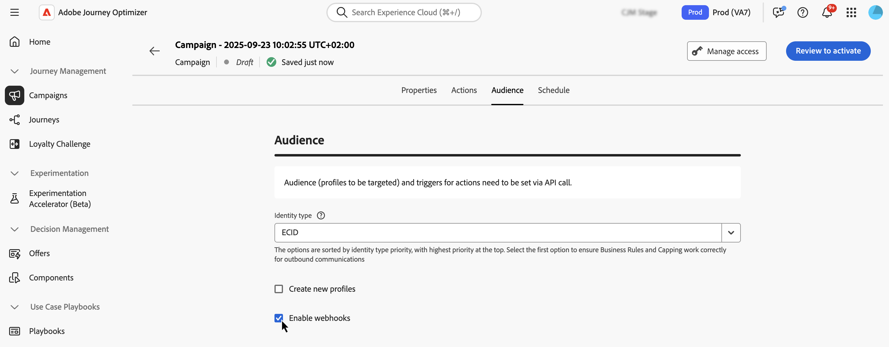

# Definir o público da campanha acionada pela API {#api-audience}

Use a guia **[!UICONTROL Público-alvo]** para definir o público da campanha.

## Selecionar o público-alvo

**Para campanhas acionadas pela API de marketing**, clique no botão **[!UICONTROL Selecionar público-alvo]** para exibir a lista de públicos-alvo disponíveis da Adobe Experience Platform. [Saiba mais sobre públicos](../audience/about-audiences.md).

>[!IMPORTANT]
>
>O uso de públicos-alvo e atributos da [composição de público-alvo](../audience/get-started-audience-orchestration.md) não está disponível para uso com o Healthcare Shield ou o Privacy and Security Shield.

**Para campanhas acionadas por API transacional**, os perfis direcionados precisam ser definidos na chamada de API. Uma única chamada de API suporta até 20 recipients únicos. Cada recipient deve ter uma ID de usuário exclusiva. IDs de usuário duplicadas não são permitidas. Saiba mais na [Documentação da API de execução de mensagem interativa](https://developer.adobe.com/journey-optimizer-apis/references/messaging/#tag/execution/operation/postIMUnitaryMessageExecution){target="_blank"}

## Selecione o tipo de identidade

No campo **[!UICONTROL Tipo de identidade]**, escolha o tipo de chave a ser usado para identificar os indivíduos do público-alvo selecionado. Você pode usar um tipo de identidade existente ou criar um novo usando o Serviço de identidade da Adobe Experience Platform. Os namespaces de Identidade Padrão estão listados em [esta página](https://experienceleague.adobe.com/pt-br/docs/experience-platform/identity/features/namespaces#standard){target="_blank"}.

Somente um tipo de identidade é permitido por campanha. Indivíduos pertencentes a um segmento que não tem o tipo de identidade selecionado entre suas diferentes identidades não podem ser alvos da campanha. Saiba mais sobre tipos de identidade e namespaces na [documentação do Adobe Experience Platform](https://experienceleague.adobe.com/docs/experience-platform/identity/home.html?lang=pt-BR){target="_blank"}.

## Ativar criação de perfil na execução da campanha

Em alguns casos, pode ser necessário enviar mensagens transacionais para perfis que não existem no sistema. Por exemplo, se um usuário desconhecido tentar redefinir a senha no seu site. Quando um perfil não existe no banco de dados, o Journey Optimizer permite que você o crie automaticamente ao executar a campanha para permitir o envio da mensagem para esse perfil.

Para ativar a criação de perfil na execução da campanha, alterne a opção **[!UICONTROL Criar novos perfis]** para ativada. Se essa opção estiver desativada, perfis desconhecidos serão rejeitados para qualquer envio e a chamada à API falhará.

>[!IMPORTANT]
>
>Esta opção é fornecida para **criação de perfil de volume muito pequeno** em um caso de uso de envio transacional de grande volume, com grande parte dos perfis já existentes na plataforma.
>
>Perfis desconhecidos são criados no **Conjunto de Dados de Perfil de Mensagens Interativas do AJO**, em três namespaces padrão (email, telefone e ECID), respectivamente, para cada canal de saída (Email, SMS e Push). No entanto, se você estiver usando um namespace personalizado, a identidade será criada com o mesmo namespace personalizado.
>
>A criação de perfil na execução não está disponível para [campanhas de Alta Taxa de Transferência](../campaigns/api-triggered-high-throughput.md), pois esse modo não depende de perfis do Adobe: o sistema não verificará se os perfis existem ou não.

## Habilitar webhooks {#webhook}

Para campanhas acionadas por API transacional, é possível habilitar webhooks a receberem feedback em tempo real sobre o status de execução de suas mensagens. Para fazer isso, alterne a opção **[!UICONTROL Habilitar webhooks]** para enviar eventos de status de entrega para um webhook configurado.

As configurações do Webhook são gerenciadas centralmente no menu **[!UICONTROL Administração]** / **[!UICONTROL Canais]** / **[!UICONTROL Webhook de feedback]**. A partir daí, os administradores podem criar e editar endpoints do webhook. [Saiba como criar webhooks de comentários](../configuration/feedback-webhooks.md)

## Próximas etapas {#next}

Quando a configuração e o conteúdo da campanha estiverem prontos, você poderá agendar a execução. [Saiba mais](api-triggered-campaign-schedule.md)
