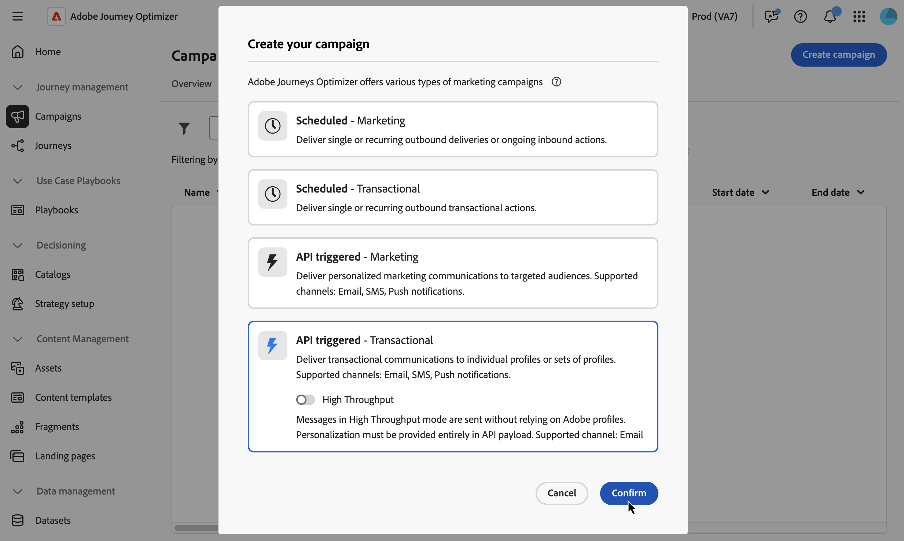

# Definir as propriedades da campanha acionada pela API {#api-properties}

Para criar uma nova campanha acionada por API, siga estas etapas:

1. Navegue até o menu **[!UICONTROL Campanhas]** e selecione a guia **[!UICONTROL API acionada]**.

1. Clique no botão **[!UICONTROL Criar campanha]** e selecione o tipo de campanha:

   * **[!UICONTROL API acionada - Marketing]** - Selecione esse tipo de campanha acionada por API para enviar comunicações de marketing personalizadas a públicos-alvo direcionados.

   * **[!UICONTROL API acionada - Transacional]** - As campanhas transacionais são destinadas a enviar mensagens transacionais, ou seja, mensagens enviadas após uma ação executada por um indivíduo: solicitação de redefinição de senha, compra de carrinho, etc.

     +++Modo de alto rendimento

     Para campanhas acionadas por API transacional, é possível habilitar o modo **[!UICONTROL Alta Taxa de Transferência]**. Esse modo foi projetado para mensagens em tempo real em larga escala (até 5.000 transações por segundo) e fornece maior disponibilidade com menor latência. [Saiba como trabalhar com o modo de Reagrupamento](../campaigns/api-triggered-high-throughput.md)

     >[!AVAILABILITY]
     >
     >Atualmente, o modo de alta taxa de transferência está disponível somente para o canal de email e na região dos EUA.
     >
     >Esse recurso só está disponível para organizações que compraram a oferta complementar **Mensagens transacionais de alta taxa de transferência** da Adobe. Entre em contato com o representante da Adobe para obter mais informações.

     +++

   

1. Na guia **[!UICONTROL Propriedades]**, digite um nome e uma descrição para a campanha.

   

1. Use o campo **Tags** para atribuir Tags unificadas do Adobe Experience Platform à sua campanha. Isso permite classificá-las facilmente e melhorar a pesquisa na lista de campanhas. [Saiba como trabalhar com tags](../start/search-filter-categorize.md#tags).

1. Você pode limitar o acesso a esta campanha com base nos rótulos de acesso. Para adicionar uma limitação de acesso, navegue até o botão **[!UICONTROL Gerenciar acesso]** na parte superior desta página. Selecione apenas os rótulos para os quais você tem permissão. [Saiba mais sobre o Controle de Acesso em Nível de Objeto](../administration/object-based-access.md).

## Próximas etapas {#next}

Quando a configuração e o conteúdo da campanha estiverem prontos, você poderá configurar sua ação. [Saiba mais](api-triggered-campaign-action.md)
