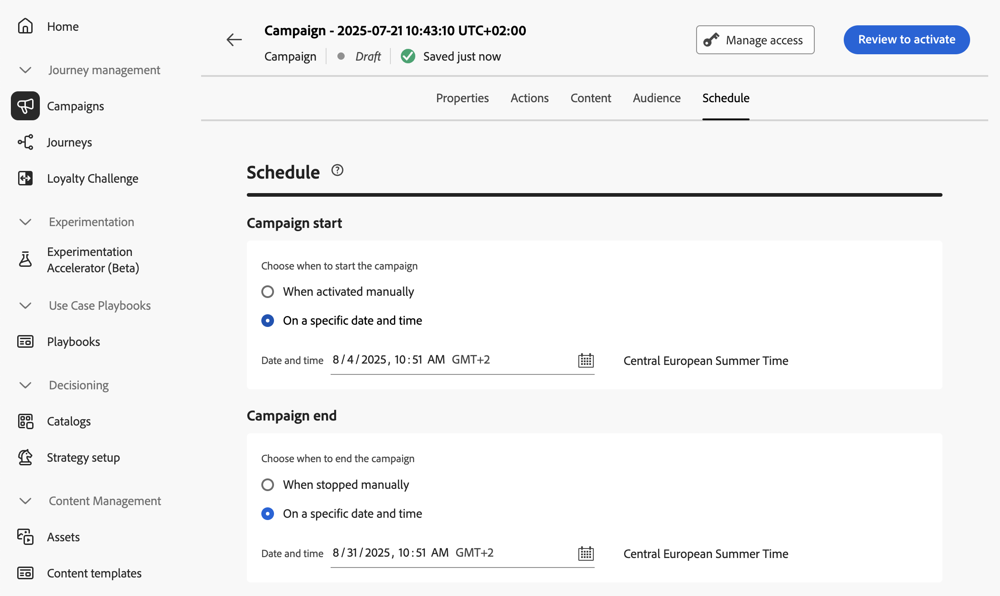

# Programar a campanha acionada pela API {#api-schedule}

Use a guia **[!UICONTROL Agendamento]** para definir o agendamento da campanha.

## Definir datas de início e término

Por padrão, as campanhas acionadas pela API começam assim que são acionadas e terminam assim que a mensagem é enviada uma vez. Se você não quiser executar sua campanha logo após ela ser acionada, poderá especificar uma data e hora em que a mensagem deverá ser enviada usando a opção **[!UICONTROL Início da campanha]**.

A opção **[!UICONTROL Campaign end]** permite especificar quando uma campanha deve parar de ser executada. Fora das datas especificadas, a campanha não será executada.

>[!NOTE]
>
>Ao agendar campanhas em [!DNL Adobe Journey Optimizer], verifique se a data/hora de início está alinhada com a primeira entrega desejada.

## Definir controle de taxa

[!DNL Journey Optimizer] permite habilitar o controle de taxa para ações de saída (email, SMS, notificações por push).

Esse recurso é particularmente útil para evitar sobrecarga em sistemas downstream, como páginas de aterrissagem ou plataformas de atendimento ao cliente. Por exemplo, você pode definir um limite de taxa de 165 mensagens por segundo para garantir uma entrega estável sem sobrecarregar os sistemas de downstream.

Para definir o controle de taxa, habilite a opção **[!UICONTROL Entrega acelerada]** na seção **[!UICONTROL Configurações de entrega]** e especifique a **[!UICONTROL Taxa de entrega]** desejada por segundo.

* Taxa de entrega mínima com suporte: 1 por segundo.
* Taxa de delivery máxima com suporte: 2000 por segundo quando a opção &quot;Throttle delivery&quot; está habilitada.

>[!IMPORTANT]
>
>Ao definir uma taxa de delivery, o período máximo para o qual o público-alvo da campanha pode ser executado é de 12 horas. Se a taxa de delivery for definida com um valor que não permita que todo o público-alvo receba a mensagem no período de 12 horas, os perfis restantes serão excluídos da campanha. Você pode ver a contagem desses perfis excluídos no relatório da campanha.

## Próximas etapas {#next}

Quando a configuração e o conteúdo da campanha estiverem prontos, você poderá revisá-los e ativá-los. [Saiba mais](../campaigns/review-activate-api-triggered-campaign.md)
