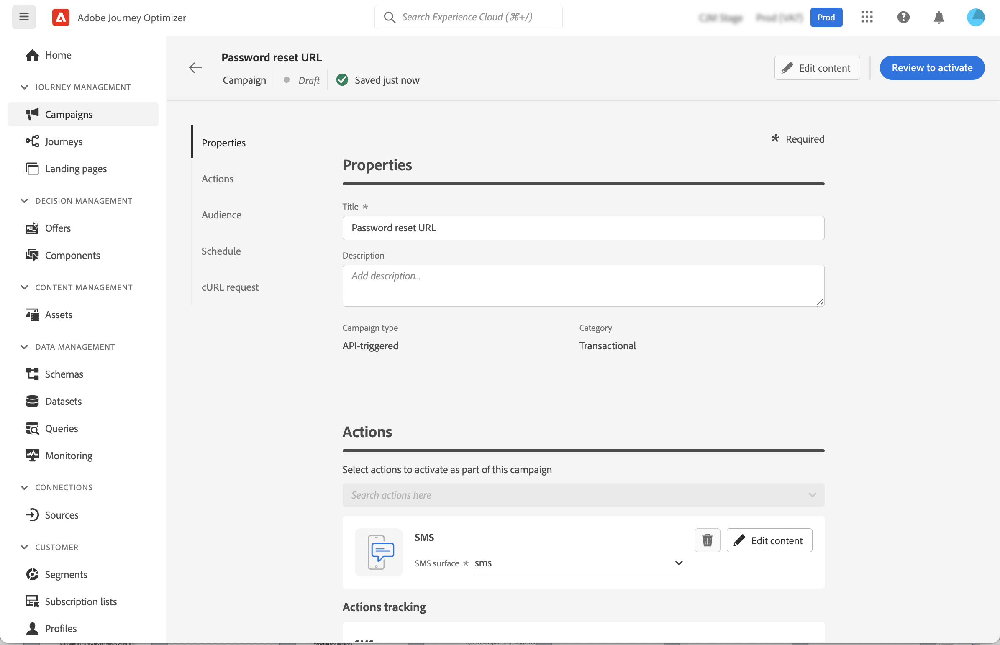

# Acione campanhas usando APIs {#trigger-campaigns}

## Sobre campanhas acionadas por API {#about}

>[!NOTE]
>
>A API de Execução de Mensagens Interativas está atualmente em versão beta, que pode estar sujeita a atualizações frequentes sem aviso prévio.

Com [!DNL Journey Optimizer], você pode criar campanhas e depois invocá-las de um sistema externo com base no acionador do usuário usando a [API REST de Execução de Mensagens Interativas](https://developer.adobe.com/journey-optimizer-apis/references/messaging/#tag/execution). Isso permite cobrir várias necessidades operacionais e de mensagens transacionais, como redefinições de senha, token OTP, entre outras.

Para fazer isso, primeiro crie uma campanha acionada por API no Journey Optimizer e, em seguida, inicie a execução por meio de uma chamada de API.

Os canais disponíveis para campanhas acionadas por API são mensagens de email, SMS e push.

## Criar uma campanha acionada por API {#create}

O processo para criar campanhas acionadas por API permanece o mesmo que as campanhas programadas, exceto pela seleção de público-alvo que é executada na carga da API. Informações detalhadas sobre como criar uma campanha estão disponíveis em [esta seção](create-campaign.md).

Para criar uma campanha acionada por API, siga estas etapas:

1. Crie uma nova campanha com a **[!UICONTROL API-triggered]** tipo .

1. Escolha o canal e a superfície do canal a serem usados para enviar a mensagem e clique em **[!UICONTROL Create]**.

   

1. Especifique um título e uma descrição para a campanha, em seguida, configure a mensagem a ser enviada.

   

   >[!NOTE]
   >
   >Você pode transmitir dados adicionais para a carga da API que pode ser usada para personalizar a mensagem. [Saiba mais](#contextual)

1. Especifique o namespace a ser usado para identificar os indivíduos do segmento.

1. Configure as datas de início e término da campanha.

   Se você configurar uma data de início e/ou término específica para uma campanha, ela não será executada fora dessas datas, e as chamadas de API falharão se a campanha for acionada pelas APIs.

1. No **[!UICONTROL cURL request]** , recupere a **[!UICONTROL Campaign ID]** para usar na carga da API.

   

1. Clique em **[!UICONTROL Review to activate]** para verificar se a campanha está configurada corretamente, ative-a.

## Usar atributos contextuais em campanhas acionadas por API {#contextual}

Com campanhas acionadas por API, você pode passar dados adicionais na carga da API e usá-los dentro da campanha para personalizar sua mensagem.

Vejamos este exemplo, onde os clientes desejam redefinir a senha e você deseja enviar a eles um URL de redefinição de senha gerado em uma ferramenta de terceiros. Com campanhas acionadas por API, você pode passar esse URL gerado para a carga da API e aproveitá-lo para a campanha para adicioná-lo à mensagem.

>[!NOTE]
>
>Diferentemente dos eventos ativados por perfil, os dados contextuais transmitidos na API REST são usados para comunicação pontual e não armazenados em relação ao perfil. No máximo, o perfil é criado com os detalhes do namespace, caso ele tenha sido encontrado ausente.

Para usar esses dados em suas campanhas, é necessário passá-los para a carga da API e adicioná-los em sua mensagem usando o editor de expressão. Para fazer isso, use o `{{context.<contextualAttribute>}}` sintaxe, em que `<contextualAttribute>` deve corresponder ao nome da variável no payload da API que contém os dados que você deseja transmitir.

O `{{context.<contextualAttribute>}}` A sintaxe é mapeada somente para um tipo de dados String .

>[!IMPORTANT]
>
>O `context.system` A sintaxe é restrita somente ao uso interno do Adobe e não deve ser usada para transmitir atributos contextuais.
Observe que, por enquanto, nenhum atributo contextual está disponível para uso no menu do painel à esquerda. Os atributos devem ser digitados diretamente na expressão de personalização, sem que nenhuma verificação seja executada por [!DNL Journey Optimizer].

## Executar a campanha {#execute}

Para executar uma campanha acionada por API, primeiro recupere a ID e passe-a para a carga da API. Para fazer isso, abra a campanha e copie e cole a ID do **[!UICONTROL cURL request]** seção.

Em seguida, você pode usar essa ID na carga da API para acionar a campanha. Consulte a [Documentação da API de execução de mensagem interativa](https://developer.adobe.com/journey-optimizer-apis/references/messaging/#tag/execution) para obter mais informações.

Observe que, se você tiver configurado uma data de início e/ou término específica ao criar a campanha, ela não será executada fora dessas datas, e as chamadas de API falharão.

>[!NOTE]
>
>Em alguns casos, pode ser necessário enviar mensagens transacionais para perfis que não existem no sistema. Por exemplo, se um usuário desconhecido tentar fazer logon no site. Nesse caso, o perfil correspondente é criado automaticamente no Adobe Experience Platform, no **Conjunto de dados do perfil de mensagens interativas AJO** conjunto de dados.

## Recursos adicionais

* [Introdução às campanhas](get-started-with-campaigns.md)
* [Criar uma campanha](create-campaign.md)
* [Modificar ou interromper uma campanha](modify-stop-campaign.md)
* [Relatório em tempo real da campanha](campaign-live-report.md)
* [Relatório global da campanha](campaign-global-report.md)
