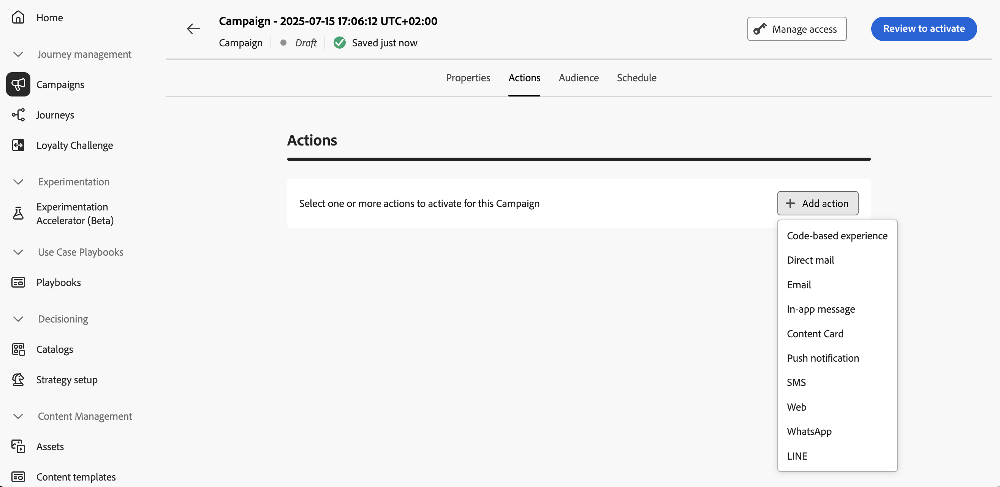

# Configurar a ação da campanha {#action-campaign-action}

Use a guia **[!UICONTROL Ações]** para selecionar uma configuração de canal para a sua mensagem e definir configurações adicionais, como rastreamento, experimento de conteúdo ou conteúdo multilíngue.

1. **Escolher o canal**

   Navegue até a guia **[!UICONTROL Ações]**, clique no botão **[!UICONTROL Adicionar ação]** e selecione o canal de comunicação.

   

   >[!NOTE]
   >
   >Os canais com suporte são: [Email](../email/get-started-email.md), [SMS/MMS/RCS](../sms/get-started-sms.md), [Notificações por push](../push/get-started-push.md), [WhatsApp](../whatsapp/get-started-whatsapp.md), [LINE](../line/get-started-line.md), [Correspondência direta](../direct-mail/get-started-direct-mail.md), [No aplicativo](../in-app/get-started-in-app.md), [Web](../web/get-started-web.md), [Experiências baseadas em código](../code-based/get-started-code-based.md).
   >
   >Os canais disponíveis variam com base no modelo de licenciamento e nos complementos.

   Se você selecionar um canal de entrada (experiência baseada em código, mensagem no aplicativo, Cartão de conteúdo ou ação da Web), poderá adicionar mais ações de entrada, para um total de até 10 ações em uma única campanha. [Saiba como](#multi-action)

1. **Selecionar uma configuração de canal**

   Uma configuração é definida por um [Administrador do sistema](../start/path/administrator.md). Ela contém todos os parâmetros técnicos para enviar a mensagem, como parâmetros de cabeçalho, subdomínio, aplicativos móveis etc. [Saiba como definir configurações de canal](../configuration/channel-surfaces.md)

   

1. **Aproveitar Otimização**

   Use a seção **[!UICONTROL Otimização]** para executar experimentos de conteúdo, aproveitar regras de direcionamento ou usar combinações avançadas de experimentação e direcionamento. Estas diferentes opções e as etapas a serem seguidas estão detalhadas em [esta seção](campaigns-message-optimization.md).
<!--
1. **Create a content experiment**

    Use the **[!UICONTROL Content experiment]** section to define multiple delivery treatments in order to measure which one performs best for your target audience. Click the **[!UICONTROL Create experiment]** button then follow the steps detailed in this section: [Create a content experiment](../content-management/content-experiment.md).-->

1. **Adicionar conteúdo multilíngue**

   Use a seção **[!UICONTROL Idiomas]** para criar conteúdo em vários idiomas dentro da sua campanha. Para isso, clique no botão **[!UICONTROL Adicionar idiomas]** e selecione as **[!UICONTROL Configurações de idioma]** desejadas. Informações detalhadas sobre como configurar e usar recursos multilíngues estão disponíveis em [esta seção](../content-management/multilingual-gs.md).

Configurações adicionais estão disponíveis, dependendo do canal de comunicação selecionado. Expanda as seções abaixo para obter mais informações.

+++**Aplicar regras de limitação** (Email, Correspondência direta, Push, SMS)

Na lista suspensa **[!UICONTROL Regras de negócio]**, selecione um conjunto de regras para aplicar regras de limitação à sua campanha. O uso de conjuntos de regras de canal permite definir o limite de frequência por tipo de comunicação para evitar sobrecarga de clientes com mensagens semelhantes. [Saiba como trabalhar com conjuntos de regras](../conflict-prioritization/rule-sets.md)

+++

+++**Rastrear envolvimento** (Email, SMS).

Use a seção de **[!UICONTROL Rastreamento de ações]** para acompanhar como os seus destinatários reagem às suas entregas de email ou SMS. Os resultados do rastreamento podem ser acessados no relatório da campanha após a execução da campanha. [Saiba mais sobre os relatórios da campanha](../reports/campaign-global-report-cja.md)

+++

+++**Habilitar o modo de entrega rápida** (Push).

O modo de entrega rápida é um complemento do [!DNL Journey Optimizer] que permite o envio muito rápido de mensagens por push em grandes volumes por meio de campanhas. A entrega rápida é usada quando um atraso na entrega das mensagens seria crítico para os negócios, quando você deseja enviar um alerta por push urgente a telefones celulares, como, por exemplo, notícias de última hora para usuários que instalaram o seu aplicativo de canal de notícias. Saiba como habilitar o modo de entrega rápida para notificações por push [nesta página](../push/create-push.md#rapid-delivery).

Para mais informações sobre desempenho ao usar o modo de entrega rápida, consulte a [descrição do produto Adobe Journey Optimizer](https://helpx.adobe.com/br/legal/product-descriptions/adobe-journey-optimizer.html){target="_blank"}.

+++

+++**Atribuir pontuações de prioridade** (Web, No aplicativo, Baseado em código)

Atribuir uma pontuação de prioridade à campanha permite priorizar uma campanha de entrada quando há uma restrição imposta, como um limite de frequência. Insira um valor numérico (de 0 a 100). Observe que, quanto maior o número, maior a prioridade. [Saiba como atribuir pontuações de prioridade a jornadas e campanhas](../conflict-prioritization/priority-scores.md)

+++

+++**Definir regras de entrega adicionais** (Cartões de conteúdo)

Para campanhas de cartão de conteúdo, você pode habilitar regras de entrega adicionais para escolher os eventos e critérios que acionam sua mensagem. [Saiba como criar cartões de conteúdo](../content-card/create-content-card.md)

+++

+++**Definir acionadores** (no aplicativo)

Para mensagens no aplicativo, você pode usar o botão **[!UICONTROL Editar acionadores]** para escolher os eventos e critérios que acionam sua mensagem. [Saiba como criar uma mensagem no aplicativo](../in-app/create-in-app.md)

+++

## Adicionar várias ações de entrada {#multi-action}

>[!CONTEXTUALHELP]
>id="ajo_multi_action"
>title="Adicionar várias ações de entrada"
>abstract="Você pode selecionar várias ações de entrada em uma mesma campanha. Este recurso permite entregar várias experiências baseadas em código, mensagens no aplicativo, cartões de conteúdo ou ações da web para locais diferentes ao mesmo tempo, cada ação com um conteúdo específico."

Para simplificar a orquestração de campanhas, você pode definir várias ações de entrada em uma única campanha, cada uma com um conteúdo específico.

>[!NOTE]
>
>Esse recurso só está disponível para canais de entrada. No momento, não há suporte para canais de saída como email.

Esse recurso permite que você forneça várias experiências baseadas em código, mensagens no aplicativo, cartões de conteúdo ou ações da Web a diferentes locais ao mesmo tempo, sem a necessidade de criar várias campanhas. Isso facilita a implantação da sua campanha e permite relatórios mais suaves, com todos os dados consolidados em uma única campanha.

Por exemplo, você pode enviar uma experiência baseada em código para vários endpoints com conteúdo ligeiramente diferente. Para fazer isso, crie várias ações baseadas em código na mesma campanha, cada uma com uma configuração de endpoint diferente.

Para definir várias ações de entrada em uma campanha, siga as etapas abaixo.

1. Selecione uma ação de entrada (**Experiência baseada em código**, **Mensagem no aplicativo**, **Cartão de Conteúdo** ou **Web**) na seção **[!UICONTROL Ações]**.

1. Selecione a configuração de canal e defina um conteúdo específico para essa ação.

1. Use o botão **[!UICONTROL Adicionar ação]** para selecionar outra ação de entrada na lista suspensa.

   {width="80%"}

1. Continue da mesma forma para adicionar mais ações. Você pode adicionar até 10 ações de entrada em uma campanha.

Quando a campanha estiver [online](review-activate-campaign.md), todas as ações serão ativadas simultaneamente.

## Próximas etapas {#next}

Quando a ação da campanha estiver pronta, você poderá criar o conteúdo. [Saiba mais](campaign-content.md)
