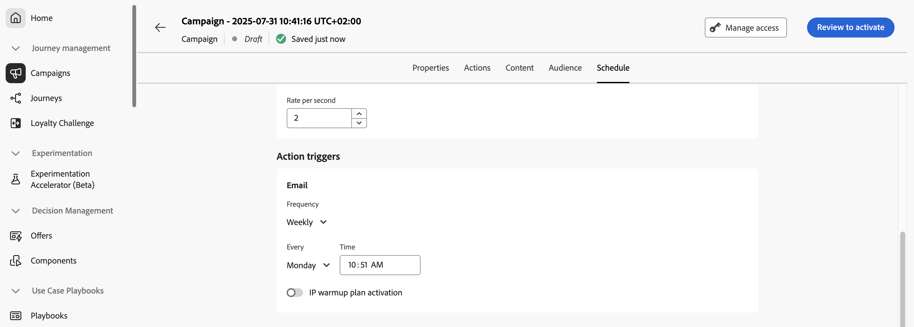

# Programar a campanha de ação {#action-campaign-schedule}

Use a guia **[!UICONTROL Agendamento]** para definir o agendamento da campanha.

## Definir datas de início e término

Por padrão, as campanhas de ação começam assim que são ativadas manualmente e terminam assim que a mensagem é enviada uma vez. Se você não quiser executar sua campanha logo após a ativação, poderá especificar uma data e hora em que a mensagem deverá ser enviada usando a opção **[!UICONTROL Início da campanha]**.

A opção **[!UICONTROL Campaign end]** permite especificar quando uma campanha deve parar de ser executada. Fora das datas especificadas, a campanha não será executada.

>[!NOTE]
>
>Ao agendar campanhas no [!DNL Adobe Journey Optimizer], verifique se a data/hora inicial está de acordo com a primeira entrega desejada. Para campanhas recorrentes, se o horário programado inicial já tiver passado, as campanhas serão transferidas para o próximo período disponível, de acordo com as suas regras de recorrência.

## Definir controle de taxa

[!DNL Journey Optimizer] permite habilitar o controle de taxa para ações de saída (email, SMS, notificações por push).

Esse recurso é particularmente útil para evitar sobrecarga em sistemas downstream, como páginas de aterrissagem ou plataformas de atendimento ao cliente. Por exemplo, você pode definir um limite de taxa de 165 mensagens por segundo para garantir uma entrega estável sem sobrecarregar os sistemas de downstream.

Para definir o controle de taxa, habilite a opção **[!UICONTROL Entrega acelerada]** na seção **[!UICONTROL Configurações de entrega]** e especifique a **[!UICONTROL Taxa de entrega]** desejada por segundo.

* Taxa de entrega mínima com suporte: 1 por segundo.
* Taxa de delivery máxima com suporte: 2000 por segundo quando a opção &quot;Throttle delivery&quot; está habilitada.

>[!IMPORTANT]
>
>Ao definir uma taxa de delivery, o período máximo para o qual o público-alvo da campanha pode ser executado é de 12 horas. Se a taxa de delivery for definida com um valor que não permita que todo o público-alvo receba a mensagem no período de 12 horas, os perfis restantes serão excluídos da campanha. Você pode ver a contagem desses perfis excluídos no relatório da campanha.

## Definir uma frequência de execução

Para ações de email, SMS e notificação por push, você pode definir uma frequência na qual a mensagem da campanha deve ser enviada. Para fazer isso, use as opções **[!UICONTROL Action triggers]** na tela de criação da campanha para especificar se a campanha deve ser executada diariamente, semanalmente ou mensalmente.

## Definir planos de aquecimento de IP

Para ações de email, você pode criar campanhas específicas de ativação do plano de aquecimento de IP. O agendamento da campanha será orientado pelo plano de aquecimento de IP ao qual será associado, o que significa que o agendamento não será mais definido na própria campanha. [Saiba como criar campanhas de aquecimento de IP](../configuration/ip-warmup-campaign.md).

## Próximas etapas {#next}

Quando a programação da campanha estiver pronta, você poderá revisar e ativar a campanha. [Saiba mais](review-activate-campaign.md)
