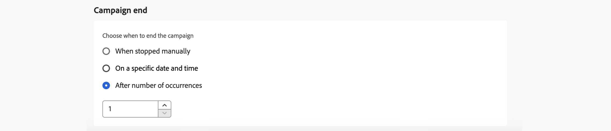

# Programar a campanha de ação {#action-campaign-schedule}

Use a guia **[!UICONTROL Agendamento]** para definir o agendamento da campanha.

## Definir uma data de início da campanha

Por padrão, as campanhas de ação começam assim que são ativadas manualmente e terminam assim que a mensagem é enviada uma vez. Se você não quiser executar sua campanha logo após a ativação, especifique uma data e hora em que a mensagem deverá ser enviada na seção **[!UICONTROL Início da campanha]**.

Ao agendar campanhas no [!DNL Adobe Journey Optimizer], verifique se a data/hora inicial está de acordo com a primeira entrega desejada. Para campanhas recorrentes, se o horário programado inicial já tiver passado, as campanhas serão transferidas para o próximo período disponível, de acordo com as suas regras de recorrência.

## Enviar na hora local do destinatário {#profile-timezone}

>[!CONTEXTUALHELP]
>id="ajo_campaigns_schedule_profile_timezone"
>title="Usar fuso horário do perfil"
>abstract="Envie mensagens com base no fuso horário de cada recipient. Todos os recipients receberão a mensagem no mesmo horário local, independentemente da localização geográfica. O sistema usa o campo &quot;timeZone&quot; dos perfis do Adobe Experience Platform, com o fuso horário do criador da campanha como fallback."

Ao agendar uma campanha para uma data e hora específicas, você pode optar por enviar mensagens com base no fuso horário de cada recipient. Isso garante que todos os recipients recebam a mensagem ao mesmo tempo local, independentemente da localização geográfica.

Por exemplo, se você agendar uma campanha para enviar às 9:00 AM usando o fuso horário do perfil, os recipients em Nova York (ET) receberão às 9:00 AM ET, enquanto os recipients em Los Angeles (PT) receberão às 9:00 AM PT.

>[!AVAILABILITY]
>
>A programação usando fusos horários do perfil está disponível somente para estes canais de saída: Email, Push, SMS, WhatsApp e LINE.

Para ativar a programação de fuso horário do perfil:

1. Na seção **[!UICONTROL Início da campanha]**, especifique a data e a hora em que a mensagem deve ser enviada.

1. Habilite a opção **[!UICONTROL Usar fuso horário do perfil]**.

   

**Como funciona:**

O sistema usa o campo `profile.timeZone` do perfil do Adobe Experience Platform de cada recipient para determinar seu fuso horário local. Se um perfil não tiver um valor de fuso horário, o sistema usará o fuso horário em que a campanha foi criada como fallback.

A campanha permanece com o status **Live** enquanto as mensagens são entregues em todos os fusos horários. Após todos os fusos horários serem processados, o status da campanha será alterado para **Concluído**.

**Identificadores de fuso horário com suporte:**

O formato `profile.timeZone` pode ser nomeação IANA ou definido como deslocamentos UTC. A nomenclatura IANA é o formato preferido, pois se ajusta automaticamente às regras de horário de verão.

Para a nomenclatura IANA, os identificadores fazem distinção entre maiúsculas e minúsculas e devem corresponder à nomenclatura IANA oficial. As compensações podem mudar com o tempo devido às regras de horário de verão e atualizações históricas. Consulte o [Banco de Dados do Fuso Horário IANA](https://www.iana.org/time-zones){_blank} para obter a lista oficial de identificadores.

## Definir uma frequência de execução

Para ações de **Email**, **SMS** e **Notificação por push**, você pode definir uma frequência na qual a mensagem da campanha deve ser enviada. Para fazer isso, use as opções **[!UICONTROL Action triggers]** na tela de criação da campanha para especificar se a campanha deve ser executada diariamente, semanalmente ou mensalmente.

>[!NOTE]
>
>Para ações de **email**, você pode criar campanhas específicas de ativação do plano de aquecimento de IP. O agendamento da campanha será orientado pelo plano de aquecimento de IP ao qual será associado, o que significa que o agendamento não será mais definido na própria campanha. [Saiba como criar campanhas de aquecimento de IP](../configuration/ip-warmup-campaign.md).

## Definir uma data final

A seção **[!UICONTROL Fim da campanha]** permite especificar quando uma campanha deve parar de ser executada. Fora das datas especificadas, a campanha não será executada.

## Definir controle de taxa

[!DNL Journey Optimizer] permite habilitar o controle de taxa para ações de saída (email, SMS, notificações por push).

Esse recurso é particularmente útil para evitar sobrecarga em sistemas downstream, como páginas de aterrissagem ou plataformas de atendimento ao cliente. Por exemplo, você pode definir um limite de taxa de 165 mensagens por segundo para garantir uma entrega estável sem sobrecarregar os sistemas de downstream.

Para definir o controle de taxa, habilite a opção **[!UICONTROL Entrega acelerada]** na seção **[!UICONTROL Configurações de entrega]** e especifique a **[!UICONTROL Taxa de entrega]** desejada por segundo.

* Taxa de entrega mínima com suporte: 1 por segundo.
* Taxa de delivery máxima com suporte: 2000 por segundo quando a opção &quot;Throttle delivery&quot; está habilitada.

>[!IMPORTANT]
>
>Ao definir uma taxa de delivery, o período máximo para o qual o público-alvo da campanha pode ser executado é de 12 horas. Se a taxa de delivery for definida com um valor que não permita que todo o público-alvo receba a mensagem no período de 12 horas, os perfis restantes serão excluídos da campanha. Você pode ver a contagem desses perfis excluídos no relatório da campanha.

## Próximas etapas {#next}

Quando a programação da campanha estiver pronta, você poderá revisar e ativar a campanha. [Saiba mais](review-activate-campaign.md)
