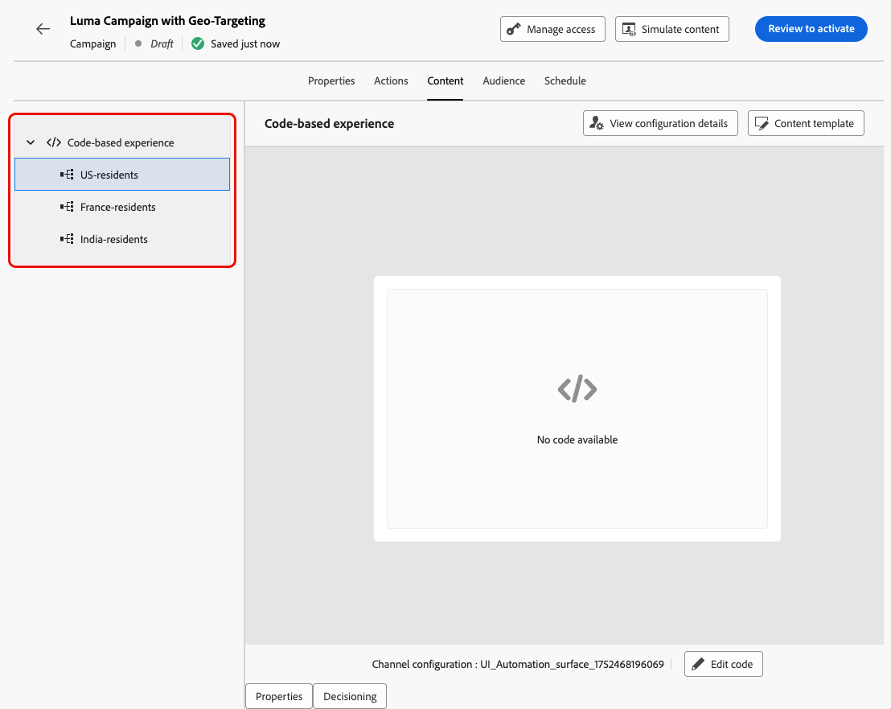

# Otimização em campanhas {#message-optimization}

A otimização o capacita com as ferramentas para fornecer conteúdo personalizado e otimizado para o público de suas campanhas, <!--based on marketer-defined advanced decision configurations. This ensures that the right message reaches the right audience at the right time in order to maximize the effectiveness of your campaigns. (Removed for now as Decisioning is not yet supported)-->garantindo o máximo de engajamento e sucesso para criar campanhas altamente <!--customized and -->eficazes.

Com a Otimização, você pode:

* Aproveitar as regras de [direcionamento](#targeting)
* Executar [experimentos de conteúdo](#experimentation)
* Use [combinações avançadas](#combination) de experimentação e direcionamento em uma única campanha

Quando a campanha estiver ativa, os perfis serão avaliados em relação aos critérios definidos e, com base nos critérios de correspondência, eles serão entregues com a experiência ou o conteúdo apropriado da campanha.

A diferença entre experimentos e direcionamento pode ser descrita da seguinte maneira:

* A experimentação consiste em uma divisão aleatória no fornecimento de conteúdo com base na alocação de tráfego&#x200B;.
* O direcionamento usa técnicas determinísticas para fornecer conteúdo com base no perfil do usuário, na associação do público-alvo ou em regras baseadas no contexto.

{width="110%" zoomable="yes"}

## Aproveitar o direcionamento {#targeting}

O direcionamento fornece conteúdo personalizado para segmentos de público-alvo específicos com base em atributos de perfil do usuário ou atributos contextuais.

Ao contrário da experimentação, que é uma atribuição aleatória do conteúdo de uma mensagem, o direcionamento é determinístico em termos de entrega do conteúdo para o público-alvo correto.

Com o direcionamento, regras específicas podem ser definidas com base em:

* **Atributos de perfil de usuário**, como localização (por exemplo, geolocalização), idade ou preferências. Por exemplo, os usuários nos EUA veem uma promoção &quot;Golden Gate&quot;, enquanto os usuários na França veem uma promoção &quot;Torre Eiffel&quot;.

* **Dados contextuais**, como tipo de dispositivo (por exemplo, direcionamento de dispositivo), hora do dia ou detalhes da sessão. Por exemplo, os usuários de desktop recebem conteúdo otimizado para desktop, enquanto os usuários móveis recebem conteúdo otimizado para dispositivos móveis.

* **Públicos-alvo** que podem ser usados para incluir ou excluir perfis que tenham uma associação de público-alvo específica.

Para configurar o direcionamento em uma campanha, siga as etapas abaixo.

1. Crie uma campanha. [Saiba mais](../campaigns/create-campaign.md) <!--Add link to API triggered?-->

1. Na guia **[!UICONTROL Ações]**, selecione pelo menos uma ação.

1. Na seção **[!UICONTROL Otimização de Mensagens]**, selecione **[!UICONTROL Direcionamento]**.

   {width=85%}

1. Use o construtor de regras para definir seus critérios. Por exemplo, defina uma regra para residentes dos EUA, uma regra para residentes da França e uma regra para residentes da Índia.

   {width=85%}

1. Selecione o **[!UICONTROL Habilitar conteúdo de fallback]**, conforme necessário. O conteúdo de fallback permite que o público receba um conteúdo padrão quando nenhuma regra de direcionamento for qualificada. Se você não selecionar essa opção, qualquer público-alvo que não se qualifique para uma regra de direcionamento definida acima não receberá conteúdo.

1. Salve as configurações da regra de direcionamento.

1. De volta à guia **[!UICONTROL Actions]** da campanha, selecione **[!UICONTROL Editar conteúdo]**.

1. Crie o conteúdo apropriado para cada grupo definido pelas suas configurações de regra de direcionamento.

   {width=85%}

   Neste exemplo, crie um conteúdo específico para residentes dos EUA, um conteúdo diferente para residentes da França e outro conteúdo para residentes da Índia.

1. [Ative](review-activate-campaign.md) sua campanha.

Uma vez que a campanha é em tempo real, o conteúdo adaptado para cada alvo é enviado para que os residentes dos EUA recebam uma mensagem específica, os residentes da França recebam uma mensagem diferente e assim por diante.

<!--Default content:

* If no targeting rules match, default content can be delivered.

* If default content is not enabled, passthrough behavior ensures lower-priority campaigns are evaluated.-->

## Usar experimentação {#experimentation}

A experimentação permite testar várias versões do conteúdo para determinar qual tem o melhor desempenho com base em métricas de sucesso predefinidas.

Para configurar a experimentação em uma campanha, siga as etapas abaixo.

Digamos que você queira testar as seguintes mensagens promocionais em uma campanha:

* **Tratamento A**: &quot;20% de desconto em sua próxima compra&quot;
* **Tratamento B**: &quot;Envio gratuito em pedidos acima de US$ 50&quot;
* **Tratamento C**: &quot;Obtenha seu vale-presente de $10&quot;

Para configurar a experimentação e determinar qual mensagem impulsiona mais compras, siga as etapas abaixo.

1. Crie uma campanha. [Saiba mais](../campaigns/create-campaign.md) <!--Add link to API triggered?-->

1. Na guia **[!UICONTROL Ações]**, selecione pelo menos duas ações de entrada, por exemplo, [experiência baseada em código](../code-based/get-started-code-based.md) e [No aplicativo](../in-app/get-started-in-app.md).

1. Na seção **[!UICONTROL Otimização de Mensagens]**, selecione **[!UICONTROL Experimentação]**.

   {width=85%}

1. Projete e configure seu experimento de conteúdo conforme desejado. [Saiba como](../content-management/content-experiment.md)

   {width=85%}

   Depois que o experimento é definido, ele se aplica a todas as ações inseridas nessa campanha, o que significa que os mesmos clientes veem as mesmas ofertas em todas as superfícies.

   >[!NOTE]
   >
   >Você pode selecionar outras ações: a experimentação se aplica a todas as ações adicionadas à campanha.

1. [Ative](review-activate-campaign.md) sua campanha.

Quando a campanha estiver ativa, os usuários serão atribuídos aleatoriamente às diferentes variações de conteúdo. [!DNL Journey Optimizer] rastreia qual variação gera mais compras e fornece insights acionáveis.

Siga o sucesso da sua campanha com o [Relatório de campanha de experimentação](../reports/campaign-global-report-cja-experimentation.md).

## Combinar direcionamento e experimentação {#combination}

O Journey Optimizer também permite combinar direcionamento e experimentos em uma única campanha para criar estratégias mais sofisticadas.

Na verdade, você pode usar o direcionamento para criar várias variantes e, para cada variante, usar a experimentação para otimizar ainda mais cada conteúdo. Isso garante que os experimentos sejam específicos para cada regra de direcionamento e não se estendam pelas variantes dentro da campanha.

Por exemplo, você pode testar uma &quot;promoção com 50% de desconto&quot; em comparação com um &quot;cartão-presente de 50 dólares&quot; para clientes nos EUA e executar um teste diferente para clientes na Europa, como &quot;frete gratuito em pedidos acima de 50 euros&quot; em comparação com &quot;20% de desconto em sua próxima compra&quot;.

Para combinar o direcionamento e os experimentos em uma campanha, siga as etapas abaixo.

1. Crie uma campanha onde você define várias regras de direcionamento. [Saiba como](#targeting)

   {width=85%}

1. Crie um experimento para a primeira regra de direcionamento.

1. Projete e configure seu experimento de conteúdo conforme desejado. [Saiba como](../content-management/content-experiment.md)

   {width=85%}

   Depois que a experimentação é definida, ela se aplica somente à primeira regra de direcionamento.

1. De volta à guia **[!UICONTROL Actions]** da campanha, selecione **[!UICONTROL Editar conteúdo]**.

1. Para o grupo definido pela primeira regra de direcionamento, é possível definir um conteúdo específico para cada variante do experimento.

   Se você adicionou mais de uma ação de entrada à campanha, a mesma combinação de direcionamento e experimento se aplica a cada ação. No entanto, é necessário definir um conteúdo específico para cada variante de cada ação.

   {width=85%}

1. Continue de forma semelhante nas outras regras de direcionamento e projete o conteúdo correspondente para cada variante.

1. Salve as alterações e [ative](review-activate-campaign.md) sua campanha.

Quando a campanha estiver ativa, os usuários de cada grupo direcionado receberão aleatoriamente as diferentes variações de conteúdo definidas para o grupo ao qual pertencem.

<!--
## Reporting on Message optimization

E.g. explaining how a marketer can look at the report to determine which treatment (e.g. which message content) is performing the best for the targeting audience
-->

