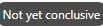

# Criar um experimento de conteúdo {#content-experiment}

>[!AVAILABILITY]
>
>O **Experiência de conteúdo** No momento, o recurso está disponível somente para um conjunto de organizações (Disponibilidade limitada). Para obter mais informações, entre em contato com o seu representante da Adobe.

Use o Journey Optimizer Content Experiment para definir vários tratamentos de delivery. O público-alvo de interesse é alocado aleatoriamente para cada tratamento a fim de determinar qual delas tem melhor desempenho em relação à métrica de interesse. Você pode optar por variar o conteúdo, o assunto ou o remetente do delivery.

>[!NOTE]
>
>Antes de começar com o Experimento de conteúdo, verifique se a configuração de relatório está definida para seus conjuntos de dados personalizados. Saiba mais [nesta seção](reporting-configuration.md).

No exemplo abaixo, o target do delivery foi dividido em dois grupos, cada um representando 45% da população direcionada, e um grupo de espera de 10%, que não receberá o delivery.

Cada pessoa no público-alvo receberá uma versão de um email, com uma linha de assunto que é uma das duas seguintes:

* uma promovendo diretamente uma oferta de 10% na nova coleção e uma imagem.
* o outro apenas anuncia uma oferta especial sem especificar 10% de desconto sem nenhuma imagem.

O objetivo aqui é ver se os recipients interagem com o email, dependendo do experimento recebido. Por conseguinte, escolheremos **[!UICONTROL Aberturas de email]** como a principal métrica de meta neste Experimento de conteúdo.

## Criar sua campanha {#campaign-experiment}

1. No **[!UICONTROL Campanhas]** página, clique em **[!UICONTROL Criar campanha]**.

   

1. Selecione seu canal e depois o **[!UICONTROL Superfície]** você deseja usar para este delivery. Para obter mais informações, consulte [Superfícies do canal](../configuration/channel-surfaces.md) página.

   

1. Clique em **[!UICONTROL Criar]**.

1. Configure o **[!UICONTROL Propriedades]** do seu delivery:
   * **[!UICONTROL Title]**
   * **[!UICONTROL Descrição]**
   * **[!UICONTROL Categoria]**: **[!UICONTROL Marketing]** / **[!UICONTROL Transacional]**

1. Para iniciar seu experimento de conteúdo, alterne a **[!UICONTROL Experiência de conteúdo]** opção. O **[!UICONTROL Experiência de conteúdo]** será exibido.

   

1. Defina o público-alvo como meta. Para fazer isso, clique no botão **[!UICONTROL Seleção do público-alvo]** para exibir a lista de segmentos disponíveis do Adobe Experience Platform. [Saiba mais sobre segmentos](../segment/about-segments.md)

   No **[!UICONTROL Namespace de identidade]** , escolha o namespace a ser usado para identificar os indivíduos do segmento selecionado. [Saiba mais](get-started-experiment.md#content-experiment-work)

1. Para executar sua campanha em uma data específica ou em uma frequência recorrente, configure a seção Schedule . [Saiba mais](create-campaign.md)

1. Clique em **[!UICONTROL Editar conteúdo]** para começar a personalizar seus diferentes **[!UICONTROL Tratamentos]**.

   

## Crie seus tratamentos {#treatment-experiment}

1. No **[!UICONTROL Editar conteúdo]** , comece a personalizar seu tratamento A.

   Para esse tratamento, especificaremos a oferta especial diretamente na linha de assunto.

   

1. Depois de conceber o seu primeiro tratamento, na **[!UICONTROL Mais ações]** , clique em **[!UICONTROL Duplicar]**.

   Você também pode optar por iniciar um novo tratamento clicando no botão **[!UICONTROL Experiência de conteúdo]** botão  para acessar as opções avançadas e **[!UICONTROL Adicionar tratamento]**.

   

1. Altere o **[!UICONTROL Título]** do seu tratamento para os diferenciar melhor.

   

1. Personalize seu segundo tratamento, conforme necessário.

   Aqui, optamos por não especificar a oferta na variável **[!UICONTROL Linha de assunto]**.

   

Depois que seus tratamentos forem personalizados, você poderá começar a configurar seu Experimento de conteúdo.

## Configurar o experimento de conteúdo {#configure-experiment}

1. Quando ambos os deliveries são personalizados, na variável **[!UICONTROL Editar conteúdo]** janela , selecione **[!UICONTROL Configurar experimento de conteúdo]**.

   

1. Selecione os objetivos que deseja definir para o seu experimento.

   Para nosso experimento, selecionamos **[!UICONTROL Abertura de email]** para testar se os recipients abrirão seus emails se o código promocional estiver na linha de assunto.

   

1. Escolha adicionar um **[!UICONTROL Retenção]** ao seu delivery. Este grupo não receberá nenhum conteúdo desta campanha.

   Ao ativar a barra de alternância, serão automaticamente necessários 10% de sua população. Você pode ajustar essa porcentagem se necessário.

   

1. Você pode optar por alocar uma porcentagem precisa para cada **[!UICONTROL Tratamento]** ou simplesmente ative a **[!UICONTROL Distribuir uniformemente]** barra de alternância.

   

1. Clique em **[!UICONTROL Salvar]** quando sua configuração for definida.

1. Quando seu experimento de conteúdo estiver pronto, você pode clicar em **[!UICONTROL Revisar para ativar]** para exibir um resumo da campanha. Os alertas são exibidos se qualquer parâmetro estiver incorreto ou ausente.

   

1. Verifique se a campanha está configurada corretamente e clique em **[!UICONTROL Ativar]** para iniciá-lo.

   

Após configurar sua experimentação e campanha, você pode seguir o sucesso de seu delivery com o relatório Campanha .

## Relatório de objetivos {#objectives-global}

>[!AVAILABILITY]
>
>O recurso de Experiência de conteúdo está disponível atualmente apenas para um conjunto de organizações (Disponibilidade limitada). Para obter mais informações, entre em contato com o seu representante da Adobe.

O **[!UICONTROL Objetivos]** A guia do relatório Campanha permite ajustar melhor os relatórios dos deliveries, direcionando uma métrica específica.

O **[!UICONTROL Objetivos]** listadas estão vinculadas a **[!UICONTROL Conjuntos de dados]** que definem uma conexão com um sistema para recuperar informações adicionais. Uma lista de **[!UICONTROL Objetivos]** está disponível, mas você pode adicionar o seu ao adicionar novo **[!UICONTROL Conjunto de dados]**. Para obter o procedimento detalhado, consulte este [seção](reporting-configuration.md).

Após selecionar os Objetivos que deseja definir como meta, os dois **[!UICONTROL Visão geral do desempenho]** e **[!UICONTROL Objetivo da campanha]** os widgets fornecerão um resumo detalhado do desempenho do seu delivery.

Com o **[!UICONTROL Objetivo da campanha]** no widget, você também pode optar por comparar seu objetivo principal com outra métrica.

Observe que cada widget pode ser redimensionado e excluído, se necessário. Para obter mais informações sobre isso, consulte esta seção [seção](../reports/global-report.md#modify-dashboard).

## Relatório de experiência {#experimentation-global}

>[!AVAILABILITY]
>
>O recurso de Experiência de conteúdo está disponível atualmente apenas para um conjunto de organizações (Disponibilidade limitada). Para obter mais informações, entre em contato com o seu representante da Adobe.

Da sua campanha **[!UICONTROL Relatório global]**, o **[!UICONTROL Experimentação]** detalha as informações principais sobre o desempenho de cada variante e se há um melhor desempenho.

Observe que a definição do melhor desempenho pode levar algum tempo, ele será representado por este ícone .

O **[!UICONTROL Resultado do experimento]** O widget detalha o desempenho de cada variante. Pode alterar o seu valor basal selecionando um dos tratamentos na **[!UICONTROL Linha de base]** o menu suspenso. O melhor tratamento será representado com um ícone de estrela.

A tabela apresenta as seguintes métricas:

* **[!UICONTROL Perfis]**: Número de perfis direcionados para este tratamento.

* **[!UICONTROL Cliques de saída exclusivos]**: Contagem total de cliques em canais de saída.

* **[!UICONTROL Contagem por perfil]**: O valor total da métrica de objetivo do Experimento dividido pelo número de perfis.

* **[!UICONTROL Intervalo de confiança]**: Diferença percentual no desempenho entre a linha de base e o tratamento com melhor desempenho. [Saiba mais](../campaigns/experiment-calculations.md#confidence-intervals).

* **[!UICONTROL Aumento médio]**: Melhoria da percentagem na taxa de conversão de um determinado tratamento em relação ao valor basal. [Saiba mais](../campaigns/experiment-calculations.md#understand-lift)

* **[!UICONTROL Confiança]**: Evidência de que um determinado tratamento é o mesmo que o tratamento inicial. [Saiba mais](../campaigns/experiment-calculations.md#understand-confidence)

Para detalhar esses resultados e como interpretá-los, consulte [esta página](../campaigns/get-started-experiment.md#interpret-results).
