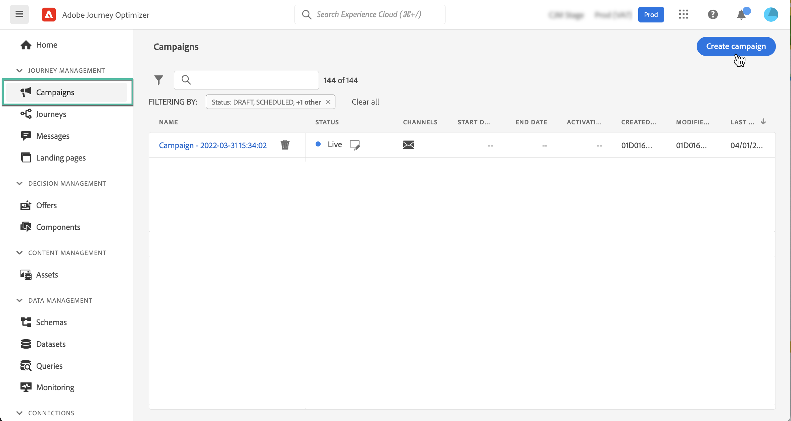
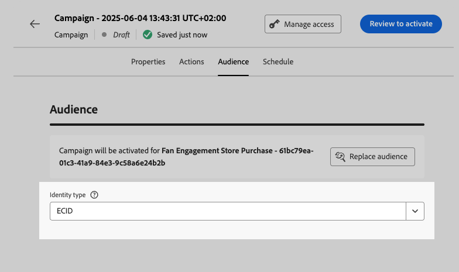

# Criar uma campanha {#create-campaign}

>[!NOTE]
>
>Antes de criar uma nova campanha, verifique se você tem um canal de superfície (ou seja, uma predefinição de mensagem) e um segmento do Adobe Experience Platform pronto para uso. Saiba mais nestas seções:
>
>* [Criar superfícies de canal](../configuration/channel-surfaces.md)
>* [Introdução aos segmentos](../segment/about-segments.md)

## Criar sua primeira campanha {#create}

1. Acesse o **[!UICONTROL Campanhas]** , em seguida, clique em **[!UICONTROL Criar campanha]**.

   >[!NOTE]
   >
   >Você também pode duplicar uma campanha ao vivo existente para criar uma nova. [Saiba mais](modify-stop-campaign.md#duplicate)

   

1. No **[!UICONTROL Propriedades]** , especifique quando deseja executar a campanha:

   * **[!UICONTROL Programado]**: execute a campanha imediatamente ou em uma data especificada. As campanhas programadas têm como objetivo enviar **marketing** digite mensagens.
   * **[!UICONTROL Acionado por API]**: execute a campanha usando uma chamada de API . As campanhas acionadas por API são destinadas ao envio de **transacional** mensagens, ou seja, mensagens enviadas após uma ação executada por um indivíduo: redefinição de senha, abandono de cartão etc. [Saiba como acionar uma campanha usando APIs](api-triggered-campaigns.md)

1. No **[!UICONTROL Ações]** escolha o canal e a superfície do canal a serem usados para enviar a mensagem e clique em **[!UICONTROL Criar]**.

   Uma superfície é uma configuração que foi definida por um [Administrador do sistema](../start/path/administrator.md). Ela contém todos os parâmetros técnicos para enviar a mensagem, como parâmetros de cabeçalho, subdomínio, aplicativos móveis etc. [Saiba mais](../configuration/channel-surfaces.md).

   

   >[!NOTE]
   >
   >Somente superfícies de canal compatíveis com o tipo de campanha de marketing são listadas na lista suspensa.

1. Especifique um título e uma descrição para a campanha.

   <!--To test the content of your message, toggle the **[!UICONTROL Content experiment]** option on. This allows you to test multiple variables of a delivery on populations samples, in order to define which treatment has the biggest impact on the targeted population.[Learn more about content experiment](../campaigns/content-experiment.md).-->

1. No **[!UICONTROL Ações]** , configure a mensagem a ser enviada com a campanha:

   1. Clique no botão **[!UICONTROL Editar conteúdo]** , em seguida, configure e crie o conteúdo da mensagem. [Saiba mais sobre mensagens](../messages/get-started-content.md).

      Saiba mais sobre as etapas detalhadas para criar o conteúdo da mensagem na página a seguir:

      * [Criar um email](../messages/create-email.md)
      * [Criar uma notificação por push](../messages/create-push.md)
      * [Criar uma mensagem de SMS.](../messages/create-sms.md)
   1. Depois que o conteúdo for definido, use a variável **[!UICONTROL Simular conteúdo]** para visualizar e testar seu conteúdo com perfis de teste. [Saiba mais](../design/preview.md).

   1. Clique na seta para voltar à tela de criação da campanha.

      

   1. No **[!UICONTROL Rastreamento de ações]** , especifique se deseja rastrear como os recipients reagem ao seu delivery: você pode rastrear cliques e/ou aberturas.

      Os resultados do rastreamento serão acessíveis no relatório da campanha após a execução da campanha. [Saiba mais sobre relatórios de campanha](../reports/campaign-global-report.md)

1. Defina o público-alvo como meta. Para fazer isso, clique no botão **[!UICONTROL Seleção do público-alvo]** para exibir a lista de segmentos disponíveis do Adobe Experience Platform. [Saiba mais sobre segmentos](../segment/about-segments.md)

   >[!NOTE]
   >
   >Para campanhas acionadas por API, o público-alvo precisa ser definido por meio de uma chamada de API. [Saiba mais](api-triggered-campaigns.md)

   No **[!UICONTROL Namespace de identidade]** , escolha o namespace a ser usado para identificar os indivíduos do segmento selecionado. [Saiba mais sobre namespaces](../event/about-creating.md#select-the-namespace)

   

   >[!NOTE]
   >
   >Os indivíduos pertencentes a um segmento que não tem a identidade (namespace) selecionada entre suas diferentes identidades não serão direcionados pela campanha.

   <!--If you are are creating an API-triggered campaign, the **[!UICONTROL cURL request]** section allows you to retrieve the **[!UICONTROL Campaign ID]** to use in the API call. [Learn more](api-triggered-campaigns.md)-->

1. Para executar sua campanha em uma data específica ou em uma frequência recorrente, configure a variável **[!UICONTROL Agendar]** seção. [Saiba como agendar campanhas](#schedule)

1. Para atribuir rótulos de uso de dados personalizados ou principais à campanha, clique no botão **[!UICONTROL Gerenciar acesso]** botão. [Saiba mais sobre o Controle de acesso no nível do objeto (OLA)](../administration/object-based-access.md)

Quando a campanha estiver pronta, você poderá revisá-la e publicá-la. [Saiba mais](#review-activate)

## Programar uma campanha {#schedule}

Por padrão, as campanhas começam assim que são ativadas manualmente e terminam assim que a mensagem é enviada uma vez.

Você pode definir uma frequência na qual a mensagem da campanha deve ser enviada. Para fazer isso, use o **[!UICONTROL Acionadores de ação]** na tela de criação da campanha para especificar se a campanha deve ser executada diariamente, semanalmente ou mensalmente.

Se não quiser executar a campanha logo após a ativação, você pode especificar a data e a hora em que a mensagem deve ser enviada usando o **[!UICONTROL Início da campanha]** opção. O  **[!UICONTROL Fim da campanha]** permite especificar quando uma campanha recorrente deve parar de ser executada.

## Modo de entrega rápida {#rapid-delivery}

>[!CONTEXTUALHELP]
>id="ajo_campaigns_rapid_delivery"
>title="Modo de entrega rápida"
>abstract="O modo de entrega rápida permite que você execute o envio de mensagens de alta velocidade no canal de push para um tamanho de público-alvo inferior a 30M."

O modo de entrega rápida, anteriormente conhecido como modo Burst no jornada, é um [!DNL Journey Optimizer] que permite o envio muito rápido de mensagens de push em grandes volumes por meio de campanhas.

A entrega rápida é usada quando o atraso na entrega de mensagens é essencial para os negócios, quando você deseja enviar um alerta por push urgente em telefones celulares, por exemplo, uma notícia de última hora para os usuários que instalaram seu aplicativo de canal de notícias.

Para obter mais informações sobre desempenho ao usar o modo Rapid delivery, consulte [Descrição do produto Adobe Journey Optimizer](https://helpx.adobe.com/br/legal/product-descriptions/adobe-campaign-managed-cloud-services.html).

### Pré-requisitos {#prerequisites}

As mensagens de delivery rápidas vêm com os seguintes requisitos:

* A entrega rápida está disponível para **[!UICONTROL Programado]** somente campanhas e não está disponível para campanhas acionadas por API,
* Nenhuma personalização é permitida na mensagem de push,
* O público-alvo deve conter menos de 30 M perfis,
* Você pode executar até 5 campanhas simultaneamente usando o modo Rapid delivery .

### Ativar modo de entrega rápida

1. Criar uma campanha de notificação por push e ativar **[!UICONTROL Entrega rápida]** opção.

1. Configure o conteúdo da mensagem e selecione o público-alvo a ser direcionado. [Saiba como criar uma campanha](#create)

   >[!IMPORTANT]
   >
   >Certifique-se de que o conteúdo da mensagem não inclua nenhuma personalização e que o público-alvo contenha menos de 30M perfis.

1. Revise e ative sua campanha como de costume. Observe que, no modo de teste, as mensagens não são enviadas por meio do modo Rapid delivery . [Saiba como revisar e ativar uma campanha](review-activate-campaign.md)
