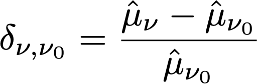

# Compreenda cálculos estatísticos no Relatório de experimentação {#experiment-report-calculations}

Esta página documenta os cálculos estatísticos detalhados usados no relatório Experimentação para campanhas no Adobe Journey Optimizer.

Observe que esta página é destinada a usuários técnicos.

## Taxa de conversão

A taxa de conversão ou **média**, μν para cada tratamento `ν` em um Experimento é definida como uma proporção da soma da métrica em relação ao número de perfis atribuídos a essa métrica, Nν:

{width="125" align="center"}

Aqui, YixvName é o valor da métrica de objetivo para cada perfil `i`, que foi atribuído a uma determinada variante *ν*. Quando a métrica de objetivo é uma métrica &quot;única&quot;, ou seja, é uma contagem do número de perfis que realizam uma ação específica, isso é exibido como uma taxa de conversão e formatado como uma porcentagem. Quando a métrica é uma métrica de &quot;contagem&quot; ou &quot;valor total&quot; (por exemplo, aberturas de email, receita respectivamente), a estimativa média da métrica é exibida como &quot;Contagem por perfil&quot; ou &quot;Valor por perfil&quot;.

Sempre que necessário, o desvio-padrão da amostra é utilizado com a expressão:

{width="225" align="center"}

## Aumento {#lift}

O aumento entre uma variante  *ν*, e a variante de controle  *ν0* é o &quot;delta&quot; relativo em taxas de conversão, definido como o cálculo abaixo onde as taxas de conversão individuais são as definidas acima. Isso é exibido como uma porcentagem.

{width="125" align="center"}

 

## Intervalos de confiança válidos a qualquer momento para tratamentos individuais

O painel Experimentação do Jornada exibe intervalos de confiança &quot;válidos a qualquer momento&quot; (sequências de confiança) para tratamentos individuais em um experimento.

A sequência de confiança de uma variante individual `ν` é fundamental para a metodologia estatística usada pelo Adobe. É possível encontrar sua definição em [esta página](https://doi.org/10.48550/arXiv.2103.06476) (reproduzido de [Waudby-Smith et al.]).

Se você estiver interessado em estimar um parâmetro de direcionamento `ψ` como o índice de conversão de uma variante em um experimento, a dicotomia entre uma sequência de Intervalos de confiança (CIs) de &quot;tempo fixo&quot; e uma Sequência de confiança (CS) uniforme no tempo pode ser resumida da seguinte maneira:

{width="500" align="center"}

Para um Intervalo de confiança regular, a garantia probabilística de que o parâmetro do público alvo está dentro do intervalo de valores⌘n é válido somente em um único valor fixo de `n` (onde `n` é o número de amostras). Por outro lado, para uma Sequência de confiança, é garantido que em todos os momentos/ todos os valores do tamanho da amostra `t`, o valor &quot;true&quot; do parâmetro de interesse está dentro dos limites.

Isso tem algumas implicações profundas que são muito importantes para o teste online:

* O CS pode ser atualizado opcionalmente sempre que novos dados estiverem disponíveis.
* Os experimentos podem ser monitorados continuamente, interrompidos adaptativamente ou continuados.
* O erro de tipo I é controlado em todos os horários de interrupção, incluindo horários dependentes de dados.

Adobe usa Sequências de Confiança Assintótica, que para uma variante individual com estimativa média `μ` tem o formato:

{width="300" align="center"}

Em que:

* `N` é o número de unidades dessa variante.
* `σ` é uma amostra da estimativa do desvio-padrão (definido acima).
* `α` é o nível desejado de erro do tipo I (ou probabilidade de falha de cobertura). Isso sempre é definido como 0,05.
* ρ2 é uma constante que ajusta o tamanho da amostra na qual o CS é o mais estreito. Adobe escolheu um valor universal de ρ2 = 10-2,8, que é apropriado para os tipos de taxas de conversão vistos em experiências online.

## Confiança {#confidence}

A confiança usada por Adobe é uma confiança &quot;válida a qualquer momento&quot;, que é obtida invertendo a sequência de confiança para o efeito médio do tratamento.

Para ser mais preciso, numa amostra de duas *t* para determinar a diferença nas médias entre duas variantes, existe um mapeamento 1:1 entre *p*-valor para este teste, e o intervalo de confiança para a diferença nas médias. Por analogia, um valor válido a qualquer momento *p*-valor pode ser obtido invertendo a sequência de confiança (a qualquer momento válido) para o avaliador de efeito médio de tratamento:

{width="200" align="center"}

Aqui, *E* é uma expectativa. O estimador usado é um estimador de propensão inversa ponderada (IPW). Considere N = N0 +N1 unidades, as atribuições de variante para cada unidade `i` rotulado por Ai=0,1 se a unidade estiver atribuída à variante `ν`=0,1 Se aos usuários for atribuída uma probabilidade fixa (propensão) π0, (1-π0), e sua métrica de resultado é Yi, então o avaliador de IPW para o efeito médio de tratamento é:

{width="400" align="center"}

Observando que *f* função de influência, Waudby-Smith et al. A mostrou que a Sequência de confiança para este estimador é:

{width="500" align="center"}

Substituindo a probabilidade de atribuição pelas suas estimativas empíricas: π0 = N0/N, o termo de variância pode ser expresso em termos de estimativas médias individuais da amostra μ0,1 e estimativas do desvio-padrão, σ0,1 como:

{width="500" align="center"}

Em seguida, lembre-se de que para um teste de hipótese regular com estatística de teste z = (μA-μ0/σpexiste uma correspondência entre `p`-valores e intervalos de confiança:

{width="500" align="center"}

onde `Φ` é a distribuição cumulativa do padrão normal. Para qualquer momento válido `p`-valores, dada a sequência de confiança para o efeito de tratamento médio definido acima, podemos inverter essa relação:

{width="600" align="center"}

Por último, a **confiança válida a qualquer momento** é:

{width="200" align="center"}

## Declarar um experimento como conclusivo

Para um Experimento com dois braços, o painel Experimentação do Journey Optimizer exibe uma mensagem informando que um Experimento é **conclusivo** quando a confiança válida a qualquer momento excede 95% (ou seja, a confiança válida a qualquer momento `p`valor inferior a 5%).

Quando mais de duas variantes estão presentes, a correção de Bonferonni é aplicada para controlar a taxa de erro da família. Para um experimento com `K` tratamento de base (controlo), há um número significativo de casos em que a `K-1` testes de hipótese independentes. A correção de Bonferonni significa que rejeitamos a hipótese nula de que o controle e uma determinada variante tenham meios iguais, se o valor for válido a qualquer momento `p`-value (definido acima) está abaixo de um limite de `α/(K-1)`.

## Braço com melhor desempenho

Quando um experimento é declarado conclusivo, o braço com melhor desempenho é exibido. Esse é o braço com o melhor desempenho (maior média ou taxa de conversão), entre o Conjunto que inclui o controle, e todos os braços que têm um `p`-valor abaixo do limiar de Bonferonni.
