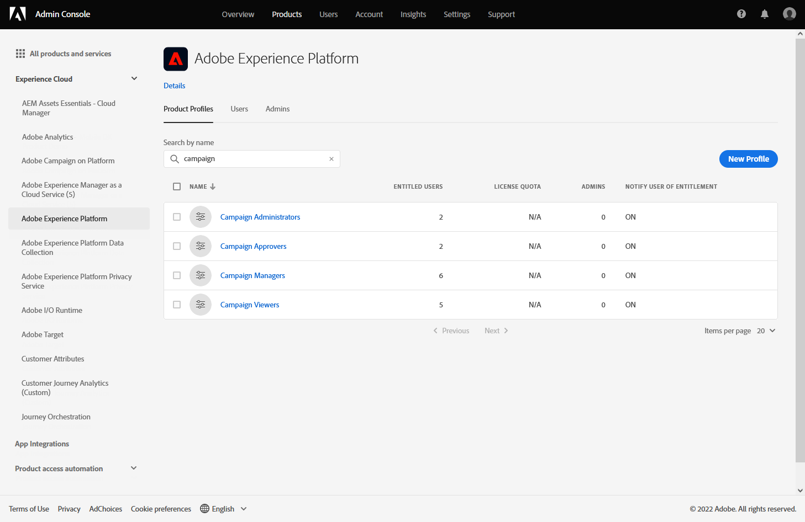

# Introdução às campanhas {#get-started-campaigns}

>[!CONTEXTUALHELP]
>id="campaigns_list"
>title="Campanhas"
>abstract="Crie campanhas para fornecer conteúdo único a um segmento específico em vários canais. Antes de criar sua campanha, verifique se você tem uma superfície de canal (ou seja, uma predefinição de mensagem) e um segmento do Adobe Experience Platform pronto para uso."

Use campanhas do Journey Optimizer para fornecer conteúdo único a um segmento específico usando vários canais. Ao usar jornadas, as ações são executadas em sequência. Com campanhas, as ações são executadas simultaneamente, imediatamente ou com base em um agendamento especificado.

Crie campanhas para enviar comunicações em lote ad-hoc simples para casos de uso de marketing, como ofertas promocionais, campanhas de engajamento, anúncios, avisos legais ou atualizações de políticas.

➡️ [Descubra este recurso no vídeo](#video)

<!--You can create two types of campaigns:

* **Scheduled campaigns** allow for simple ad-hoc batch communications for marketing use cases like promotional offers, engagement campaigns, announcements, legal notices, or policy updates.
* **API Triggered Campaigns** allow for simple transactional/operational messages with REST APIs (password reset, card abandonment, etc.), where the need may involve personalization using profile attributes and contextual data from payload.-->

## Antes de começar {#campaign-prerequisites}

Verifique os seguintes pré-requisitos antes de começar a criar sua primeira campanha no Journey Optimizer:

1. **Você precisa de permissões adequadas**. As campanhas só estão disponíveis para usuários com acesso a uma campanha relacionada **[!UICONTROL Product profile]** Como administrador do Campaign, aprovador do Campaign, gerente de campanha e/ou visualizador do Campaign.

   Se não conseguir acessar campanhas, suas permissões devem ser estendidas. Se você tiver acesso a [Adobe Admin Console](https://adminconsole.adobe.com/){target=&quot;_blank&quot;} para sua organização, siga as etapas abaixo. Caso contrário, entre em contato com o administrador da Journey Optimizer.

   +++Saiba como atribuir permissões de campanha

   Para atribuir o **[!UICONTROL Product profile]** para seus usuários:

   1. De [Adobe Admin Console](https://adminconsole.adobe.com/){target=&quot;_blank&quot;}, selecione o [!DNL Adobe Experience Platform] produto.

   1. Navegue até o **[!UICONTROL Product profile]** selecione uma das campanhas internas relacionadas **[!UICONTROL Product profile]**: Administrador de campanha, aprovador da campanha, gerente de campanha ou visualizador da campanha.

      Para obter mais informações sobre a campanha do Journey Optimizer **[!UICONTROL Product profiles]** e **[!UICONTROL Permissions]**, [consulte esta página](../administration/ootb-product-profiles.md).

      

   1. Clique em **[!UICONTROL Add user]** para atribuir ao usuário o **[!UICONTROL Product profile]**.

      

   1. Digite o nome do usuário, o grupo ou o endereço de email e clique em **[!UICONTROL Save]**.
   Seu usuário agora pode acessar **[!UICONTROL Campaigns]**.

+++

1. **Você precisa de um público-alvo**. Segmentos de público-alvo precisam estar disponíveis antes de criar a campanha. Saiba mais sobre a criação de público-alvo [nesta página](../segment/about-segments.md).
1. **Você precisa de uma superfície de canal**. Para selecionar um canal, é necessário criar e disponibilizar a superfície do canal correspondente (ou seja, predefinição). Saiba mais sobre superfícies de canais [nesta página](../configuration/channel-surfaces.md).

## Acessar campanhas {#access}

As campanhas podem ser acessadas a partir da variável **[!UICONTROL Campaigns]** menu.

Por padrão, a lista mostra todas as campanhas com a variável **[!UICONTROL Draft]**, **[!UICONTROL Scheduled]** e **[!UICONTROL Live]** status. Para exibir campanhas interrompidas, concluídas e arquivadas, é necessário limpar o filtro.

## Status da campanha {#statuses}

As campanhas podem ter vários status:

* **[!UICONTROL Draft]**: A campanha está sendo editada e não foi ativada.
* **[!UICONTROL Activating]**: A campanha está sendo ativada.
* **[!UICONTROL Live]**: A campanha foi ativada.
* **[!UICONTROL Scheduled]**: A campanha está configurada para ser ativada em uma data de início específica.
* **[!UICONTROL Stopped]**: A campanha foi interrompida manualmente. Não é possível ativá-la ou reutilizá-la. [Saiba mais](modify-stop-campaign.md#stop)
* **[!UICONTROL Completed]**: A campanha foi concluída. Esse status é automaticamente atribuído 3 dias após a ativação de uma campanha ou na data de término da campanha, se ela tiver uma execução recorrente.
* **[!UICONTROL Archived]**: A campanha foi arquivada.

>[!NOTE]
>
>O ícone &quot;Abrir versão de rascunho&quot; ao lado de um **[!UICONTROL Live]** ou **[!UICONTROL Scheduled]** indica que uma nova versão da campanha foi criada e ainda não foi ativada. [Saiba mais](modify-stop-campaign.md#modify).

## Vídeo tutorial {#video}

Saiba como criar sua primeira campanha.

>[!VIDEO](https://video.tv.adobe.com/v/346680?quality=12)
