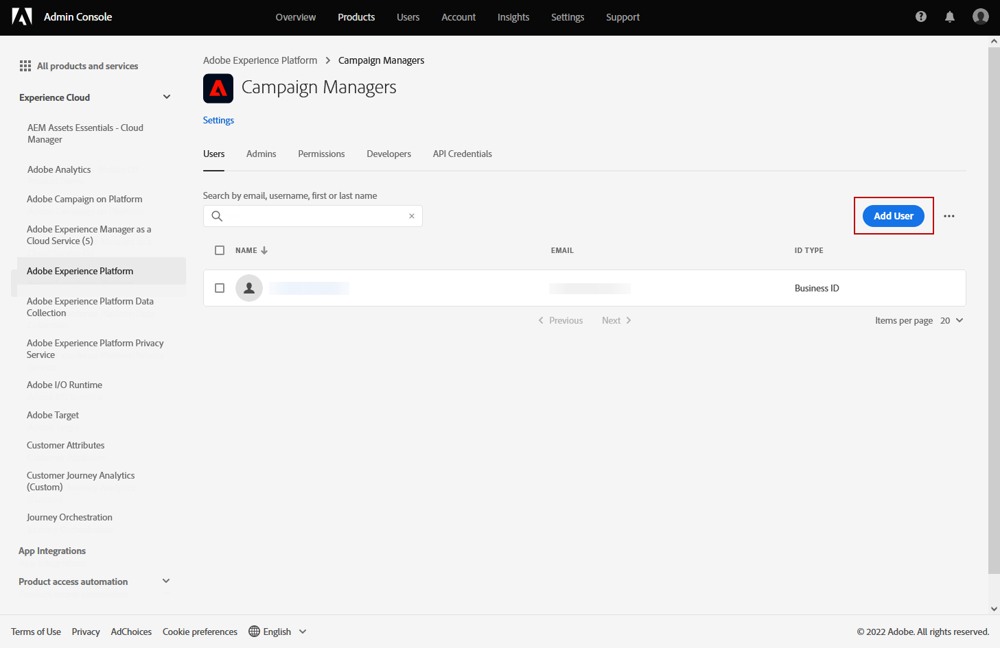

# Introdução a campanhas {#get-started-campaigns}

>[!CONTEXTUALHELP]
>id="campaigns_list"
>title="Campanhas"
>abstract="Crie campanhas para fornecer conteúdo único a um segmento específico em vários canais. Antes de criar sua campanha, verifique se você tem uma superfície de canal (ou seja, uma predefinição de mensagem) e um segmento da Adobe Experience Platform pronto para uso."

Use as campanhas do Journey Otimizer para fornecer conteúdo único a um segmento específico usando vários canais. Ao usar jornadas, as ações são executadas em sequência. Com campanhas, as ações são executadas simultaneamente, imediatamente ou com base em um agendamento especificado.

Você pode criar dois tipos de campanhas:

* **Campanhas programadas** permitir comunicações em lote ad-hoc simples para casos de uso de marketing, como ofertas promocionais, campanhas de engajamento, anúncios, avisos legais ou atualizações de políticas.
* **Campanhas acionadas pela API** permitir mensagens transacionais/operacionais simples com APIs REST (redefinição de senha, abandono de cartão etc.), onde a necessidade pode envolver personalização usando atributos de perfil e dados contextuais da carga.

As principais etapas para criar uma campanha são as seguintes:

➡️ [Descubra este recurso no vídeo](#video)

## Antes de começar {#campaign-prerequisites}

Verifique os seguintes pré-requisitos antes de começar a criar sua primeira campanha no Journey Otimizer:

1. **Você precisa de permissões adequadas**. As campanhas só estão disponíveis para usuários com acesso a uma campanha relacionada **[!UICONTROL Product profile]** Como administrador do Campaign, aprovador do Campaign, gerente de campanha e/ou visualizador do Campaign.

   Se não conseguir acessar campanhas, suas permissões devem ser estendidas. Se você tiver acesso a [Adobe Admin Console](https://adminconsole.adobe.com/){target=&quot;_blank&quot;} para sua organização, siga as etapas abaixo. Caso contrário, entre em contato com o administrador do Journey Otimizer.

   +++Saiba como atribuir permissões de campanha

   Para atribuir o **[!UICONTROL Product profile]** para seus usuários:

   1. De [Adobe Admin Console](https://adminconsole.adobe.com/){target=&quot;_blank&quot;}, selecione o [!DNL Adobe Experience Platform] produto.

   1. Navegue até o **[!UICONTROL Product profile]** selecione uma das campanhas internas relacionadas **[!UICONTROL Product profile]**: Administrador de campanha, aprovador da campanha, gerente de campanha ou visualizador da campanha.

      Para obter mais informações sobre a campanha do Journey Otimizer **[!UICONTROL Product profiles]** e **[!UICONTROL Permissions]**, [consulte esta página](../administration/ootb-product-profiles.md).

      

   1. Clique em **[!UICONTROL Add user]** para atribuir ao usuário o **[!UICONTROL Product profile]**.

      

   1. Digite o nome do usuário, o grupo ou o endereço de email e clique em **[!UICONTROL Save]**.
   Seu usuário agora pode acessar **[!UICONTROL Campaigns]**.

+++

1. **Você precisa de um público-alvo**. Segmentos de público-alvo precisam estar disponíveis antes de criar a campanha. Saiba mais sobre a criação de público-alvo [nesta página](../segment/about-segments.md).
1. **Você precisa de uma superfície de canal**. Para selecionar um canal, é necessário criar e disponibilizar a superfície do canal correspondente (ou seja, predefinição). Saiba mais sobre superfícies de canais [nesta página](../configuration/channel-surfaces.md).

## Vídeo tutorial {#video}

Saiba como criar sua primeira campanha.

>[!VIDEO](https://video.tv.adobe.com/v/346680?quality=12)
