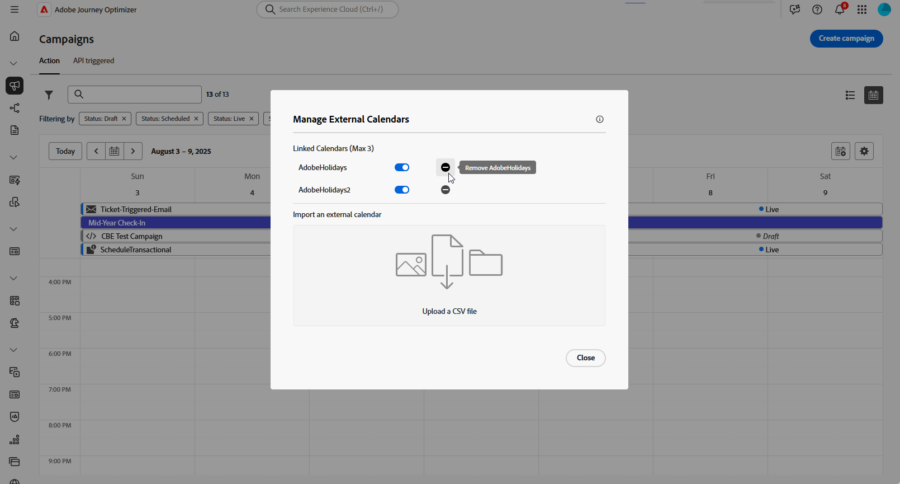

# Acessar e gerenciar campanhas {#manage-campaigns}

>[!CONTEXTUALHELP]
>id="ajo_targeting_workflow_list"
>title="Inventário de campanhas orquestradas"
>abstract="Nesta tela, é possível acessar a lista completa de campanhas orquestradas, verificar o status atual, as datas da última/próxima execução e criar uma nova campanha orquestrada."

>[!CONTEXTUALHELP]
>id="ajo_orchestration_campaign_action"
>title="Ação"
>abstract="Esta seção lista todas as ações usadas na campanha orquestrada."

As campanhas podem ser acessadas no menu **[!UICONTROL Campanhas]**. Use as guias para procurar campanhas por tipo: **Ações** campanhas, **Campanhas acionadas por API** e **Campanhas orquestradas**. Saiba mais sobre os [tipos de campanhas](get-started-with-campaigns.md#get-started-with-campaigns). Os tipos disponíveis dependem do contrato de licença e das permissões.

>[!BEGINTABS]

>[!TAB Campanhas de ação]

Selecione a guia **[!UICONTROL Ação]** para acessar a lista de campanhas de Ação.

Por padrão, a lista mostra todas as campanhas com os status **[!UICONTROL Rascunho]**, **[!UICONTROL Agendado]** e **[!UICONTROL Ativo]**. Para exibir campanhas interrompidas, concluídas e arquivadas, é necessário limpar o filtro.

>[!TAB Campanhas acionadas por API]

Selecione a guia **[!UICONTROL API acionada]** para acessar a lista de campanhas acionadas por API.

Por padrão, a lista mostra todas as campanhas com os status **[!UICONTROL Rascunho]**, **[!UICONTROL Agendado]** e **[!UICONTROL Ativo]**. Para exibir campanhas interrompidas, concluídas e arquivadas, é necessário limpar o filtro.

>[!TAB Campanhas orquestradas]

Selecione a guia **[!UICONTROL Orquestração]** para acessar a lista de campanhas Orquestradas.

{zoomable="yes"}{zoomable="yes"}

Cada campanha orquestrada na lista exibe informações como o [status](#status) atual da campanha, o canal e as tags associados ou a última vez que ela foi modificada. Você pode personalizar as colunas exibidas, clicando no botão .

>[!ENDTABS]

Além disso, uma barra de pesquisa e filtros estão disponíveis para facilitar a pesquisa na lista. Por exemplo, você pode filtrar campanhas para exibir somente aquelas associadas a um determinado canal ou tag, ou aquelas criadas durante um intervalo de datas específico.

A  no inventário de campanhas permite executar as diversas operações detalhadas abaixo.

* **[!UICONTROL Exibir o relatório de todos os tempos]** / **[!UICONTROL Exibir o relatório das últimas 24 horas]** - Acesse relatórios para medir e visualizar o impacto e o desempenho de suas campanhas. Saiba mais sobre [relatórios de campanha](../reports/campaign-global-report-cja.md).
* **[!UICONTROL Editar marcas]** - Edita as marcas associadas à campanha. Saiba como [usar tags em suas campanhas](../start/search-filter-categorize.md#add-tags-to-an-object)
* **[!UICONTROL Duplicar]** - Use esta opção para duplicar uma campanha, por exemplo, para executar uma campanha Orquestrada que foi interrompida. [Saiba mais](#duplicate-a-campaign)
* **[!UICONTROL Excluir]** - Use esta opção para excluir uma campanha. [Saiba mais](#delete-a-campaign)
* **[!UICONTROL Arquivar]**: arquive a campanha. Todas as campanhas arquivadas são excluídas em uma programação contínua 30 dias após sua última data modificada. Esta ação está disponível para todas as campanhas, exceto as campanhas de **[!UICONTROL Rascunho]**. Saiba mais sobre [arquivamento de campanha](#archive-a-campaign).

Para campanhas acionadas por Ação e API, as ações adicionais abaixo estão disponíveis:

* **[!UICONTROL Adicionar ao pacote]** - Adicione a campanha a um pacote para exportá-la para outra sandbox. Saiba como [exportar objetos para outra sandbox](../configuration/copy-objects-to-sandbox.md)
* **[!UICONTROL Abrir versão de rascunho]** - Se uma nova versão da campanha tiver sido criada e ainda não tiver sido ativada, você poderá acessar sua versão de rascunho usando esta ação.

## Ciclo de vida da campanha {#statuses}

No Adobe Journey Optimizer, cada campanha passa por um ciclo de vida refletido pelo status na interface. Os status disponíveis variam dependendo do tipo de campanha — Ação, API acionada ou Orquestrada. Use as guias abaixo para explorar o ciclo de vida e os status específicos de cada tipo de campanha.

>[!BEGINTABS]

>[!TAB Campanhas de ação]

* **[!UICONTROL Rascunho]**: a campanha está sendo editada e não foi ativada.
* **[!UICONTROL Agendado]**: a campanha está configurada para ser ativada em uma data de início específica.
* **[!UICONTROL Ao vivo]**: A campanha foi ativada.
* **[!UICONTROL Em revisão]**: a campanha foi enviada para aprovação para ser publicada. [Saiba como trabalhar com aprovações](../test-approve/gs-approval.md)
* **[!UICONTROL Parada]**: a campanha foi interrompida manualmente. Não é possível ativá-lo ou reutilizá-lo. [Saiba como interromper uma campanha](manage-campaigns.md#stop)
* **[!UICONTROL Concluído]**: a campanha foi concluída. Esse status é atribuído automaticamente 3 dias após a ativação de uma campanha ou na data final da campanha, se houver uma execução recorrente.
* **[!UICONTROL Falha]**: a execução da campanha falhou. Verifique os logs para identificar o problema.
* **[!UICONTROL Arquivado]**: a campanha foi arquivada. [Saiba como arquivar campanhas](manage-campaigns.md#archive)

>[!NOTE]
>
>O ícone &quot;Abrir versão de rascunho&quot; ao lado do status **[!UICONTROL Ativo]** ou **[!UICONTROL Agendado]** indica que uma nova versão de uma campanha acionada por Ação ou API foi criada e ainda não foi ativada.

>[!TAB Campanhas acionadas por API]

* **[!UICONTROL Rascunho]**: a campanha está sendo editada e não foi ativada.
* **[!UICONTROL Agendado]**: a campanha está configurada para ser ativada em uma data de início específica.
* **[!UICONTROL Ao vivo]**: A campanha foi ativada.
* **[!UICONTROL Em revisão]**: a campanha foi enviada para aprovação para ser publicada. [Saiba como trabalhar com aprovações](../test-approve/gs-approval.md)
* **[!UICONTROL Parada]**: a campanha foi interrompida manualmente. Não é possível ativá-lo ou reutilizá-lo. [Saiba como interromper uma campanha](manage-campaigns.md#stop)
* **[!UICONTROL Concluído]**: a campanha foi concluída. Esse status é atribuído automaticamente 3 dias após a ativação de uma campanha ou na data final da campanha, se houver uma execução recorrente.
* **[!UICONTROL Falha]**: a execução da campanha falhou. Verifique os logs para identificar o problema.
* **[!UICONTROL Arquivado]**: a campanha foi arquivada. [Saiba como arquivar campanhas](manage-campaigns.md#archive)

>[!NOTE]
>
>O ícone &quot;Abrir versão de rascunho&quot; ao lado do status **[!UICONTROL Ativo]** ou **[!UICONTROL Agendado]** indica que uma nova versão de uma campanha acionada por Ação ou API foi criada e ainda não foi ativada.

>[!TAB Campanhas orquestradas]

* **[!UICONTROL Rascunho]**: A campanha Orquestrada foi criada. Ela ainda não foi publicada.
* **[!UICONTROL Publicação]**: a campanha Orquestrada está sendo publicada.
* **[!UICONTROL Live]**: a campanha orquestrada foi publicada e está sendo executada.
* **[!UICONTROL Agendado]**: a execução da campanha Orquestrada foi agendada.
* **[!UICONTROL Concluído]**: a execução da campanha Orquestrada foi concluída. O status “Concluída” é atribuído automaticamente até três dias após uma campanha concluir o envio de mensagens sem erros.
* **[!UICONTROL Encerrada]**: este status é exibido quando uma campanha recorrente é encerrada. A campanha continua sendo executada até que todas as atividades tenham sido concluídas, mas nenhum outro perfil poderá entrar na campanha.
* **[!UICONTROL Arquivado]**: a campanha Orquestrada foi arquivada. Todas as campanhas arquivadas são excluídas dentro de um prazo contínuo 30 dias após a data da última modificação. Você pode duplicar uma campanha arquivada, se necessário, para continuar trabalhando nela.
* **[!UICONTROL Parado]**: a execução da campanha Orquestrada foi interrompida. Para iniciar a campanha novamente, você precisa duplicá-la.

>[!ENDTABS]

Quando ocorre um erro em uma de suas campanhas, um ícone de aviso é exibido junto com o status da campanha. Clique nele para exibir informações relacionadas ao alerta. Esses alertas podem ocorrer em várias situações, como quando a mensagem da campanha não foi publicada ou se a configuração escolhida estiver incorreta.

## Calendário de campanhas {#calendar}

>[!CONTEXTUALHELP]
>id="ajo_campaigns_view"
>title="Visualizações de campanhas em lista e calendário"
>abstract="Além da lista de campanhas, o [!DNL Journey Optimizer] fornece uma visualização do calendário das suas campanhas, oferecendo uma representação visual clara dos cronogramas. Você pode alternar entre as visualizações em lista e calendário a qualquer momento, usando estes botões."

Além da lista de campanhas, o [!DNL Journey Optimizer] fornece uma exibição do calendário de suas campanhas, oferecendo uma representação visual clara de suas agendas.

Como as campanhas são representadas:

* Por padrão, a grade de calendário mostra todas as campanhas ativas e programadas para a semana selecionada. Opções de filtro adicionais podem mostrar ativações concluídas, interrompidas e concluídas ou ativações de um determinado tipo ou canal.
* As campanhas de rascunho não são exibidas.
* Campanhas abrangendo vários dias aparecem na parte superior da grade do calendário.
* Se nenhuma hora de início for especificada, a hora de ativação manual mais próxima será usada para posicioná-la no calendário.
* As campanhas são exibidas como intervalos de tempo de 1 hora, mas isso não reflete a hora real de envio ou de conclusão.

Para navegar no calendário do Campaigns:

1. Clique no ícone do  para acessar o calendário do Campaigns.

1. Use os botões de seta ou o seletor de datas acima do calendário para se mover entre semanas.

   O calendário exibe todas as campanhas programadas para a semana atual.

   

1. Clique no ícone de  para alternar a exibição de itens que abrangem vários dias ou semanas.

   

1. Clique no ícone  para gerenciar e adicionar até três calendários externos.

   

1. Arraste e solte seus arquivos CSV contendo nomes de evento, datas de início e datas de término.

   Os eventos carregados são exibidos para todos os usuários em sua organização e exibidos nos calendários do Jornada e do Campaign.

   +++O formato CSV deve ser o seguinte:

   | Coluna1 | Coluna2 | Coluna3 |
   |-|-|-|
   | Nome do evento | Data inicial no formato mm/dd/aa | Data final no formato mm/dd/aa |

   +++

1. Se necessário, você pode ocultar, reexibir ou remover calendários externos adicionados.

   

1. Para obter mais detalhes sobre uma campanha, clique no bloco visual para abrir os detalhes. Um painel de informações será aberto com várias informações sobre a campanha, como tipo, acesso aos relatórios ou as tags atribuídas.

   

## Modificar e parar campanhas de Ação recorrentes {#modify}

### Modificar uma campanha de ação

Para modificar e criar uma nova versão de uma campanha de Ação recorrente, siga estas etapas:

1. Abra a campanha Ação e clique no botão **[!UICONTROL Modificar campanha]**.

1. Uma nova versão da campanha é criada. Você pode verificar a versão disponível clicando em **[!UICONTROL Abrir versão disponível]**.

   

   Na lista de campanhas, campanhas ativadas com uma versão de rascunho em andamento são exibidas com um ícone específico na coluna **[!UICONTROL Status]**. Clique nesse ícone para abrir a versão de rascunho da campanha.

   

1. Quando as alterações estiverem prontas, você poderá ativar a nova versão da campanha (consulte [Revisar e ativar uma campanha](create-campaign.md#review-activate)).

   >[!IMPORTANT]
   >
   >Ativar o rascunho substituirá a versão ao vivo da campanha.

### Interromper uma campanha de ação {#stop}

Para interromper uma campanha recorrente, abra-a e clique no botão **[!UICONTROL Parar campanha]**.

>[!IMPORTANT]
>
>Interromper uma campanha não interromperá um envio em andamento, mas interromperá um envio agendado ou as próximas ocorrências se o envio já estiver em andamento.

## Arquivar uma campanha {#archive}

Com o tempo, a lista de campanhas continua crescendo e, eventualmente, dificulta a navegação em campanhas concluídas e interrompidas.

Para evitar isso, você pode arquivar campanhas concluídas e interrompidas que não são mais necessárias. Para fazer isso, clique no botão de reticências e selecione **[!UICONTROL Arquivar]**.

As campanhas arquivadas podem ser recuperadas usando o filtro dedicado na lista.

## Excluir uma campanha {#delete}

Para excluir uma campanha, use as reticências  e selecione **[!UICONTROL Excluir]**.

{width="70%" align="left"}

>[!IMPORTANT]
>
>Esta opção está disponível somente para campanhas do **[!UICONTROL Rascunho]**.

## Duplicar uma campanha {#duplicate}

Para duplicar uma campanha, por exemplo, se ela tiver sido interrompida, use as reticências  e selecione **[!UICONTROL Duplicar]**.

Insira o nome da campanha e confirme.

A campanha é criada e adicionada à lista de campanhas.
