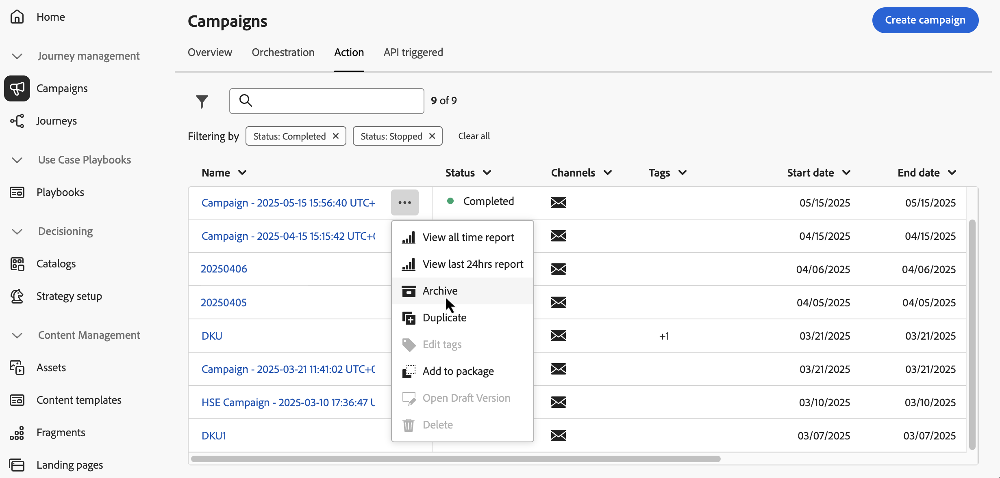

# Acessar e gerenciar campanhas {#manage-campaigns}

>[!CONTEXTUALHELP]
>id="ajo_targeting_workflow_list"
>title="Inventário de campanhas orquestradas"
>abstract="Nesta tela, é possível acessar a lista completa de campanhas orquestradas, verificar o status atual, as datas da última/próxima execução e criar uma nova campanha orquestrada."

>[!CONTEXTUALHELP]
>id="ajo_orchestration_campaign_action"
>title="Ação"
>abstract="Esta seção lista todas as ações usadas na campanha orquestrada."

Saiba como acessar, organizar e gerenciar suas campanhas no Adobe Journey Optimizer. Este guia aborda tudo, desde encontrar campanhas até entender status, executar operações comuns e manter o espaço de trabalho da campanha.

>[!BEGINSHADEBOX]

**Ir diretamente para o que você precisa:**

* **Criar uma nova campanha** - [Escolher o tipo de campanha](get-started-with-campaigns.md#campaign-types) | [Criar campanha de Ação](create-campaign.md) | [Criar campanha acionada por API](api-triggered-campaigns.md) | [Criar campanha orquestrada](../orchestrated/gs-orchestrated-campaigns.md)
* **Localizar campanhas existentes** - [Pesquisar e filtrar](#access)
* **Exibir desempenho da campanha** - [Relatórios de campanha](../reports/campaign-global-report-cja.md)
* **Agendar campanhas** - [Usar o calendário](#calendar)
* **Gerenciar conflitos** - [Guia de gerenciamento de conflitos](../conflict-prioritization/gs-conflict-prioritization.md)

>[!ENDSHADEBOX]

## Acessar e procurar campanhas {#access}

As campanhas podem ser acessadas no menu **[!UICONTROL Campanhas]**. Use as guias para procurar campanhas por tipo: **Ações** campanhas, **Campanhas acionadas por API** e **Campanhas orquestradas**. Saiba mais sobre os [tipos de campanhas](get-started-with-campaigns.md#campaign-types). Os tipos disponíveis dependem do contrato de licença e das permissões.

>[!BEGINTABS]

>[!TAB Campanhas de ação]

Selecione a guia **[!UICONTROL Ação]** para acessar a lista de campanhas de Ação.

Por padrão, a lista mostra todas as campanhas com os status **[!UICONTROL Rascunho]**, **[!UICONTROL Agendado]** e **[!UICONTROL Ativo]**. Para exibir campanhas interrompidas, concluídas e arquivadas, é necessário limpar o filtro.

>[!TAB Campanhas acionadas por API]

Selecione a guia **[!UICONTROL API acionada]** para acessar a lista de campanhas acionadas por API.

Por padrão, a lista mostra todas as campanhas com os status **[!UICONTROL Rascunho]**, **[!UICONTROL Agendado]** e **[!UICONTROL Ativo]**. Para exibir campanhas interrompidas, concluídas e arquivadas, é necessário limpar o filtro.

>[!TAB Campanhas orquestradas]

Selecione a guia **[!UICONTROL Orquestração]** para acessar a lista de campanhas Orquestradas.

{zoomable="yes"}

Cada campanha orquestrada na lista exibe informações como o [status](#statuses) atual da campanha, o canal e as tags associados ou a última vez que ela foi modificada. Você pode personalizar as colunas exibidas, clicando no botão .

>[!ENDTABS]

### Pesquisar e filtrar campanhas {#search-filter}

Além disso, uma barra de pesquisa e filtros estão disponíveis para facilitar a pesquisa na lista. Por exemplo, você pode filtrar campanhas para exibir somente aquelas associadas a um determinado canal ou tag, ou aquelas criadas durante um intervalo de datas específico.

## Operações do Campaign {#operations}

A  no inventário de campanhas permite executar várias operações.

### Ações disponíveis

**Para todos os tipos de campanha:**

* **[!UICONTROL Exibir o relatório de todos os tempos]** / **[!UICONTROL Exibir o relatório das últimas 24 horas]** - Acesse relatórios para medir e visualizar o impacto e o desempenho de suas campanhas. [Saiba mais sobre relatórios de campanha →](../reports/campaign-global-report-cja.md)
* **[!UICONTROL Editar marcas]** - Edita as marcas associadas à campanha. [Saiba como usar tags →](../start/search-filter-categorize.md#add-tags)
* **[!UICONTROL Duplicar]** - Use esta opção para duplicar uma campanha, por exemplo, para executar uma campanha Orquestrada que foi interrompida. [Saiba mais sobre duplicação →](#duplicate-a-campaign)
* **[!UICONTROL Excluir]** - Use esta opção para excluir uma campanha. [Saiba mais sobre exclusão →](#delete-a-campaign)
* **[!UICONTROL Arquivar]**: arquive a campanha. Todas as campanhas arquivadas são excluídas em uma programação contínua 30 dias após sua última data modificada. Esta ação está disponível para todas as campanhas, exceto as campanhas de **[!UICONTROL Rascunho]**. [Saiba mais sobre arquivamento →](#archive-a-campaign)

**Somente para campanhas acionadas por Ação e API:**

* **[!UICONTROL Adicionar ao pacote]** - Adicione a campanha a um pacote para exportá-la para outra sandbox. [Saiba como exportar objetos →](../configuration/copy-objects-to-sandbox.md)
* **[!UICONTROL Abrir versão de rascunho]** - Se uma nova versão da campanha tiver sido criada e ainda não tiver sido ativada, você poderá acessar sua versão de rascunho usando esta ação.

## Noções básicas sobre o status da campanha {#statuses}

Cada campanha passa por um ciclo de vida que é refletido pelo status na interface. Compreender esses status ajuda você a saber quais ações estão disponíveis e o que fazer a seguir.

| Status | Campanhas de ação | Campanhas acionadas por API | Campanhas orquestradas | O que significa | Próximas ações |
|--------|:----------------:|:-----------------------:|:----------------------:|---------------|--------------|
| **[!UICONTROL Rascunho]** | ✅ | ✅ | ✅ | Em edição, não ativado | Continue editando ou [ative a campanha](review-activate-campaign.md) |
| **[!UICONTROL Programado]** | ✅ | ✅ | ✅ | Configurado para uma data de início específica | Aguarde a inicialização, [modifique se necessário](#modify) ou [exiba no calendário](#calendar) |
| **[!UICONTROL Ao vivo]** | ✅ | ✅ | ✅ | Ativado e em execução | [Monitorar desempenho](../reports/campaign-global-report-cja.md), [criar nova versão](#modify) se necessário |
| **[!UICONTROL Em revisão]** | ✅ | ✅ | — | Enviado para aprovação | Aguardar [aprovação](../test-approve/gs-approval.md) ou modificar |
| **[!UICONTROL Interrompida]** | ✅ | ✅ | ✅ | Interrompido manualmente, não é possível reativar | [Duplicar para reutilizar](#duplicate-a-campaign) |
| **[!UICONTROL Concluído]** | ✅ | ✅ | ✅ | Execução concluída (atribuída automaticamente 3 dias após a ativação ou na data final para recorrente) | [Exibir relatórios](../reports/campaign-global-report-cja.md), [arquivo morto](#archive-a-campaign) ou [duplicar](#duplicate-a-campaign) |
| **[!UICONTROL Falha]** | ✅ | ✅ | — | Falha na execução | Verifique logs, corrija problemas, [duplique para tentar novamente](#duplicate-a-campaign) |
| **[!UICONTROL Arquivado]** | ✅ | ✅ | ✅ | Arquivado (excluído automaticamente após 30 dias) | [Recuperar usando filtro](#access), se necessário |
| **[!UICONTROL Fechado]** | — | — | ✅ | Campanha recorrente fechada, nenhuma nova entrada permitida (continua até que todas as atividades sejam concluídas) | Aguardar a conclusão |
| **[!UICONTROL Publicação]** | — | — | ✅ | Em publicação | Aguardar a conclusão da publicação |

>[!NOTE]
>
>Para campanhas acionadas por Ação e API, o ícone &quot;Abrir versão de rascunho&quot; ao lado do status **[!UICONTROL Ativo]** ou **[!UICONTROL Agendado]** indica que uma nova versão foi criada e ainda não foi ativada.

### Indicadores de erro

Quando ocorre um erro em uma de suas campanhas, um ícone de aviso é exibido junto com o status da campanha. Clique nele para exibir informações relacionadas ao alerta. Esses alertas podem ocorrer em várias situações, como quando a mensagem da campanha não foi publicada ou se a configuração escolhida estiver incorreta.

>[!NOTE]
>
>O Assets/Images pode ser acessado em conteúdo entregue por até 2 anos (730 dias) desde sua primeira publicação em qualquer fragmento/mensagem em linha. A republicação é necessária após esse período de expiração (a qualquer momento após 730 dias) para mantê-las acessíveis por mais 2 anos. Qualquer republicação feita dentro de 730 dias da primeira publicação não estenderá a expiração de ativos/imagens para os próximos 730 dias.

## Calendário de campanhas {#calendar}

>[!CONTEXTUALHELP]
>id="ajo_campaigns_view"
>title="Visualizações de campanhas em lista e calendário"
>abstract="Além da lista de campanhas, o [!DNL Journey Optimizer] fornece uma visualização do calendário das suas campanhas, oferecendo uma representação visual clara dos cronogramas. Você pode alternar entre as visualizações em lista e calendário a qualquer momento, usando estes botões."

Além da lista de campanhas, o [!DNL Journey Optimizer] fornece uma exibição do calendário de suas campanhas, oferecendo uma representação visual clara de suas agendas.

### Como o calendário funciona

Como as campanhas são representadas:

* Por padrão, a grade de calendário mostra todas as campanhas ativas e programadas para a semana selecionada. Opções de filtro adicionais podem mostrar ativações concluídas, interrompidas e concluídas ou ativações de um determinado tipo ou canal.
* As campanhas de rascunho não são exibidas.
* Campanhas abrangendo vários dias aparecem na parte superior da grade do calendário.
* Se nenhuma hora de início for especificada, a hora de ativação manual mais próxima será usada para posicioná-la no calendário.
* As campanhas são exibidas como intervalos de tempo de 1 hora, mas isso não reflete a hora real de envio ou de conclusão.

### Navegar pelo calendário

1. Clique no ícone do  para acessar o calendário do Campaigns.

1. Use os botões de seta ou o seletor de datas acima do calendário para se mover entre semanas.

   O calendário exibe todas as campanhas programadas para a semana atual.

   

1. Clique no ícone de  para alternar a exibição de itens que abrangem vários dias ou semanas.

   

1. Clique no ícone  para gerenciar e adicionar até três calendários externos.

   

1. Arraste e solte seus arquivos CSV contendo nomes de evento, datas de início e datas de término.

   Os eventos carregados são exibidos para todos os usuários em sua organização e exibidos nos calendários do Jornada e do Campaign.

   +++O formato CSV deve ser o seguinte:

   | Coluna1 | Coluna2 | Coluna3 |
   |-|-|-|
   | Nome do evento | Data inicial no formato mm/dd/aa | Data final no formato mm/dd/aa |

   +++

1. Se necessário, você pode ocultar, reexibir ou remover calendários externos adicionados.

   

1. Para obter mais detalhes sobre uma campanha, clique no bloco visual para abrir os detalhes. Um painel de informações será aberto com várias informações sobre a campanha, como tipo, acesso aos relatórios ou as tags atribuídas.

   

## Modificar e parar campanhas de Ação recorrentes {#modify}

### Modificar uma campanha de ação {#modify-an-action-campaign}

Para modificar e criar uma nova versão de uma campanha de Ação recorrente, siga estas etapas:

1. Abra a campanha Ação e clique no botão **[!UICONTROL Modificar campanha]**.

1. Uma nova versão da campanha é criada. Você pode verificar a versão disponível clicando em **[!UICONTROL Abrir versão disponível]**.

   

   Na lista de campanhas, campanhas ativadas com uma versão de rascunho em andamento são exibidas com um ícone específico na coluna **[!UICONTROL Status]**. Clique nesse ícone para abrir a versão de rascunho da campanha.

   

1. Quando as alterações estiverem prontas, você poderá ativar a nova versão da campanha (consulte [Revisar e ativar uma campanha](review-activate-campaign.md)).

   >[!IMPORTANT]
   >
   >Ativar o rascunho substituirá a versão ao vivo da campanha.

**Tópicos relacionados:**
* [Propriedades da campanha](campaign-properties.md)
* [Ações de campanha](campaign-action.md)
* [Conteúdo da campanha](campaign-content.md)
* [Público-alvo da campanha](campaign-audience.md)
* [Programação de campanha](campaign-schedule.md)

### Interromper uma campanha de ação {#stop}

Para interromper uma campanha recorrente, abra-a e clique no botão **[!UICONTROL Parar campanha]**.

>[!IMPORTANT]
>
>Interromper uma campanha não interromperá um envio em andamento, mas interromperá um envio agendado ou as próximas ocorrências se o envio já estiver em andamento.

## Arquivar uma campanha {#archive-a-campaign}

Com o tempo, a lista de campanhas continua crescendo e, eventualmente, dificulta a navegação em campanhas concluídas e interrompidas.

Para evitar isso, você pode arquivar campanhas concluídas e interrompidas que não são mais necessárias. Para fazer isso, clique no botão de reticências e selecione **[!UICONTROL Arquivar]**.

As campanhas arquivadas podem ser recuperadas usando o filtro dedicado na lista.

## Excluir uma campanha {#delete-a-campaign}

Para excluir uma campanha, use as reticências  e selecione **[!UICONTROL Excluir]**.

{width="70%" align="left"}

>[!IMPORTANT]
>
>Esta opção está disponível somente para campanhas do **[!UICONTROL Rascunho]**.

## Duplicar uma campanha {#duplicate-a-campaign}

Para duplicar uma campanha, por exemplo, se ela tiver sido interrompida, use as reticências  e selecione **[!UICONTROL Duplicar]**.

Insira o nome da campanha e confirme.

A campanha é criada e adicionada à lista de campanhas.

## Recursos adicionais

* **Introdução** - [Introdução às campanhas](get-started-with-campaigns.md) | [Crie sua primeira campanha de Ação](create-campaign.md) | [Guia de campanhas acionadas por API](api-triggered-campaigns.md) | [Guia de campanhas orquestradas](../orchestrated/gs-orchestrated-campaigns.md)

* **Configuração da campanha** - [Propriedades da campanha](campaign-properties.md) | [Ações e canais de campanha](campaign-action.md) | [Design do conteúdo da campanha](campaign-content.md) | [Seleção do público da campanha](campaign-audience.md) | [Agendamento de campanha](campaign-schedule.md)

* **Recursos avançados** - [Fluxos de trabalho de aprovação](../test-approve/gs-approval.md) | [Gerenciamento de conflitos e priorização](../conflict-prioritization/gs-conflict-prioritization.md) | [Limite de frequência por canal](../conflict-prioritization/channel-capping.md) | [Pontuações de prioridade](../conflict-prioritization/priority-scores.md) | [Exportar campanhas para outras sandboxes](../configuration/copy-objects-to-sandbox.md)

* **Monitoramento e otimização** - [Relatórios de campanha (CJA)](../reports/campaign-global-report-cja.md) | [Configurar alertas](../reports/alerts.md)

* **Organização** - [Trabalhar com marcas](../start/search-filter-categorize.md) | [Gerenciar permissões](../administration/ootb-product-profiles.md)
