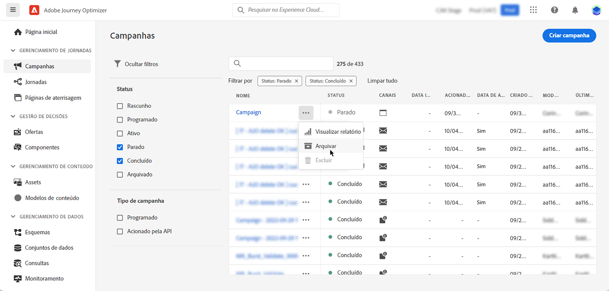

# Gerenciar campanhas {#modify-stop-campaign}

Depois que uma campanha é ativada, você pode modificá-la ou interrompê-la a qualquer momento. Essas operações estão disponíveis apenas para campanhas com uma execução recorrente.

Além disso, você pode duplicar campanhas ao vivo (executadas uma vez ou com uma execução recorrente) para criar novas campanhas e arquivar campanhas concluídas ou interrompidas.

## Acessar campanhas {#access}

As campanhas podem ser acessadas a partir da variável **[!UICONTROL Campanhas]** menu.

Por padrão, a lista mostra todas as campanhas com a variável **[!UICONTROL Rascunho]**, **[!UICONTROL Programado]** e **[!UICONTROL Ao vivo]** status.

Para exibir campanhas interrompidas, concluídas e arquivadas, é necessário limpar o filtro.

## Status da campanha {#statuses}

As campanhas podem ter vários status:

* **[!UICONTROL Rascunho]**: A campanha está sendo editada e não foi ativada.
* **[!UICONTROL Ativando]**: A campanha está sendo ativada.
* **[!UICONTROL Ao vivo]**: A campanha foi ativada.
* **[!UICONTROL Programado]**: A campanha está configurada para ser ativada em uma data de início específica.
* **[!UICONTROL Parado]**: A campanha foi interrompida manualmente. Não é possível ativá-la ou reutilizá-la. [Saiba como parar uma campanha](modify-stop-campaign.md#stop)
* **[!UICONTROL Concluído]**: A campanha foi concluída. Esse status é automaticamente atribuído 3 dias após a ativação de uma campanha ou na data de término da campanha, se ela tiver uma execução recorrente.
* **[!UICONTROL Arquivado]**: A campanha foi arquivada. [Saiba como arquivar campanhas](modify-stop-campaign.md#archive)

>[!NOTE]
>
>O ícone &quot;Abrir versão de rascunho&quot; ao lado de um **[!UICONTROL Ao vivo]** ou **[!UICONTROL Programado]** indica que uma nova versão da campanha foi criada e ainda não foi ativada. [Saiba mais](modify-stop-campaign.md#modify).

## Modificar uma campanha recorrente {#modify}

Para modificar e criar uma nova versão de uma campanha recorrente, siga estas etapas:

1. Abra a campanha e clique no botão **[!UICONTROL Modificar campanha]** botão.

1. Uma nova versão da campanha é criada. Você pode verificar a versão ao vivo clicando em **[!UICONTROL Abrir versão ao vivo]**.

   

   Na lista de campanhas, as campanhas ativadas com uma versão de rascunho em andamento são exibidas com um ícone específico na **[!UICONTROL Status]** coluna. Clique neste ícone para abrir a versão de rascunho da campanha.

   

1. Quando as alterações estiverem prontas, você poderá ativar a nova versão da campanha (consulte [Revisar e ativar uma campanha](create-campaign.md#review-activate)).

   >[!IMPORTANT]
   >
   >Ativar o rascunho substituirá a versão ao vivo da campanha.

## Interromper uma campanha recorrente {#stop}

Para interromper uma campanha recorrente, abra-a e clique no botão **[!UICONTROL Parar campanha]** botão.

>[!IMPORTANT]
>
>Parar uma campanha não interromperá um envio em andamento, mas interromperá um envio agendado ou as próximas ocorrências se o envio já estiver em andamento.

<!-- inbound campaign (inapp): can stop and resume -->

## Duplicar uma campanha {#duplicate}

Você pode duplicar uma campanha ao vivo para criar uma nova. Para fazer isso, abra a campanha e clique em **[!UICONTROL Duplicar]**.

## Arquivar uma campanha {#archive}

Com o tempo, a lista de campanhas continua crescendo e, eventualmente, torna mais difícil navegar pelas campanhas concluídas e interrompidas.

Para evitar isso, você pode arquivar campanhas concluídas e interrompidas que não são mais necessárias. Para fazer isso, clique no botão elipse e selecione **[!UICONTROL Arquivar]**.

Campanhas arquivadas podem ser recuperadas usando o filtro dedicado na lista. [Saiba como acessar campanhas](get-started-with-campaigns.md#access)
