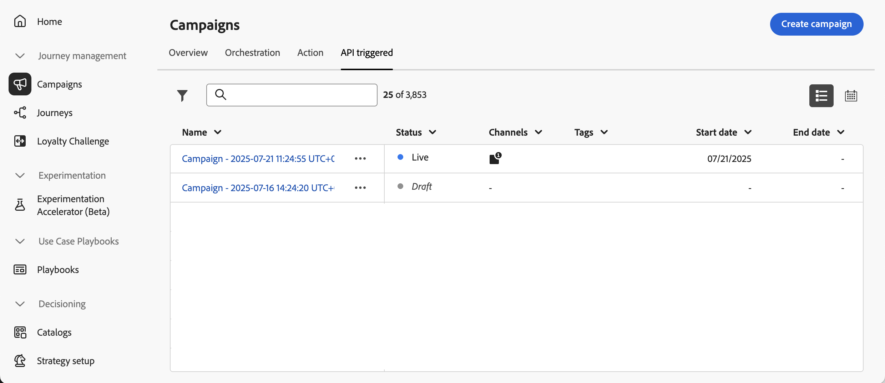

# Acessar e gerenciar campanhas {#modify-stop-campaign}

## Acessar campanhas {#access}

>[!CONTEXTUALHELP]
>id="ajo_campaigns_view"
>title="Visualizações de campanhas em lista e calendário"
>abstract="Além da lista de campanhas, o [!DNL Journey Optimizer] fornece uma visualização do calendário das suas campanhas, oferecendo uma representação visual clara dos cronogramas. Você pode alternar entre as visualizações em lista e calendário a qualquer momento, usando estes botões."

As campanhas podem ser acessadas no menu **[!UICONTROL Campanhas]**.

>[!BEGINTABS]

>[!TAB Campanhas de ação]

Selecione a guia **[!UICONTROL Ação]** para acessar a lista de campanhas de ação.

Por padrão, a lista mostra todas as campanhas com os status **[!UICONTROL Rascunho]**, **[!UICONTROL Agendado]** e **[!UICONTROL Ativo]**. Para exibir campanhas interrompidas, concluídas e arquivadas, é necessário limpar o filtro.

>[!TAB Campanhas acionadas por API]

Selecione a guia **[!UICONTROL API acionada]** para acessar a lista de campanhas acionadas por API.

Por padrão, a lista mostra todas as campanhas com os status **[!UICONTROL Rascunho]**, **[!UICONTROL Agendado]** e **[!UICONTROL Ativo]**. Para exibir campanhas interrompidas, concluídas e arquivadas, é necessário limpar o filtro.

>[!ENDTABS]

Você também pode filtrar a lista com base no tipo de campanha e no canal, ou nas tags atribuídas às campanhas ao criá-las.

## Calendário de campanhas {#calendar}

Além da lista de campanhas, o [!DNL Journey Optimizer] fornece uma exibição do calendário de suas campanhas, oferecendo uma representação visual clara de suas agendas.

>[!AVAILABILITY]
>
>No momento, a exibição de calendário está disponível apenas para um conjunto de organizações (Disponibilidade limitada). Para solicitar acesso, use [este formulário](https://forms.cloud.microsoft/r/FC49afuJVi){target=”_blank”}.
>
>Esse recurso está em desenvolvimento ativo. Suas solicitações e informações são bem-vindas usando o botão **[!UICONTROL Comentários sobre a Beta]** no menu superior.

O calendário exibe todas as campanhas programadas para a semana atual. Use os botões de seta acima do calendário para navegar entre semanas.

Como as campanhas são representadas:

* Por padrão, a grade de calendário mostra todas as campanhas ativas e programadas para a semana selecionada. Opções de filtro adicionais podem mostrar ativações concluídas, interrompidas e concluídas ou ativações de um determinado tipo ou canal.
* As campanhas de rascunho não são exibidas.
* Campanhas abrangendo vários dias aparecem na parte superior da grade do calendário.
* Se nenhuma hora de início for especificada, a hora de ativação manual mais próxima será usada para posicioná-la no calendário.
* As campanhas são exibidas como intervalos de tempo de 1 hora, mas isso não reflete a hora real de envio ou de conclusão.

Para obter mais detalhes sobre uma campanha, clique no bloco visual para abrir os detalhes.

Para exibir detalhes de uma campanha específica, selecione-a na lista. Um painel de informações será aberto com várias informações sobre a campanha, como tipo, acesso aos relatórios ou as tags atribuídas.

## Status e alertas da campanha {#statuses}

As campanhas podem ter vários status:

* **[!UICONTROL Rascunho]**: a campanha está sendo editada e não foi ativada.
* **[!UICONTROL Agendado]**: a campanha está configurada para ser ativada em uma data de início específica.
* **[!UICONTROL Ao vivo]**: A campanha foi ativada.
* **[!UICONTROL Em revisão]**: a campanha foi enviada para aprovação para ser publicada. [Saiba como trabalhar com aprovações](../test-approve/gs-approval.md)
* **[!UICONTROL Parada]**: a campanha foi interrompida manualmente. Não é possível ativá-lo ou reutilizá-lo. [Saiba como interromper uma campanha](modify-stop-campaign.md#stop)
* **[!UICONTROL Concluído]**: a campanha foi concluída. Esse status é atribuído automaticamente 3 dias após a ativação de uma campanha ou na data final da campanha, se houver uma execução recorrente.
* **[!UICONTROL Falha]**: a execução da campanha falhou. Verifique os logs para identificar o problema.
* **[!UICONTROL Arquivado]**: a campanha foi arquivada. [Saiba como arquivar campanhas](modify-stop-campaign.md#archive)

>[!NOTE]
>
>O ícone &quot;Abrir versão de rascunho&quot; ao lado do status **[!UICONTROL Ativo]** ou **[!UICONTROL Agendado]** indica que uma nova versão da campanha foi criada e ainda não foi ativada. [Saiba mais](modify-stop-campaign.md#modify).

Quando ocorre um erro em uma de suas campanhas, um ícone de aviso é exibido junto com o status da campanha. Clique nele para exibir informações relacionadas ao alerta. Esses alertas podem ocorrer em várias situações, como quando a mensagem da campanha não foi publicada ou se a configuração escolhida estiver incorreta.

## Modificar e parar campanhas de ações recorrentes {#modify}

### Modificar uma campanha de ação

Para modificar e criar uma nova versão de uma campanha de ação recorrente, siga estas etapas:

1. Abra a campanha de ação e clique no botão **[!UICONTROL Modificar campanha]**.

1. Uma nova versão da campanha é criada. Você pode verificar a versão disponível clicando em **[!UICONTROL Abrir versão disponível]**.

   

   Na lista de campanhas, campanhas ativadas com uma versão de rascunho em andamento são exibidas com um ícone específico na coluna **[!UICONTROL Status]**. Clique nesse ícone para abrir a versão de rascunho da campanha.

   

1. Quando as alterações estiverem prontas, você poderá ativar a nova versão da campanha (consulte [Revisar e ativar uma campanha](create-campaign.md#review-activate)).

   >[!IMPORTANT]
   >
   >Ativar o rascunho substituirá a versão ao vivo da campanha.

### Interromper uma campanha de ação {#stop}

Para interromper uma campanha recorrente, abra-a e clique no botão **[!UICONTROL Parar campanha]**.

>[!IMPORTANT]
>
>Interromper uma campanha não interromperá um envio em andamento, mas interromperá um envio agendado ou as próximas ocorrências se o envio já estiver em andamento.

## Duplicar uma campanha {#duplicate}

Você pode duplicar uma campanha para criar uma nova. Para fazer isso, abra a campanha e clique em **[!UICONTROL Duplicar]**.

## Arquivar uma campanha {#archive}

Com o tempo, a lista de campanhas continua crescendo e, eventualmente, dificulta a navegação em campanhas concluídas e interrompidas.

Para evitar isso, você pode arquivar campanhas concluídas e interrompidas que não são mais necessárias. Para fazer isso, clique no botão de reticências e selecione **[!UICONTROL Arquivar]**.

As campanhas arquivadas podem ser recuperadas usando o filtro dedicado na lista.
