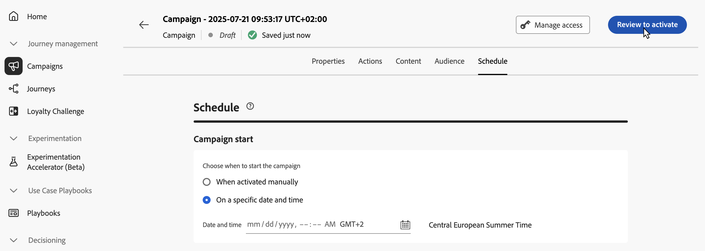

# Revisar e ativar a campanha acionada pela API {#api-review}

Depois que a campanha de ação é configurada, é necessário revisar o parâmetro e o conteúdo antes de ativá-la. Para fazer isso, siga estes passos:

>[!IMPORTANT]
>
> Se a campanha estiver sujeita a uma política de aprovação, será necessário solicitar aprovação para enviar a campanha. [Saiba mais](../test-approve/gs-approval.md)

1. Na tela de configuração da campanha, clique em **[!UICONTROL Revisar para ativar]** para exibir um resumo da campanha.

   

1. Um resumo da configuração da campanha é exibido, permitindo verificar se algum parâmetro está incorreto ou ausente e modificar sua campanha, se necessário.

   No caso de erros, não é possível ativar a campanha. Resolva os erros antes de continuar.

   

1. Verifique se a campanha está configurada corretamente e clique em **[!UICONTROL Ativar]**.

1. A campanha é ativada. Seu status é **[!UICONTROL Ativo]** ou **[!UICONTROL Agendado]** se você inseriu uma data de início.

   O status **[!UICONTROL Concluído]** é atribuído automaticamente à campanha três dias após sua ativação ou na data final da campanha, se ela tiver uma execução recorrente. [Saiba mais sobre os status das campanhas](get-started-with-campaigns.md#statuses).

   Se nenhuma data final tiver sido especificada, a campanha manterá o status **[!UICONTROL Ativo]**. Para alterá-la, é necessário interromper a campanha manualmente. [Saiba como interromper uma campanha](modify-stop-campaign.md)

1. Depois que uma campanha é ativada, você pode verificar as informações a qualquer momento abrindo-a. O resumo permite obter estatísticas sobre o número de perfis segmentados e ações entregues e com falha.

   Você também pode obter estatísticas adicionais em relatórios dedicados clicando no botão **[!UICONTROL Relatórios]**. [Saiba mais](../reports/campaign-global-report-cja.md)

   

## Próximas etapas {#next}

Quando a campanha acionada pela API estiver pronta, você poderá acionar a execução usando APIs. [Saiba mais](trigger-campaigns.md)
