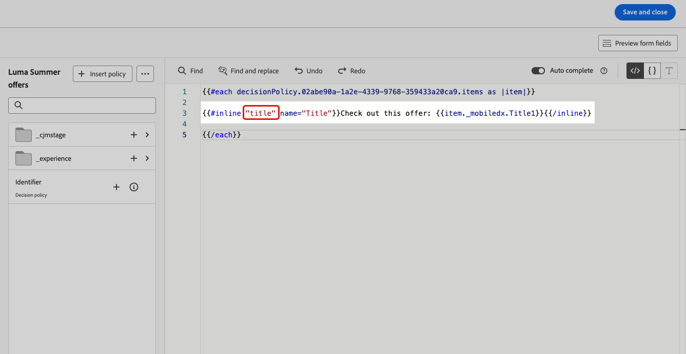
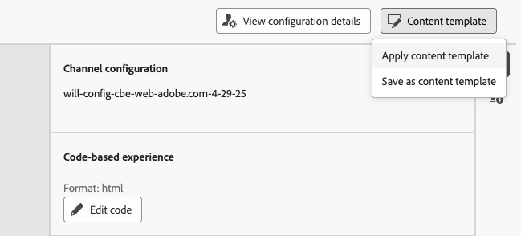

# Usar campos de formulário editáveis em experiências baseadas em código {#code-based-form-fields}

Para obter mais flexibilidade e controle sobre as experiências baseadas em código, o [!DNL Journey Optimizer] permite que a equipe de desenvolvimento crie modelos de conteúdo JSON ou HTML que contêm campos editáveis predefinidos específicos.

Ao criar uma experiência baseada em código, os profissionais de marketing não técnicos podem editar diretamente esses campos na interface, sem precisar abrir o editor de personalização ou tocar em outros elementos de código em sua jornada ou campanha.

Esse recurso fornece uma experiência simplificada para usuários de marketing, permitindo que os desenvolvedores tenham mais controle sobre o conteúdo do código, resultando em menos espaço para erros.

## Entender a sintaxe do campo de formulário {#form-field-syntax}

Para tornar editáveis partes de uma HTML ou de uma carga de código JSON, você deve usar uma sintaxe específica no editor de expressão. Isso envolve declarar uma **variável** com um valor padrão que os usuários podem substituir após aplicar o modelo de conteúdo à sua experiência baseada em código.

Por exemplo, suponha que você queira criar um modelo de conteúdo para aplicá-lo às suas experiências baseadas em código e permitir que os usuários personalizem uma cor específica usada em locais diferentes, como cores de fundo de quadros ou botões.

Ao criar seu modelo de conteúdo, você precisa declarar uma variável com uma **ID exclusiva**, por exemplo, &quot;*cor*&quot;, e chamá-la nos locais desejados no conteúdo em que deseja aplicar essa cor.

Ao aplicar o modelo de conteúdo ao seu conteúdo, os usuários poderão personalizar a cor usada sempre que a variável for referenciada.

## Adicionar campos editáveis a modelos de conteúdo HTML ou JSON {#add-editable-fields}

>[!CONTEXTUALHELP]
>id="ajo_cbe_preview_form_fields"
>title="Verificar a renderização dos campos de formulário"
>abstract="Em modelos de conteúdo JSON ou HTML, é possível definir campos editáveis específicos que habilitam usuários comuns a editar facilmente o conteúdo em experiências baseadas em código, sem a necessidade de manipular código. Crie esses campos usando a sintaxe dedicada e visualize-os usando este botão."

Para tornar alguns dos códigos JSON ou HTML editáveis, comece criando uma experiência baseada em código [modelo de conteúdo](../content-management/content-templates.md), em que é possível definir campos de formulário específicos.

>[!NOTE]
>
>Essa etapa geralmente é executada por um perfil de desenvolvedor.

➡️ [Saiba como adicionar campos editáveis a modelos de experiência baseados em código neste vídeo](#video)

1. Crie um modelo de conteúdo e selecione o canal de **[!UICONTROL experiência baseada em código]**. [Saiba como criar modelos](../content-management/create-content-templates.md)

1. Selecione o modo de criação: HTML ou JSON.

   >[!CAUTION]
   >
   >Alterar o modo de criação resultará na perda de todo o código atual. As experiências baseadas em código baseadas nesse modelo precisam usar o mesmo modo de criação.

1. Abra o [editor de personalização](../personalization/personalization-build-expressions.md) para editar o conteúdo do código.

1. Para definir um campo de formulário editável<!--To declare the variable you want users to edit-->, navegue até o menu **[!UICONTROL Funções auxiliares]** no painel de navegação esquerdo e adicione o atributo **embutido**. A sintaxe a ser declarada e chamada para a variável é adicionada automaticamente no conteúdo.

   {width="85%"}

1. Substitua `"name"` por uma ID exclusiva para identificar o campo editável. Por exemplo, digite &quot;imgURL&quot;.

   >[!NOTE]
   >
   >A ID do campo deve ser exclusiva e não pode conter espaços. Essa ID deve ser usada em qualquer lugar no conteúdo onde você deseja exibir o valor da variável.

1. Adapte a sintaxe de acordo com suas necessidades adicionando parâmetros detalhados na tabela abaixo:

   | Ação | Parâmetro | Exemplo |
   | ------- | ------- | ------- |
   | Declarar um campo editável com um **valor padrão**. Ao adicionar o modelo ao seu conteúdo, esse valor padrão será usado se você não personalizá-lo. | Adicione o valor padrão entre as tags em linha. | `{{#inline "editableFieldID"}}default_value{{/inline}}` |
   | Defina um **rótulo** para o campo editável. Esse rótulo será exibido no editor de código ao editar os campos do modelo. | `name="title"` | `{{#inline "editableFieldID" name="title"}}default_value{{/inline}}` |

   <!--
    | Action | Parameter| Example |
    | ------- | ------- | ------- |
    |Declare an editable field containing an **image source** that needs to be published.|`assetType="image"`|`{{#inline "editableFieldID" assetType="image"}}default_value{{/inline}}`|
    |Declare an editable field containing an **URL** that needs to be tracked.br/>Note that out-of-the-box "Mirror page URL" and "Unsubscribe link" predefined blocks cannot become editable fields.>|`assetType="url"`|`{{#inline "editableFieldID" assetType="url"}}default_value{{/inline}}`|
    -->

1. Clique em **[!UICONTROL Visualizar campos de formulário]** para verificar como os campos de formulário editáveis serão exibidos nas experiências baseadas em código que aplicam este modelo.

   {width="85%"}

1. Use a sintaxe `{{{name}}}` no código em todos os locais onde deseja exibir o valor do campo editável. Substitua `name` pela ID exclusiva do campo definido anteriormente.

   {width="85%"}

1. Continue de forma semelhante para adicionar outros campos editáveis, envolvendo cada um deles com as tags `{{#inline}}` e `{{/inline}}`.

1. Edite o restante do código conforme necessário, incluindo as IDs correspondentes aos campos editáveis definidos. [Saiba como](create-code-based.md#edit-code)

   

1. Salve seu template.

### Usar políticas de decisão em formulários de campo editáveis {#decision-policy-in-form-fields}

Ao criar um modelo de conteúdo de experiência baseado em código, você pode usar uma política de decisão para aproveitar as ofertas nos campos de formulário editáveis.

1. Crie um modelo de experiência baseado em código conforme descrito [acima](#add-editable-fields).

1. Clique em **[!UICONTROL Adicionar política de decisão]** usando o ícone **[!UICONTROL Mostrar Decisão]** no painel direito da tela de edição ou no editor de expressão da seção **[!UICONTROL Política de decisão]** no menu esquerdo.

   Saiba como criar uma política de decisão em [esta seção](../experience-decisioning/create-decision.md#add-decision).

1. Clique no botão **[!UICONTROL Inserir política]**. O código correspondente à política de decisão é adicionado.

   

1. Após a marca `{{#each}}`, insira o código correspondente aos campos de formulário editáveis que você deseja adicionar, usando a sintaxe **inline** descrita [acima](#add-editable-fields). Substitua `"name"` por uma ID exclusiva para identificar o campo editável. Neste exemplo, use &quot;title&quot;.

   {width="90%"}

1. Clique em **[!UICONTROL Visualizar campos de formulário]** para verificar como os campos de formulário editáveis serão exibidos nas experiências baseadas em código que aplicam este modelo.

   {width="70%"}

1. Insira o restante do código acima da tag `{{/each}}`. Use a sintaxe `{{{name}}}` no código em todos os locais onde deseja exibir o valor do campo editável. Neste exemplo, substitua `name` por &quot;title&quot;.

   {width="85%"}

1. Salve seu template.

### Exemplos de código {#code-examples}

Abaixo estão alguns exemplos de modelos JSON e HTML, alguns deles incluindo políticas de decisão.

**Modelo JSON:**

```
{{#inline "title" name="Title"}}Best gear for winter is here for you!{{/inline}} 
{{#inline "description" name="Description"}}Add description{{/inline}} 
{{#inline "imgURL" name="Image Link"}}Add link{{/inline}} 
{{#inline "number_of_items" name="Number of items"}}23{{/inline}}

{
  "title": "{{{title}}}",
  "description": "{{{description}}}",
  "imageUrl": "{{{imgURL}}}",
  "number_of_items": {{{number_of_items}}}, 
  "code": "DEFAULT"
}
```

>[!NOTE]
>
>Ao fazer referência aos campos em linha na carga JSON:
>
>   * Os campos do tipo sequência de caracteres devem ser colocados entre aspas duplas.
>   * Inteiros ou boolianos NÃO devem ser colocados entre aspas duplas. (Veja o campo `number_of_items` no exemplo acima.)

**Modelo JSON com decisão:**

```
{ 
"offer": [ 
{{#each decisionPolicy.fff709b7-7fef-4e4e-83d7-594fbcf196c1.items as |item|}} 
{{#inline "title" name="Title"}}{{item._mobiledx.Title1}}{{/inline}} {{#inline "description" name="Description"}}{{item._mobiledx.Title2}}{{/inline}} {{#inline "imgURL" name="Image Link"}}https://luma.enablementadobe.com/content/luma/us/en/experience/warming-up/_jcr_content/root/hero_image.coreimg.jpeg{{/inline}} 

{ 
"title": "{{{title}}}", 
"description": "{{{description}}}", 
"imageUrl": "{{{imgURL}}}", 
"link": "https://lumaenablement.adobe.com/web/luma/home", "code": "DEFAULT" 
}, 
{{/each}}
] 
}
```

>[!NOTE]
>
>Os campos embutidos para os quais você deseja usar itens de decisão precisam ser colocados dentro do bloco de política de decisão - entre as marcas `{{#each}}` e `{{/each}}`.

**Modelo do HTML:**

```
{{#inline "title" name="Title"}}Please enter title here{{/inline}} 
{{#inline "imgSrc" name="Image link"}}{{/inline}} 

<div class="TopRibbon__content">{{{title}}}</div> 
<style> .theme-luma .TopRibbon { background-color: #200098; }</style>
```

**Modelo do HTML com decisão:**

```
{{#each decisionPolicy.f112884a-5654-43ad-9d6d-dbd32ae23ee6.items as |item|}} 
{{#inline "title" name="Title"}}Title is: {{item._mobiledx.Title1}}{{/inline}} 

<div class="TopRibbon__content">{{{title}}}</div> 
<style> .theme-luma .TopRibbon { background-color: #200098; }</style> 

{{/each}}
```

## Editar campos de formulário em uma experiência baseada em código {#edit-form-fields}

>[!CONTEXTUALHELP]
>id="ajo_code_based_form_fields"
>title="O que são campos de formulário?"
>abstract="Essa experiência baseada em código contém campos de formulário que podem ser facilmente editados sem a necessidade de manipular código no editor de personalização."

Agora que o modelo de conteúdo contendo campos de formulário editáveis predefinidos foi criado, você pode criar uma experiência baseada em código usando esse modelo de conteúdo.

Você poderá editar facilmente os campos de formulário a partir de uma jornada de experiência ou campanha baseada em código, sem abrir o editor de personalização.

>[!NOTE]
>
>Essa etapa geralmente é executada por um profissional de marketing.

1. Na tela jornada activity ou campaign edition, selecione o template de conteúdo que contém campos de formulário editáveis. [Saiba como usar modelos de conteúdo](../content-management/use-content-templates.md)

   {width="60%"}

   >[!CAUTION]
   >
   >Os modelos disponíveis para escolher têm como escopo o HTML ou o JSON com base na configuração de canal selecionada anteriormente. Somente os modelos compatíveis são exibidos.

1. Os campos predefinidos no modelo de conteúdo selecionado estão disponíveis no painel direito. <!--The code preview is displayed with the rest of the code.-->

   

1. Na seção **[!UICONTROL Campos de formulário editáveis]**, você pode:

   * Edite cada valor diretamente nos campos editáveis, sem abrir o editor de código.

   {width="60%"}

   * Clique no ícone de personalização para editar cada campo usando o [editor de código](../personalization/personalization-build-expressions.md).

   {width="70%"}

   >[!NOTE]
   >
   >Em ambos os casos, só é possível editar um campo por vez e o restante do conteúdo de experiência baseado em código não pode ser editado.

1. Se uma [política de decisão foi adicionada](#decision-policy-in-form-fields) ao modelo de conteúdo, ela vem com todos os atributos disponíveis no [esquema do catálogo de ofertas](../experience-decisioning/catalogs.md). É possível editar o item de decisão em linha ou usando o editor de expressão.

1. Para editar o restante do código, clique no botão **[!UICONTROL Editar código]** e atualize seu conteúdo de experiência baseado em código completo, incluindo os campos de formulário editáveis. [Saiba mais](create-code-based.md#edit-code)

## Vídeo explicativo {#video}

Saiba como adicionar campos editáveis a modelos de conteúdo de canal de experiência baseados em código.

>[!VIDEO](https://video.tv.adobe.com/v/3463996/?learn=on&#x26;enablevpops&captions=por_br)
