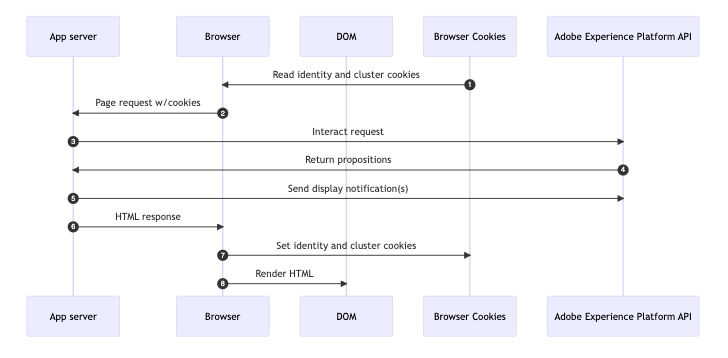

# Amostras de métodos de implementação baseados em código {#implementation-samples}

A experiência baseada em código é compatível com qualquer tipo de implementação de cliente. Nesta página, você pode encontrar amostras para cada método de implementação:

* [Lado do cliente](#client-side-implementation)
* [Lado do servidor](#server-side-implementation)
* [Híbrido](#hybrid-implementation)

>[!IMPORTANT]
>
>Siga [este link](https://github.com/adobe/alloy-samples/tree/main/ajo){target="_blank"} para encontrar implementações de exemplo para diferentes casos de uso de personalização e experimentação. Confira-as e execute-as para entender melhor quais são as etapas de implementação necessárias e como funciona o fluxo de personalização completo.

➡️ Saiba mais sobre como configurar o Web SDK para experiências e decisões baseadas em código em [estes tutoriais](code-based-decisioning-implementations.md#tutorials)

## Implementação do lado do cliente {#client-side-implementation}

Se você tiver uma implementação no lado do cliente, poderá usar um dos SDKs do cliente da AEP: AEP Web SDK ou AEP Mobile SDK.

* As etapas [abaixo](#client-side-how) descrevem o processo de busca do conteúdo publicado na borda pelas jornadas e campanhas de experiência baseadas em código em uma implementação de exemplo do **Web SDK** e de exibição do conteúdo personalizado.

* As etapas para implementar o canal baseado em código usando o **Mobile SDK** estão descritas em [este tutorial](https://developer.adobe.com/client-sdks/edge/adobe-journey-optimizer/code-based/tutorial/){target="_blank"}.

  >[!NOTE]
  >
  >Implementações de exemplo para casos de uso de dispositivos móveis estão disponíveis para o [aplicativo iOS](https://github.com/adobe/aepsdk-messaging-ios/tree/main/TestApps/MessagingDemoAppSwiftUI){target="_blank"} e o [aplicativo Android](https://github.com/adobe/aepsdk-messaging-android/tree/main/code/testapp){target="_blank"}.

### Como funciona - Web SDK {#client-side-how}

1. O [Web SDK](https://experienceleague.adobe.com/docs/experience-platform/edge/home.html?lang=pt-BR){target="_blank"} está incluído na página.

1. Você precisa usar o comando `sendEvent` e especificar o [URI de superfície](code-based-surface.md)<!--( or location/path)--> para buscar conteúdo de personalização.

   ```javascript
   alloy("sendEvent", {
   renderDecisions: true,
   personalization: {
       surfaces: ["#sample-json-content"],
   },
   }).then(applyPersonalization("#sample-json-content"));
   ```

1. Os itens de experiência baseados em código devem ser aplicados manualmente pelo código de implementação (usando o método [`applyPersonalization`](https://github.com/adobe/alloy-samples/blob/ac83b6927d007dc456caad2c6ce0b324c99c26c9/ajo/personalization-client-side/public/script.js){target="_blank"}) para atualizar o DOM com base na decisão.

1. Para jornadas de experiência e campanhas baseadas em código, os eventos de exibição devem ser enviados manualmente para indicar quando o conteúdo foi exibido. Isso é feito por meio do comando `sendEvent`.

   ```javascript
   function sendDisplayEvent(decision) {
     const { id, scope, scopeDetails = {} } = decision;
   
     alloy("sendEvent", {
   
       xdm: {
         eventType: "decisioning.propositionDisplay",
         _experience: {
           decisioning: {
             propositions: [
               {
                 id: id,
                 scope: scope,
                 scopeDetails: scopeDetails,
               },
             ],
           },
         },
       },
     });
   }
   ```

1. Para jornadas de experiência e campanhas baseadas em código, os eventos de interação devem ser enviados manualmente para indicar quando um usuário interagiu com o conteúdo. Isso é feito por meio do comando `sendEvent`.

   ```javascript
   function sendInteractEvent(label, proposition) {
     const { id, scope, scopeDetails = {} } = proposition;
   
     alloy("sendEvent", {
   
       xdm: {
         eventType: "decisioning.propositionInteract",
         _experience: {
           decisioning: {
             propositions: [
               {
                 id: id,
                 scope: scope,
                 scopeDetails: scopeDetails,
               },
             ],
             propositionEventType: {
               interact: 1
             },
             propositionAction: {
               id: label,
               label: label,
               tokens: proposition.items?.[0]?.characteristics?.tokens || []
             },
           },
         },
       },
     });
   }
   ```

   >[!IMPORTANT]
   >
   >O campo `tokens` em `propositionAction` é crítico para um rastreamento preciso e atribuição no Adobe Journey Optimizer Decisioning (AJO-D). Esses tokens permitem:
   >- Atribuição de clique adequada para atividades de decisão
   >- Relatórios precisos de interações do usuário com conteúdo decidido
   >- Otimização do desempenho da oferta com base no envolvimento do usuário
   >
   >Normalmente, os tokens são encontrados em `proposition.items[0].characteristics.tokens` e devem ser sempre incluídos ao rastrear as interações do usuário com o conteúdo decidido.

### Principais observações

**Cookies**

Os cookies são usados para manter a identidade do usuário e as informações do cluster. Ao usar uma implementação no lado do cliente, o Web SDK lida com o armazenamento e o envio desses cookies automaticamente durante o ciclo de vida da solicitação.

| Cookie | Finalidade | Armazenado por | Enviado por |
| ------------------------ | -------------------------------------------------------------------------- | --------- | ------- |
| kndctr_AdobeOrg_identity | Contém detalhes da identidade do usuário | Web SDK | Web SDK |
| kndctr_AdobeOrg_cluster | Indica qual cluster de borda de experiência deve ser usado para atender a solicitações | Web SDK | Web SDK |

**Solicitar posicionamento**

As solicitações para a API do Adobe Experience Platform são necessárias para obter apresentações e enviar uma notificação de exibição. Ao usar uma implementação no lado do cliente, o Web SDK faz essas solicitações quando o comando `sendEvent` é usado.

| Solicitação | Feito por |
| ---------------------------------------------- | ----------------------------------- |
| solicitação de interação para obter apresentações | Web SDK usando o comando sendEvent |
| solicitação de interação para enviar notificações de exibição | Web SDK usando o comando sendEvent |

**Diagrama de Fluxo**


## Implementação do lado do servidor {#server-side-implementation}

Se você tiver uma implementação do lado do servidor, poderá usar uma da API do AEP Edge Network.

As etapas abaixo descrevem o processo de busca do conteúdo publicado na borda pelas jornadas e campanhas de experiência baseadas em código em uma amostra da implementação da API do Edge Network para uma página da Web e a exibição do conteúdo personalizado.

### Como funciona

1. A página da Web é solicitada e todos os cookies armazenados anteriormente pelo navegador com o prefixo `kndctr_` são incluídos.
1. Quando a página é solicitada no servidor de aplicativos, um evento é enviado ao [ponto de extremidade de coleta de dados interativa](https://experienceleague.adobe.com/docs/experience-platform/edge-network-server-api/data-collection/interactive-data-collection.html?lang=pt-BR) para buscar conteúdo de personalização. Este aplicativo de exemplo usa alguns métodos auxiliares para simplificar a criação e o envio de solicitações para a API (consulte [aepEdgeClient.js](https://github.com/adobe/alloy-samples/blob/ac83b6927d007dc456caad2c6ce0b324c99c26c9/common/aepEdgeClient.js){target="_blank"}). Mas a solicitação é simplesmente uma `POST` com uma carga que contém um evento e uma consulta. Os cookies (se disponíveis) da etapa anterior estão incluídos com a solicitação na matriz `meta>state>entries`.

   ```javascript
   fetch(
     "https://edge.adobedc.net/ee/v2/interact?dataStreamId=abc&requestId=123",
     {
       headers: {
         accept: "*/*",
         "accept-language": "en-US,en;q=0.9",
         "cache-control": "no-cache",
         "content-type": "text/plain; charset=UTF-8",
         pragma: "no-cache",
         "sec-fetch-dest": "empty",
         "sec-fetch-mode": "cors",
         "sec-fetch-site": "cross-site",
         "sec-gpc": "1",
         "Referrer-Policy": "strict-origin-when-cross-origin",
         Referer: "https://localhost/",
       },
       body: JSON.stringify({
         event: {
           xdm: {
             eventType: "decisioning.propositionFetch",
             web: {
               webPageDetails: {
                 URL: "https://localhost/",
               },
               webReferrer: {
                 URL: "",
               },
             },
             identityMap: {
               FPID: [
                 {
                   id: "xyz",
                   authenticatedState: "ambiguous",
                   primary: true,
                 },
               ],
             },
             timestamp: "2022-06-23T22:21:00.878Z",
           },
           data: {},
         },
         query: {
           identity: {
             fetch: ["ECID"],
           },
           personalization: {
             schemas: [
               "https://ns.adobe.com/personalization/default-content-item",
               "https://ns.adobe.com/personalization/html-content-item",
               "https://ns.adobe.com/personalization/json-content-item",
               "https://ns.adobe.com/personalization/redirect-item",
               "https://ns.adobe.com/personalization/dom-action",
             ],
             surfaces: ["web://localhost/","web://localhost/#sample-json-content"],
           },
         },
         meta: {
           state: {
             domain: "localhost",
             cookiesEnabled: true,
             entries: [
               {
                 key: "kndctr_XXX_AdobeOrg_identity",
                 value: "abc123",
               },
               {
                 key: "kndctr_XXX_AdobeOrg_cluster",
                 value: "or2",
               },
             ],
           },
         },
       }),
       method: "POST",
     }
   ).then((res) => res.json());
   ```

1. A experiência JSON das jornadas de experiência e da campanha baseadas em código é lida a partir da resposta e usada ao produzir a resposta do HTML.

1. Para jornadas de experiência e campanhas baseadas em código, os eventos de exibição devem ser enviados manualmente na implementação para indicar quando o conteúdo da jornada ou da campanha foi exibido. Neste exemplo, a notificação é enviada no lado do servidor durante o ciclo de vida da solicitação.

   ```javascript
   function sendDisplayEvent(aepEdgeClient, req, propositions, cookieEntries) {
     const address = getAddress(req);
   
     aepEdgeClient.interact(
       {
         event: {
           xdm: {
             web: {
               webPageDetails: { URL: address },
               webReferrer: { URL: "" },
             },
             timestamp: new Date().toISOString(),
             eventType: "decisioning.propositionDisplay",
             _experience: {
               decisioning: {
                 propositions: propositions.map((proposition) => {
                   const { id, scope, scopeDetails } = proposition;
   
                   return {
                     id,
                     scope,
                     scopeDetails,
                   };
                 }),
               },
             },
           },
         },
         query: { identity: { fetch: ["ECID"] } },
         meta: {
           state: {
             domain: "",
             cookiesEnabled: true,
             entries: [...cookieEntries],
           },
         },
       },
       {
         Referer: address,
       }
     );
   }
   ```

1. Quando a resposta do HTML é retornada, a identidade e os cookies de cluster são definidos na resposta pelo servidor de aplicativos.

### Principais observações

**Cookies**

Os cookies são usados para manter a identidade do usuário e as informações do cluster. Ao usar uma implementação do lado do servidor, o servidor de aplicativos deve lidar com o armazenamento e o envio desses cookies durante o ciclo de vida da solicitação.

| Cookie | Finalidade | Armazenado por | Enviado por |
| ------------------------ | -------------------------------------------------------------------------- | ------------------ | ------------------ |
| kndctr_AdobeOrg_identity | Contém detalhes da identidade do usuário | servidor de aplicativos | servidor de aplicativos |
| kndctr_AdobeOrg_cluster | Indica qual cluster de borda de experiência deve ser usado para atender a solicitações | servidor de aplicativos | servidor de aplicativos |

**Solicitar posicionamento**

As solicitações para a API do Adobe Experience Platform são necessárias para obter apresentações e enviar uma notificação de exibição. Ao usar uma implementação no lado do cliente, o Web SDK faz essas solicitações quando o comando `sendEvent` é usado.

| Solicitação | Feito por |
| ---------------------------------------------- | ------------------------------------------------------------ |
| solicitação de interação para obter apresentações | servidor de aplicativos que chama a API do Adobe Experience Platform |
| solicitação de interação para enviar notificações de exibição | servidor de aplicativos que chama a API do Adobe Experience Platform |

**Diagrama de Fluxo**



## Implementação híbrida {#hybrid-implementation}

Se você tiver uma implementação híbrida, verifique os links abaixo.

* Blog técnico da Adobe: [Personalization híbrido no Adobe Experience Platform Web SDK](https://blog.developer.adobe.com/hybrid-personalization-in-the-adobe-experience-platform-web-sdk-6a1bb674bf41){target="_blank"}
* Documentação do SDK: [Personalização híbrida usando o Web SDK e a API do Edge Network Server](https://experienceleague.adobe.com/docs/experience-platform/edge/personalization/hybrid-personalization.html){target="_blank"}

## Depurar chamadas de API de rede do Edge com o Adobe Experience Platform Assurance {#debugging-edge-api-assurance}

Ao usar diretamente a API do Edge Network para experiências baseadas em código (sem usar o Web SDK ou o Mobile SDK), você pode depurar suas chamadas de API com o Adobe Experience Platform Assurance incluindo a ID de sessão do Assurance como um cabeçalho de token de validação.

1. Obtenha a ID de sessão do Assurance de uma sessão ativa do Adobe Experience Platform Assurance ou crie uma usando a API do Assurance.

1. Adicione o cabeçalho `x-adobe-aep-validation-token` com sua ID de sessão do Assurance para rotear suas solicitações de API do Edge Network por meio da sessão do Assurance.

   **Exemplo:**

   ```bash
   curl -v 'https://edge.adobedc.net/ee/v1/interact?configId={DATASTREAM_ID}&requestId={REQUEST_ID}' \
   --header 'Content-Type: application/json' \
   --header 'x-adobe-aep-validation-token: {ASSURANCE_SESSION_ID}' \
   --data-raw '{
       "xdm": {
         "identityMap": {
               "ECID": [
                   {
                       "id": "{ECID_VALUE}"
                   }
               ]
           }
       },
       "events": [
           {
               "xdm": {
                   "eventType": "test",
                   "timestamp": "{TIMESTAMP}"
               }
           }
       ]
   }'
   ```

1. Após a configuração, abra a sessão do Assurance e selecione o modo de exibição **[!UICONTROL Edge Delivery]** para ver as solicitações e respostas da API Edge Network em tempo real, incluindo cargas de solicitação, conteúdo de resposta, propostas de personalização e mensagens de erro.


<!--
## Implementation guides and tutorials {#implementation-guides}

To help you get started with implementing code-based experiences, refer to the comprehensive step-by-step tutorials below:

* **Mobile SDK implementation**: Follow [this tutorial](https://developer.adobe.com/client-sdks/edge/adobe-journey-optimizer/code-based/tutorial/){target="_blank"} to learn how to set up code-based experiences on mobile apps using the Adobe Experience Platform Mobile SDK.

* **Web SDK implementation**: Learn how to configure the Web SDK for decisioning and code-based experiences in [these tutorials](code-based-decisioning-implementations.md#tutorials).

* **Decisioning implementation**: To learn how to implement decisioning capabilities on a code-based campaign, follow [this use case tutorial](https://experienceleague.adobe.com/en/docs/journey-optimizer/using/decisioning/experience-decisioning/experience-decisioning-uc){target="_blank"}.-->
