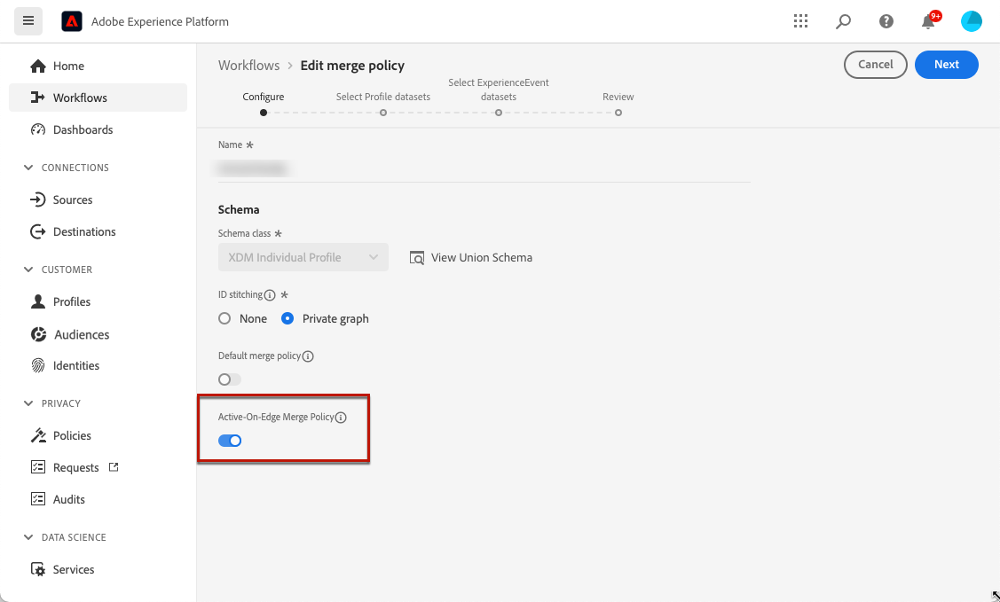

# Pré-requisitos da experiência baseada em código {#code-based-prerequisites}

Para poder usar ações de experiência baseadas em código no [!DNL Journey Optimizer] e fornecer carga de conteúdo de código que pode ser usada por seus aplicativos, siga os pré-requisitos abaixo:

* Para adicionar modificações aos seus aplicativos, é necessário ter uma implementação específica. [Saiba mais](#implementation-prerequisites)

* Para que as experiências baseadas em código sejam entregues corretamente, defina as configurações do Adobe Experience Platform detalhadas [aqui](#delivery-prerequisites).

* Para habilitar a exibição de dados em seus relatórios de experiência baseados em código, siga estes [pré-requisitos de relatórios](#reporting-prerequisites).

* Ao criar uma [configuração de canal de experiência baseada em código](code-based-configuration.md), insira uma cadeia de caracteres/caminho ou um URI de superfície que corresponda àquele declarado em sua própria implementação. Isso garante que o conteúdo seja entregue no local desejado dentro do aplicativo ou página especificada. Caso contrário, as alterações não poderão ser entregues. [Leia mais](code-based-surface.md)

## Pré-requisitos de implementação {#implementation-prerequisites}

A experiência baseada em código é compatível com qualquer tipo de implementação de cliente, conforme mostrado nas opções abaixo. Você pode usar um método de implementação do lado do cliente, do lado do servidor ou híbrido para suas propriedades:

* Somente no lado do cliente - Para adicionar modificações às suas páginas da Web ou aplicativos móveis, é necessário implementar o [Adobe Experience Platform Web SDK](https://experienceleague.adobe.com/docs/platform-learn/implement-web-sdk/overview.html?lang=pt-BR){target="_blank"} no seu site ou o [Adobe Experience Platform Mobile SDK](https://developer.adobe.com/client-sdks/documentation/){target="_blank"} nos seus aplicativos móveis.

* Modo híbrido - Você pode usar a [API do Edge Network Server da AEP](https://experienceleague.adobe.com/docs/experience-platform/edge-network-server-api/data-collection/interactive-data-collection.html?lang=pt-BR){target="_blank"} para solicitar personalização no lado do servidor; a resposta é fornecida ao Adobe Experience Platform Web SDK para renderizar as modificações no lado do cliente. Saiba mais na [documentação de API do Edge Network Server](https://experienceleague.adobe.com/docs/experience-platform/edge-network-server-api/overview.html){target="_blank"} do Adobe Experience Platform. Você pode obter mais informações sobre o modo híbrido e verificar alguns exemplos de implementação em [esta publicação do blog](https://blog.developer.adobe.com/hybrid-personalization-in-the-adobe-experience-platform-web-sdk-6a1bb674bf41){target="_blank"}.

* Lado do servidor - Você pode usar a [API do AEP Edge Network Server](https://experienceleague.adobe.com/docs/experience-platform/edge-network-server-api/data-collection/interactive-data-collection.html?lang=pt-BR){target="_blank"} para solicitar personalização do lado do servidor. Sua equipe de desenvolvimento deve lidar com a resposta e renderizar as modificações no lado do cliente na implementação do aplicativo.

Você pode encontrar amostras para cada método de implementação acima em [esta seção](code-based-implementation-samples.md).

## Pré-requisitos de entrega {#delivery-prerequisites}

Para que as experiências baseadas em código sejam entregues corretamente, as seguintes configurações devem ser definidas:

* Na [Coleção de Dados da Adobe Experience Platform](https://experienceleague.adobe.com/docs/experience-platform/edge/datastreams/overview.html?lang=pt-BR){target="_blank"}, verifique se você tem uma sequência de dados definida, como no serviço **[!UICONTROL Adobe Experience Platform]**, se a opção **[!UICONTROL Adobe Journey Optimizer]** está habilitada.

  Isso garante que os eventos de entrada do Journey Optimizer sejam manipulados corretamente pelo Adobe Experience Platform Edge. [Saiba mais](https://experienceleague.adobe.com/docs/experience-platform/edge/datastreams/configure.html){target="_blank"}

  

* Em [Adobe Experience Platform](https://experienceleague.adobe.com/docs/experience-platform/profile/home.html?lang=pt-BR){target="_blank"}, verifique se você tem uma política de mesclagem com a opção **[!UICONTROL Política de mesclagem Ative-On-Edge]** habilitada. Para fazer isso, selecione uma política no menu Experience Platform **[!UICONTROL Cliente]** > **[!UICONTROL Perfis]** > **[!UICONTROL Mesclar Políticas]**. [Saiba mais](https://experienceleague.adobe.com/docs/experience-platform/profile/merge-policies/ui-guide.html#configure){target="_blank"}

  Essa política de mesclagem é usada por [!DNL Journey Optimizer] canais de entrada para ativar e publicar corretamente campanhas de entrada na borda. [Saiba mais](https://experienceleague.adobe.com/docs/experience-platform/profile/merge-policies/ui-guide.html?lang=pt-BR){target="_blank"}

  

* Para solucionar problemas de entrega de experiências na Web do Journey Optimizer, você pode usar a exibição **Edge Delivery** no **Adobe Experience Platform Assurance**. Este plug-in permite que você inspecione chamadas de solicitação em detalhes, verifique se as chamadas de borda esperadas ocorrem conforme previsto e examine dados de perfil, incluindo mapas de identidade, associações de segmento e configurações de consentimento. Além disso, você pode revisar as atividades para as quais a solicitação se qualificou e identificar aquelas que não foram qualificadas.

  O uso do plug-in **Edge Delivery** ajuda a obter os insights necessários para entender e solucionar problemas de implementações de entrada de maneira eficaz.

  [Saiba mais sobre a exibição do Edge Delivery](https://experienceleague.adobe.com/pt-br/docs/experience-platform/assurance/view/edge-delivery)

## Pré-requisitos de relatórios {#reporting-prerequisites}

Para habilitar relatórios para o canal baseado em código, você precisa verificar se o [conjunto de dados](../data/get-started-datasets.md) usado na implementação do aplicativo [sequência de dados](https://experienceleague.adobe.com/docs/experience-platform/datastreams/overview.html){target="_blank"} também está incluído na configuração de relatórios.

Em outras palavras, ao configurar os relatórios, se você adicionar um conjunto de dados que não esteja presente no fluxo de dados do aplicativo, os dados do aplicativo não serão exibidos nos relatórios.

Saiba como adicionar conjuntos de dados para relatórios em [esta seção](../reports/reporting-configuration.md#add-datasets).

>[!NOTE]
>
>O conjunto de dados é usado como somente leitura pelo sistema de relatórios [!DNL Journey Optimizer] e não afeta a coleta ou a assimilação de dados.
