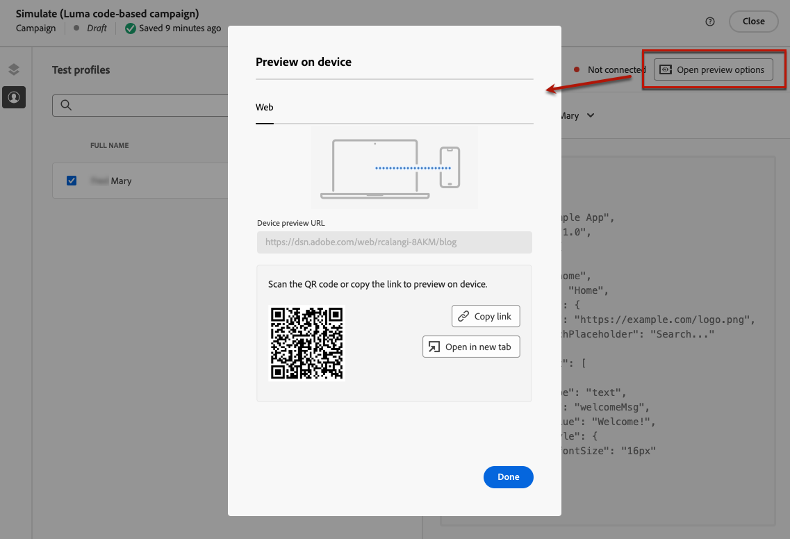
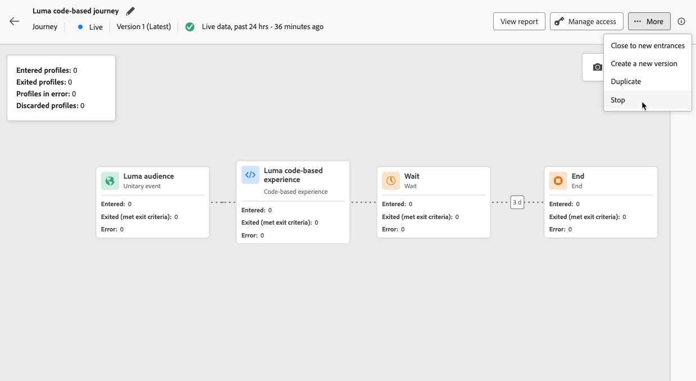

# Criar experiências baseadas em código {#create-code-based}

No [!DNL Journey Optimizer], você pode criar experiências baseadas em código em uma jornada ou campanha.

As medidas de proteção e recomendações específicas para experiências baseadas em código são detalhadas [nesta página](code-based-prerequisites.md).

## Adicionar uma experiência baseada em código por meio de uma jornada ou campanha {#create-code-based-experience}

Para começar a criar sua experiência baseada em código por meio de uma jornada ou campanha, siga as etapas abaixo.

>[!BEGINTABS]

>[!TAB Adicionar uma experiência baseada em código a uma jornada]

Para adicionar uma atividade de **experiência baseada em código** a uma jornada, siga estas etapas:

1. [Criar uma jornada](../building-journeys/journey-gs.md).

1. Inicie sua jornada com uma atividade [Evento](../building-journeys/general-events.md) ou [Ler público](../building-journeys/read-audience.md).

1. Arraste e solte uma atividade de **[!UICONTROL Experiência baseada em código]** da seção **[!UICONTROL Ações]** da paleta.

   

   >[!NOTE]
   >
   >Como a **experiência baseada em código** é uma atividade de mensagem de entrada, ela vem com uma atividade **Wait** de 3 dias. [Saiba mais](../building-journeys/wait-activity.md#auto-wait-node)

1. Insira um **[!UICONTROL Rótulo]** e uma **[!UICONTROL Descrição]** para a mensagem.

1. Selecione ou crie a [Configuração de experiência baseada em código](code-based-configuration.md) para usar.

   

1. Selecione o botão **[!UICONTROL Editar conteúdo]** e edite o conteúdo conforme desejado usando o editor de personalização. [Saiba mais](#edit-code)

1. Se necessário, conclua o fluxo de jornada arrastando e soltando ações ou eventos adicionais. [Saiba mais](../building-journeys/about-journey-activities.md)

1. Quando sua experiência com base em código estiver pronta, finalize a configuração e publique sua jornada para ativá-la. [Saiba mais](../building-journeys/publishing-the-journey.md)

Para obter mais informações sobre como configurar uma jornada, consulte [esta página](../building-journeys/journey-gs.md).

>[!TAB Criar uma campanha de experiência baseada em código]

Para começar a criar sua **experiência baseada em código** por meio de uma campanha, siga as etapas abaixo.

1. Crie uma campanha. [Saiba mais](../campaigns/create-campaign.md)

1. Selecione o tipo de campanha que deseja executar

   * **[!UICONTROL Agendado - Marketing]**: execute a campanha imediatamente ou em uma data especificada. As campanhas agendadas têm como objetivo enviar mensagens de **marketing**. Eles são configurados e executados na interface do usuário do.

   * **[!UICONTROL Acionado por API - Marketing/Transacional]**: execute a campanha usando uma chamada de API. As campanhas acionadas por API têm como objetivo enviar **mensagens de marketing** ou **mensagens transacionais**, ou seja, mensagens enviadas após uma ação executada por um indivíduo: redefinição de senha, compra de carrinho etc. [Saiba como acionar uma campanha usando APIs](../campaigns/api-triggered-campaigns.md)

1. Conclua as etapas para criar uma campanha, como as propriedades da campanha, [público-alvo](../audience/about-audiences.md) e [agendamento](../campaigns/create-campaign.md#schedule). Para obter mais informações sobre como configurar uma campanha, consulte [esta página](../campaigns/get-started-with-campaigns.md).

1. Selecione a ação **[!UICONTROL Experiência baseada em código]**.

1. Selecione ou crie a configuração de experiência baseada em código. [Saiba mais](code-based-configuration.md)

   

1. Edite o conteúdo conforme desejado usando o editor de personalização. [Saiba mais](#edit-code)

   <!---->

Para obter mais informações sobre como configurar uma campanha, consulte [esta página](../campaigns/get-started-with-campaigns.md).

>[!ENDTABS]

## Editar o conteúdo do código {#edit-code}

>[!CONTEXTUALHELP]
>id="ajo_code_based_experience"
>title="Usar o editor de personalização"
>abstract="Insira e edite o código que deseja entregar como parte desta ação de experiência baseada em código."
>additional-url="https://experienceleague.adobe.com/docs/journey-optimizer/using/content-management/personalization/expression-editor/personalization-build-expressions.html?lang=pt-BR" text="Introdução ao editor de personalização"

1. Na atividade de jornada ou na tela de edição de campanha, selecione **[!UICONTROL Editar código]**.

   

1. O [editor de personalização](../personalization/personalization-build-expressions.md) se abre. É uma interface de criação de experiência não visual que permite criar seu código.

1. Você pode alternar o modo de criação de HTML para JSON e vice-versa.

   

   >[!CAUTION]
   >
   >Alterar o modo de criação resultará na perda de todo o código atual, portanto, alterne os modos antes de iniciar a criação.

1. Insira o código conforme necessário. Você pode aproveitar o editor de personalização do [!DNL Journey Optimizer] com todos os seus recursos de personalização e criação. [Saiba mais](../personalization/personalization-build-expressions.md)

1. Você pode adicionar fragmentos de expressão HTML ou JSON, se necessário. [Saiba como](../personalization/use-expression-fragments.md)

   Também é possível salvar parte do conteúdo do código como fragmento. [Saiba como](../content-management/fragments.md#save-as-expression-fragment)

1. Com experiências baseadas em código, você pode usar o recurso de decisão de experiência. Selecione o ícone **[!UICONTROL Política de decisão]** na barra esquerda e clique em **[!UICONTROL Adicionar política de decisão]**. [Saiba mais](../experience-decisioning/create-decision.md)

   

   >[!NOTE]
   >
   >No momento, a Escolha de experiências está disponível apenas para algumas organizações (disponibilidade limitada). Para obter acesso, entre em contato com seu representante da Adobe.

1. Clique em **[!UICONTROL Salvar e fechar]** para confirmar as alterações.

Agora, assim que o desenvolvedor fizer uma chamada de API ou SDK para buscar conteúdo para a superfície definida na configuração do canal, as alterações serão aplicadas à página da Web ou aplicativo.

## Testar a experiência baseada em código {#test-code-based-experience}

>[!CONTEXTUALHELP]
>id="ajo_code_based_preview"
>title="Visualize sua experiência baseada em código"
>abstract="Acesse uma simulação de como será a sua experiência baseada em código."

Para exibir uma pré-visualização de sua experiência baseada em código modificada, siga as etapas abaixo.

>[!CAUTION]
>
>Você deve ter perfis de teste disponíveis para simular quais ofertas serão entregues a eles. Saiba como [criar perfis de teste](../audience/creating-test-profiles.md).

1. Na jornada ou campanha, na tela do editor de personalização ou de edição de conteúdo, selecione **[!UICONTROL Simular conteúdo]**.

   

1. Clique em **[!UICONTROL Gerenciar perfis de teste]** para selecionar um ou mais perfis de teste.

1. Uma visualização da sua experiência modificada baseada em código é exibida.

Informações detalhadas sobre como selecionar perfis de teste e visualizar seu conteúdo estão disponíveis em [esta seção](../content-management/preview.md).

### Visualizar no dispositivo {#preview-on-device}

>[!CONTEXTUALHELP]
>id="ajo_code_based_preview_device"
>title="Pré-visualize sua experiência baseada em código em um dispositivo real"
>abstract="Obtenha uma visualização de suas experiências personalizadas diretamente do seu navegador ou de seus dispositivos móveis, para ver como elas aparecem em dispositivos reais."

>[!CONTEXTUALHELP]
>id="ajo_code_based_preview_device_web"
>title="Visualize sua experiência da Web com base em código no dispositivo"
>abstract="Digitalize o código QR ou copie o link para visualizar no dispositivo."

>[!CONTEXTUALHELP]
>id="ajo_code_based_preview_device_mobile"
>title="Visualize sua experiência móvel baseada em código no dispositivo"
>abstract="Digitalize o código QR ou copie o link para visualizar no dispositivo. Depois de conectado, insira o pino no dispositivo. Talvez seja necessário reiniciar o aplicativo para ver as alterações toda vez que atualizar os links de visualização."

>[!CONTEXTUALHELP]
>id="ajo_code_based_preview_device_refresh"
>title="Atualizar o link de visualização para refletir a exibição atual"
>abstract="A visualização no dispositivo mostrará o conteúdo a partir de quando você criou ou atualizou o link de visualização. Se você modificou o conteúdo ou selecionou um perfil de teste ou tratamento diferente, atualize a visualização para que ela reflita a exibição atual."

Ao criar experiências baseadas em código para páginas da Web ou aplicativos móveis, você pode visualizar suas experiências personalizadas diretamente do seu navegador ou de seus dispositivos móveis, para ver como essas experiências são exibidas em dispositivos reais.

>[!WARNING]
>
>A visualização no dispositivo não está disponível ao usar [políticas de decisão](../experience-decisioning/create-decision.md) ou [personalização](../personalization/personalization-build-expressions.md) atributos contextuais.

1. Na tela **[!UICONTROL Simular]**, clique no botão **[!UICONTROL Abrir opções de visualização]**. As opções de visualização dependem da plataforma selecionada na sua [configuração baseada em código](code-based-configuration.md#create-code-based-configuration).

1. Se você estiver usando uma [plataforma da Web](code-based-configuration.md#web) em sua configuração baseada em código, o campo somente leitura da **[!UICONTROL URL de visualização do dispositivo]** será preenchido com a URL inserida para a configuração de canal atual.

   

   É possível:

   * Selecione o botão **[!UICONTROL Copiar link]** e cole o link em uma guia do navegador. Você também pode compartilhar o link com sua equipe e as partes interessadas, que podem visualizar a nova experiência em qualquer navegador antes que as alterações entrem em vigor.

   * Clique em **[!UICONTROL Abrir em nova guia]** para abrir o link em seu navegador atual.

   * Digitalize o código QR com seu dispositivo móvel para abrir o link de visualização em um navegador móvel.

1. Se você estiver usando [Plataformas móveis](code-based-configuration.md#mobile) (iOS/Android) em sua configuração baseada em código, o campo somente leitura **[!UICONTROL Deeplink]** será preenchido automaticamente com o valor **[!UICONTROL Visualizar URL]** inserido na configuração de canal para a plataforma selecionada.

   Alterne entre as guias **[!UICONTROL iOS]** e **[!DNL Android]** para visualizar sua experiência para a plataforma de sua escolha.

   

   É possível:

   * Selecione o botão **[!UICONTROL Copiar link]** e compartilhe o link com a equipe e as partes interessadas, que podem visualizar a nova experiência em qualquer navegador móvel antes que as alterações entrem em vigor.

   * Digitalize o código QR com seu dispositivo móvel para abrir o link de visualização diretamente no aplicativo móvel. Insira o PIN no dispositivo para estabelecer a sessão [Assurance](https://experienceleague.adobe.com/en/docs/experience-platform/assurance/tutorials/implement-assurance){target="_blank"}.

     >[!NOTE]
     >
     >O **Adobe Experience Platform Assurance** é um produto da Adobe Experience Cloud que ajuda a inspecionar, testar, simular e validar a maneira como você coleta dados ou oferece experiências em seu aplicativo móvel. [Saiba mais](https://experienceleague.adobe.com/pt-br/docs/experience-platform/assurance/home){target="_blank"}

1. Os links de visualização são gerados para o perfil de teste selecionado e, se estiver usando o [Experimento de Conteúdo](../content-management/content-experiment.md) na sua jornada ou campanha, para o tratamento selecionado.

   <!--If you have modified the content or selected a different treatment or test profile, scroll down to the bottom of the **[!UICONTROL Preview on device]** pop-up and click **[!UICONTROL Refresh preview link]** to reflect the current state.

   -->

   <!--When creating a content experiment, you need to select a given treatment and click the **[!UICONTROL Simulate content]** button to obtain the link corresponding to that treatment, then select another treatment, click the **[!UICONTROL Simulate content]** button to obtain a new preview link, and so on.-->

   Ao atualizar o conteúdo ou selecionar um perfil de teste ou tratamento diferente, o link de visualização é atualizado automaticamente. Você pode copiar o link em diferentes guias do navegador e comparar as experiências.

## Ative sua experiência baseada em código {#code-based-experience-live}

>[!IMPORTANT]
>
>A partir da versão de setembro, uma nova experiência de ativação de campanha e jornada permitirá gerenciar todo o processo de aprovação, garantindo que campanhas e jornadas sejam totalmente revisadas e aprovadas pelas partes interessadas apropriadas antes de serem publicadas. Esse recurso está disponível em Disponibilidade limitada. [Saiba mais](../test-approve/gs-approval.md)

Depois de definir sua experiência baseada em código e editar seu conteúdo conforme desejado usando o [editor baseado em código](#edit-code), você pode ativar sua jornada ou campanha para tornar as alterações visíveis para o público-alvo.

Você também pode visualizar seu conteúdo de experiência baseado em código antes de ativá-lo. [Saiba mais](#test-code-based-experience)

>[!NOTE]
>
>Se você ativar uma jornada/campanha baseada em código e afetar as mesmas páginas que outra jornada ou campanha que já está ativa, todas as alterações serão aplicadas ao conteúdo.
>
>Se várias jornadas ou campanhas baseadas em código atualizarem os mesmos elementos do conteúdo, a jornada/campanha de prioridade mais alta terá prioridade.

Assim que a jornada ou campanha baseada em código estiver ativa, a equipe de implementação do aplicativo será responsável por fazer chamadas explícitas de API ou SDK para buscar conteúdo para as superfícies definidas na [configuração de experiência baseada em código](code-based-configuration.md) selecionada. Saiba mais sobre as diferentes implementações de clientes em [esta seção](code-based-implementation-samples.md).

### Publish uma jornada baseada em código {#publish-code-based-journey}

Para ativar sua experiência baseada em código a partir de uma jornada, siga as etapas abaixo.

1. Verifique se a jornada é válida e se não há erros. [Saiba mais](../building-journeys/troubleshooting.md#checking-for-errors-before-testing)

1. Na jornada, selecione a opção **[!UICONTROL Publish]**, localizada no menu suspenso no canto superior direito.

   

   >[!NOTE]
   >
   >Saiba mais sobre a publicação de jornadas em [esta seção](../building-journeys/publishing-the-journey.md).

Sua jornada baseada em código pega o status do **[!UICONTROL Live]** e agora está visível para o público selecionado. Cada recipient da jornada pode ver suas modificações.

>[!NOTE]
>
>Após clicar em **[!UICONTROL Publish]**, pode levar até 15 minutos para que as alterações fiquem disponíveis online.

### Ativar uma campanha baseada em código {#activate-code-based-campaign}

1. Em sua campanha baseada em código, selecione **[!UICONTROL Revisar para ativar]**.

   

1. Verifique e edite, se necessário, o conteúdo, as propriedades, a configuração, o público-alvo e o agendamento.

1. Selecione **[!UICONTROL Ativar]**.

   

   >[!NOTE]
   >
   >Saiba mais sobre como ativar campanhas em [esta seção](../campaigns/review-activate-campaign.md).

Sua campanha baseada em código pega o status do **[!UICONTROL Live]** e agora está visível para o público selecionado. Cada recipient da campanha pode ver as modificações que você adicionou ao conteúdo.

>[!NOTE]
>
>Após clicar em **[!UICONTROL Ativar]**, pode levar até 15 minutos para que as alterações fiquem disponíveis ao vivo.
>
>Se você definiu um agendamento para sua campanha baseada em código, ele tem o status **[!UICONTROL Agendado]** até que a data e a hora de início sejam atingidas.

## Interromper uma jornada ou campanha baseada em código {#stop-code-based-experience}

Quando uma experiência baseada em código está ativa, você pode interrompê-la para impedir que o público-alvo veja suas modificações. Siga as etapas abaixo.

1. Selecione uma jornada ou campanha ao vivo na respectiva lista.

1. Execute a ação relevante de acordo com seu caso:

   * No menu superior da campanha, selecione **[!UICONTROL Parar campanha]**.

     

   * No menu superior de jornada, clique no botão **[!UICONTROL Mais]** e selecione **[!UICONTROL Parar]**.

     

1. As modificações adicionadas não estarão mais visíveis para o público-alvo definido.

>[!NOTE]
>
>Quando uma jornada ou campanha baseada em código é interrompida, não é possível editá-la ou ativá-la novamente. Você só pode duplicá-la e ativar a jornada/campanha duplicada.

<!--Reporting TBC

## Check the code-based experience reports {#check-code-based-reports}

Once your code-based experience is live, you can check the **[!UICONTROL Code-based]** tab of the  [Journey report](../reports/journey-global-report-cja.md#web-cja) and [Campaign report](../reports/campaign-global-report-cja.md#web) to compare elements such as the number of experiences delivered to your audience, and the number of engagements with your content.-->

<!--## Code-based reports

You can access code-based journey or campaign reports from the summary screen.

Global reports display events that occurred at least two hours ago and cover events over a selected time period. In comparison, Live reports focus on events that took place within the past 24 hours, with a minimum time interval of two minutes from the event occurrence.

### Code-based live report {#live-report-code-based}

From your campaign **[!UICONTROL Live report]**, the **[!UICONTROL Code-based experience]** tab details the main information relative to your apps or web pages. [Learn more on live report](../reports/campaign-live-report.md)

+++Learn more on the different metrics and widgets available for the Code-based experience report.

The **[!UICONTROL Code-based experience performance]** KPIs detail the main information relative to your visitors' engagement with your code-based experiences, such as:

* **[!UICONTROL Impressions]**: total number of experiences delivered to all users.

* **[!UICONTROL Interactions]**:  total number of engagements with your app/page. This includes any actions taken by the users, such as clicks or any other interactions.

The **[!UICONTROL Code-based experience summary]** graph shows the evolution of your experiences (impressions, unique impressions and interactions) for the last 24 hours.

TBC: The **[!UICONTROL Interactions by element]** table details the main information relative to your visitors' engagement with the various elements on your app/pages.
+++

### Code-based global report {#global-report-code-based}

Code-based campaign global report can be accessed directly from your journey or campaign with the **[!UICONTROL View report]** button. [Learn more on global report](../reports/campaign-global-report-cja.md)

From your Campaign **[!UICONTROL Global report]**, the **[!UICONTROL Code-based experience]** tab details the main information relative to your apps or web pages.

Add image TBC

+++Learn more on the different metrics and widgets available for the Code-based experience report.

The **[!UICONTROL Code-based experience performance]** KPIs detail the main information relative to your visitors' engagement with your experiences, such as:

* **[!UICONTROL Unique impressions]**: number of unique users to whom the experience was delivered.

* **[!UICONTROL Impressions]**: total number of experiences delivered to all users.

* **[!UICONTROL Interactions]**: percentage of engagements with your app/page. This includes any actions taken by the users, such as clicks or any other interactions.

The **[!UICONTROL Code-based experience summary]** graph shows the evolution of your experiences (unique impressions, impressions and interactions) for the concerned period.

TBC: The **[!UICONTROL Interactions by element]** table details the main information relative to your visitors' engagement with the various elements on your apps/pages.
+++

TBC video if existing

## How-to video{#video}

The video below shows how to create a code-based campaign, configure its properties, review, and publish it.

>[!VIDEO]()

-->
