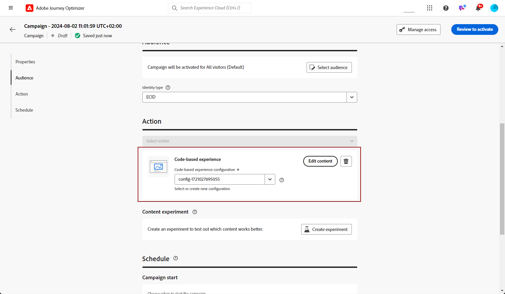

# Criar experiências baseadas em código {#create-code-based}

>[!BEGINSHADEBOX]

O que há neste guia de documentação:

* [Introdução ao canal baseado em código](get-started-code-based.md)
* [Pré-requisitos baseados em código](code-based-prerequisites.md)
* [Amostras de implementação baseadas em código](code-based-implementation-samples.md)
* **[Criar experiências baseadas em código](create-code-based.md)**

>[!ENDSHADEBOX]

>[!AVAILABILITY]
>
>O canal de experiência baseado em código está disponível no momento como uma versão beta somente para usuários selecionados. Para participar do programa beta, entre em contato com o Atendimento ao cliente da Adobe.

## Criar uma campanha baseada em código {#create-code-based-campaign}

Para começar a criar sua experiência baseada em código por meio de uma campanha, siga as etapas abaixo.

>[!CAUTION]
>
>Atualmente em [!DNL Journey Optimizer] você só pode criar experiências baseadas em código usando **campanhas**.

1. Criar uma campanha. [Saiba mais](../campaigns/create-campaign.md)

1. Selecione o **[!UICONTROL Experiência baseada em código (Beta)]** ação.

1. Insira a superfície de experiência baseada em código. [Saiba mais](#surface-definition)

   

   >[!CAUTION]
   >
   >Verifique se o URI de superfície usado em sua campanha baseada em código corresponde ao usado em sua própria implementação. Caso contrário, as alterações não serão aplicadas.

1. Selecione **[!UICONTROL Criar]**.

1. Conclua as etapas para criar uma campanha, como as propriedades da campanha, [público](../audience/about-audiences.md), e [programação](../campaigns/create-campaign.md#schedule).

   >[!NOTE]
   >
   >Para obter mais informações sobre como configurar uma campanha, consulte [esta página](../campaigns/get-started-with-campaigns.md).

1. Edite o conteúdo conforme desejado usando o [editor baseado em código](#edit-code).

   

## Editar o conteúdo do código {#edit-code}

>[!CONTEXTUALHELP]
>id="ajo_code_based_experience"
>title="Usar o editor de expressão"
>abstract="Insira e edite o código que deseja entregar como parte desta ação de experiência baseada em código."
>additional-url="https://experienceleague.adobe.com/docs/journey-optimizer/using/content-management/personalization/expression-editor/personalization-build-expressions.html" text="Introdução ao editor de expressão"

1. Na tela de edição da campanha, selecione **[!UICONTROL Editar código]**.

   

1. A variável [Editor de expressão](../personalization/personalization-build-expressions.md) é aberto. É uma interface de criação de experiência não visual que permite criar seu código.

1. Você pode alternar o modo de criação de HTML para JSON e vice-versa.

   >[!CAUTION]
   >
   >Alterar o modo de criação resultará na perda de todo o código atual, portanto, alterne os modos antes de iniciar a criação.

1. Insira o código conforme necessário. Você pode aproveitar o [!DNL Journey Optimizer] Editor de expressão com todos os seus recursos de personalização e criação. [Saiba mais](../personalization/personalization-build-expressions.md)

   

1. Em campanhas baseadas em código, é possível usar o recurso de decisão da experiência. Selecione o **[!UICONTROL Decisões]** na barra esquerda e clique em **[!UICONTROL Criar decisão]**. [Saiba mais](../experience-decisioning/create-decision.md)

   

   >[!NOTE]
   >
   >O recurso de decisão de experiência está disponível atualmente como um beta apenas para usuários selecionados.

1. Clique em **[!UICONTROL Salvar e fechar]** para confirmar as alterações.

Agora, assim que o desenvolvedor fizer uma chamada de API ou SDK para buscar conteúdo para a superfície selecionada, as alterações serão aplicadas à página da Web ou aplicativo.

## Testar a campanha baseada em código {#test-code-based-campaign}

>[!CONTEXTUALHELP]
>id="ajo_code_based_preview"
>title="Visualizar sua experiência baseada em código"
>abstract="Obtenha uma simulação de como será sua experiência baseada em código."

Para exibir uma pré-visualização de sua experiência baseada em código modificada, siga as etapas abaixo.

>[!CAUTION]
>
>Você deve ter perfis de teste disponíveis para simular quais ofertas serão entregues a eles. Saiba como [criar perfis de teste](../audience/creating-test-profiles.md).

1. Na tela Editor de expressão ou Editar conteúdo, selecione **[!UICONTROL Simular conteúdo]**.

   

1. Clique em **[!UICONTROL Gerenciar perfis de teste]** para selecionar um ou mais perfis de teste.

1. Uma visualização da sua experiência modificada baseada em código é exibida.

<!--
    

    You can also open it in the default browser, or copy the test URI to paste it in any browser. This allows you to share the link with your team and stakeholders who will be able to preview the new web experience in any browser before the campaign goes live.

    When copying the test URI, the content displayed is the one personalized for the test profile used when the content simulation was generated in [!DNL Journey Optimizer].-->

## Ativar a campanha baseada em código {#activate-code-based-campaign}

Depois de definir sua campanha baseada em código e editar o conteúdo conforme desejado usando o [editor baseado em código](#edit-code), você pode revisá-lo e ativá-lo. Siga as etapas abaixo.

>[!NOTE]
>
>Você também pode pré-visualizar o conteúdo da campanha antes de ativá-lo. [Saiba mais](#test-code-based-campaign)

1. Em sua campanha baseada em código, selecione **[!UICONTROL Revisar para ativar]**.

   

1. Verifique e edite, se necessário, o conteúdo, as propriedades, a superfície, o público-alvo e o agendamento.

1. Selecionar **[!UICONTROL Ativar]**.

   

   >[!NOTE]
   >
   >Depois de clicar em **[!UICONTROL Ativar]**, pode levar até 1 minuto para que as alterações nas campanhas baseadas em código sejam disponibilizadas ao vivo em seu local.

Sua campanha baseada em código utiliza o **[!UICONTROL Ao vivo]** e agora está visível para o público-alvo selecionado. Cada recipient da campanha pode visualizar as modificações.

>[!NOTE]
>
>Se você definiu uma programação para sua campanha baseada em código, ela tem a **[!UICONTROL Agendado]** até que a data e a hora de início sejam atingidas.
>
>Se você ativar uma campanha baseada em código que afeta os mesmos locais que outra campanha que já está ativa, todas as alterações serão aplicadas aos seus locais.

Saiba mais sobre como ativar campanhas no [nesta seção](../campaigns/review-activate-campaign.md).

## Interromper uma campanha baseada em código {#stop-code-based-campaign}

Quando uma campanha baseada em código está ativa, você pode interrompê-la para impedir que seu público-alvo veja suas modificações. Siga as etapas abaixo.

1. Selecione uma campanha ao vivo da lista.

1. No menu superior, selecione **[!UICONTROL Interromper campanha]**.

   

1. As modificações adicionadas não estarão mais visíveis para o público-alvo definido.

>[!NOTE]
>
>Quando uma campanha baseada em código é interrompida, não é possível editá-la ou ativá-la novamente. Você só pode duplicá-la e ativar a campanha duplicada.

## Relatórios de campanha baseados em código

Você pode acessar relatórios de campanha baseados em código na tela de resumo da campanha.

Os relatórios globais exibem eventos que ocorreram pelo menos duas horas atrás e abrangem eventos durante um período selecionado. Em comparação, os Relatórios em tempo real focalizam eventos que ocorreram nas últimas 24 horas, com um intervalo mínimo de dois minutos a partir da ocorrência do evento.

### Relatório ao vivo baseado em código {#live-report-code-based}

Da sua campanha **[!UICONTROL Relatório ao vivo]**, o **[!UICONTROL Experiência baseada em código]** A guia detalha as principais informações relacionadas aos aplicativos ou páginas da Web. [Saiba mais sobre o relatório em tempo real](../reports/campaign-live-report.md)

+++Saiba mais sobre as diferentes métricas e widgets disponíveis para o Relatório de experiência baseado em código.

A variável **[!UICONTROL Desempenho de experiência baseado em código]** Os KPIs detalham as principais informações relativas ao envolvimento dos visitantes com suas experiências baseadas em código, como:

* **[!UICONTROL Impressões]**: número total de experiências entregues a todos os usuários.

* **[!UICONTROL Interações]**: número total de envolvimentos com seu aplicativo/página. Isso inclui qualquer ação realizada pelos usuários, como cliques ou quaisquer outras interações.

A variável **[!UICONTROL Resumo da experiência baseado em código]** o gráfico mostra a evolução de suas experiências (impressões, impressões exclusivas e interações) nas últimas 24 horas.

<!--The **[!UICONTROL Interactions by element]** table details the main information relative to your visitors' engagement with the various elements on your app/pages.-->
+++

### Relatório global baseado em código {#global-report-code-based}

O relatório global da campanha baseado em código pode ser acessado diretamente de sua campanha com o **[!UICONTROL Exibir relatório]** botão. [Saiba mais sobre relatório global](../reports/campaign-global-report.md)

Da sua campanha **[!UICONTROL Relatório global]**, o **[!UICONTROL Experiência baseada em código]** A guia detalha as principais informações relacionadas aos aplicativos ou páginas da Web.

<!--image-->

+++Saiba mais sobre as diferentes métricas e widgets disponíveis para o Relatório de experiência baseado em código.

A variável **[!UICONTROL Desempenho de experiência baseado em código]** Os KPIs detalham as principais informações relativas ao envolvimento dos visitantes com suas experiências, como:

* **[!UICONTROL Impressões exclusivas]**: número de usuários únicos aos quais a experiência foi entregue.

* **[!UICONTROL Impressões]**: número total de experiências entregues a todos os usuários.

* **[!UICONTROL Interações]**: porcentagem de envolvimentos com seu aplicativo/página. Isso inclui qualquer ação realizada pelos usuários, como cliques ou quaisquer outras interações.

A variável **[!UICONTROL Resumo da experiência baseado em código]** o gráfico mostra a evolução de suas experiências (impressões únicas, impressões e interações) para o período relacionado.

<!--The **[!UICONTROL Interactions by element]** table details the main information relative to your visitors' engagement with the various elements on your apps/pages.-->
+++

<!--
## How-to video{#video}

The video below shows how to create a code-based campaign, configure its properties, review, and publish it.

>[!VIDEO]()

-->