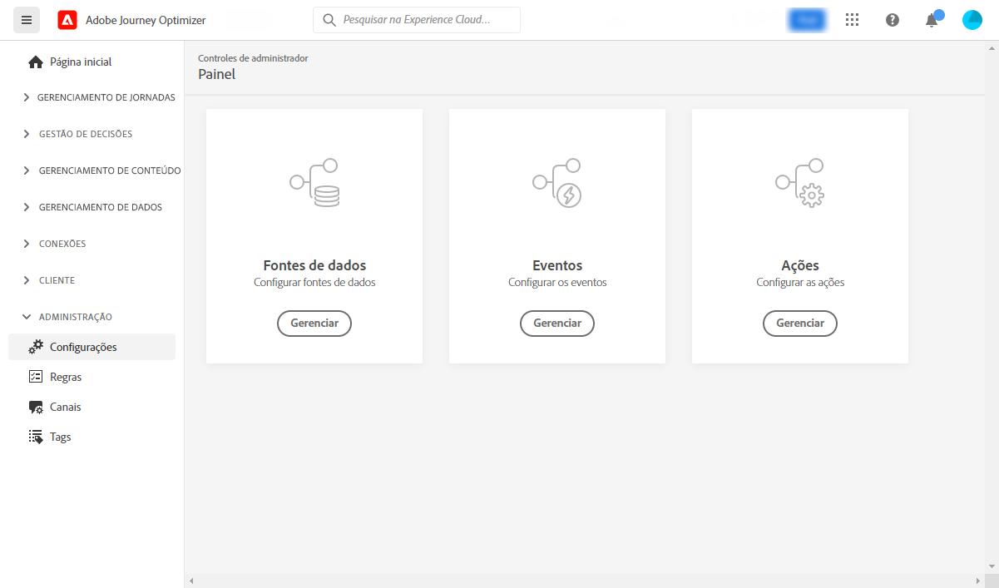

# Introdução à configuração de jornadas {#configure-journeys}

>[!CONTEXTUALHELP]
>id="ajo_journey_configuration_dashboard"
>title="Sobre a configuração de jornada"
>abstract="Para enviar mensagens em jornadas, é necessário configurar as fontes de dados, eventos e ações. As fontes de dados permitem estabelecer uma conexão com um sistema para recuperar informações adicionais que serão usadas em suas jornadas, como, por exemplo, nas condições. Os eventos permitem acionar as jornadas quando um evento é recebido. As ações personalizadas facilitam a conexão a um sistema de terceiros para enviar mensagens. Se estiver usando os recursos de mensagem incorporados do Journey Optimizer, não é necessário configurar uma ação."

Para enviar mensagens com jornadas, é necessário configurar **[!UICONTROL Fontes de Dados]**, **[!UICONTROL Eventos]** e **[!UICONTROL Ações]**. As fontes de dados permitem estabelecer uma conexão com um sistema para recuperar informações adicionais que serão usadas em suas jornadas, como, por exemplo, nas condições. Os eventos permitem acionar as jornadas quando um evento é recebido. As ações personalizadas facilitam a conexão a um sistema de terceiros para enviar mensagens. Se estiver usando os recursos de mensagem incorporados do Journey Optimizer, não é necessário configurar uma ação.

Você também pode configurar conexões com sistemas externos por meio de fontes de dados personalizadas e ações personalizadas. Isso permite, por exemplo, enriquecer suas jornadas com dados provenientes de um sistema de reservas externo ou enviar mensagens usando um sistema de terceiros, como Epsilon ou Facebook. Saiba como [integrar o Journey Optimizer a sistemas externos](external-systems.md).

## Fontes de dados {#data-sources}

A configuração do Data Source permite definir uma conexão com um sistema para recuperar informações adicionais que serão usadas em suas jornadas. [Saiba mais](../../using/datasource/about-data-sources.md)

## Eventos {#events}

Os eventos permitem acionar as jornadas de forma unitária para enviar mensagens em tempo real à pessoa que flui para a jornada.

Na configuração do evento, configure os eventos esperados nas jornadas. Os dados de entrada dos eventos são padronizados de acordo com o Adobe Experience Data Model (XDM). Os eventos vêm das APIs de ingestão de transmissão para eventos autenticados e não autenticados (como eventos do Adobe Mobile SDK). [Saiba mais](../../using/event/about-events.md)

## Ações {#actions}

Os recursos de mensagem do Journey Optimizer são incorporados: basta adicionar uma atividade de ação de canal à jornada. Se você estiver usando um sistema de terceiros para enviar mensagens, poderá criar uma ação personalizada. [Saiba mais](../../using/action/action.md)

## Navegar pelos campos do Adobe Experience Platform {#friendly-names-display}

Ao definir a [carga útil do evento](../event/about-creating.md#define-the-payload-fields), [carga útil do grupo de campo](../datasource/configure-data-sources.md#define-field-groups) e selecionar campos no [editor de expressões](../building-journeys/expression/expressionadvanced.md), o nome de exibição é exibido além do nome do campo. Essas informações são recuperadas a partir da definição do schema no Experience Data Model.

Se descritores como &quot;xdm:alternateDisplayInfo&quot; forem fornecidos durante a configuração de esquemas, os nomes de usuário simples substituirão os nomes de exibição. É especialmente útil ao trabalhar com &quot;eVars&quot; e campos genéricos. Você pode configurar descritores de nome amigáveis por meio de uma chamada de API. Para obter mais informações, consulte o [guia do desenvolvedor do Registro de Esquema](https://experienceleague.adobe.com/docs/experience-platform/xdm/api/getting-started.html?lang=pt-BR){target="_blank"}.

Se um nome simples estiver disponível, o campo será exibido como `<friendly-name>(<name>)`. Se nenhum nome simples estiver disponível, o nome de exibição será exibido, por exemplo `<display-name>(<name>)`. Se nenhum deles estiver definido, somente o nome técnico do campo será exibido `<name>`.

>[!NOTE]
>
>Os nomes simples não são recuperados ao selecionar campos de uma união de schemas.
