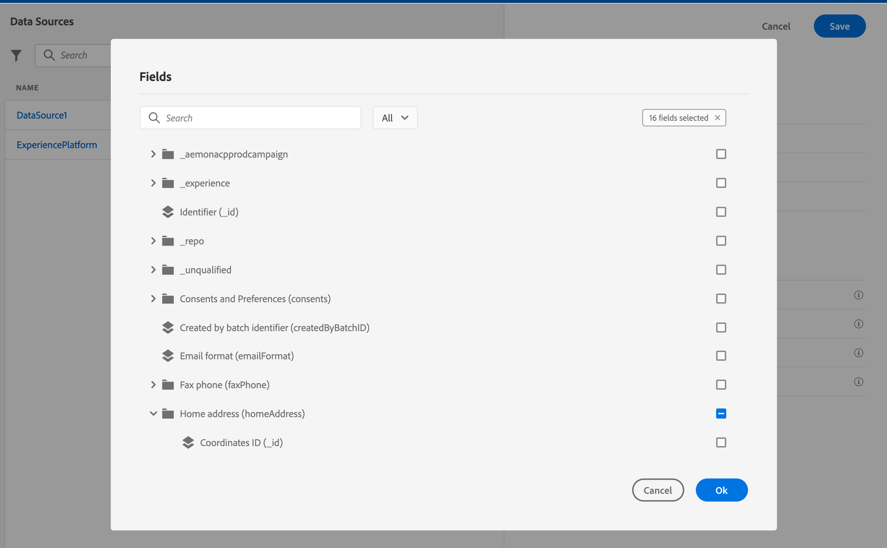

# Configurar jornadas {#configure-journeys}

>[!CONTEXTUALHELP]
>id="ajo_journey_configuration_dashboard"
>title="Sobre a configuração do jornada"
>abstract="Para enviar mensagens com jornadas, é necessário configurar as Fontes de dados, os Eventos e as Ações. As fontes de dados permitem definir uma conexão com um sistema para recuperar informações adicionais que serão usadas em suas jornadas, por exemplo, em suas condições. Os eventos permitem acionar as jornadas quando um evento é recebido. As ações personalizadas permitem conectar-se a um sistema de terceiros para enviar suas mensagens. Se estiver usando recursos de mensagem integrada do Journey Optimizer, não será necessário configurar uma ação."

Para enviar mensagens com o jornada, é necessário configurar **[!UICONTROL Fontes de dados]**, **[!UICONTROL Eventos]** e **[!UICONTROL Ações]**.

## Fontes de dados {#data-sources}

A configuração da Fonte de Dados permite definir uma conexão com um sistema para recuperar informações adicionais que serão usadas em suas jornadas. [Saiba mais](../../using/datasource/about-data-sources.md)

## Eventos {#events}

Os eventos permitem acionar as jornadas de forma unitária para enviar mensagens, em tempo real, ao indivíduo que flui para a jornada.

Na configuração do evento, configure os eventos esperados nas jornadas. Os dados de entrada dos eventos são normalizados de acordo com o Adobe Experience Data Model (XDM). Os eventos vêm das APIs de assimilação de streaming para eventos autenticados e não autenticados (como eventos do Adobe Mobile SDK). [Saiba mais](../../using/event/about-events.md)

## Ações {#actions}

Os recursos de mensagem do Journey Optimizer são incorporados: você só precisa adicionar uma atividade de ação de canal à jornada. Se você estiver usando um sistema de terceiros para enviar mensagens, é possível criar uma ação personalizada. [Saiba mais](../../using/action/action.md)

## Procurar nos campos da Adobe Experience Platform {#friendly-names-display}

Ao definir a [carga útil do evento](../event/about-creating.md#define-the-payload-fields), [carga útil do grupo de campo](../datasource/configure-data-sources.md#define-field-groups) e selecionar campos no [editor de expressões](../building-journeys/expression/expressionadvanced.md), o nome de exibição é exibido além do nome do campo. Essas informações são recuperadas a partir da definição do schema no modelo de dados de experiência.

Se descritores como &quot;xdm:alternateDisplayInfo&quot; forem fornecidos durante a configuração de schemas, os nomes de usuário simples substituirão os nomes de exibição. É especialmente útil ao trabalhar com &quot;eVars&quot; e campos genéricos. Você pode configurar descritores de nome amigáveis por meio de uma chamada de API. Para obter mais informações, consulte o [Guia do desenvolvedor do Registro de Schema](https://experienceleague.adobe.com/docs/experience-platform/xdm/api/getting-started.html?lang=pt-BR){target=&quot;_blank&quot;}.

Se um nome simples estiver disponível, o campo será exibido como `<friendly-name>(<name>)`. Se nenhum nome simples estiver disponível, o nome de exibição será exibido, por exemplo `<display-name>(<name>)`. Se nenhum deles estiver definido, somente o nome técnico do campo será exibido `<name>`.

>[!NOTE]
>
>Os nomes simples não são recuperados ao selecionar campos de uma união de schemas.
