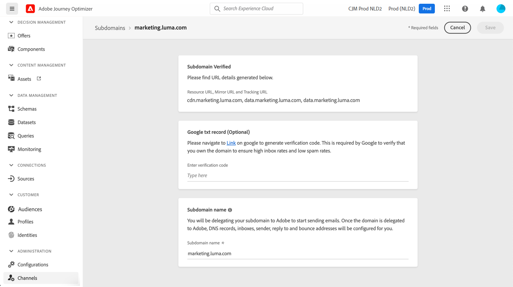

# Delegação de subdomínio em [!DNL Journey Optimizer] {#subdomain-delegation}

A criação de um subdomínio para campanhas de email permite que as marcas isolem vários tipos de tráfego (marketing vs. corporativo, por exemplo) em pools de IP específicos e com domínios específicos, o que agilizará o processo de aquecimento de IP e melhorará a capacidade de entrega em geral. Se você compartilhar um domínio e ele for bloqueado ou adicionado à lista de bloqueios, isso poderá afetar seu delivery de email corporativo. No entanto, problemas ou blocos de reputação em um domínio específico para suas comunicações de marketing por email afetarão apenas esse fluxo de email. Usar seu domínio principal como remetente ou endereço &quot;De&quot; para vários fluxos de email também pode quebrar a autenticação de email, fazendo com que suas mensagens sejam bloqueadas ou colocadas na pasta de spam.

>[!NOTE]
>
>Você não pode usar o mesmo domínio de envio para enviar mensagens de [!DNL Adobe Journey Optimizer] e de outro produto, como [!DNL Adobe Campaign] ou [!DNL Adobe Marketo Engage].

## Por que configurar subdomínios? {#why-set-up-subdomains}

Um subdomínio é uma divisão do seu domínio que pode ser usada para isolar suas marcas ou vários tipos de tráfego, por exemplo, mensagens transacionais e comunicações de marketing.

Vamos ver o exemplo do domínio &quot;mybrand.com&quot;, usado para enviar comunicações transacionais e de marketing. Nessa situação, você pode optar por configurar dois subdomínios:

* subdomínio &quot;info.mybrand.com&quot; para comunicações transacionais (confirmação de compras, redefinição de senha etc.),
* subdomínio &quot;marketing.mybrand.com&quot; para emails de prospecção.

Ao fazer isso, você ajudará a preservar a reputação do seu domínio e de outros subdomínios. Por exemplo, se os subdomínios &quot;marketing.mybrand.com&quot; acabassem sendo incluídos na lista de bloqueios por provedores de serviço de internet devido a uma entrega incorreta, isso evitaria que todo o domínio &quot;mybrand.com&quot; e o subdomínio &quot;info.mybrand.com&quot; fossem incluídos na lista de bloqueios.

Ao implementar uma solução, há requisitos para componentes voltados para o exterior: isso inclui configurar links e páginas da Web a serem rastreadas, exibir mirror pages, etc.

Embora esses requisitos estejam sendo gerenciados por meio de componentes hospedados pelo Adobe e pelo cliente, eles incluem URLs que podem ser vistos pelos recipients dos emails. Para evitar URLs que indicam a solução técnica subjacente ou o provedor de hospedagem, os subdomínios podem ser configurados para tornar isso transparente para os recipients dos emails.

**Saiba mais**

* Saiba como [delegar seus subdomínios](delegate-subdomain.md) diretamente da interface
* Saiba como [adicionar registros TXT do Google](google-txt.md) para seus subdomínios para garantir o delivery bem-sucedido de emails para endereços Gmail
* Saiba como [acessar os registros PTR](ptr-records.md) gerado para seus subdomínios, permitindo que sejam verificados pelo envio de servidores de email

## Métodos de configuração de subdomínio {#subdomain-delegation-methods}

A configuração de subdomínio permite configurar uma subseção do seu domínio (tecnicamente uma &quot;zona DNS&quot;) para usar com o Adobe Campaign. Os métodos de configuração disponíveis são:

* **Delegação completa do subdomínio para o Adobe** (recomendado): o subdomínio é totalmente delegado à Adobe. O Adobe é capaz de controlar e manter todos os aspectos do DNS necessários para fornecer, renderizar e rastrear mensagens. [Saiba mais sobre a delegação completa de subdomínio](delegate-subdomain.md#full-subdomain-delegation)

* **Uso de CNAMEs**: Crie um subdomínio e use CNAMEs para apontar para registros específicos do Adobe. Com essa configuração, você e o Adobe compartilham a responsabilidade pela manutenção do DNS. [Saiba mais sobre a delegação de subdomínio CNAME](delegate-subdomain.md#cname-subdomain-delegation)

>[!CAUTION]
>
>* A delegação completa de subdomínio é o método preferido.
>
>* O método CNAME é recomendado se as políticas de sua organização restringirem o método completo de delegação de subdomínio. Essa abordagem requer que você mantenha e gerencie registros de DNS por conta própria. O Adobe não poderá ajudar a alterar, manter ou gerenciar o DNS de um subdomínio configurado por meio do método CNAME.

A tabela abaixo apresenta um resumo de como esses métodos funcionam, bem como o nível de esforço necessário:

| Método de configuração | Como funciona | Nível de esforço |
|---|---|---|
| **Delegação completa** | Crie o subdomínio e o registro de namespace. A Adobe irá configurar todos os registros DNS necessários para o Adobe Campaign.  Nesta configuração, a Adobe é totalmente responsável pelo gerenciamento do subdomínio e de todos os registros DNS. | Baixa |
| **CNAME, método personalizado** | Crie o subdomínio e o registro de namespace. A Adobe fornecerá os registros que serão colocados em seus servidores DNS e configurará os valores correspondentes em servidores DNS do Adobe Campaign.  Nessa configuração, você e a Adobe compartilham a responsabilidade pela manutenção do DNS. | Alta |

Informações adicionais sobre a configuração de domínio estão disponíveis em [esta documentação](https://experienceleague.adobe.com/docs/deliverability-learn/deliverability-best-practice-guide/additional-resources/product-specific-resources/campaign/ac-domain-name-setup.html).

Em caso de dúvida sobre os métodos de configuração de subdomínio, entre em contato com o Adobe ou entre em contato com o Atendimento ao cliente para solicitar consultoria sobre Deliverability.

## Acessar subdomínios delegados {#access-delegated-subdomains}

Todos os subdomínios delegados são exibidos na variável **[!UICONTROL Administração]** > **[!UICONTROL Canais]** > **[!UICONTROL Subdomínios]** menu. Os filtros estão disponíveis para ajudar você a refinar a lista (data de delegação, usuário ou status).

O **[!UICONTROL Status]** fornece informações sobre o processo de delegação de subdomínio:

* **[!UICONTROL Rascunho]**: A delegação de subdomínio foi salva como rascunho. Clique no nome do subdomínio para retomar o processo de delegação,
* **[!UICONTROL Processamento]**: O subdomínio está passando por várias verificações de configuração antes de poder ser usado,
* **[!UICONTROL Sucesso]**: O subdomínio passou pelas verificações com êxito e pode ser usado para enviar mensagens,
* **[!UICONTROL Falha]**: Uma ou várias verificações falharam após o envio da delegação de subdomínio.

Para acessar informações detalhadas sobre um subdomínio com a variável **[!UICONTROL Sucesso]** , abra-o na lista.

É possível:

* Recupere o nome do subdomínio (somente leitura) configurado durante o processo de delegação, bem como os URLs gerados (recursos, mirror pages, URLs de rastreamento),

* Adicione um registro TXT de verificação do site do Google ao seu subdomínio para garantir que ele seja verificado (consulte [Adicionar um registro TXT do Google a um subdomínio](google-txt.md)).

>[!CAUTION]
>
>A configuração de subdomínio é comum a todos os ambientes. Portanto, qualquer modificação em um subdomínio também afetará as sandboxes de produção.
