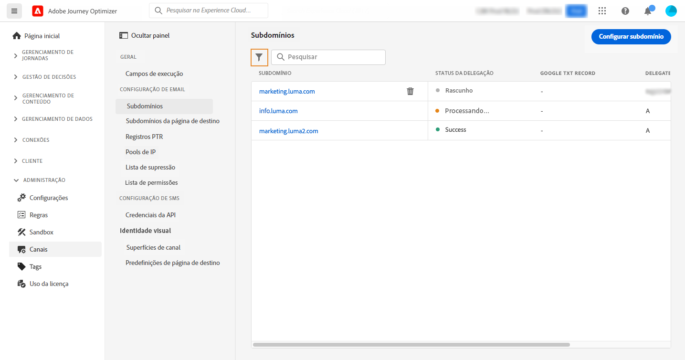

# Acessar subdomínios delegados {#access-delegated-subdomains}

Todos os subdomínios delegados são exibidos na variável **[!UICONTROL Administração]** > **[!UICONTROL Canais]** > **[!UICONTROL Subdomínios]** menu. Os filtros estão disponíveis para ajudar você a refinar a lista (data de delegação, usuário ou status).

O **[!UICONTROL Status]** fornece informações sobre o processo de delegação de subdomínio:

* **[!UICONTROL Rascunho]**: A delegação de subdomínio foi salva como rascunho. Clique no nome do subdomínio para retomar o processo de delegação,
* **[!UICONTROL Processamento]**: O subdomínio está passando por várias verificações de configuração antes de poder ser usado,
* **[!UICONTROL Sucesso]**: O subdomínio passou pelas verificações com êxito e pode ser usado para enviar mensagens,
* **[!UICONTROL Falha]**: Uma ou várias verificações falharam após o envio da delegação de subdomínio.

Para acessar informações detalhadas sobre um subdomínio, abra-o na lista. É possível:

* Recupere o nome do subdomínio (somente leitura) configurado durante o processo de delegação, bem como os URLs gerados (recursos, mirror pages, URLs de rastreamento),

* Adicione um registro TXT de verificação do site do Google ao seu subdomínio para garantir que ele seja verificado (consulte [Adicionar um registro TXT do Google a um subdomínio](google-txt.md)).

