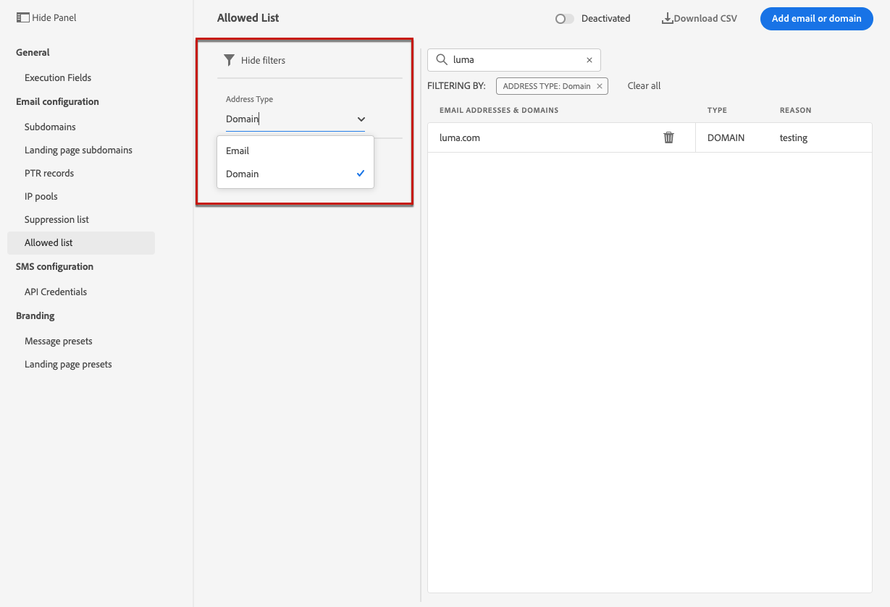

# Lista de permissões {#allow-list}

É possível definir uma lista específica de segurança de envio no [sandbox](../administration/sandboxes.md) nível.

Essa lista de permissões permite especificar endereços de email ou domínios individuais que serão os únicos recipients ou domínios autorizados a receber os emails enviados de uma sandbox específica.

>[!NOTE]
>
>Esse recurso está disponível em sandboxes de produção e não produção.

Por exemplo, em uma instância de não produção, em que podem ocorrer erros, a lista de permissões garante que você não tenha risco de enviar mensagens indesejadas para endereços de clientes reais e, portanto, fornece um ambiente seguro para fins de teste.

Além disso, quando a lista de permissões estiver ativa, mas estiver vazia, nenhum email será enviado. Portanto, se você encontrar algum problema importante, poderá usar esse recurso para interromper todas as comunicações de saída do [!DNL Journey Optimizer] até que você corrija o problema. Saiba mais sobre o [Lógica da lista de permissões](#logic).

>[!CAUTION]
>
>Esse recurso se aplica somente ao canal de email.

## Acessar a lista de permissões {#access-allowed-list}

Para acessar a lista detalhada de domínios e endereços de email permitidos, acesse **[!UICONTROL Administração]** > **[!UICONTROL Canais]** > **[!UICONTROL Configuração de email]** e selecione **[!UICONTROL Lista de permissões]**.


>[!CAUTION]
>
>As permissões para visualizar, exportar e gerenciar a lista de permissões estão restritas a [Administradores do Jornada](../administration/ootb-product-profiles.md#journey-administrator). Saiba mais sobre como gerenciar [!DNL Journey Optimizer] direitos de acesso dos usuários em [esta seção](../administration/permissions-overview.md).

Para exportar a lista de permissões como um arquivo CSV, selecione a **[!UICONTROL Baixar CSV]** botão.

Use o **[!UICONTROL Excluir]** para remover permanentemente uma entrada.

Você pode pesquisar por domínios ou endereços de email e filtrar no **[!UICONTROL Tipo de endereço]**. Depois de selecionado, você pode limpar o filtro exibido na parte superior da lista.



## Ativar a lista de permissões {#enable-allow-list}

Para ativar a lista de permissões, siga as etapas abaixo.

1. Acesse o  **[!UICONTROL Canais]** > **[!UICONTROL Configuração de email]** > **[!UICONTROL Lista de permissões]** menu.

1. Clique em **[!UICONTROL Desativado]**.

   

1. Selecionar **[!UICONTROL Ativar lista de permissões]**. A lista de permissões agora está ativa.

   

   >[!NOTE]
   >
   >Após ativar a lista de permissões, há uma latência de 5 minutos para que ela entre em vigor em suas jornadas e campanhas.

A lógica de lista de permissões se aplica quando o recurso está ativo. Saiba mais [nesta seção](#logic).

>[!NOTE]
>
>Quando ativado, o recurso de lista de permissões é honrado ao executar jornadas, mas também ao testar mensagens com o [provas](../design/preview.md#send-proofs) e teste de jornadas usando o [modo de teste](../building-journeys/testing-the-journey.md).

## Desativar a lista de permissões {#deactivate-allow-list}

Para desativar a lista de permissões, siga as etapas abaixo.

1. Acesse o  **[!UICONTROL Canais]** > **[!UICONTROL Configuração de email]** > **[!UICONTROL Lista de permissões]** menu.

1. Clique em **[!UICONTROL Ativo]**.

   

1. Selecionar **[!UICONTROL Desativar lista de permissões]**. A lista de permissões não está mais ativa.

   

   >[!NOTE]
   >
   >Após desativar a lista de permissões, há uma latência de 5 minutos para que ela entre em vigor nas jornadas e campanhas.

A lógica de lista de permissões não se aplica quando o recurso é desativado. Saiba mais [nesta seção](#logic).

## Adicionar entidades à lista de permissões {#add-entities}

Para adicionar novos endereços de email ou domínios à lista de permissões para uma sandbox específica, você pode [preencher manualmente a lista](#manually-populate-list)ou use uma [Chamada de API](#api-call-allowed-list).

>[!NOTE]
>
>A lista de permissões pode conter até 1.000 entradas.

### Preencher manualmente a lista de permissões {#manually-populate-list}

>[!CONTEXTUALHELP]
>id="ajo_admin_allowed_list_add_header"
>title="Adicionar endereços ou domínios à lista de permissões"
>abstract="Você pode adicionar manualmente novos endereços de email ou domínios à lista de permissões selecionando-os um por um."

>[!CONTEXTUALHELP]
>id="ajo_admin_allowed_list_add"
>title="Adicionar endereços ou domínios à lista de permissões"
>abstract="Você pode adicionar manualmente novos endereços de email ou domínios à lista de permissões selecionando-os um por um."

Você pode preencher manualmente a variável [!DNL Journey Optimizer] lista de permissões adicionando um endereço de email ou um domínio por meio da interface do usuário.

>[!NOTE]
>
>Você só pode adicionar um endereço de email ou domínio por vez.

Para fazer isso, siga as etapas abaixo.

1. Selecione o **[!UICONTROL Adicionar email ou domínio]** botão.

   

1. Escolha o tipo de endereço: **[!UICONTROL Endereço de email]** ou **[!UICONTROL Endereço do domínio]**.

1. Insira o endereço de email ou domínio para o qual deseja enviar emails.

   >[!NOTE]
   >
   >Certifique-se de inserir um endereço de email válido (como abc@company.com) ou domínio (como abc.company.com).

1. Especifique um motivo, se necessário.

   

   >[!NOTE]
   >
   >Todos os caracteres ASCII compreendidos entre 32 e 126 são permitidos no **[!UICONTROL Motivo]** campo. A lista completa pode ser encontrada em [esta página](https://en.wikipedia.org/wiki/Wikipedia:ASCII#ASCII_printable_characters){target=&quot;_blank&quot;} por exemplo.

1. Clique em **[!UICONTROL Enviar]**.

### Adicionar entidades usando uma chamada de API {#api-call-allowed-list}

Para preencher a lista de permissões, você também pode chamar a API de supressão com a variável `ALLOWED` para a variável `listType` atributo. Por exemplo:


Você pode executar o **Adicionar**, **Excluir** e **Get** operações.

Saiba mais sobre como fazer chamadas de API no [APIs do Adobe Experience Platform](https://experienceleague.adobe.com/docs/experience-platform/landing/platform-apis/api-guide.html)Documentação de referência de {target=&quot;_blank&quot;}.

## Lógica da lista de permissões {#logic}

>[!CONTEXTUALHELP]
>id="ajo_admin_allowed_list_logic"
>title="Gerenciar a lista de permissões"
>abstract="Quando a lista de permissões for ativada, somente os recipients incluídos na lista de permissões receberão mensagens de email dessa sandbox. Quando desativado, todos os recipients receberão emails."

Quando a lista de permissões for [ative](#enable-allow-list), aplica-se a seguinte lógica:

* Se a lista de permissões for **empty**, nenhum email será enviado.

* Se uma entidade for **na lista de permissões**, e não na lista de supressão, o email é enviado para os recipients correspondentes. No entanto, se a entidade também estiver no [lista de supressão](../reports/suppression-list.md), os recipients correspondentes não receberão o email, sendo o motivo **[!UICONTROL Suprimido]**.

* Se uma entidade for **não na lista de permissões** (e não na lista de supressão), os recipients correspondentes não receberão o email, o motivo sendo **[!UICONTROL Não permitido]**.

>[!NOTE]
>
>Os perfis com **[!UICONTROL Não permitido]** são excluídos durante o processo de envio da mensagem. Portanto, enquanto a variável **Relatórios de Jornada** mostrará esses perfis como tendo sido movidos pela jornada ([Ler segmento](../building-journeys/read-segment.md) e [atividades de mensagem](../building-journeys/journeys-message.md)), **Relatórios de email** não os incluirá no **[!UICONTROL Enviado]** métricas como são filtradas antes do envio do email.
>
>Saiba mais sobre o [Relatório ao vivo](../reports/live-report.md) e [Relatório Global](../reports/global-report.md).

Quando a lista de permissões for [desativado](#deactivate-allow-list), todos os emails que você está enviando da sandbox atual são enviados para todos os recipients (desde que não estejam na lista de supressão), incluindo endereços de cliente real.

## Relatórios de exclusão {#reporting}

Quando a lista de permissões está ativa, é possível recuperar endereços de email ou domínios que foram excluídos de um envio porque não estavam na lista de permissões. Para fazer isso, você pode usar a variável [Serviço de query Adobe Experience Platform](https://experienceleague.adobe.com/docs/experience-platform/query/api/getting-started.html){target=&quot;_blank&quot;} para fazer as chamadas de API abaixo.

Para obter o **número de emails** que não foram enviados porque os recipients não estavam na lista de permissões, use a seguinte query:

```sql
SELECT count(distinct _id) from cjm_message_feedback_event_dataset WHERE
_experience.customerJourneyManagement.messageExecution.messageExecutionID = '<MESSAGE_EXECUTION_ID>' AND
_experience.customerJourneyManagement.messageDeliveryfeedback.feedbackStatus = 'exclude' AND
_experience.customerJourneyManagement.messageDeliveryfeedback.messageExclusion.reason = 'EmailNotAllowed'
```

Para obter o **lista de endereços de email** que não foram enviados porque os recipients não estavam na lista de permissões, use a seguinte query:

```sql
SELECT distinct(_experience.customerJourneyManagement.emailChannelContext.address) from cjm_message_feedback_event_dataset WHERE
_experience.customerJourneyManagement.messageExecution.messageExecutionID IS NOT NULL AND
_experience.customerJourneyManagement.messageDeliveryfeedback.feedbackStatus = 'exclude' AND
_experience.customerJourneyManagement.messageDeliveryfeedback.messageExclusion.reason = 'EmailNotAllowed'
```
