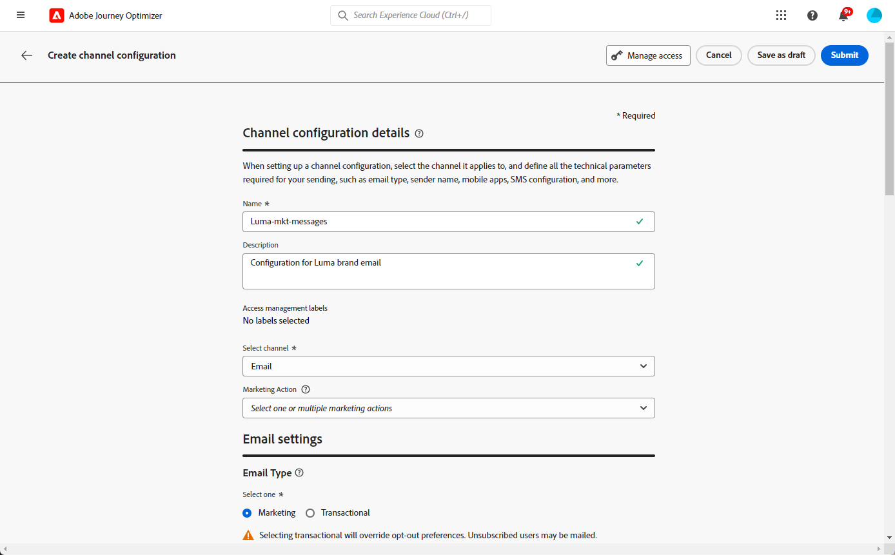

# Configurar superfícies do canal {#set-up-channel-surfaces}

Com [!DNL Journey Optimizer], é possível configurar superfícies do canal (ou seja, predefinições de mensagem) que definem todos os parâmetros técnicos necessários para suas mensagens: tipo de email, email e nome do remetente, aplicativos móveis, configuração de SMS e muito mais.

>[!CAUTION]
>
> * Para criar, editar e excluir superfícies de canais, você deve ter a variável [Gerenciar a superfície do canal](../administration/high-low-permissions.md#manage-channel-surface) permissão.
>
> * Você deve executar o [Configuração de email](#configure-email-settings), [Configuração por push](../configuration/push-configuration.md) e [Configuração de SMS](../configuration/sms-configuration.md) etapas antes de criar superfícies de canal.

Depois que as superfícies do canal forem configuradas, você poderá selecioná-las ao criar mensagens de uma jornada.

<!--
➡️ [Learn how to create and use email surfaces in this video](#video-presets)
-->

## Criar uma superfície de canal {#create-channel-surface}

>[!CONTEXTUALHELP]
>id="ajo_admin_message_presets_header"
>title="Configurações de superfície do canal"
>abstract="Ao configurar uma superfície de canal, selecione o canal ao qual ele se aplica e defina todos os parâmetros técnicos necessários para suas mensagens, como tipo de email, subdomínio, nome do remetente, aplicativos móveis, configuração de SMS e muito mais."

>[!CONTEXTUALHELP]
>id="ajo_admin_message_presets"
>title="Configurações de superfície do canal"
>abstract="Ao configurar uma superfície de canal, selecione o canal ao qual ele se aplica e defina todos os parâmetros técnicos necessários para suas mensagens, como tipo de email, nome do remetente, aplicativos móveis, configuração de SMS e muito mais."

<!--New contextual help content for September release: A channel surface defines all the technical parameters required for your messages (email type, sender name, mobile apps, SMS configuration, etc.): once configured, you will be able to select it when creating actions from a journey or a campaign. Note that you must have the Manage channel surface permission to create, edit and delete channel surfaces.

To create a channel surface, follow these steps:

1. Access the **[!UICONTROL Channels]** > **[!UICONTROL Branding]** > **[!UICONTROL Channel surfaces]** menu, then click **[!UICONTROL Create channel surface]**.

    

1. Enter a name and a description (optional) for the surface, then select the channel(s) to configure.

    

    >[!NOTE]
    >
    > Names must begin with a letter (A-Z). It can only contain alpha-numeric characters. You can also use underscore `_`, dot`.` and hyphen `-` characters. 

1. If you selected the **[!UICONTROL Email]** channel, configure your settings as described in [this section](email-settings.md).

    

1. For the **[!UICONTROL Push Notification]** channel, select at least one platform  -  **iOS** and/or **Android** -, and the mobile applications to use for each platform.

    
        
    >[!NOTE]
    >
    >For more on how to configure your environment to send push notifications, refer to [this section](push-gs.md).

1. For the **[!UICONTROL SMS]** channel, define your settings as detailed in [this section](sms-configuration.md#message-preset-sms).

    

    >[!NOTE]
    >
    >For more on how to configure your environment to send SMS messages, refer to [this section](sms-configuration.md).

1. Once all the parameters have been configured, click **[!UICONTROL Submit]** to confirm. You can also save the channel surface as draft and resume its configuration later on.

    

    >[!NOTE]
    >
    >You cannot proceed with surface creation while the selected IP pool is under [edition](ip-pools.md#edit-ip-pool) (**[!UICONTROL Processing]** status), and has never been associated with the selected subdomain. [Learn more](#subdomains-and-ip-pools)
    >
    >Save the surface as draft and wait until the IP pool has the **[!UICONTROL Success]** status to resume surface creation.
    
1. Once the channel surface has been created, it displays in the list with the **[!UICONTROL Processing]** status.

    During this step, several checks will be performed to verify that it has been configured properly. The processing time is around **48h-72h**, and can take up to **7-10 business days**.

    These checks include configuration and technical tests that are performed by the Adobe team:

    * SPF validation
    * DKIM validation
    * MX record validation
    * Check IPs denylisting
    * Helo host check
    * IP pool verification
    * A/PTR record, t/m/res subdomain verification

    >[!NOTE]
    >
    >If the checks are not successful, learn more on the possible failure reasons in [this section](#monitor-channel-surfaces).  

1. Once the checks are successful, the channel surface gets the **[!UICONTROL Active]** status. It is ready to be used to deliver messages.

    

## Monitor channel surfaces {#monitor-channel-surfaces}

All your channel surfaces display in the **[!UICONTROL Channels]** > **[!UICONTROL Channel surfaces]** menu. Filters are available to help you browse through the list (channel, user, status).

Once created, channel surfaces can have the following statuses:

* **[!UICONTROL Draft]**: The channel surface has been saved as a draft and has not been submitted yet. Open it to resume the configuration.
* **[!UICONTROL Processing]**: The channel surface has been submitted and is going through several verifications steps.
* **[!UICONTROL Active]**: The channel surface has been verified and can be selected to create messages.
* **[!UICONTROL Failed]**: One or several checks have failed during the channel surface verification.
* **[!UICONTROL Deactivated]**: The channel surface is deactivated. It cannot be used to create new messages.

In case a channel surface creation fails, the details on each possible failure reason are described below.

If one of these errors occurs, contact [Adobe Customer Care](https://helpx.adobe.com/enterprise/admin-guide.html/enterprise/using/support-for-experience-cloud.ug.html){target="_blank"} to get assistance.

* **SPF validation failed**: SPF (Sender Policy Framework) is an email authentication protocol that allows to specify authorized IPs that can send emails from a given subdomain. SPF validation failure means that the IP addresses in the SPF record do not match the IP addresses used for sending emails to the mailbox providers. 

* **DKIM validation failed**: DKIM (DomainKeys Identified Mail) allows the recipient server to verify that the received message was sent by the genuine sender of the associated domain and that the content of the original message was not altered on its way. DKIM validation failure means that the receiving mail servers are unable to verify the authenticity of the message content and its association with the sending domain.:

* **MX record validation failed**: MX (Mail eXchange) record validation failure means that the mail servers responsible for accepting inbound emails on behalf of a given subdomain are not correctly configured.

* **Deliverability configurations failed**: Deliverability configurations failure can happen due to any of the following reasons:
    * Blocklisting of the allocated IPs
    * Invalid `helo` name
    * Emails being sent from IPs other than the ones specified in the IP pool of the corresponding surface
    * Unable to deliver emails to inboxes of major ISPs like Gmail and Yahoo

## Edit a channel surface {#edit-channel-surface}

To edit a channel surface, follow the steps below.

>[!NOTE]
>
>You cannot edit the **[!UICONTROL Push notification settings]**. If a channel surface is only configured for the Push notification channel, it is not editable.

1. From the list, click a channel surface name to open it.

    

1. Edit its properties as desired.

    >[!NOTE]
    >
    >If a channel surface has the **[!UICONTROL Active]** status, the **[!UICONTROL Name]**, **[!UICONTROL Select channel]** and **[!UICONTROL Subdomain]** fields are greyed out and cannot be edited.

1. Click **[!UICONTROL Submit]** to confirm your changes.

    >[!NOTE]
    >
    >You can also save the channel surface as draft and resume update later on.

Once the changes are submitted, the channel surface will go through a validation cycle similar to the one in place when [creating a channel surface](#create-channel-surface). The edition processing time can take up to **3 hours**.

>[!NOTE]
>
>If you only edit the **[!UICONTROL Description]**, **[!UICONTROL Email type]** and/or **[!UICONTROL Email retry parameters]** fields, the update is instantaneous.

### Update details {#update-details}

For channel surfaces that have the **[!UICONTROL Active]** status, you can check the details of the update. To do so:

Click the **[!UICONTROL Recent update]** icon that is displayed next to the active surface name.

<!--You can also access the update details from an active channel surface while update is in progress.-->

No **[!UICONTROL Atualização recente]** você pode ver informações como o status da atualização e a lista de alterações solicitadas.

<!---->

### Atualizar status {#update-statuses}

Uma atualização da superfície do canal pode ter os seguintes status:

* **[!UICONTROL Processamento]**: A atualização da superfície do canal foi enviada e está passando por várias etapas de verificação.
* **[!UICONTROL Sucesso]**: A superfície de canal atualizada foi verificada e pode ser selecionada para criar mensagens.
* **[!UICONTROL Falha]**: Uma ou várias verificações falharam durante a verificação de atualização da superfície do canal.

Cada status é detalhado abaixo.

#### Processamento {#surface-processing}

Várias verificações de deliverability serão executadas para verificar se a superfície foi atualizada corretamente.

>[!NOTE]
>
>Se você só editar a variável **[!UICONTROL Descrição]**, **[!UICONTROL Tipo de email]** e/ou **[!UICONTROL Parâmetros de nova tentativa de email]** , a atualização é instantânea.

O tempo de processamento pode demorar até **3 horas**. Saiba mais sobre as verificações realizadas durante o ciclo de validação em [esta seção](#create-channel-surface).

Se você editar uma superfície que já estava ativa:

* O seu estatuto permanece **[!UICONTROL Ativo]** enquanto o processo de validação estiver em andamento.

* O **[!UICONTROL Atualização recente]** ícone é exibido ao lado do nome da superfície na lista de superfícies do canal.

* Durante o processo de validação, as mensagens configuradas usando essa superfície ainda usam a versão mais antiga da superfície.

>[!NOTE]
>
>Não é possível modificar uma superfície de canal enquanto a atualização estiver em curso. Ainda é possível clicar no nome, mas todos os campos estão esmaecidos. As alterações não serão refletidas até que a atualização seja bem-sucedida.

#### Sucesso {#success}

Depois que o processo de validação for bem-sucedido, a nova versão da superfície será automaticamente usada em todas as mensagens que usam essa superfície. No entanto, pode ser necessário aguardar:
* alguns minutos antes de ser consumido pelas mensagens unitárias,
* até ao lote seguinte para que a superfície seja eficaz em mensagens por lote.

#### Falha {#failed}

Se o processo de validação falhar, a versão mais antiga da superfície ainda será usada.

Saiba mais sobre os possíveis motivos de falha em [esta seção](#monitor-channel-surfaces).

Quando a atualização falhar, a superfície torna-se editável novamente. Você pode clicar no nome e atualizar as configurações que precisam ser corrigidas.

## Desativar uma superfície de canal {#deactivate-a-surface}

Para criar uma **[!UICONTROL Ativo]** superfície do canal indisponível para criar novas mensagens, você pode desativá-la. No entanto, as mensagens das jornadas que atualmente usam essa superfície não serão afetadas e continuarão funcionando.

>[!NOTE]
>
>Não é possível desativar uma superfície de canal durante o processamento de uma atualização. Aguarde até que a atualização seja bem-sucedida ou tenha falhado. Saiba mais sobre [superfícies de canal de edição](#edit-channel-surface) e no [status de atualização](#update-statuses).

1. Acesse a lista de superfícies do canal.

1. Na superfície ativa de sua escolha, clique no botão **[!UICONTROL Mais ações]** botão.

1. Selecionar **[!UICONTROL Desativar]**.

   

>[!NOTE]
>
>Não é possível excluir superfícies de canal desativadas para evitar problemas nas jornadas que usam essas superfícies para enviar mensagens.

Não é possível editar diretamente uma superfície de canal desativada. No entanto, você pode duplicá-lo e editar a cópia para criar uma nova versão que será usada para criar novas mensagens. Também é possível ativá-la novamente e aguardar até que a atualização seja bem-sucedida na edição.

<!--
## How-to video{#video-presets}

Learn how to create channel surfaces, how to use them and how to delegate a subdomain and create an IP pool.

>[!VIDEO](https://video.tv.adobe.com/v/334343?quality=12)
-->
