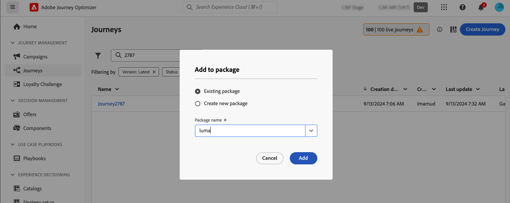

# Copiar objetos do Journey Optimizer para outra sandbox {#copy-to-sandbox}

As ferramentas de sandbox permitem copiar objetos como jornadas, modelos de conteúdo ou fragmentos em várias sandboxes aproveitando a exportação e a importação de pacotes. Um pacote pode consistir em um único objeto ou em vários objetos. Todos os objetos incluídos em um pacote precisam ser da mesma sandbox.

Esta página descreve o caso de uso de ferramentas de sandbox no contexto do Journey Optimizer. Para obter mais informações sobre o recurso propriamente dito, consulte a [documentação sobre o Experience Platform](https://experienceleague.adobe.com/docs/experience-platform/sandbox/ui/sandbox-tooling.html).

>[!NOTE]
>
>Este recurso requer as seguintes permissões do recurso **Administração de sandbox**: Gerenciar sandboxes (ou Exibir sandboxes) e Gerenciar pacotes. [Saiba mais](../administration/ootb-permissions.md)

O processo de cópia é realizado por meio de uma exportação e importação de pacotes entre as sandboxes de origem e de destino. Estas são as etapas gerais para copiar uma jornada de uma sandbox para outra:

1. Adicione o objeto a ser exportado como um pacote na sandbox de origem.
1. Exporte o pacote para a sandbox de destino.

Além disso, você pode aproveitar a **API REST do Serviço de Cópia de Objeto** da Journey Optimizer para gerenciar os objetos das sandboxes. [Saiba como trabalhar com a API REST do Serviço de Cópia de Objeto](https://developer.adobe.com/journey-optimizer-apis/references/sandbox/)

## Objetos exportados e práticas recomendadas {#objects}

O Journey Optimizer permite exportar jornadas, modelos de conteúdo e fragmentos para outra sandbox. As seções a seguir fornecem informações e práticas recomendadas para cada tipo de objeto.

### Práticas recomendadas gerais {#global}

* Ao copiar um objeto, todas as dependências (como fragmentos aninhados, públicos-alvo do jornada ou ações) são atualizadas corretamente no objeto principal, garantindo o mapeamento adequado na sandbox de destino.

* Se um objeto exportado contiver personalização de perfil, verifique se o esquema apropriado existe na sandbox de destino para evitar qualquer problema de personalização.

### Jornadas {#journeys}

* Ao exportar uma jornada, além da própria jornada, o Journey Optimizer também copia a maioria dos objetos dos quais a jornada depende: públicos, esquemas, eventos e ações. Para obter mais informações sobre objetos copiados, consulte esta [seção](https://experienceleague.adobe.com/docs/experience-platform/sandbox/ui/sandbox-tooling.html#abobe-journey-optimizer-objects).

* Não garantimos que todos os elementos vinculados sejam copiados para a sandbox de destino. É altamente recomendável executar uma verificação completa, por exemplo, antes de publicar uma jornada. Isso permite identificar qualquer objeto ausente em potencial.

* Os objetos copiados na sandbox de destino são exclusivos e não há risco de substituir elementos existentes. A jornada jornada e qualquer mensagem dentro dela é trazida no modo de rascunho. Isso permite executar uma validação completa antes da publicação na sandbox de destino.

* O processo de cópia copia apenas os metadados sobre a jornada e os objetos nessa Jornada. Nenhum dado de perfil ou conjunto de dados está sendo copiado como parte desse processo.

### Modelos de conteúdo {#content-templates}

* Ao exportar um template de conteúdo, todos os fragmentos aninhados também são copiados junto com ele.

* Às vezes, a exportação de modelos de conteúdo pode resultar na duplicação do fragmento. Por exemplo, se dois modelos compartilharem o mesmo fragmento e forem copiados em pacotes separados, ambos os modelos precisarão reutilizar o mesmo fragmento na sandbox de destino. Para evitar a duplicação, selecione a opção &quot;Use existing&quot; durante o processo de importação. [Saiba como importar um pacote](#import)

* Para evitar ainda mais a duplicação, é recomendável exportar modelos de conteúdo em um único pacote. Isso garante que o sistema gerencie a desduplicação com eficiência.

### Fragmentos {#fragments}

* Os fragmentos podem ter vários status, como Em tempo real, Rascunho e Em tempo real com rascunho em andamento. Ao exportar um fragmento, seu estado de rascunho mais recente é copiado para a sandbox de destino.

* Ao exportar um fragmento, todos os fragmentos aninhados também são copiados junto com ele.

## Adicionar objetos como um pacote{#export}

Para copiar objetos para outra sandbox, primeiro é necessário adicioná-los como um pacote na sandbox de origem. Siga estas etapas:

1. Navegue até o inventário onde o primeiro objeto que deseja copiar está armazenado, como a lista jornadas. Clique no ícone **Mais ações** (os três pontos ao lado do nome do objeto) e clique em **Adicionar ao pacote**.

   

1. Na janela **Adicionar ao pacote**, escolha se deseja adicionar o objeto a um pacote existente ou criar um novo pacote:

   

   * **Pacote existente**: selecione o pacote no menu suspenso.
   * **Criar um novo pacote**: digite o nome do pacote. Você também pode adicionar uma descrição.

1. Repita essas etapas para adicionar todos os objetos que você deseja exportar com seu pacote.

>[!NOTE]
>
>Para exportação de jornadas, além da própria jornada, o Journey Optimizer também copia a maioria dos objetos dos quais a jornada depende: públicos, esquemas, eventos e ações. Para obter mais detalhes sobre a exportação do jornada, consulte [esta seção](../building-journeys/copy-to-sandbox.md).

## Publish do pacote a ser exportado {#publish}

Quando o pacote estiver pronto para ser exportado, siga estas etapas para publicá-lo:

1. Navegue até o menu **[!UICONTROL Administração]** > **[!UICONTROL Sandboxes]**, selecione a guia **Pacotes**.

1. Abra o pacote que deseja exportar, selecione os objetos que deseja exportar e clique em **Publish**.

   Neste exemplo, queremos exportar uma jornada, um template de conteúdo e um fragmento.

   

1. Para acompanhar o status da publicação do pacote na guia **[!UICONTROL Trabalhos]**. Para obter mais detalhes sobre um trabalho, selecione-o na lista e clique no botão **[!UICONTROL Exibir detalhes da importação]**.

   

## Importar o pacote na sandbox de destino {#import}

Depois que o pacote for publicado, é necessário importá-lo para a sandbox de destino. Siga estas etapas:

1. Navegue até o menu **[!UICONTROL Sandboxes]** e selecione a guia **[!UICONTROL Procurar]**.

1. Procure a sandbox em que deseja importar o pacote e clique no ícone + ao lado do nome.

   

   >[!NOTE]
   >
   >Somente as sandboxes da sua organização estão disponíveis.

1. No campo **Sandbox de destino**, verifique se as sandboxes de destino corretas estão selecionadas e selecione o pacote a ser importado na lista suspensa **[!UICONTROL Nome do pacote]**. Clique em **Next**.

   

1. Revise os objetos e as dependências do pacote. Esta é a lista de objetos que foram adicionados ao pacote, juntamente com outros objetos dos quais as jornadas dependem, como públicos, esquemas, eventos ou ações.

   Para cada objeto, você pode optar por criar um novo ou usar um existente na sandbox de destino. Isso permite, por exemplo, evitar a duplicação de fragmentos que pode ocorrer ao importar modelos de conteúdo usando fragmentos comuns.

   

1. Clique no botão **Concluir**, no canto superior direito, para começar a copiar o pacote para a sandbox de destino. O processo de cópia varia de acordo com a complexidade dos objetos e com quantos objetos precisam ser copiados.

1. Clique no trabalho de importação para revisar o resultado da cópia:

   * Clique no botão **Exibir objetos importados** para exibir cada objeto individual copiado.
   * Clique no botão **Exibir detalhes da importação** para verificar os resultados da importação para cada objeto.

   

1. Acesse sua sandbox de destino e execute uma verificação completa de todos os objetos copiados.
