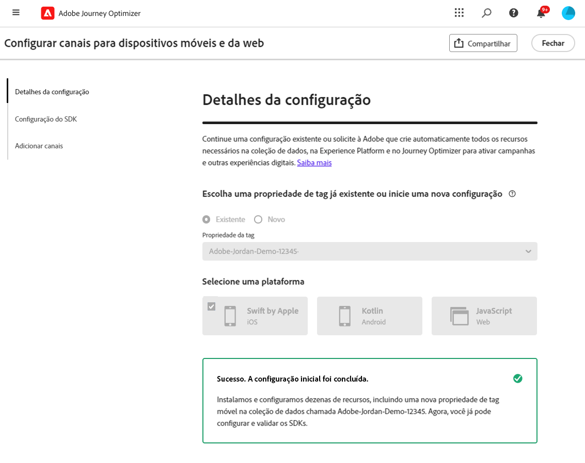
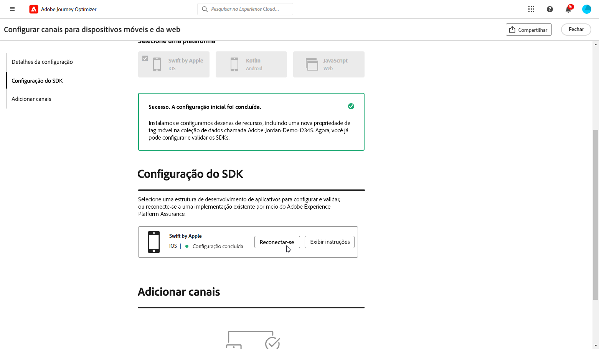
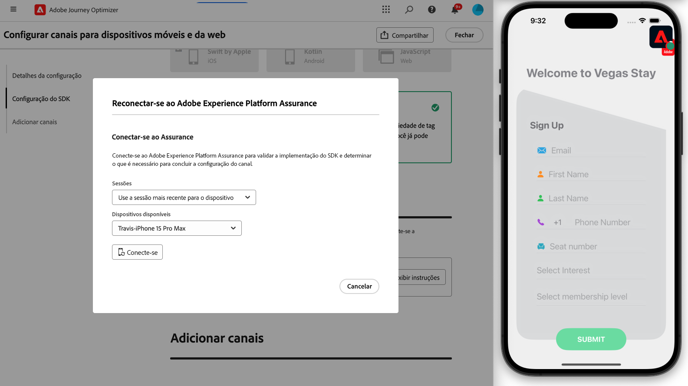

# Criar uma configuração de canal {#set-mobile-ios}

>[!CONTEXTUALHELP]
>id="ajo_mobile_web_setup_javascript_code"
>title="Código Javascript"
>abstract="A tag head contém metadados e recursos essenciais que são carregados antes do conteúdo principal da sua página da Web. Colocar o código nesta seção garante que ele seja inicializado e executado corretamente antecipadamente, permitindo que sua página da Web seja carregada e funcione com eficiência. Ao adicionar código à seção de cabeçalho, você ajuda a aprimorar a estrutura, o desempenho e a experiência geral do usuário do site."

>[!CONTEXTUALHELP]
>id="ajo_mobile_web_setup_push_token"
>title="Recuperar o token do dispositivo"
>abstract="Para garantir que o token de push do dispositivo seja sincronizado corretamente com o perfil do Adobe Experience Platform, é necessário incorporar o código a seguir no aplicativo. Essa integração é essencial para manter recursos de comunicação atualizados e garantir uma experiência perfeita para o usuário."

>[!CONTEXTUALHELP]
>id="ajo_mobile_web_setup_push_xcode"
>title="Iniciar o aplicativo a partir do Xcode"
>abstract="Para obter o token de push, primeiro inicie o aplicativo usando o Xcode. Depois que o aplicativo for iniciado, reinicie-o para garantir que o processo de validação seja concluído. O Adobe fornecerá seu token de push como parte dos resultados da validação. Esse token é essencial para ativar as notificações por push e será exibido assim que a configuração for validada com êxito."

>[!CONTEXTUALHELP]
>id="ajo_mobile_web_push_certificate_fcm"
>title="Fornecer um certificado de push"
>abstract="Arraste e solte seu arquivo de chave privada .json. Esse arquivo contém informações de autenticação necessárias para uma integração segura e comunicação entre o aplicativo e o servidor."

>[!CONTEXTUALHELP]
>id="ajo_mobile_web_setup_push_certificate"
>title="Fornecer um certificado de push"
>abstract="O arquivo de chave .p8 contém uma chave privada usada para autenticar seu aplicativo nos servidores da Apple para notificações por push seguras. Você pode adquirir essa chave na página Certificados, Identificadores e Perfis em sua conta de desenvolvedor."

>[!CONTEXTUALHELP]
>id="ajo_mobile_web_setup_push_key_id"
>title="ID da chave"
>abstract="A ID da chave, uma cadeia de 10 caracteres atribuída durante a criação da chave de autenticação p8, pode ser encontrada na guia **Chaves** da página Certificados, Identificadores e Perfis da sua conta de desenvolvedor."

>[!CONTEXTUALHELP]
>id="ajo_mobile_web_setup_push_team_id"
>title="ID da equipe"
>abstract="A ID da equipe, um valor de sequência de caracteres usado para identificar sua equipe, pode estar localizada na guia **Associação** da sua conta de desenvolvedor."

Essa configuração simplifica a configuração rápida de canais de marketing, disponibilizando prontamente todos os recursos essenciais nos aplicativos Experience Platform, Journey Optimizer e Coleção de dados. Isso permite que sua equipe de marketing comece rapidamente a criar campanhas e jornadas.

1. Na página inicial do Journey Optimizer, clique em **[!UICONTROL Iniciar]** no cartão **[!UICONTROL Configurar canais móveis e da Web]**.

   

1. Criar uma **[!UICONTROL Nova]** configuração.

   Se você já tiver configurações existentes, poderá optar por selecionar uma ou criar uma nova configuração.

   

1. Insira um **[!UICONTROL Nome]** para sua nova configuração e selecione ou crie sua **[!UICONTROL Sequência de Dados]**. Este **[!UICONTROL Nome]** será usado para todos os recursos criados automaticamente.

1. Se sua organização tiver vários fluxos de dados, selecione um entre as opções existentes. Se você não tiver uma sequência de dados, uma será criada automaticamente para você.

1. Selecione sua plataforma e clique em **[!UICONTROL Criar recursos automaticamente]**.

1. Para simplificar o processo de configuração, os recursos necessários são criados automaticamente para ajudar você a começar. Isso inclui a criação de uma nova **[!UICONTROL Propriedade de Marca Móvel]** e a instalação de extensões.

[Saiba mais sobre os recursos gerados automaticamente](set-mobile-config.md#auto-create-resources)

1. Quando a geração de recursos estiver concluída, siga as instruções na interface do usuário para configurar e validar seus SDKs e canais.

1. Após concluir a configuração, compartilhe a **[!UICONTROL Configuração do canal]** gerada automaticamente com os membros da equipe responsáveis pela criação de Jornadas e Campanhas.

   {zoomable="yes"}

1. Agora você pode fazer referência à **[!UICONTROL Configuração de canal]** na interface Campanhas ou Jornada, permitindo uma conexão perfeita entre a sua configuração e a execução de jornadas e campanhas direcionadas para o seu público-alvo.

## Modificar uma configuração móvel existente {#reconnect}

Depois de criar sua configuração, você pode facilmente revisitá-la a qualquer momento para adicionar mais canais ou fazer mais ajustes para atender às suas necessidades

1. Na página inicial do Journey Optimizer, clique em **[!UICONTROL Iniciar]** no cartão **[!UICONTROL Configurar canais móveis e da Web]**.

   

1. Selecione **[!UICONTROL Existente]** e escolha sua **[!UICONTROL propriedade de Marca]** existente no menu suspenso.

   

1. Ao acessar sua configuração existente, é necessário reconectar-se com o Adobe Assurance. No menu de Instalação do SDK, clique em **[!UICONTROL Reconectar]**.

   

1. Selecione seu dispositivo no menu suspenso **[!UICONTROL Dispositivos disponíveis]** e clique em **[!UICONTROL Conectar]**.

   {zoomable="yes"}

1. Agora você pode atualizar sua configuração conforme necessário.

