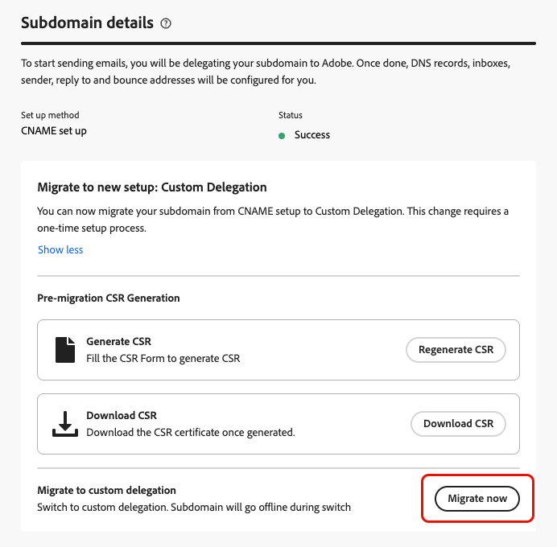

# Migrar um subdomínio de email de CNAME para delegação personalizada {#migrate-cname-to-custom}

>[!AVAILABILITY]
>
>Este recurso é oferecido com disponibilidade limitada. Entre em contato com o representante da Adobe para obter acesso.

Se o subdomínio estiver configurado atualmente com [CNAMEs](about-subdomain-delegation.md#cname-subdomain-setup), você poderá migrá-lo para o método de **[!UICONTROL Delegação personalizada]** para atender às políticas de segurança da sua empresa. Isso dá a você total propriedade e controle sobre seus subdomínios e certificados no [!DNL Journey Optimizer]. [Saiba mais sobre subdomínios personalizados](delegate-custom-subdomain.md)

Como parte desse processo, é necessário:

* [Excluir os registros DNS existentes](#delete-dns) da solução de hospedagem
* [Carregar o certificado SSL](#upload-ssl-certificate) obtido da Autoridade de Certificação
* Conclua as [etapas do Loop de Comentários](#feedback-loop) verificando a propriedade do domínio e o endereço de email do relatório
* [Criar um novo conjunto de registros DNS](#create-dns-records) gerados pela Adobe na sua plataforma de hospedagem

Para migrar o subdomínio, siga as etapas abaixo.

## Antes de começar {#before-you-begin}

Antes de iniciar o processo de migração, reveja as informações importantes abaixo.

>[!IMPORTANT]
>
>Você só pode migrar um subdomínio configurado com o [método CNAME](delegate-subdomain.md#cname-subdomain-setup).

* Verifique se o **método de delegação personalizado está habilitado** para sua organização (esse recurso está atualmente com a Disponibilidade limitada; entre em contato com seu representante da Adobe para obter acesso). [Saiba mais](delegate-custom-subdomain.md)
* Verifique se nenhuma configuração de canal ativa está usando esse subdomínio. O processo de migração interromperá sua funcionalidade.

  >[!NOTE]
  >
  >Se você desativar uma configuração de canal antes de iniciar a migração, poderá alterá-la de volta para o estado ativo após a conclusão do fluxo de trabalho de migração.

* Verifique se nenhuma campanha ou jornada ativa está usando uma configuração de canal vinculada a esse subdomínio, pois isso pode causar interrupção no delivery.
* Esteja ciente de que o tempo de inatividade começa assim que você entra no fluxo de migração. O subdomínio é movido para **[!UICONTROL Rascunho]** durante o processo e só estará disponível após a conclusão da instalação.
* Consequentemente, é recomendável **executar as etapas de pré-migração antes de iniciar o processo de migração**, para que seu certificado SSL esteja pronto e reduzir o tempo de inatividade. [Saiba mais](#start-migration)

## Iniciar a migração {#start-migration}

Siga as etapas abaixo para começar a migrar um determinado subdomínio.

1. Vá para **[!UICONTROL Administração]** > **[!UICONTROL Canais]** > **[!UICONTROL Configurações de email]** > **[!UICONTROL Subdomínios]**.

1. Selecione um subdomínio configurado com CNAMEs e abra-o.

1. Você pode usar a seção **[!UICONTROL Geração de CSR pré-migração]** para gerar a CSR para enviá-la à Autoridade de certificação e ter o certificado SSL pronto quando o processo de migração começar. [Saiba como](#send-csr-to-ca)

   >[!IMPORTANT]
   >
   >As etapas de pré-migração são opcionais nesta fase, mas altamente recomendadas. Concluí-los **antes** de iniciar a migração reduz o tempo de inatividade e ajuda a garantir uma transição suave.

   {width="70%"}

1. Selecione **[!UICONTROL Migrar agora]** na seção dedicada.

   <!--{width=90%}-->

1. Revise as [informações exibidas](#before-you-begin).

   >[!WARNING]
   >
   >O tempo de inatividade começa assim que você entra no fluxo de migração, portanto, certifique-se de que ele não afete suas campanhas e jornadas ativas.

1. Clique em **[!UICONTROL Sim]**. O subdomínio muda para o status **[!UICONTROL Rascunho]** e fica indisponível até que a configuração seja concluída.

## Gerar e enviar a CSR à autoridade de certificação {#send-csr-to-ca}

Para concluir a migração, você precisa de um certificado SSL emitido por uma CA (Autoridade de Certificação). Para receber esse certificado SSL, você deve primeiro gerar uma Solicitação de assinatura de certificado (CSR) e enviá-la à CA.

Se você já iniciou o processo de migração ou não, siga as etapas abaixo para gerar e enviar sua nova CSR.

1. Clique em **[!UICONTROL Regenerar CSR]**.

1. Preencha o formulário que exibe e gera novamente a Solicitação de assinatura de certificado (CSR).

   {width="60%"}

   >[!NOTE]
   >
   >O comprimento da chave pode ser somente 2048 ou 4096 bits. Ele não pode ser alterado após o envio do subdomínio.

1. Clique em **[!UICONTROL Baixar CSR]** e salve o formulário no computador local.

1. Envie-o à Autoridade de certificação (CA) para obter seu certificado SSL. Antes de enviar essa CSR à sua CA para assinatura, há alguns pontos importantes a serem considerados:

   * A CSR baixada da etapa 3 é somente para data.subdomain.com.

   * No entanto, o certificado deve abranger as entradas data.subdomain.com e cdn.subdomain.com como Nomes alternativos da entidade (SAN) em um único certificado. Por exemplo, se você estiver delegando example.adobe.com, data.subdomain.com corresponde a data.example.adobe.com, e cdn.subdomain.com corresponde a cdn.example.adobe.com.

   * Os subdomínios Data (data.example.adobe.com) e CDN (cdn.example.adobe.com) precisam ser adicionados como entradas pares no mesmo certificado. Nenhum subdomínio adicional deve ser adicionado a esse certificado.

   * A maioria das CAs permite adicionar outras SANs (como o subdomínio CDN) durante o processo de assinatura

      * Por meio do portal da CA (recomendado, se disponível) ou
      * Solicitando-o manualmente com a equipe de suporte caso a opção de portal não esteja disponível.

   * Depois de assinada, a CA emitirá um único certificado que abrangerá o domínio de dados e o subdomínio CDN.

## Excluir registros DNS existentes {#delete-dns}

Após iniciar o processo de migração, é necessário excluir os registros DNS existentes da solução de hospedagem. Siga as etapas abaixo.

1. A lista de registros configurados atualmente nos servidores DNS é exibida.

1. Navegue até a solução de hospedagem de domínio e exclua as entradas CNAME existentes da hospedagem de DNS.

1. Verifique se todos os registros DNS foram excluídos. Depois de concluído, marque a caixa &quot;Confirmo que excluí os registros necessários do site de hospedagem&quot;.

   {width="75%"}

## Carregar o certificado SSL {#upload-ssl-certificate}

Na seção **[!UICONTROL Certificado SSL]**, você precisa carregar um novo certificado SSL para [!DNL Journey Optimizer].

Antes disso, verifique o seguinte:

* Se você já tiver enviado sua CSR para a Autoridade de certificação como parte das [etapas de pré-migração](#start-migration), verifique se recebeu seu certificado SSL.

* Se ainda não tiver feito isso, siga as etapas para [gerar, baixar e enviar a CSR](#send-csr-to-ca).

<!--
    * Click **[!UICONTROL Regenerate CSR]** and fill the form to generate the Certificate Signing Request.

    * Click **[!UICONTROL Download CSR]** to save the form to your local computer.

    * Send the CSR to the Certificate Authority to get your SSL certificate.-->

1. Depois de recuperar o certificado SSL, clique em **[!UICONTROL Carregar certificado]**.

   {width="75%"}

1. Carregue o certificado SSL para [!DNL Journey Optimizer] no formato .pem com a cadeia completa de certificados. Este é um exemplo de formato de arquivo .pem:

   ```
   -----BEGIN CERTIFICATE-----
   MIIDXTCCAkWgAwIBAgIJALc3... (base64 encoded data)
   -----END CERTIFICATE-----
   ```

1. Marque a caixa &quot;Confirmo que carreguei o certificado SSL&quot;.

## Loop de comentários completo {#feedback-loop}

Em seguida, conclua as etapas do loop de comentários para verificar a propriedade do domínio e o endereço de email do relatório.

{width="75%"}

O processo é o mesmo que ao configurar um novo subdomínio personalizado. Siga as etapas detalhadas na página [Configurar um subdomínio personalizado](delegate-custom-subdomain.md#feedback-loop-steps).


## Criar um novo conjunto de registros DNS {#create-dns-records}

Para concluir o processo de migração, crie um novo conjunto de registros DNS gerados pelo Adobe na sua plataforma de hospedagem.

1. Depois de concluir as etapas do loop de comentários, clique no botão **[!UICONTROL Continuar]**, na parte superior direita da tela.

   Esta etapa verifica se os registros anteriores foram excluídos e se o certificado SSL foi carregado corretamente. Se ocorrer algum erro, consulte a [lista de verificação de solução de problemas](#troubleshooting).

1. Se todas as validações forem bem-sucedidas, a seção **[!UICONTROL Registros a serem criados]** será exibida.

   {width="75%"}

1. Crie todos os registros necessários na sua plataforma de hospedagem.

1. Depois que todos os registros forem criados, clique em **[!UICONTROL Enviar]**.

   >[!NOTE]
   >
   >Se todos os registros listados não forem criados, um erro será exibido. Crie todos os registros necessários.

Após o envio, você deve aguardar até que o Adobe execute as verificações necessárias, que podem levar até 3 horas. [Saiba mais](delegate-subdomain.md#submit-subdomain)

Quando o subdomínio estiver ativo novamente, nenhuma alteração será necessária nas configurações de canal existentes que o usam, elas continuarão funcionando como antes.

## Lista de verificação de solução de problemas {#troubleshooting}

Se ocorrerem erros ao tentar enviar o subdomínio personalizado, execute as ações de solução de problemas listadas abaixo.

* Não foi possível validar o recurso _. O DNS ainda existe e precisa ser excluído._ — Exclua todos os registros da solução de hospedagem. [Saiba como](#delete-dns)
* Não foi possível validar o recurso _. Carregue seu certificado SSL e tente novamente._ — O certificado SSL não foi carregado. Certifique-se de carregá-lo. [Saiba como](#upload-ssl-certificate)
* _O certificado contém domínios inesperados em seus Nomes Alternativos da Entidade (SAN)._ — Certifique-se de carregar o certificado SSL correto. [Saiba como](#upload-ssl-certificate)
* _O certificado não tem os seguintes domínios necessários em sua SAN (Nomes Alternativos da Entidade)._ — Certifique-se de carregar o certificado SSL correto. [Saiba como](#upload-ssl-certificate)

**Consulte também**

* [Configurar um subdomínio personalizado](delegate-custom-subdomain.md)
* [Métodos de delegação de subdomínio](about-subdomain-delegation.md#subdomain-delegation-methods)
