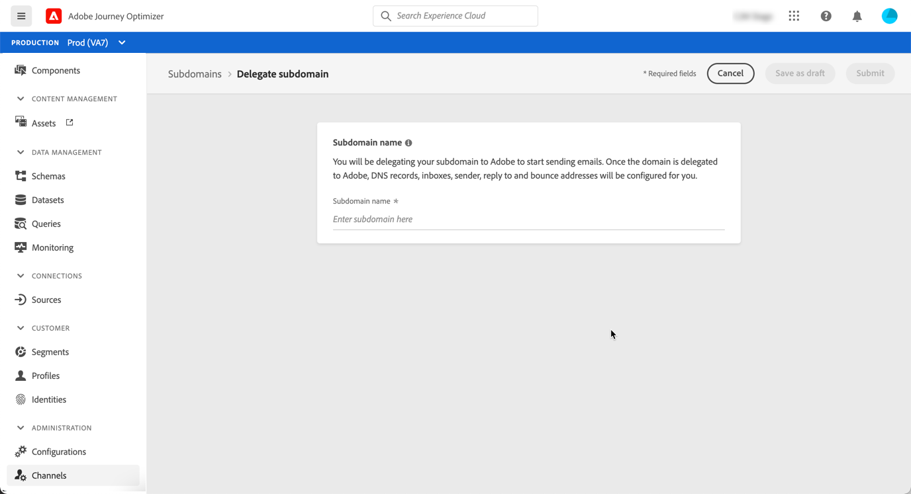

# Delegar um subdomínio

A delegação de nome de domínio é um método que permite ao proprietário de um nome de domínio (tecnicamente: uma zona DNS) para delegar uma subdivisão dessa zona (tecnicamente: uma zona DNS sob ela, que pode ser chamada de subzona) para outra entidade. Basicamente, como cliente, se estiver lidando com a zona &quot;example.com&quot;, você pode delegar a subzona &quot;marketing.example.com&quot; ao Adobe.

Delegando um subdomínio para uso com [!DNL Journey Optimizer], os clientes podem confiar no Adobe para manter a infraestrutura de DNS necessária para atender aos requisitos de deliverability padrão do setor para seus domínios de envio de marketing por email, além de manter e controlar o DNS para seus domínios internos de email.

[!DNL Journey Optimizer] O permite delegar totalmente seus subdomínios ao Adobe diretamente da interface do produto. Ao fazer isso, o Adobe poderá enviar mensagens como um serviço gerenciado controlando e mantendo todos os aspectos do DNS necessários para fornecer, renderizar e rastrear campanhas de email.

>[!NOTE]
>
>Por padrão, [!DNL Journey Optimizer] o contrato de licença permite delegar até 10 subdomínios. Entre em contato com o Adobe se quiser aumentar essa limitação.
>
>No momento, o uso de CNAMEs para delegação de subdomínio não é compatível com o Journey Optimizer.

Para delegar um novo subdomínio, siga as etapas abaixo:

1. Acesse o **[!UICONTROL Channels]** / **[!UICONTROL Subdomains]** , em seguida, clique em **[!UICONTROL Delegate subdomain]**.

   

1. Especifique o nome do subdomínio que será delegado.

   

   >[!CAUTION]
   >
   >Não é permitido delegar um subdomínio inválido para Adobe. Certifique-se de inserir um subdomínio válido que seja de propriedade de sua organização, como marketing.suaempresa.com.
   >
   >Observe que subdomínios de vários níveis, como email.marketing.suaempresa.com, não são suportados no momento.

1. A lista de registros que serão colocados em seus servidores DNS é exibida. Copie esses registros, um por um ou baixando um arquivo CSV, e navegue até a solução de hospedagem de domínio para gerar os registros DNS correspondentes.

1. Verifique se todos os registros DNS foram gerados na solução de hospedagem de domínio. Se tudo estiver configurado corretamente, marque a caixa &quot;I confirm...&quot; e clique em **[!UICONTROL Submit]**.

   

   >[!NOTE]
   >
   >Você pode criar os registros e enviar a configuração de subdomínio posteriormente usando o **[!UICONTROL Save as draft]** botão. Você poderá retomar a delegação do subdomínio abrindo-a a partir da lista de subdomínios.

1. Depois que a delegação de subdomínio for enviada, o subdomínio será exibido na lista com a variável **[!UICONTROL Processing]** status. Para obter mais informações sobre os status dos subdomínios, consulte [esta seção](access-subdomains.md).

   

   Antes de poder usar esse subdomínio para enviar mensagens, é necessário aguardar até que o Adobe execute as verificações necessárias, que podem levar até 3 horas. Saiba mais [nesta seção](#subdomain-validation).

1. Depois que as verificações são bem-sucedidas, o subdomínio recebe o **[!UICONTROL Success]** status. Ele está pronto para ser usado para entregar mensagens.

   <!-- later on, users will be notified in Pulse -->

   

## Validação de subdomínio {#subdomain-validation}

As verificações e ações abaixo serão executadas até que o subdomínio seja verificado e possa ser usado para enviar mensagens.

>[!NOTE]
>
>Essas etapas são executadas por Adobe e podem levar até 3 horas.

1. **Pré-validação**: O Adobe verifica se o subdomínio foi delegado ao Adobe DNS (registro NS, registro SOA, configuração de zona, registro de propriedade). Se a etapa de pré-validação falhar, um erro será retornado junto com o motivo correspondente; caso contrário, o Adobe continuará para a próxima etapa.

1. **Configurar DNS para o domínio**:

   * **Registro MX**: Registro de eXchange de email - Registro do servidor de email que processa emails de entrada enviados ao subdomínio.
   * **Registro SPF**: Registro da Estrutura de Política do Remetente - Lista os IPs dos servidores de email que podem enviar emails do subdomínio.
   * **Registro DKIM**: DomainKeys Identified Mail standard record - Usa a criptografia de chave pública-privada para autenticar a mensagem e evitar falsificação.
   * **A**: Mapeamento IP padrão.

1. **Criar URLs de rastreamento e espelho**: se o domínio for email.example.com, o domínio tracking/mirror será data.email.example.com. Ele é protegido pela instalação do certificado SSL.

1. **Provisionamento do CDN CloudFront**: se o CDN ainda não estiver configurado, o Adobe o provisões para a gravação.

1. **Criar domínio CDN**: se o domínio for email.example.com, o domínio CDN será cdn.email.example.com.

1. **Criar e anexar um certificado SSL CDN**: O Adobe cria o certificado CDN para o domínio CDN e anexa o certificado ao domínio CDN.

1. **Criar DNS de encaminhamento**: se esse for o primeiro subdomínio que você está delegando, o Adobe criará o DNS de encaminhamento necessário para criar registros PTR - um para cada um dos IPs.

1. **Criar registro PTR**: O registro PTR, também conhecido como registro de DNS reverso, é exigido pelos ISPs para que eles não marquem os emails como spam. O Gmail também recomenda ter registros PTR para cada IP. O Adobe cria registros PTR somente quando você delega o primeiro subdomínio, um para cada IP, todos os IPs apontando para o primeiro subdomínio. Por exemplo, se o IP for *192.1.2.1* e o subdomínio é *email.example.com*, o registro PTR será: *192.1.2.1 PTR r1.email.example.com*. Você pode atualizar o registro PTR posteriormente para apontar para o novo domínio delegado.
