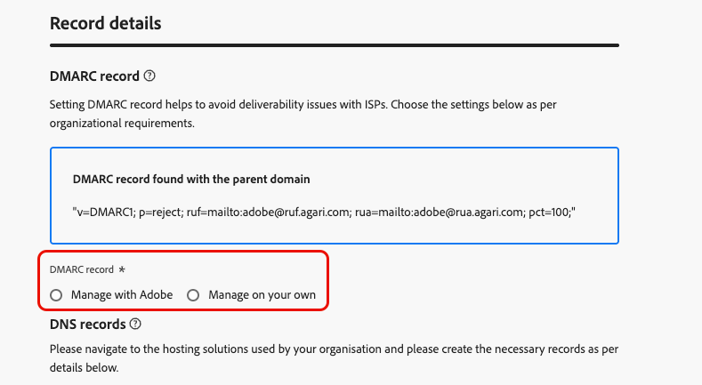

# Delegar um subdomínio {#delegate-subdomain}

>[!CONTEXTUALHELP]
>id="ajo_admin_subdomainname"
>title="Delegação de subdomínios"
>abstract="O Journey Optimizer permite delegar os subdomínios à Adobe. Você pode delegar totalmente um subdomínio à Adobe, que é o método recomendado. Você também pode criar um subdomínio usando CNAMEs para apontar para registros específicos da Adobe, mas esse método exige que você mantenha e gerencie registros DNS por conta própria."
>additional-url="https://experienceleague.adobe.com/pt-br/docs/journey-optimizer/using/configuration/delegate-subdomains/about-subdomain-delegation#subdomain-delegation-methods" text="Métodos de configuração de subdomínio"

>[!CONTEXTUALHELP]
>id="ajo_admin_subdomainname_header"
>title="Delegação de subdomínios"
>abstract="Para começar a enviar emails, você deve delegar seu subdomínio à Adobe. Após a delegação, serão configurados registros DNS, caixas de entrada, remetente e endereços de resposta e rejeição para você."

## Introdução a subdomínios de email {#gs-delegate-subdomain}

A delegação de nome de domínio é um método que permite ao proprietário de um nome de domínio (tecnicamente: uma zona DNS) delegar uma subdivisão dele (tecnicamente: uma zona DNS sob ele, que pode ser chamada de subzona) para outra entidade. Basicamente, como cliente, se estiver lidando com a zona &quot;example.com&quot;, você pode delegar a subzona &quot;marketing.example.com&quot; ao Adobe. Saiba mais sobre [delegação de subdomínio](about-subdomain-delegation.md)

Por padrão, o [!DNL Journey Optimizer] permite delegar **até 10 subdomínios**. No entanto, dependendo do contrato de licença, talvez você possa delegar até 100 subdomínios. Fale com seu contato na Adobe para saber mais sobre o número de subdomínios aos quais você tem direito.

Você pode delegar totalmente um subdomínio ou criar um subdomínio usando CNAMEs para apontar para registros específicos do Adobe.

A delegação completa de subdomínio é o método recomendado. Saiba mais sobre as diferenças entre os [métodos de configuração de subdomínio](about-subdomain-delegation.md#subdomain-delegation-methods).

A configuração de subdomínio é **comum a todos os ambientes**. Portanto, qualquer modificação em um subdomínio também afeta as sandboxes de produção.

>[!CAUTION]
>
>O envio paralelo de subdomínios não tem suporte em [!DNL Journey Optimizer]. Se você tentar enviar um subdomínio para delegação quando outro estiver com o status **[!UICONTROL Processando]**, receberá uma mensagem de erro.

## Delegar totalmente um subdomínio à Adobe {#full-subdomain-delegation}

>[!CONTEXTUALHELP]
>id="ajo_admin_subdomain_dns"
>title="Gerar os registros DNS correspondentes"
>abstract="Para delegar totalmente um novo subdomínio à Adobe, é necessário copiar e colar as informações do servidor de nomes da Adobe exibidas na interface do Journey Optimizer na solução de hospedagem de domínio para gerar os registros DNS correspondentes. Para delegar um subdomínio usando CNAMEs, também é necessário copiar e colar o registro de validação SSL do URL do CDN. Depois que as verificações forem bem-sucedidas, o subdomínio estará pronto para ser usado para entregar mensagens."
>additional-url="https://experienceleague.adobe.com/pt-br/docs/journey-optimizer/using/configuration/delegate-subdomains/delegate-subdomain#cname-subdomain-delegation" text="Delegação de subdomínio CNAME"

O [!DNL Journey Optimizer] permite delegar totalmente os subdomínios à Adobe diretamente da interface do produto. Ao fazer isso, o Adobe poderá enviar mensagens como um serviço gerenciado, controlando e mantendo todos os aspectos do DNS necessários para fornecer, renderizar e rastrear campanhas de email.

Você pode confiar no Adobe para manter a infraestrutura de DNS necessária para atender aos requisitos de capacidade de entrega padrão do setor para seus domínios de envio de marketing por email, enquanto continua mantendo e controlando DNS para seus domínios de email internos.

Para delegar totalmente um novo subdomínio ao Adobe, siga as etapas abaixo:

1. Acesse o menu **[!UICONTROL Administração]** > **[!UICONTROL Canais]** > **[!UICONTROL Configurações de email]** > **[!UICONTROL Subdomínios]** e clique em **[!UICONTROL Configurar subdomínio]**.

   

1. Selecione **[!UICONTROL Totalmente delegado]** na seção **[!UICONTROL Configurar método]**.

   

1. Especifique o nome do subdomínio que será delegado.

   

   >[!CAUTION]
   >
   >Não é permitido delegar um subdomínio inválido à Adobe. Insira um subdomínio válido de propriedade de sua organização, como marketing.yourcompany.com.

   <!--Capital letters are not allowed in subdomains. TBC by PM-->

1. A lista de registros que serão colocados em seus servidores DNS é exibida. Copie esses registros, um por um ou baixando um arquivo CSV, e navegue até a solução de hospedagem de domínio para gerar os registros DNS correspondentes.

1. Verifique se todos os registros DNS foram gerados em sua solução de hospedagem de domínio. Se tudo estiver configurado corretamente, marque a caixa &quot;Confirmo...&quot;.

   

1. Configurar registro do DMARC. Se o subdomínio tiver um registro DMARC existente e for buscado por [!DNL Journey Optimizer], você poderá usar os mesmos valores ou alterá-los conforme necessário. Se você não adicionar nenhum valor, os valores padrão serão usados. [Saiba mais](dmarc-record.md)

   

1. Clique em **[!UICONTROL Enviar]**.

   Você pode criar os registros e enviar a configuração de subdomínio posteriormente usando o botão **[!UICONTROL Salvar como rascunho]**. Você poderá retomar a delegação de subdomínio abrindo-a na lista de subdomínios.

1. O subdomínio é exibido na lista com o status **[!UICONTROL Processando]**. Para obter mais informações sobre os status dos subdomínios, consulte [esta seção](about-subdomain-delegation.md#access-delegated-subdomains).

   

   Antes de poder usar esse subdomínio para enviar mensagens, você deve aguardar até que o Adobe execute as verificações necessárias, que podem levar até 3 horas. Saiba mais [nesta seção](#subdomain-validation).

   >[!NOTE]
   >
   >Todos os registros ausentes, ou seja, os registros ainda não criados em sua solução de hospedagem, serão listados.

1. Depois que as verificações forem bem-sucedidas, o subdomínio obterá o status **[!UICONTROL Success]**. Ele está pronto para ser usado para enviar mensagens.

   O subdomínio será marcado como **[!UICONTROL Falha]** se você não criar o registro de validação na solução de hospedagem.

Depois que um subdomínio é delegado à Adobe em [!DNL Journey Optimizer], um registro PTR é automaticamente criado e associado a esse subdomínio. [Saiba mais](ptr-records.md)

## Configurar um subdomínio com CNAMEs {#cname-subdomain-delegation}

>[!CONTEXTUALHELP]
>id="ajo_admin_subdomain_dns_cname"
>title="Gerar o DNS correspondente e os registros de validação"
>abstract="Para delegar um subdomínio usando CNAMEs, é necessário copiar e colar as informações do servidor de nomes da Adobe e o registro de validação do URL CDN do SSL exibido na interface do Journey Optimizer em sua plataforma de hospedagem. Depois que as verificações forem bem-sucedidas, o subdomínio estará pronto para ser usado para entregar mensagens."

>[!CONTEXTUALHELP]
>id="ajo_admin_subdomain_cdn_cname"
>title="Copiar o registro de validação"
>abstract="A Adobe gera um registro de validação. Você precisa criar o registro correspondente em sua plataforma de hospedagem para validação de URL de CDN."

Se você tiver políticas de restrição específicas de domínio e quiser que o Adobe tenha controle parcial sobre o DNS, poderá optar por realizar todas as atividades relacionadas ao DNS da sua parte.

A configuração do subdomínio CNAME permite criar um subdomínio e usar CNAMEs para apontar para registros específicos do Adobe. Com essa configuração, você e a Adobe compartilham a responsabilidade pela manutenção do DNS para configurar o ambiente para enviar, renderizar e rastrear emails.

>[!CAUTION]
>
>O método CNAME é recomendado se as políticas de sua organização restringirem o método completo de delegação de subdomínio. Essa abordagem exige que você mantenha e gerencie registros DNS por conta própria. O Adobe não poderá ajudar na alteração, manutenção ou gerenciamento de DNS em um subdomínio configurado por meio do método CNAME.

➡️ [Saiba como criar um subdomínio usando CNAME para apontar para registros específicos do Adobe neste vídeo](#video)

Para configurar um subdomínio usando CNAMEs, siga as etapas abaixo:

1. Acesse o menu **[!UICONTROL Administração]** > **[!UICONTROL Canais]** > **[!UICONTROL Configurações de email]** > **[!UICONTROL Subdomínios]** e clique em **[!UICONTROL Configurar subdomínio]**.

1. Selecione o método **[!UICONTROL CNAME set up]**.

   

1. Especifique o nome do subdomínio que será delegado.

   >[!CAUTION]
   >
   >Você não deve delegar um subdomínio inválido à Adobe. Insira um subdomínio válido que **seja de propriedade de sua organização**, como marketing.yourcompany.com.

   <!--Capital letters are not allowed in subdomains. TBC by PM-->

1. A lista de registros que serão colocados em seus servidores DNS é exibida. Copie esses registros, um por um ou baixando um arquivo CSV, e navegue até a solução de hospedagem de domínio para gerar os registros DNS correspondentes.

1. Verifique se todos os registros DNS foram gerados em sua solução de hospedagem de domínio. Se tudo estiver configurado corretamente, marque a caixa &quot;Confirmo...&quot;.

   

1. Configure o registro do DMARC. Se o subdomínio tiver um registro DMARC existente e for buscado por [!DNL Journey Optimizer], você poderá usar os mesmos valores ou alterá-los conforme necessário. Se você não adicionar nenhum valor, os valores padrão serão usados. [Saiba mais](dmarc-record.md)

   

1. Clique em **[!UICONTROL Continuar]**.

   Você pode criar os registros posteriormente usando o botão **[!UICONTROL Salvar como rascunho]**. É possível retomar a delegação de subdomínio nesse estágio, abrindo-a na lista de subdomínios.

1. Aguarde até que o Adobe verifique se os registros são gerados sem erros na solução de hospedagem. Esse processo pode levar até 2 minutos.

   >[!NOTE]
   >
   >Todos os registros ausentes, ou seja, os registros ainda não criados em sua solução de hospedagem, serão listados.

1. O Adobe gera um registro de validação de URL CDN SSL. Copie este registro de validação na plataforma de hospedagem. Se você criou corretamente esse registro na sua solução de hospedagem, marque a caixa &quot;Eu confirmo...&quot; e clique em **[!UICONTROL Enviar]**.

   <!---->

1. Depois que a delegação de subdomínio CNAME for enviada, o subdomínio será exibido na lista com o status **[!UICONTROL Processando]**. Para obter mais informações sobre os status dos subdomínios, consulte [esta seção](about-subdomain-delegation.md#access-delegated-subdomains).

   

   Antes de poder usar esse subdomínio para enviar mensagens, você deve aguardar até que o Adobe execute as verificações necessárias, que normalmente levam de 2 a 3 horas. Saiba mais [nesta seção](#subdomain-validation).

1. Depois que as verificações forem bem-sucedidas<!--i.e Adobe validates the record you created and installs it-->, o subdomínio obterá o status **[!UICONTROL Success]**. Ele está pronto para ser usado para enviar mensagens.

   O subdomínio será marcado como **[!UICONTROL Falha]** se você não criar o registro de validação na solução de hospedagem.

Após validar o registro e instalar o certificado, o Adobe cria automaticamente o registro PTR para o subdomínio CNAME. [Saiba mais](ptr-records.md)

## Validação de subdomínio {#subdomain-validation}

As verificações e ações abaixo são executadas até que o subdomínio seja verificado e possa ser usado para enviar mensagens.

Estas etapas são executadas pela Adobe e podem levar **até 3 horas**.

1. **Pré-validar**: o Adobe verifica se o subdomínio foi delegado ao DNS do Adobe (registro NS, registro SOA, configuração de zona, registro de propriedade). Se a etapa de pré-validação falhar, um erro será retornado junto com o motivo correspondente; caso contrário, o Adobe continuará para a próxima etapa.

1. **Configurar DNS para o domínio**:

   * **Registro MX**: registro Mail eXchange - registro do servidor de email que processa emails de entrada enviados para o subdomínio.
   * **Registro SPF**: registro da Estrutura de Política do Remetente - Lista os IPs dos servidores de email que podem enviar emails do subdomínio.
   * **Registro do DKIM**: registro padrão DomainKeys Identified Mail - Usa criptografia de chave pública-privada para autenticar a mensagem e evitar falsificação.
   * **A**: mapeamento de IP padrão.
   * **CNAME**: um registro CNAME ou Nome Canônico é um tipo de registro DNS que mapeia um nome de alias para um nome de domínio verdadeiro ou canônico.

1. **Criar URLs de rastreamento e espelho**: se o domínio for email.example.com, o domínio de rastreamento/espelho será data.email.example.com. É protegido por meio da instalação do certificado SSL.

1. **Provisionar CDN CloudFront**: se o CDN ainda não estiver configurado, a Adobe o provisionará para a ID da sua organização.

1. **Criar domínio CDN**: se o domínio for email.example.com, o domínio CDN será cdn.email.example.com.

1. **Criar e anexar certificado SSL de CDN**: a Adobe cria o certificado CDN para o domínio CDN e anexa o certificado ao domínio CDN.

1. **Criar DNS de encaminhamento**: se este for o primeiro subdomínio que você está delegando, a Adobe criará o DNS de encaminhamento necessário para criar registros PTR - um para cada um de seus IPs.

1. **Criar registro PTR**: o registro PTR, também conhecido como registro de DNS reverso, é exigido pelos ISPs para que eles não marquem os emails como spam. O Gmail também recomenda ter registros PTR para cada IP. O Adobe cria registros PTR somente quando você delega um subdomínio pela primeira vez, um para cada IP, todos os IPs que apontam esse subdomínio. Por exemplo, se o IP for *192.1.2.1* e o subdomínio for *email.example.com*, o registro PTR será: *192.1.2.1PTR r1.email.example.com*. Você pode atualizar o registro PTR posteriormente para apontar para o novo domínio delegado. [Saiba mais sobre registros PTR](ptr-records.md)

## Cancelar delegação de um subdomínio {#undelegate-subdomain}

Se quiser cancelar a delegação de um subdomínio, entre em contato com o representante da Adobe.

No entanto, é necessário executar várias etapas na interface do usuário antes de acessar o Adobe.

>[!NOTE]
>
>Você só pode desdelegar subdomínios com o status **[!UICONTROL Sucesso]**. Subdomínios com os status **[!UICONTROL Rascunho]** e **[!UICONTROL Falha]** podem simplesmente ser excluídos da interface do usuário.

Primeiro, execute as seguintes etapas no [!DNL Journey Optimizer]:

1. Desative todas as configurações de canal associadas ao subdomínio. [Saiba como](../configuration/channel-surfaces.md#deactivate-a-surface)

1. Cancele a delegação de qualquer subdomínio de página de aterrissagem, subdomínio SMS e subdomínio da Web associado a esse subdomínio.

   Você precisa levantar uma solicitação dedicada para cada [página de aterrissagem](../landing-pages/lp-subdomains.md#undelegate-subdomain), [SMS](../sms/sms-subdomains.md#undelegate-subdomain) ou [subdomínio da Web](../web/web-delegated-subdomains.md#undelegate-subdomain).

1. Interrompa as campanhas ativas associadas aos subdomínios. [Saiba como](../campaigns/modify-stop-campaign.md#stop)

1. Interrompa as jornadas ativas associadas aos subdomínios. [Saiba como](../building-journeys/end-journey.md#stop-journey)

1. Aponte os [registros PTR](ptr-records.md#edit-ptr-record) vinculados ao subdomínio para outro subdomínio.

   Se esse for o único subdomínio delegado, ignore esta etapa.

Depois de concluir, entre em contato com o representante da Adobe com o subdomínio que você deseja cancelar a delegação.

Depois que a solicitação for tratada pela Adobe, o domínio não delegado não será mais exibido na página de inventário do subdomínio.

>[!CAUTION]
>
>Depois que a delegação de um subdomínio é cancelada, o seguinte se aplica:
>
>* Não é possível reativar as configurações de canal que estavam usando esse subdomínio.
>* Não é possível delegar o mesmo subdomínio novamente por meio da interface do usuário. Caso deseje, entre em contato com o representante da Adobe.

## Vídeo tutorial{#video}

Saiba como criar um subdomínio usando CNAME para apontar para registros específicos do Adobe.

>[!VIDEO](https://video.tv.adobe.com/v/339484?quality=12)
