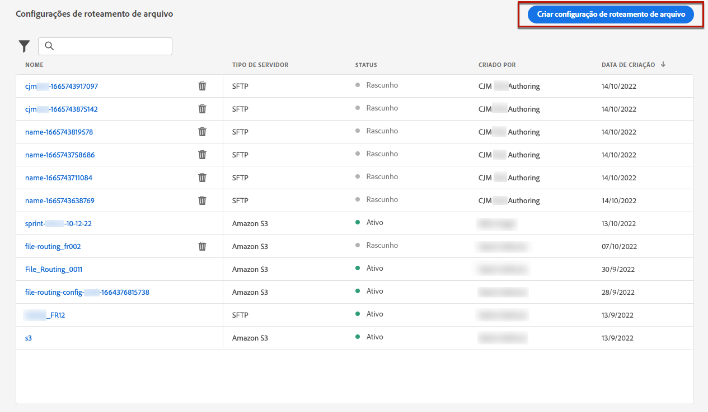
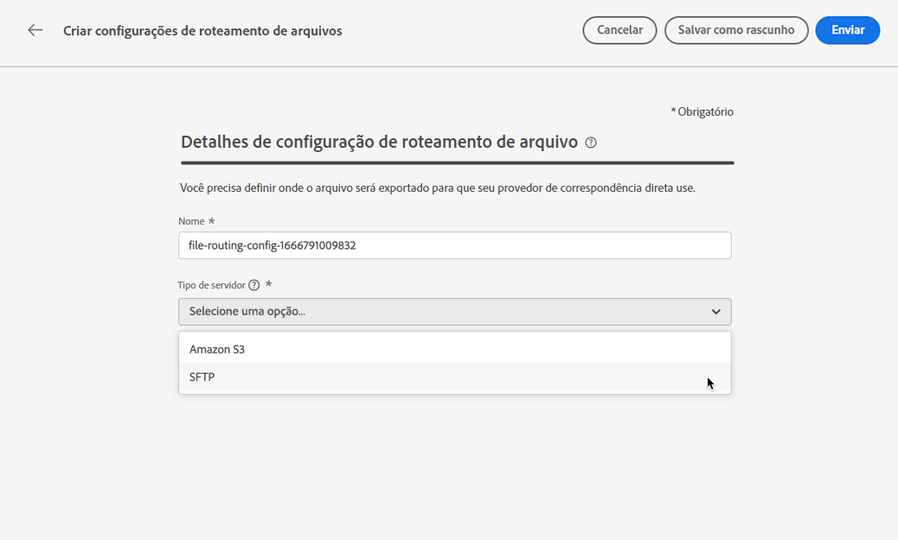
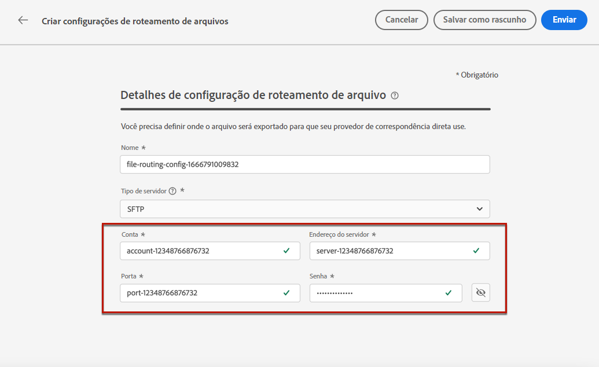
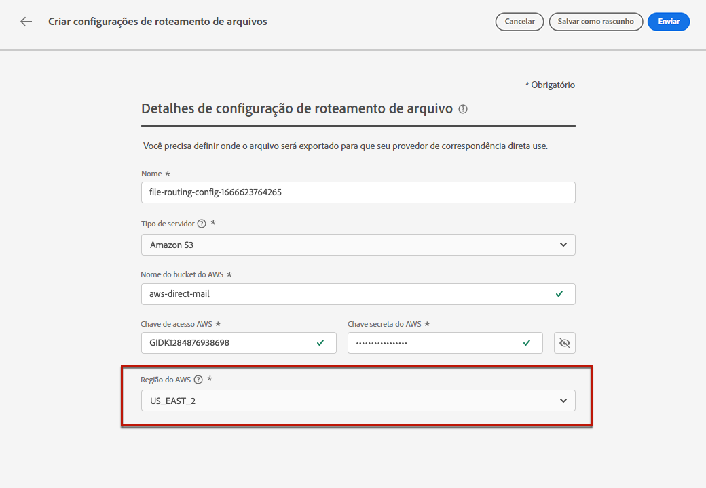
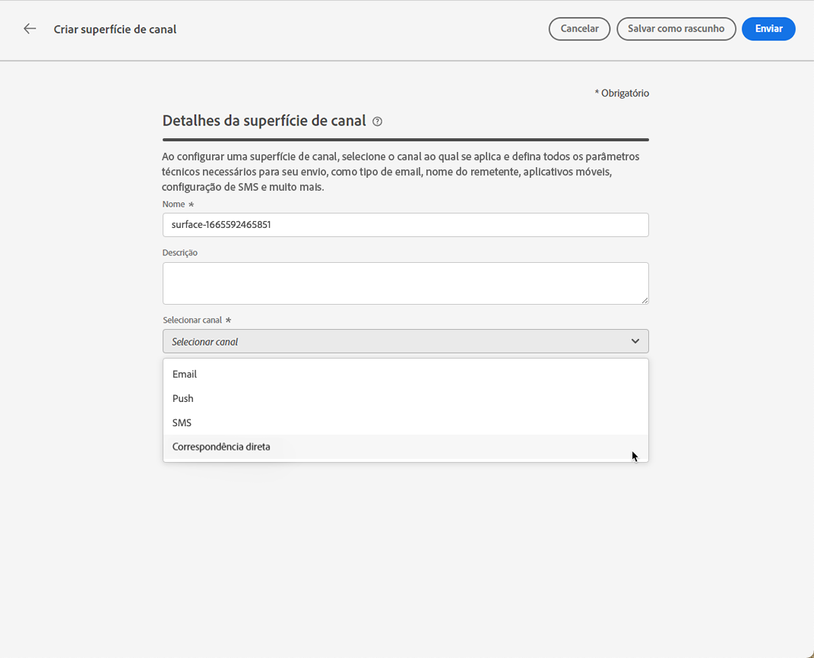
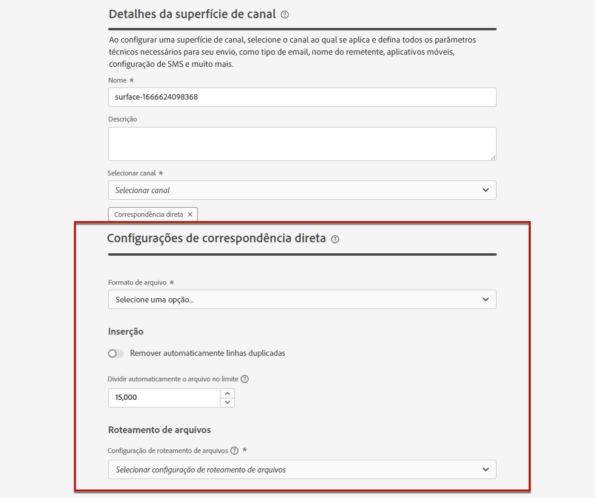
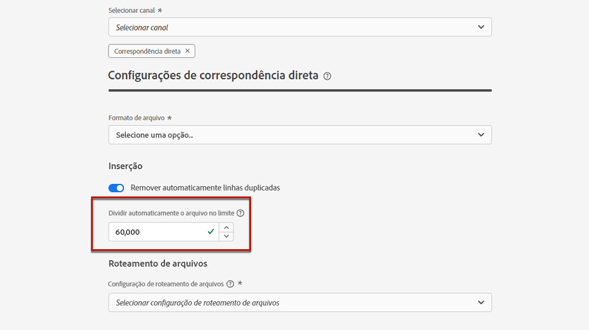
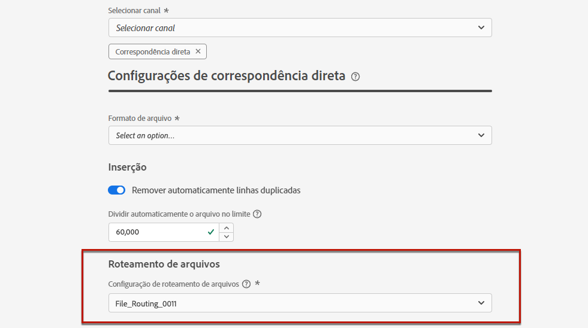

# Configuração de correspondência direta {#direct-mail-configuration}

[!DNL Journey Optimizer] permite personalizar e gerar os arquivos exigidos por provedores de correspondência direta para enviar emails para seus clientes.

Ao preparar um delivery de mala direta, [!DNL Journey Optimizer] gera um arquivo incluindo todos os perfis segmentados e as informações de contato escolhidas (endereço postal por exemplo). Você poderá enviar esse arquivo para seu provedor de correspondência direta que irá cuidar realmente do envio.

Para enviar uma mensagem de correspondência direta, é necessário criar um arquivo e carregá-lo em um servidor. Antes de poder fazer isso, é necessário criar um [configuração de roteamento de arquivos](#file-routing-configuration) e [superfície de correspondência direta](#direct-mail-surface) que referenciará a configuração de roteamento de arquivos.

## Configurar roteamento de arquivos {#file-routing-configuration}

>[!CONTEXTUALHELP]
>id="ajo_dm_file_routing_details"
>title="Definir as configurações da configuração de roteamento de arquivos"
>abstract="Ao criar a mensagem de correspondência direta, você gerará o arquivo contendo todas as informações de perfil necessárias. Esse arquivo precisa ser exportado e carregado em um servidor para que seu provedor de correspondência direta possa acessar e usar esse arquivo para delivery de correspondência direta."

>[!CONTEXTUALHELP]
>id="ajo_dm_file_routing_details_header"
>title="Definir as configurações da configuração de roteamento de arquivos"
>abstract="Você precisa definir onde o arquivo será exportado e carregado para que seu provedor de correspondência direta use."

>[!CONTEXTUALHELP]
>id="ajo_dm_select_file_routing"
>title="Configuração do roteamento de arquivos"
>abstract="Selecione a configuração de roteamento de arquivos de sua escolha, que define onde o arquivo será exportado e carregado para que seu provedor de correspondência direta use."

>[!CONTEXTUALHELP]
>id="ajo_dm_file_routing_type"
>title="Selecione o tipo de servidor para o roteamento de arquivos"
>abstract="Escolha o servidor que deseja usar para fazer upload e armazenar os arquivos de correspondência direta. Atualmente, somente o Amazon S3 e SFTP são compatíveis."

>[!CONTEXTUALHELP]
>id="ajo_dm_file_routing_aws_region"
>title="Escolha a região do AWS"
>abstract="Selecione a região geográfica onde deseja exportar e carregar seus arquivos de correspondência direta. Para um uso ideal, é recomendável escolher a região mais próxima para hospedar sua infraestrutura de nuvem."

1. Acesse o **[!UICONTROL Administração]** > **[!UICONTROL Canais]** > **[!UICONTROL Configuração do roteamento de arquivos]** > **[!UICONTROL Roteamento de arquivo]** , em seguida, clique em **[!UICONTROL Criar configuração de roteamento]**.

   

1. Defina um nome para sua configuração.

1. Selecione a configuração **[!UICONTROL Tipo de servidor]**, ou seja, o servidor que você deseja usar para carregar e armazenar os arquivos de correspondência direta.

   

   >[!NOTE]
   >
   >Atualmente, somente o Amazon S3 e SFTP estão disponíveis.

   Ao criar a mensagem de correspondência direta, você gerará o arquivo contendo todas as informações de perfil necessárias. Esse arquivo precisa ser exportado e carregado em um servidor para que seu provedor de correspondência direta possa acessar e usar esse arquivo para delivery de correspondência direta.

1. Preencha os detalhes e as credenciais específicas do tipo de configuração selecionado, como endereço do servidor, chave de acesso, etc.

   

1. Se você selecionou **[!UICONTROL Amazon S3]**, é possível escolher a região do AWS para a qual deseja exportar e carregar seus arquivos de correspondência direta.

   

   >[!NOTE]
   >
   >As regiões do AWS são áreas geográficas separadas distribuídas pelo mundo que a AWS usa para abrigar sua infraestrutura. Para um uso ideal, é recomendável escolher a região mais próxima para hospedar sua infraestrutura de nuvem.

1. Selecione **[!UICONTROL Enviar]**. A configuração de roteamento de arquivos é criada com a variável **[!UICONTROL Ativo]** status. Agora está pronto para ser usado em uma superfície de correspondência direta para entregar correspondência direta de [!DNL Journey Optimizer].

   >[!NOTE]
   >
   >Você também pode selecionar **[!UICONTROL Salvar como rascunho]** para criar a configuração de roteamento de arquivos, mas você não poderá selecioná-la em uma superfície até que seja **[!UICONTROL Ativo]**.

## Criar uma superfície de correspondência direta {#direct-mail-surface}

>[!CONTEXTUALHELP]
>id="ajo_dm_surface_settings"
>title="Definir as configurações de correspondência direta"
>abstract="Uma superfície de correspondência direta contém as configurações relacionadas à formatação do arquivo que contém os dados de perfil para correspondência direta. Você também deve definir onde o arquivo será exportado selecionando a configuração de roteamento do arquivo."

<!--
>[!CONTEXTUALHELP]
>id="ajo_dm_surface_sort"
>title="Define the sort order"
>abstract="If you select this option, the sort will be by profile ID, ascending or descending. If you unselect it, the sorting configuration defined when creating the direct mail message within a journey or a campaign."-->

>[!CONTEXTUALHELP]
>id="ajo_dm_surface_split"
>title="Definir o limite de divisão de arquivo"
>abstract="Você deve definir o número máximo de registros para cada arquivo que contém dados de perfil. Depois que o limite especificado for atingido, outro arquivo será criado para os registros restantes."

Depois que o roteamento de arquivos for configurado, é necessário criar uma superfície de canal para enviar mala direta de [!DNL Journey Optimizer]. Em cada superfície, será necessário selecionar uma configuração de roteamento de arquivos.

1. Crie uma superfície de canal. [Saiba mais](channel-surfaces.md)

1. Selecione o **[!UICONTROL Correspondência direta]** canal.

   

1. Defina as configurações de correspondência direta na seção dedicada da configuração da superfície do canal.

   

1. Selecione o formato de arquivo: **[!UICONTROL CSV]** ou **[!UICONTROL Delimitado por texto]**.

1. No **[!UICONTROL Inserção]** , é possível optar por remover automaticamente linhas duplicadas.

1. Defina o número máximo de registros (ou seja, linhas) para cada arquivo que contenha dados de perfil. Depois que o limite especificado for atingido, outro arquivo será criado para os registros restantes.

   

   Por exemplo, se houver 100.000 registros no arquivo e o limite for definido como 60.000, os registros serão divididos em dois arquivos. O primeiro arquivo terá 60.000 linhas e o segundo arquivo conterá as 40.000 linhas restantes.

   >[!NOTE]
   >
   >É possível definir qualquer número entre 1 e 200.000 registros, o que significa que cada arquivo deve conter pelo menos 1 linha e não mais de 200.000 linhas.

1. Finalmente, selecione o **[!UICONTROL Configuração do roteamento de arquivos]** entre os que você criou. Isso define onde o arquivo será exportado e carregado para que seu provedor de correspondência direta use.

   >[!CAUTION]
   >
   >Se não tiver configurado nenhuma opção de roteamento de arquivos, você não poderá criar uma superfície de correspondência direta. [Saiba mais](#file-routing-configuration)

   