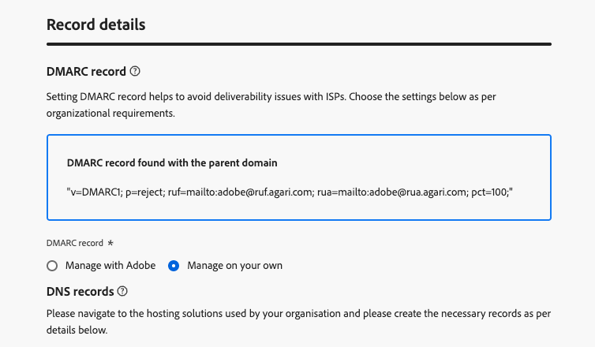

# Registro DMARC {#dmarc-record}

>[!CONTEXTUALHELP]
>id="ajo_admin_dmarc_record"
>title="Definir o registro DMARC"
>abstract="DMARC é um método de autenticação de email que permite aos proprietários de domínio proteger seus domínios contra uso não autorizado e evitar problemas de capacidade de entrega com provedores de caixa de correio. Como parte da aplicação de práticas recomendadas do setor, o Google e o Yahoo! exigirão um registro DMARC para qualquer domínio que você usar para enviar emails a eles."

## O que é o DMARC? {#what-is-dmarc}

O DMARC (Domain-based Message Authentication, Reporting, and Conformance) é um método de autenticação de email que permite que os proprietários do domínio o protejam contra o uso não autorizado. Ao oferecer uma política clara para provedores de email e provedores de serviços de Internet (ISPs), ajuda a impedir que agentes mal-intencionados enviem emails que alegam ser do seu domínio. A implementação do DMARC reduz o risco de emails legítimos serem marcados como spam ou rejeitados e melhora a capacidade de entrega de emails.

O DMARC também oferece relatórios sobre mensagens que falham na autenticação, juntamente com controle sobre o tratamento de emails que não passam na validação do DMARC. Dependendo da [política do DMARC](#dmarc-policies) implementada, esses emails podem ser monitorados, colocados em quarentena ou rejeitados. Esses recursos capacitam você a tomar medidas para mitigar e resolver possíveis erros.

Para ajudá-lo a evitar problemas de entrega e, ao mesmo tempo, obter controle sobre emails com falha de autenticação, o [!DNL Journey Optimizer] agora oferece suporte à tecnologia da DMARC diretamente na interface de administração. [Saiba mais](#implement-dmarc)

### Como funciona o DMARC? {#how-dmarc-works}

O SPF e o DKIM são usados para associar um email a um domínio e trabalhar juntos para autenticar o email. O DMARC vai um passo além e ajuda a evitar a falsificação, combinando o domínio verificado pelo DKIM e SPF.

>[!NOTE]
>
>No Journey Optimizer, o SPF e o DKIM são configurados para você.

Para passar o DMARC, uma mensagem deve passar o SPF ou o DKIM:

* O SPF (Sender Policy Framework) ajuda a verificar se a mensagem de email vem de uma fonte autorizada, verificando o endereço IP do servidor de envio em relação a uma lista de endereços IP autorizados para o domínio.
* O DKIM (DomainKeys Identified Mail) adiciona uma assinatura digital às mensagens de email, permitindo que o recipient verifique a integridade e a autenticidade da mensagem.

Se ambas ou qualquer uma dessas opções falhar na autenticação, o DMARC falhará e o email será entregue de acordo com a política do DMARC selecionada.

<!--DMARC requires alignment between the 'From" and 'Return-Path' address.-->

### Políticas do DMARC {#dmarc-policies}

Se um email não passar na autenticação do DMARC, você poderá decidir qual ação será aplicada a essa mensagem. O DMARC tem três opções de política:

* Monitor (p=none): instrui o provedor da caixa de correio/ISP a fazer o que normalmente faria com a mensagem.
* Quarentena (p=quarantine): instrui o provedor de caixa de correio/ISP a entregar emails que não transmitem o DMARC para a pasta de spam ou lixo eletrônico do recipient.
* Reject (p=reject): Instrui o provedor de caixa de correio/ISP a bloquear o email que não passa no DMARC, resultando em uma devolução.

>[!NOTE]
>
>Saiba como definir a política do DMARC com [!DNL Journey Optimizer] em [esta seção](#set-up-dmarc).

## Atualização de requisitos do DMARC {#dmarc-update}

Como parte da aplicação de práticas recomendadas do setor, o Google e o Yahoo! ambos exigem um **registro DMARC** para qualquer domínio que você use para enviar emails para eles. Este novo requisito se aplica a partir de **1º de fevereiro de 2024**.

>[!CAUTION]
>
>Espera-se que o não cumprimento deste novo requisito do Gmail e do Yahoo! resulte em emails direcionados à pasta de spam ou bloqueados.

Consequentemente, a Adobe recomenda que você execute as seguintes ações:

* Verifique se o **registro do DMARC** está configurado para **todos os subdomínios que você já delegou** à Adobe no [!DNL Journey Optimizer]. [Saiba como](#check-subdomains-for-dmarc)

* Ao **delegar qualquer novo subdomínio** à Adobe, você pode **configurar o DMARC** diretamente **na [!DNL Journey Optimizer] interface de administração**. [Saiba como](#implement-dmarc)

## Implementar o DMARC em [!DNL Journey Optimizer] {#implement-dmarc}

A interface de administração [!DNL Journey Optimizer] permite configurar o registro do DMARC para todos os subdomínios que você já delegou ou à Adobe. As etapas detalhadas estão descritas abaixo.

### Verificar subdomínios existentes para o DMARC {#check-subdomains-for-dmarc}

Para verificar se você tem um registro DMARC configurado para todos os subdomínios que você delegou em [!DNL Journey Optimizer], siga as etapas abaixo.

1. Acesse o menu **[!UICONTROL Administração]** > **[!UICONTROL Canais]** > **[!UICONTROL Configurações de email]** > **[!UICONTROL Subdomínios]** e clique em **[!UICONTROL Configurar subdomínio]**.

1. Para cada subdomínio delegado, verifique a coluna **[!UICONTROL Registro DMARC]**. Se nenhum registro for encontrado para um determinado subdomínio, um alerta será exibido.

   

   >[!CAUTION]
   >
   >Para estar em conformidade com o novo requisito do Gmail e do Yahoo! e evitar problemas de capacidade de entrega com os principais ISPs, é recomendável configurar o registro do DMARC para todos os subdomínios delegados. [Saiba mais](dmarc-record-update.md)

1. Selecione um subdomínio sem registro DMARC associado e preencha a seção **[!UICONTROL Registro DMARC]** de acordo com as necessidades da sua organização. As etapas para preencher os campos de registro do DMARC estão detalhadas em [esta seção](#implement-dmarc).

   <!---->

   >[!NOTE]
   >
   >Dependendo de um registro DMARC ser encontrado com o domínio pai ou não, você pode optar por usar os valores do domínio pai ou fazer com que o Adobe gerencie o registro DMARC. [Saiba mais](#implement-dmarc)

1. Se você estiver editando um subdomínio:

   * [Totalmente delegado](delegate-subdomain.md#full-subdomain-delegation) à Adobe, nenhuma outra ação é necessária.

   * Configurado com [CNAME](delegate-subdomain.md#cname-subdomain-setup), você deve copiar o registro DNS para o DMARC na solução de hospedagem para gerar os registros DNS correspondentes.

     

     Verifique se o registro DNS foi gerado na solução de hospedagem de domínio e marque a caixa &quot;Confirmo...&quot;.

1. Salve as alterações.

### Configurar o DMARC para novos subdomínios {#set-up-dmarc}

Ao delegar novos subdomínios à Adobe no [!DNL Journey Optimizer], um registro DMARC será criado no DNS para o seu domínio. Siga as etapas abaixo para implementar o DMARC.

>[!CAUTION]
>
>Para estar em conformidade com o novo requisito do Gmail e do Yahoo! e evitar problemas de capacidade de entrega com os principais ISPs, é recomendável configurar o registro do DMARC para todos os subdomínios delegados. [Saiba mais](dmarc-record-update.md)

<!--If you fail to comply with the new requirement from Gmail and Yahoo! to have DMARC record for all sending domains, your emails are expected to land into the spam folder or to get blocked.-->

1. Configure um novo subdomínio. [Saiba como](delegate-subdomain.md)

1. Vá para a seção **[!UICONTROL Registro do DMARC]**.

1. Se um registro DMARC estiver disponível no domínio pai associado ao subdomínio, duas opções serão exibidas:

   

   * **[!UICONTROL Gerenciar com o Adobe]**: você pode fazer com que o Adobe gerencie o registro do DMARC para o seu subdomínio. Siga as etapas detalhadas em [esta seção](#manage-dmarc-with-adobe).

   * **[!UICONTROL Gerenciar por conta própria]**: <!--This option is selected by default.-->Essa opção permite gerenciar o registro do DMARC fora do [!DNL Journey Optimizer], usando os valores do domínio pai. Esses valores são exibidos na interface, mas não podem ser editados.

     {width="80%"}

1. Se nenhum registro DMARC for encontrado no domínio pai, somente a opção **[!UICONTROL Gerenciar com Adobe]** estará disponível. Siga as etapas [abaixo](#manage-dmarc-with-adobe) para configurar o registro DMARC para o seu subdomínio.

   {width="80%"}

### Gerenciar registros do DMARC com o Adobe {#manage-dmarc-with-adobe}

Para permitir que a Adobe gerencie o registro do DMARC para você, selecione a opção **[!UICONTROL Gerenciar com o Adobe]** e siga as etapas abaixo.

>[!NOTE]
>
>Se buscado por [!DNL Journey Optimizer], você pode usar os mesmos valores como realçados na interface ou alterá-los conforme necessário.

{width="80%"}

>[!NOTE]
>
>Se você não adicionar nenhum valor, os valores padrão pré-preenchidos serão usados.

1. Defina a ação que o servidor do recipient executará se o DMARC falhar. Dependendo da [política do DMARC](#dmarc-policies) que você deseja aplicar, selecione uma das três opções:

   * **[!UICONTROL Nenhum]** (valor padrão): Instrui o destinatário a não executar nenhuma ação contra mensagens que não passaram na autenticação do DMARC, mas ainda enviar relatórios de email ao remetente.
   * **[!UICONTROL Quarentena]**: Instrui o servidor de email de recebimento a colocar em quarentena emails que não passaram na autenticação do DMARC - geralmente significa colocar essas mensagens na pasta de spam ou lixo eletrônico do destinatário.
   * **[!UICONTROL Reject]**: Instrui o destinatário a negar (devolver) completamente qualquer email para o domínio que não for autenticado. Com essa política ativada, somente os emails verificados como 100% autenticados pelo seu domínio terão uma chance de inserção na caixa de entrada.

   >[!NOTE]
   >
   >Como prática recomendada, é recomendável implantar lentamente a implementação do DMARC, escalando sua política do DMARC de **Nenhuma** para **Quarentena** e **Rejeitar** à medida que você entende o impacto potencial do DMARC.

1. Opcionalmente, adicione um ou mais endereços de email de sua escolha para indicar para onde o **DMARC relata** os emails que [falha na autenticação](#how-dmarc-works) devem ir dentro da sua organização. Você pode adicionar até cinco endereços para cada relatório.

   >[!NOTE]
   >
   >Certifique-se de ter uma caixa de entrada original (não Adobe) em seu controle, onde você pode receber esses relatórios.

   Há dois relatórios diferentes gerados por ISPs que os remetentes podem receber por meio das tags RUA/RUF na política da DMARC:

   * **Relatórios de agregação** (RUA): eles não contêm PII (Informações de Identificação Pessoal) que possam ser sensíveis ao GDPR.
   * **Relatórios de falha forense** (RUF): eles contêm endereços de email sensíveis ao GDPR. Antes de usar o, verifique internamente como lidar com informações que precisam ser compatíveis com o GDPR.

   >[!NOTE]
   >
   >Esses relatórios altamente técnicos fornecem uma visão geral dos emails que são tentados de falsificação. Eles são melhor assimilados por meio de uma ferramenta de terceiros.

1. Selecione a **porcentagem aplicável** de emails para o DMARC.

   Essa porcentagem depende da confiança na infraestrutura de email e da tolerância a falsos positivos (emails legítimos marcados como fraudulentos). É comum que as organizações comecem com a política do DMARC definida como **Nenhuma**, aumentem gradualmente a porcentagem da política do DMARC e monitorem de perto o impacto na entrega de emails legítimos.

   >[!NOTE]
   >
   >Trabalhe com os administradores de email e a equipe de TI para aumentar gradualmente a porcentagem à medida que você ganhar confiança nas práticas de autenticação de email.

   Como prática recomendada, procure uma alta taxa de conformidade da DMARC, idealmente próxima de 100%, para maximizar os benefícios de segurança e, ao mesmo tempo, minimizar o risco de falsos positivos.

1. Selecione um **intervalo de relatórios** entre 24 e 168 horas. Ele permite que os proprietários de domínio recebam atualizações regulares sobre os resultados de autenticação de email e tomem as medidas necessárias para melhorar a segurança do email.

<!--The DMARC reporting interval is specified in the DMARC policy published in the DNS (Domain Name System) records for a domain. The reporting interval can be set to daily, weekly, or another specified frequency, depending on the domain owner's preferences.

The default value (24 hours) is generally the email providers' expectation.

**********

Setting up a DMARC record involves adding a DNS TXT record to your domain's DNS settings. This record specifies your DMARC policy, such as whether to quarantine or reject messages that fail authentication. Implementing DMARC is a proactive step towards enhancing email security and protecting both your organization and your recipients from email-based threats.

DMARC helps prevent malicious actors from sending emails that appear to come from your domain. By setting up DMARC, you can specify how email providers should handle messages that fail authentication checks, reducing the likelihood that phishing emails will reach recipients.

DMARC helps improve email deliverability by providing a clear policy for email providers to follow when encountering messages claiming to be from your domain. This can reduce the chances of legitimate emails being marked as spam or rejected.

DMARC helps protect against email spoofing, phishing, and other fraudulent activities.

It allows you to decide how a mailbox provider should handle emails that fail SPF and DKIM checks, providing a way to authenticate the sender's domain and prevent unauthorized use of the domain for malicious purposes.

## What are the benefits of DMARC? {#dmarc-benefits}

The key benefits or DMARC are as folllows:

* DMARC allows email receivers to easily identify the authentication of emails, which could potentially improve delivery.

* It offers reporting on which messages fail SPF and/or DKIM, enabling senders to gain visibility.

* This increased visibility allows for steps to be taken to mitigate further errors. It gives senders a degree of control over what happens with mail that does not pass either of these authentication methods.

-->
