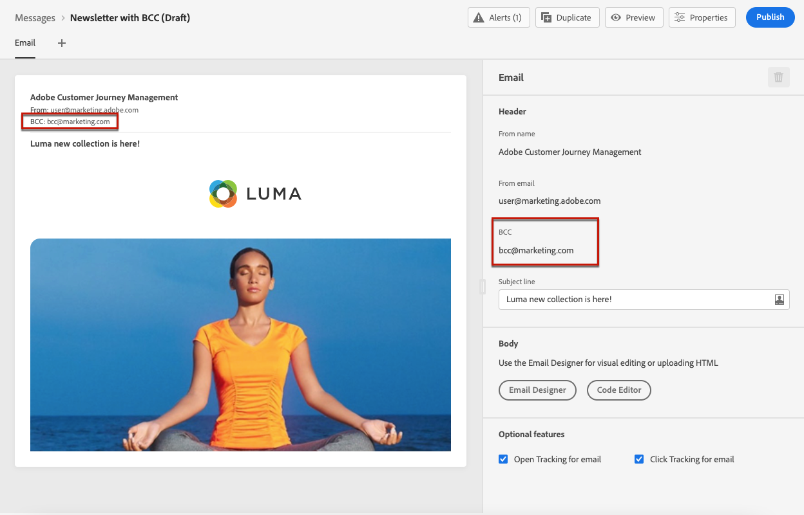
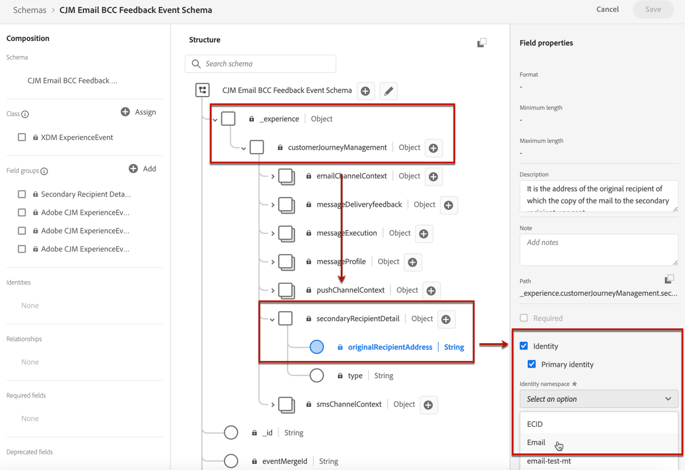

# Definir configurações de email {#email-settings}

Defina as configurações de email na seção dedicada da configuração predefinida de mensagem. Saiba como criar predefinições de mensagem em [esta seção](message-presets.md).


## Tipo de email {#email-type}

>[!CONTEXTUALHELP]
>id="ajo_admin_presets_emailtype"
>title="Definir a categoria de email"
>abstract="Selecione o tipo de mensagem que será enviada ao usar esta predefinição: Marketing para mensagens promocionais, que exigem consentimento do usuário, ou Transacional para mensagens não comerciais, que também podem ser enviadas para perfis sem assinatura em contextos específicos."

No **TIPO DE EMAIL** selecione o tipo de mensagem que será enviada com a predefinição: **Marketing** ou **Transacional**.

* Choose **Marketing** para mensagens promocionais: essas mensagens exigem o consentimento do usuário.

* Choose **Transacional** para mensagens não comerciais, como confirmação de pedido, notificações de redefinição de senha ou informações de delivery, por exemplo.

>[!CAUTION]
>
>**Transacional** as mensagens podem ser enviadas aos perfis que cancelaram a assinatura das comunicações de marketing. Essas mensagens só podem ser enviadas em contextos específicos.

When [criação de uma mensagem](../messages/get-started-content.md#create-new-message), você deve escolher uma predefinição de mensagem válida que corresponda à categoria selecionada para a mensagem.

## Subdomínio e pool IP {#subdomains-and-ip-pools}

No **DETALHES DO SUBDOMÍNIO E DO POOL IP** na seção , você deve:

1. Selecione o subdomínio a ser usado para enviar os emails. [Saiba mais](about-subdomain-delegation.md)

1. Selecione o pool de IP a ser associado à predefinição. [Saiba mais](ip-pools.md)


Não é possível continuar com a criação predefinida enquanto o pool de IP selecionado estiver em [edição](ip-pools.md#edit-ip-pool) (**[!UICONTROL Processing]** e nunca foi associado ao subdomínio selecionado. Caso contrário, a versão mais antiga da associação do pool de IP/subdomínio ainda será usada. Se esse for o caso, salve a predefinição como rascunho e tente novamente depois que o pool de IP tiver a variável **[!UICONTROL Success]** status.

>[!NOTE]
>
>Para ambientes não relacionados à produção, o Adobe não cria subdomínios de teste prontos para uso nem concede acesso a um pool IP de envio compartilhado. Você precisa [delegar seus próprios subdomínios](delegate-subdomain.md) e usar os IPs do pool atribuído à sua organização.

## List-Unsubscribe {#list-unsubscribe}

Em [selecionar um subdomínio](#subdomains-and-ip-pools) na lista, a variável **[!UICONTROL Enable List-Unsubscribe]** será exibida.


Essa opção está ativada por padrão.

Se você deixá-lo ativado, um link de cancelamento de subscrição será incluído automaticamente no cabeçalho do email, como:


Se você desativar esta opção, nenhum link de cancelamento de subscrição será exibido no cabeçalho do email.

O link de cancelamento de subscrição consiste em dois elementos:

* Um **cancelar inscrição do endereço de email**, para a qual todas as solicitações de cancelamento de subscrição são enviadas.

   Em [!DNL Journey Optimizer], o endereço de email de cancelamento de inscrição é o padrão **[!UICONTROL Mailto (unsubscribe)]** endereço exibido na predefinição de mensagem, com base no [subdomínio selecionado](#subdomains-and-ip-pools).

   

* O **cancelar inscrição do URL**, que é o URL da landing page onde o usuário será redirecionado depois de cancelado a assinatura.

   Se você adicionar um [link para opção de não participação com um clique](../messages/consent.md#one-click-opt-out) para uma mensagem criada usando essa predefinição, o URL de cancelamento de subscrição será o URL definido para o link de recusa de um clique.

   

   >[!NOTE]
   >
   >Se você não adicionar um link para opção de não participação com um clique no conteúdo da mensagem, nenhuma landing page será exibida para o usuário.

Saiba mais sobre como adicionar um link de cancelamento de subscrição de cabeçalho às suas mensagens em [esta seção](../messages/consent.md#unsubscribe-header).

<!--Select the **[!UICONTROL Custom List-Unsubscribe]** option to enter your own Unsubscribe URL and/or your own Unsubscribe email address.(to add later)-->

## Parâmetros de cabeçalho{#email-header}

No **[!UICONTROL HEADER PARAMETERS]** , insira os nomes do remetente e os endereços de email associados ao tipo de mensagens enviadas usando essa predefinição.

>[!CAUTION]
>
>Os endereços de email devem usar o [subdomínio delegado](about-subdomain-delegation.md).

* **[!UICONTROL Sender name]**: O nome do remetente, como o nome da sua marca.

* **[!UICONTROL Sender email]**: O endereço de email que deseja usar para suas comunicações. Por exemplo, se o subdomínio delegado for *marketing.luma.com*, você pode usar *contact@marketing.luma.com*.

* **[!UICONTROL Reply to (name)]**: O nome que será usado quando o recipient clicar no **Responder** no software cliente de email.

* **[!UICONTROL Reply to (email)]**: O endereço de email que será usado quando o recipient clicar no link **Responder** no software cliente de email. Você deve usar um endereço definido no subdomínio delegado (por exemplo, *reply@marketing.luma.com*), caso contrário, os emails serão descartados.

* **[!UICONTROL Error email]**: Todos os erros gerados pelos ISPs após alguns dias de envio de email (rejeições assíncronas) são recebidos neste endereço.


>[!NOTE]
>
>Os endereços devem começar com uma letra (A-Z) e só podem conter caracteres alfanuméricos. Você também pode usar o sublinhado `_`, ponto`.` e hífen `-` caracteres.

### Encaminhar email {#forward-email}

Se quiser encaminhar para um endereço de email específico todos os emails recebidos por [!DNL Journey Optimizer] para o subdomínio delegado, entre em contato com o Atendimento ao Cliente do Adobe. Você precisará fornecer:

* O endereço de email de encaminhamento de sua escolha. Observe que o domínio de endereço de email de encaminhamento não pode corresponder a qualquer subdomínio delegado ao Adobe.
* O nome da sua caixa de proteção.
* O nome predefinido para o qual o endereço de email de encaminhamento (ou &quot;responder a&quot;) será usado.
* O atual **[!UICONTROL Reply to (email)]** endereço definido no nível predefinido.

>[!NOTE]
>
>Só pode haver um endereço de email de encaminhamento por subdomínio. Consequentemente, se várias predefinições usarem o mesmo subdomínio, o mesmo endereço de email de encaminhamento deverá ser usado para todas elas.

O endereço de email de encaminhamento será configurado pelo Adobe. Isso pode levar de 3 a 4 dias.

## Email CCO {#bcc-email}

>[!CONTEXTUALHELP]
>id="ajo_admin_preset_bcc"
>title="Definir um endereço de email CCO"
>abstract="Você pode manter uma cópia dos emails enviados enviando-os para uma caixa de entrada CCO. Digite o endereço de email de sua escolha para que cada email enviado seja copiado para o CCO. Este recurso é opcional."

Você pode enviar uma cópia idêntica (ou cópia oculta de carbono) de um email enviado por [!DNL Journey Optimizer] para uma caixa de entrada CCO. Esse recurso opcional permite reter cópias das comunicações por email enviadas aos usuários para fins de conformidade e/ou arquivamento. Isso será invisível para os recipients do delivery.

>[!CAUTION]
>
>Esse recurso estará disponível a partir de **31 de maio**.

### Habilitar email CCO {#enable-bcc}

Para ativar o **[!UICONTROL BCC email]** , insira o endereço de email de sua escolha no campo dedicado. Você pode especificar qualquer endereço externo no formato correto, exceto um endereço de email definido no subdomínio delegado. Por exemplo, se o subdomínio delegado for *marketing.luma.com* qualquer endereço como *abc@marketing.luma.com* é proibida.

>[!NOTE]
>
>Você só pode definir um endereço de email CCO. Verifique se o endereço CCO tem capacidade de recepção suficiente para armazenar todos os emails enviados usando a predefinição atual.
>
>Mais recomendações estão listadas em [esta seção](#bcc-recommendations-limitations).


Todas as mensagens de email que usam essa predefinição serão copiadas para o CCO para o endereço de email inserido. A partir daí, eles podem ser processados e arquivados usando um sistema externo.

>[!CAUTION]
>
>O uso do recurso CCO será contado em relação ao número de mensagens para as quais você está licenciado. Portanto, ative-o somente nas predefinições usadas para comunicações críticas que você deseja arquivar. Verifique se há volumes licenciados em seu contrato.

A configuração de endereço de email CCO é salva e processada imediatamente no nível predefinido. Quando você [criar uma nova mensagem](../messages/get-started-content.md#create-new-message) usando essa predefinição, o endereço de email CCO é exibido automaticamente.



No entanto, o endereço CCO é selecionado para enviar comunicações seguindo a lógica abaixo:

* Para jornadas em lote e em burst, não se aplica à execução em lote ou em burst que já havia sido iniciada antes da definição de Cco ser feita. A alteração será selecionada na próxima recorrência ou nova execução.

* Para mensagens transacionais, a alteração é selecionada imediatamente para a próxima comunicação (atraso de até um minuto).

>[!NOTE]
>
>Não é necessário republicar uma mensagem ou jornada para que a configuração Cco seja selecionada.

### Recommendations e limitações {#bcc-recommendations-limitations}

* Para garantir sua conformidade com a privacidade, os emails do CCO devem ser processados por um sistema de arquivamento capaz de armazenar informações de identificação pessoal (PII) seguras.

* Como as mensagens podem conter dados confidenciais ou privados, como informações de identificação pessoal (PII), verifique se o endereço CCO está correto e proteja o acesso às mensagens.

* Sua caixa de entrada usada para Cco deve ser gerenciada adequadamente para espaço e entrega. Se a caixa de entrada retornar rejeições, alguns emails poderão não ser recebidos e, portanto, não serão arquivados.

* As mensagens podem ser entregues ao endereço de email CCo antes dos recipients do target. As mensagens Cco também podem ser enviadas mesmo que as mensagens originais tenham [devolvido](../reports/suppression-list.md#delivery-failures).

   <!--OR: Only successfully sent emails are taken in account. [Bounces](../reports/suppression-list.md#delivery-failures) are not. TO CHECK -->

* Não abra ou clique nos emails enviados para o endereço CCO, pois são considerados no total de aberturas e cliques da análise de envio, o que pode causar alguns erros de cálculo no [relatórios](../reports/message-monitoring.md).

* Não marque mensagens como spam na caixa de entrada CCO, pois isso afetará todos os outros emails enviados para esse endereço.


>[!CAUTION]
>
>Não clique no link de cancelamento de subscrição nos emails enviados para o endereço CCo, pois você cancelará imediatamente a assinatura dos recipients correspondentes.

### Conformidade com o RGPD {#gdpr-compliance}

Regulamentos como o GDPR afirmam que os titulares de dados devem poder modificar o consentimento a qualquer momento. Como os emails CCO que você está enviando com o Journey Optimizer incluem informações de identificação pessoal (PII) seguras, você deve editar a variável **[!UICONTROL CJM Email BCC Feedback Event Schema]** para gerenciar essas PII de acordo com o GDPR e regulamentos semelhantes.

Para fazer isso, siga as etapas abaixo.

1. Ir para **[!UICONTROL Data management]** > **[!UICONTROL Schemas]** > **[!UICONTROL Browse]** e selecione **[!UICONTROL CJM Email BCC Feedback Event Schema]**.

   

1. Clique para expandir **[!UICONTROL _experience]**, **[!UICONTROL customerJourneyManagment]** then **[!UICONTROL secondaryRecipientDetail]**.

1. Selecione **[!UICONTROL originalRecipientAddress]**.

1. No **[!UICONTROL Field properties]** à direita, role para baixo até o **[!UICONTROL Identity]** caixa de seleção.

1. Selecione-o e também selecione **[!UICONTROL Primary identity]**.

1. Selecione um namespace na lista suspensa.

   

1. Clique em **[!UICONTROL Apply]**.

>[!NOTE]
>
>Saiba mais sobre como gerenciar a privacidade e os regulamentos aplicáveis na [documentação da Experience Platform](https://experienceleague.adobe.com/docs/experience-platform/privacy/home.html?lang=pt-BR){target=&quot;_blank&quot;}.

### Dados de relatórios CCO {#bcc-reporting}

Os relatórios como tal no CCO não estão disponíveis na jornada e nos relatórios de mensagem. No entanto, as informações são armazenadas em um conjunto de dados do sistema chamado **[!UICONTROL AJO BCC Feedback Event Dataset]**. Você pode executar consultas em relação a esse conjunto de dados para encontrar informações úteis para fins de depuração, por exemplo.

Você pode acessar esse conjunto de dados por meio da interface do usuário do . Selecionar **[!UICONTROL Data management]** > **[!UICONTROL Datasets]** > **[!UICONTROL Browse]** e ativar **[!UICONTROL Show system datasets]** alterne do filtro para exibir os conjuntos de dados gerados pelo sistema. Saiba mais sobre como acessar conjuntos de dados no [esta seção](../start/get-started-datasets.md#access-datasets).


Para executar consultas em relação a esse conjunto de dados, você pode usar o Editor de consultas fornecido pelo [Serviço de query Adobe Experience Platform](https://experienceleague.adobe.com/docs/experience-platform/query/api/getting-started.html){target=&quot;_blank&quot;}. Para acessá-lo, selecione **[!UICONTROL Data management]** > **[!UICONTROL Queries]** e clique em **[!UICONTROL Create query]**. [Saiba mais](../start/get-started-queries.md)


Dependendo de quais informações você estiver procurando, é possível executar as seguintes consultas.

1. Para todas as outras consultas abaixo, será necessário a ID de ação do jornada. Execute esta consulta para buscar todas as IDs de ação associadas a uma ID de versão do jornada específica nos últimos 2 dias:

       &quot;
       SELECIONAR
       DISTINTO
       CAST(CARIMBO DE DATA E HORA COMO DATA) COMO EventTime,
       _experience.journeyOrchestration.stepEvents.journeyVersionID,
       _experience.journeyOrchestration.stepEvents.actionName,
       _experience.journeyOrchestration.stepEvents.actionID
       FROM jornada_step_events
       ONDE
       _experience.journeyOrchestration.stepEvents.journeyVersionID = &#39;&lt;journey version=&quot;&quot; id=&quot;&quot;>&#39; AND
       _experience.journeyOrchestration.stepEvents.actionID não é NULL AND
       CARIMBO DE DATA E HORA > NOW() - INTERVALO &#39;2&#39; DIA
       ORDEM POR EventTime DESC;
       &quot;
   
   >[!NOTE]
   >
   >Para obter o `<journey version id>`selecione o [Versão do jornada](../building-journeys/journey-versions.md) do **[!UICONTROL Journey management]** > **[!UICONTROL Journeys]** menu. A ID da versão do jornada é exibida no final do URL exibido no navegador da Web.
   >
   >

1. Execute esta consulta para buscar todos os eventos de feedback de mensagem (especialmente o status de feedback) gerados para uma mensagem específica direcionada a um usuário específico nos últimos 2 dias:

       &quot;
       SELECIONAR
       _experience.customerJourneyManagement.messageExecution.journeyVersionID AS JourneyVersionID,
       _experience.customerJourneyManagement.messageExecution.journeyActionID AS JourneyActionID,
       timestamp AS EventTime,
       _experience.customerJourneyManagement.emailChannelContext.address AS RecipientAddress,
       _experience.customerjorneymanagement.messagedeliveryfeedback.feedbackStatus AS FeedbackStatus,
       CASE _experience.customerjorneymanagement.messagedeliveryfeedback.feedbackStatus
       QUANDO &#39;enviado&#39; ENTÃO &#39;ENVIADO&#39;
       QUANDO &#39;atraso&#39; E DEPOIS &#39;Repetir&#39;
       QUANDO &#39;out_of_band&#39; ENTÃO &#39;Bounce&#39;
       QUANDO &#39;saltar&#39; E DEPOIS &#39;Rejeitar&#39;
       END AS FeedbackStatusCategory
       FROM cjm_message_feedback_event_dataset
       ONDE
       timestamp > now() - INTERVAL &#39;2&#39; day E
       _experience.customerJourneyManagement.messageExecution.journeyVersionID = &#39;&lt;journey version=&quot;&quot; id=&quot;&quot;>&#39; AND
       _experience.customerJourneyManagement.messageExecution.journeyActionID = &#39;&lt;journey action=&quot;&quot; id=&quot;&quot;>&#39; AND
       _experience.customerJourneyManagement.emailChannelContext.address = &#39;&lt;recipient email=&quot;&quot; address=&quot;&quot;>&#39;
       ORDEM POR EventTime DESC;
       &quot;
   
   >[!NOTE]
   >
   >Para obter o `<journey action id>` execute a primeira consulta descrita acima usando a id da versão do jornada. O `<recipient email address>` é o endereço de email do recipient real ou direcionado.

1. Execute esta consulta para buscar todos os eventos de feedback de mensagem CCO gerados para uma mensagem específica direcionada a um usuário específico nos últimos 2 dias:

   ```
   SELECT   
   _experience.customerJourneyManagement.messageExecution.journeyVersionID AS JourneyVersionID, 
   _experience.customerJourneyManagement.messageExecution.journeyActionID AS JourneyActionID, 
   _experience.customerJourneyManagement.emailChannelContext.address AS BccEmailAddress,
   timestamp AS EventTime, 
   _experience.customerJourneyManagement.secondaryRecipientDetail.originalRecipientAddress AS RecipientAddress, 
   _experience.customerjourneymanagement.messagedeliveryfeedback.feedbackStatus AS FeedbackStatus,
   CASE _experience.customerjourneymanagement.messagedeliveryfeedback.feedbackStatus
               WHEN 'sent' THEN 'Sent'
               WHEN 'delay' THEN 'Retry'
               WHEN 'out_of_band' THEN 'Bounce' 
               WHEN 'bounce' THEN 'Bounce'
           END AS FeedbackStatusCategory 
   FROM ajo_bcc_feedback_event_dataset  
   WHERE  
   timestamp > now() - INTERVAL '2' day  AND
   _experience.customerJourneyManagement.messageExecution.journeyVersionID = '<journey version id>' AND 
   _experience.customerJourneyManagement.messageExecution.journeyActionID = '<journeyaction id>' AND 
   _experience.customerJourneyManagement.secondaryRecipientDetail.originalRecipientAddress = '<recipient email address>'
   ORDER BY EventTime DESC;
   ```

1. Execute esta query para buscar todos os endereços de recipient que não receberam a mensagem, enquanto sua entrada CCO existe nos últimos 30 dias:

   ```
   SELECT
       DISTINCT 
   bcc._experience.customerJourneyManagement.secondaryRecipientDetail.originalRecipientAddress AS RecipientAddressesNotRecievedMessage
   FROM ajo_bcc_feedback_event_dataset bcc
   LEFT JOIN cjm_message_feedback_event_dataset mfe
   ON 
   bcc._experience.customerJourneyManagement.messageExecution.journeyVersionID =
           mfe._experience.customerJourneyManagement.messageExecution.journeyVersionID AND    bcc._experience.customerJourneyManagement.messageExecution.journeyActionID = mfe._experience.customerJourneyManagement.messageExecution.journeyActionID AND 
   bcc._experience.customerJourneyManagement.secondaryRecipientDetail.originalRecipientAddress = mfe._experience.customerJourneyManagement.emailChannelContext.address AND
   mfe._experience.customerJourneyManagement.messageExecution.journeyVersionID = '<journey version id>' AND 
   mfe._experience.customerJourneyManagement.messageExecution.journeyActionID = '<journey action id>' AND
   mfe.timestamp > now() - INTERVAL '30' DAY AND
   mfe._experience.customerjourneymanagement.messagedeliveryfeedback.feedbackstatus IN ('bounce', 'out_of_band') 
   WHERE bcc.timestamp > now() - INTERVAL '30' DAY;
   ```

## Parâmetros de nova tentativa de email {#email-retry}

>[!CONTEXTUALHELP]
>id="ajo_admin_presets_retryperiod"
>title="Ajustar o período de tempo de nova tentativa"
>abstract="As tentativas são executadas por 3,5 dias (84 horas) quando uma mensagem de email falha devido a um erro temporário de devolução temporária. Você pode ajustar esse período de tentativas padrão para atender melhor às suas necessidades."
>additional-url="https://experienceleague.adobe.com/docs/journey-optimizer/using/configuration/configuration-message/email-configuration/monitor-reputation/retries.html" text="Sobre tentativas"

Você pode configurar o **Parâmetros de nova tentativa de email**.


Por padrão, a variável [período de tempo de nova tentativa](retries.md#retry-duration) está definida para 84 horas, mas você pode ajustar essa configuração para melhor atender às suas necessidades.

Você deve inserir um valor inteiro (em horas ou minutos) dentro do seguinte intervalo:

* Para emails de marketing, o período mínimo de nova tentativa é de 6 horas.
* Para emails transacionais, o período mínimo de nova tentativa é de 10 minutos.
* Para ambos os tipos de email, o período máximo de tentativas é de 84 horas (ou 5040 minutos).

Saiba mais sobre tentativas em [esta seção](retries.md).

## Rastreamento de URL {#url-tracking}

>[!CONTEXTUALHELP]
>id="ajo_admin_preset_utm"
>title="Parâmetros de rastreamento de URL"
>abstract="Use esta seção para anexar parâmetros de rastreamento automaticamente aos URLs da campanha presentes no seu conteúdo de email."

Você pode usar **[!UICONTROL URL Tracking Parameters]** para medir a eficácia de seus esforços de marketing em todos os canais. Este recurso é opcional.

Os parâmetros definidos nesta seção serão anexados ao final dos URLs incluídos no conteúdo da mensagem de email. Em seguida, você pode capturar esses parâmetros em ferramentas de análise da Web, como Adobe Analytics ou Google Analytics, e criar vários relatórios de desempenho.


Três parâmetros de rastreamento de URL são preenchidos automaticamente como um exemplo ao criar uma predefinição de mensagem. Você pode editá-los e adicionar até 10 parâmetros de rastreamento usando o **[!UICONTROL Add new parameter]** botão.

Para configurar um parâmetro de rastreamento de URL, você pode inserir diretamente os valores desejados no **[!UICONTROL Name]** e **[!UICONTROL Value]** ou escolha em uma lista de valores predefinidos navegando até os seguintes objetos:

* Atributos de jornada: **ID de origem**, **Nome da origem**, **ID da versão de origem**
* Atributos de ação: **ID da ação**, **Nome da ação**
* Atributos do offer decisioning: **ID da oferta**, **Nome da oferta**


>[!CAUTION]
>
>Não selecione uma pasta: navegue até a pasta necessária e selecione um atributo de perfil para usar como valor de parâmetro de rastreamento.

Abaixo estão exemplos de URLs compatíveis com Adobe Analytics e Google Analytics.

* URL compatível com Adobe Analytics: `www.YourLandingURL.com?cid=email_AJO_{{context.system.source.id}}_image_{{context.system.source.name}}`

* URL compatível com Google Analytics: `www.YourLandingURL.com?utm_medium=email&utm_source=AJO&utm_campaign={{context.system.source.id}}&utm_content=image`

>[!NOTE]
>
>É possível combinar a digitação de valores de texto e a seleção de valores predefinidos. Cada **[!UICONTROL Value]** pode conter até 255 caracteres no total.
