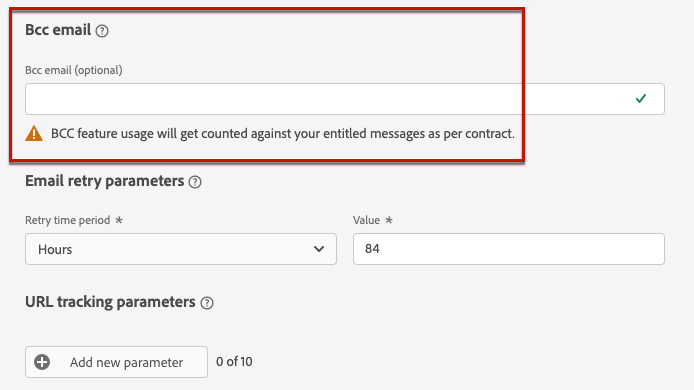

# Definir configurações de email {#email-settings}

Defina as configurações de email na seção dedicada da configuração da superfície do canal (ou seja, predefinição de mensagem). Saiba como criar superfícies no [esta seção](channel-surfaces.md).

## Tipo de email {#email-type}

>[!CONTEXTUALHELP]
>id="ajo_admin_presets_emailtype"
>title="Definir a categoria de email"
>abstract="Selecione o tipo de mensagem que será enviada ao usar esta superfície: Marketing para mensagens promocionais, que exigem consentimento do usuário, ou Transacional para mensagens não comerciais, que também podem ser enviadas para perfis sem assinatura em contextos específicos."

No **TIPO DE EMAIL** selecione o tipo de mensagem que será enviada com a superfície: **Marketing** ou **Transacional**.

* Choose **Marketing** para email promocional: essas mensagens exigem o consentimento do usuário.

* Choose **Transacional** para email não comercial, como confirmação de pedido, notificações de redefinição de senha ou informações de delivery, por exemplo.

>[!CAUTION]
>
>**Transacional** os emails podem ser enviados a perfis que cancelaram a assinatura das comunicações de marketing. Essas mensagens só podem ser enviadas em contextos específicos.

When [criação de uma mensagem](../messages/get-started-content.md#create-new-message), você deve escolher uma superfície de canal válida que corresponda à categoria selecionada para seu email.

## Subdomínio e pool IP {#subdomains-and-ip-pools}

No **DETALHES DO SUBDOMÍNIO E DO POOL IP** na seção , você deve:

1. Selecione o subdomínio a ser usado para enviar os emails. [Saiba mais](about-subdomain-delegation.md)

1. Selecione o pool IP a ser associado à superfície. [Saiba mais](ip-pools.md)

Não é possível continuar com a criação da superfície enquanto o pool de IP selecionado estiver em [edição](ip-pools.md#edit-ip-pool) (**[!UICONTROL Processing]** e nunca foi associado ao subdomínio selecionado. Caso contrário, a versão mais antiga da associação do pool de IP/subdomínio ainda será usada. Se esse for o caso, salve a superfície como rascunho e tente novamente depois que o pool de IP tiver a tag **[!UICONTROL Success]** status.

>[!NOTE]
>
>Para ambientes não relacionados à produção, o Adobe não cria subdomínios de teste prontos para uso nem concede acesso a um pool IP de envio compartilhado. Você precisa [delegar seus próprios subdomínios](delegate-subdomain.md) e usar os IPs do pool atribuído à sua organização.

## List-Unsubscribe {#list-unsubscribe}

Em [selecionar um subdomínio](#subdomains-and-ip-pools) na lista, a variável **[!UICONTROL Enable List-Unsubscribe]** será exibida.

Essa opção está ativada por padrão.

Se você deixá-lo ativado, um link de cancelamento de subscrição será incluído automaticamente no cabeçalho do email, como:

Se você desativar esta opção, nenhum link de cancelamento de subscrição será exibido no cabeçalho do email.

O link de cancelamento de subscrição consiste em dois elementos:

* Um **cancelar inscrição do endereço de email**, para a qual todas as solicitações de cancelamento de subscrição são enviadas.

   Em [!DNL Journey Optimizer], o endereço de email de cancelamento de inscrição é o padrão **[!UICONTROL Mailto (unsubscribe)]** endereço exibido na superfície do canal, com base na variável [subdomínio selecionado](#subdomains-and-ip-pools).

   

* O **cancelar inscrição do URL**, que é o URL da landing page onde o usuário será redirecionado depois de cancelado a assinatura.

   Se você adicionar um [link para opção de não participação com um clique](../messages/consent.md#one-click-opt-out) para uma mensagem criada usando essa superfície, o URL de cancelamento de inscrição será o URL definido para o link de recusa de um clique.

   

   >[!NOTE]
   >
   >Se você não adicionar um link para opção de não participação com um clique no conteúdo da mensagem, nenhuma landing page será exibida para o usuário.

Saiba mais sobre como adicionar um link de cancelamento de subscrição de cabeçalho às suas mensagens em [esta seção](../messages/consent.md#unsubscribe-header).

<!--Select the **[!UICONTROL Custom List-Unsubscribe]** option to enter your own Unsubscribe URL and/or your own Unsubscribe email address.(to add later)-->

## Parâmetros de cabeçalho{#email-header}

No **[!UICONTROL HEADER PARAMETERS]** , insira os nomes do remetente e os endereços de email associados ao tipo de emails enviados usando essa superfície.

>[!CAUTION]
>
>Os endereços de email devem usar o [subdomínio delegado](about-subdomain-delegation.md).

* **[!UICONTROL Sender name]**: O nome do remetente, como o nome da sua marca.

* **[!UICONTROL Sender email]**: O endereço de email que deseja usar para suas comunicações. Por exemplo, se o subdomínio delegado for *marketing.luma.com*, você pode usar *contact@marketing.luma.com*.

* **[!UICONTROL Reply to (name)]**: O nome que será usado quando o recipient clicar no **Responder** no software cliente de email.

* **[!UICONTROL Reply to (email)]**: O endereço de email que será usado quando o recipient clicar no link **Responder** no software cliente de email. Você deve usar um endereço definido no subdomínio delegado (por exemplo, *reply@marketing.luma.com*), caso contrário, os emails serão descartados.

* **[!UICONTROL Error email]**: Todos os erros gerados pelos ISPs após alguns dias de envio de email (rejeições assíncronas) são recebidos neste endereço.

>[!NOTE]
>
>Os endereços devem começar com uma letra (A-Z) e só podem conter caracteres alfanuméricos. Você também pode usar o sublinhado `_`, ponto`.` e hífen `-` caracteres.

### Encaminhar email {#forward-email}

Se quiser encaminhar para um endereço de email específico todos os emails recebidos por [!DNL Journey Optimizer] para o subdomínio delegado, entre em contato com o Atendimento ao Cliente do Adobe. Você precisará fornecer:

* O endereço de email de encaminhamento de sua escolha. Observe que o domínio de endereço de email de encaminhamento não pode corresponder a qualquer subdomínio delegado ao Adobe.
* O nome da sua caixa de proteção.
* O nome de superfície para o qual o endereço de email de encaminhamento será usado.
* O atual **[!UICONTROL Reply to (email)]** endereço definido no nível da superfície do canal.

>[!NOTE]
>
>Só pode haver um endereço de email de encaminhamento por subdomínio. Consequentemente, se várias superfícies usarem o mesmo subdomínio, o mesmo endereço de email de encaminhamento deve ser usado para todos eles.

O endereço de email de encaminhamento será configurado pelo Adobe. Isso pode levar de 3 a 4 dias.

## Email CCO {#bcc-email}

Você pode enviar uma cópia idêntica (ou cópia oculta de carbono) de emails enviados por [!DNL Journey Optimizer] para uma caixa de entrada do CCO, onde serão armazenados para fins de conformidade ou arquivamento.

Para fazer isso, ative a **[!UICONTROL BCC EMAIL]** recurso opcional no nível da superfície do canal. [Saiba mais](bcc-email.md)

## Parâmetros de nova tentativa de email {#email-retry}

>[!CONTEXTUALHELP]
>id="ajo_admin_presets_retryperiod"
>title="Ajustar o período de tempo de nova tentativa"
>abstract="As tentativas são executadas por 3,5 dias (84 horas) quando um delivery de email falha devido a um erro temporário de devolução temporária. Você pode ajustar esse período de tentativas padrão para atender melhor às suas necessidades."
>additional-url="https://experienceleague.adobe.com/docs/journey-optimizer/using/configuration/configuration-message/email-configuration/monitor-reputation/retries.html" text="Sobre tentativas"

Você pode configurar o **PARÂMETROS DE TENTATIVA DE EMAIL**.

Por padrão, a variável [período de tempo de nova tentativa](retries.md#retry-duration) está definida para 84 horas, mas você pode ajustar essa configuração para melhor atender às suas necessidades.

Você deve inserir um valor inteiro (em horas ou minutos) dentro do seguinte intervalo:

* Para emails de marketing, o período mínimo de nova tentativa é de 6 horas.
* Para emails transacionais, o período mínimo de nova tentativa é de 10 minutos.
* Para ambos os tipos de email, o período máximo de tentativas é de 84 horas (ou 5040 minutos).

Saiba mais sobre tentativas em [esta seção](retries.md).

## Rastreamento de URL {#url-tracking}

>[!CONTEXTUALHELP]
>id="ajo_admin_preset_utm"
>title="Definir parâmetros de rastreamento de URL"
>abstract="Use esta seção para anexar automaticamente parâmetros de rastreamento aos URLs presentes no seu conteúdo de email. Este recurso é opcional."

>[!CONTEXTUALHELP]
>id="ajo_admin_preset_url_preview"
>title="Visualizar parâmetros de rastreamento do URL"
>abstract="Analise como os parâmetros de rastreamento serão anexados aos URLs presentes no seu conteúdo de email."

Você pode usar **[!UICONTROL URL TRACKING PARAMETERS]** para medir a eficácia de seus esforços de marketing em todos os canais. Este recurso é opcional.

Os parâmetros definidos nesta seção serão anexados ao final dos URLs incluídos no conteúdo da mensagem de email. Em seguida, você pode capturar esses parâmetros em ferramentas de análise da Web, como Adobe Analytics ou Google Analytics, e criar vários relatórios de desempenho.

Três parâmetros de rastreamento de URL são preenchidos automaticamente como um exemplo ao criar uma superfície de canal. Você pode editá-los e adicionar até 10 parâmetros de rastreamento usando o **[!UICONTROL Add new parameter]** botão.

Para configurar um parâmetro de rastreamento de URL, você pode inserir diretamente os valores desejados no **[!UICONTROL Name]** e **[!UICONTROL Value]** campos.

<!--You can also choose from a list of predefined values by navigating to the following objects:
* Journey attributes: **Source id**, **Source name**, **Source version id**
* Action attributes: **Action id**, **Action name**
* Offer decisioning attributes: **Offer id**, **Offer name**

>[!CAUTION]
>
>Do not select a folder: make sure to browse to the necessary folder and select a profile attribute to use as a tracking parameter value.-->

Também é possível editar cada **[!UICONTROL Value]** usando o [Editor de expressão](../personalization/personalization-build-expressions.md). Clique no ícone de edição para abrir o editor. A partir daí, é possível selecionar os atributos contextuais de sua escolha e/ou editar diretamente o texto.

>[!NOTE]
>
>É possível combinar a digitação de valores de texto e o uso de atributos contextuais no Editor de expressão. Cada **[!UICONTROL Value]** pode conter até 255 caracteres no total.

<!--You can drag and drop the parameters to reorder them.-->

Abaixo estão exemplos de URLs compatíveis com Adobe Analytics e Google Analytics.

* URL compatível com Adobe Analytics: `www.YourLandingURL.com?cid=email_AJO_{{context.system.source.id}}_image_{{context.system.source.name}}`

* URL compatível com Google Analytics: `www.YourLandingURL.com?utm_medium=email&utm_source=AJO&utm_campaign={{context.system.source.id}}&utm_content=image`

Você pode visualizar dinamicamente o URL de rastreamento resultante. Cada vez que você adiciona, edita ou remove um parâmetro, a visualização é atualizada automaticamente.

