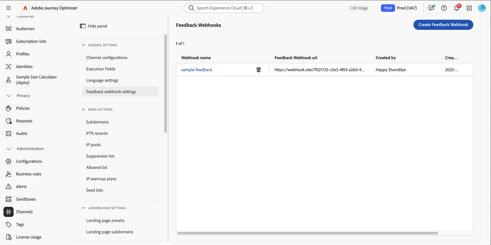

# Criar webhooks de feedback para campanhas acionadas por API {#webhooks}

Os webhooks de feedback permitem que você receba atualizações de status em tempo real para mensagens enviadas por meio de campanhas acionadas por API transacional. Ao configurar um webhook, você pode receber automaticamente os resultados do delivery diretamente para seus sistemas, permitindo monitoramento, registro e processamento automatizado.

Você pode gerenciar configurações de webhook no menu **[!UICONTROL Administração]** / **[!UICONTROL Canais]** / **[!UICONTROL Configurações de webhook de comentários]**.



>[!NOTE]
>Somente uma configuração de webhook por combinação de **Organização + sandbox** é permitida.

## Criar um webhook de feedback

Para criar um webhook, siga estas etapas:

1. Navegue até **[!UICONTROL Administração]** / **[!UICONTROL Canais]** / **[!UICONTROL Configurações do webhook de comentários]**.

1. Clique em **Criar Webhook de Feedback**.

1. Na seção **[!UICONTROL Configuração Básica]**, forneça os seguintes detalhes:

   

   * **Nome do Webhook** - Insira um nome descritivo para identificar o webhook.
   * **Canais** - Selecione os canais para os quais este webhook deve receber feedback (Email e/ou SMS).
   * **URL do Webhook** - Forneça o ponto de extremidade HTTPS onde os eventos de comentários devem ser entregues.

1. Na seção **[!UICONTROL Autenticação]**, selecione o método de autenticação:

   

   * **Sem Autenticação** - Nenhum cabeçalho de autenticação foi adicionado.
   * **Autenticação JWT** - Forneça os detalhes necessários se o ponto de extremidade exigir autenticação JWT.

1. Na seção **[!UICONTROL Parâmetros de cabeçalho]**, configure cabeçalhos personalizados adicionais para serem enviados com cada solicitação de webhook.

   

1. Clique em **[!UICONTROL Enviar]** para salvar a configuração.

>[!NOTE]
>
>Você pode editar um webhook a qualquer momento. Para fazer isso, abra-o no inventário e clique no botão **[!UICONTROL Editar]**.

## Estrutura de carga do Webhook

Após a execução de uma mensagem, **[!DNL Journey Optimizer]** envia a seguinte carga para o ponto de extremidade configurado.

```
{
  "requestId": "8NoByJneShCdCGRnrGS1t1m3CdA73dhR",
  "imsOrg": "myImsOrg",
  "sandbox": {
    "id": "068abf40-575e-11ea-8512-9b1bfdb82603",
    "name": "prod"
  },
  "channel": "email",
  "eventType": "message.feedback",
  "messageExecution": {
    "messageExecutionID": "HUMA-26362805",
    "messageType": "transactional",
    "campaignID": "16f24a15-7e21-477c-848a-d5695ca7f137",
    "campaignVersionID": "2ca10c10-56dd-4505-87cd-fa5da84e7a5d"
  },
  "messageDeliveryFeedback": {
    "feedbackStatus": {
      "value": "bounce"
    },
    "offers": null,
    "messageExclusion": null,
    "messageFailure": {
      "category": "sync",
      "type": "Ignored",
      "code": "25",
      "reason": "Admin Failure"
    },
    "retryCount": 0
  },
  "identityMap": {
    "email": [
      {
        "id": "john.doe@luma.com",
        "primary": true
      }
    ]
  }
}
```

O webhook pode capturar os seguintes eventos:

* Enviado
* Entregues
* Rejeição (veja o exemplo acima)
* Erros

Cada solicitação recebida também inclui uma requestId exclusiva enviada de volta para o webhook.

## Próximas etapas {#next}

Depois que um webhook de feedback for criado, você poderá habilitá-lo ao configurar um público da **campanha** acionada pela API transacional. Saiba mais nesta seção: [Habilitar webhooks](../campaigns/api-triggered-campaign-audience.md#webhook)
