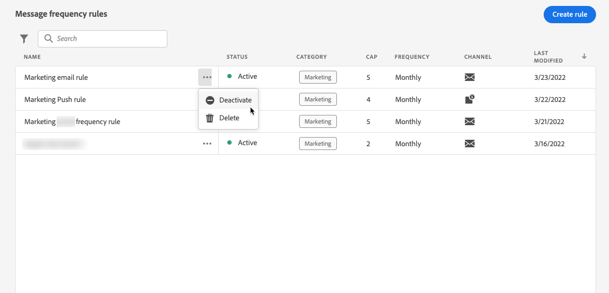

# Regras de frequência de mensagem {#frequency-rules}

[!DNL Journey Optimizer] permite controlar a frequência com que os usuários receberão uma mensagem ou inserirão em uma jornada, definindo regras entre canais que excluirão automaticamente perfis excessivamente solicitados de mensagens e ações.

Por exemplo, você não quer que sua marca envie mais de 3 mensagens de marketing por mês para seus clientes.

Para fazer isso, você pode usar uma regra de frequência que limitará o número de mensagens enviadas com base em um ou mais canais durante um período de calendário mensal.

>[!NOTE]
>
>As regras de frequência de mensagem são diferentes do gerenciamento de recusa, que permite que os usuários cancelem a assinatura do recebimento de comunicações de uma marca. [Saiba mais](../messages/consent.md#opt-out-management)

## Regras de acesso {#access-rules}

As regras estão disponíveis na **[!UICONTROL Administration]** > **[!UICONTROL Rules]** menu. Todas as regras são listadas, classificadas por data de modificação.

<!--To access, create, edit or delete message frequency rules, you must have the message configuration permission. [Learn more](../administration/high-low-permissions.md#administration-permissions)-->

Use o ícone de filtro para filtrar na categoria, no status e/ou no canal. Você também pode pesquisar no rótulo da mensagem.

## Criar uma regra {#create-new-rule}

Para criar uma nova regra, siga as etapas abaixo.

1. Acesse o **[!UICONTROL Message frequency rules]** e, em seguida, clique em **[!UICONTROL Create rule]**.

   

1. Defina o nome da regra.

   

1. Selecione a categoria da regra de mensagem.

   >[!NOTE]
   >
   >Atualmente, somente o **[!UICONTROL Marketing]** está disponível.

1. Defina o limite para sua regra, o que significa o número máximo de mensagens que podem ser enviadas para um perfil de usuário individual a cada mês.

   

   >[!NOTE]
   >
   >O limite de frequência baseia-se num período de calendário mensal. Ele é redefinido no início de cada mês.

1. Selecione o canal que deseja usar para esta regra: **[!UICONTROL Email]** ou **[!UICONTROL Push notification]**.

   

   >[!NOTE]
   >
   >Você deve selecionar pelo menos um canal para criar a regra.

1. Selecione vários canais se desejar aplicar o limite em todos os canais selecionados como uma contagem total.

   Por exemplo, defina o limite como 15 e selecione os canais de email e push. Se um perfil já tiver recebido 10 emails de marketing e 5 notificações por push de marketing, ele será excluído do próximo delivery de qualquer email de marketing ou notificação por push.

1. Clique em **[!UICONTROL Save as draft]** para confirmar a criação da regra. Sua mensagem é adicionada na lista de regras, com a variável **[!UICONTROL Draft]** status.

   

## Ativar uma regra {#activate-rule}

Para ativar uma regra de frequência de mensagem, clique nas reticências ao lado da regra e selecione **[!UICONTROL Activate]**.

Ativar uma regra afetará as mensagens que ela se aplicar à próxima execução. Saiba como [aplicar uma regra de frequência a uma mensagem](#apply-frequency-rule).

>[!NOTE]
>
>Não é necessário modificar ou republicar mensagens ou jornadas para que uma regra entre em vigor.

Para desativar uma regra de frequência de mensagem, clique nas reticências ao lado da regra e selecione **[!UICONTROL Deactivate]**.

O status da regra será alterado para **[!UICONTROL Inactive]** e a regra não se aplicará a execuções futuras de mensagens. As mensagens atualmente em execução não serão afetadas.

>[!NOTE]
>
>Desativar uma regra não afeta ou redefine nenhuma contagem em perfis individuais.

## Aplicar uma regra de frequência a uma mensagem {#apply-frequency-rule}

Para aplicar uma regra de frequência a uma mensagem, basta selecionar a categoria definida para essa regra quando [criação da mensagem](../messages/get-started-content.md#create-new-message).

Ao selecionar a variável **[!UICONTROL Marketing]** categoria , todas as regras de frequência de mensagem correspondentes serão automaticamente aplicadas a essa mensagem.

<!--Clicking the link out button next to the category selector will jump you over to the rules inventory screen to see which rules will be applied to the message.-->

Você pode visualizar o número de perfis excluídos do delivery na [Exibições ao vivo e globais](../reports/message-monitoring.md)e no [relatório ao vivo por email](../reports/email-live-report.md), onde as regras de frequência serão listadas como um possível motivo para os usuários excluídos do delivery.

## Exemplo

Você pode combinar várias regras de frequência de mensagem, como descrito no exemplo abaixo.

1. Crie uma regra chamada *Limite geral de marketing*:

   * Selecione todos os canais (Email, Push).
   * Defina o limite como 12.

1. Para restringir ainda mais o número de notificações por push baseadas em marketing enviadas por um usuário, crie uma segunda regra chamada *Limite o push de marketing*:

   * Selecione Canal de push.
   * Defina o limite como 4.

Neste cenário, um perfil individual pode receber até 12 mensagens de marketing por mês, mas será excluído das notificações de push de marketing depois de receber 4 notificações por push.
