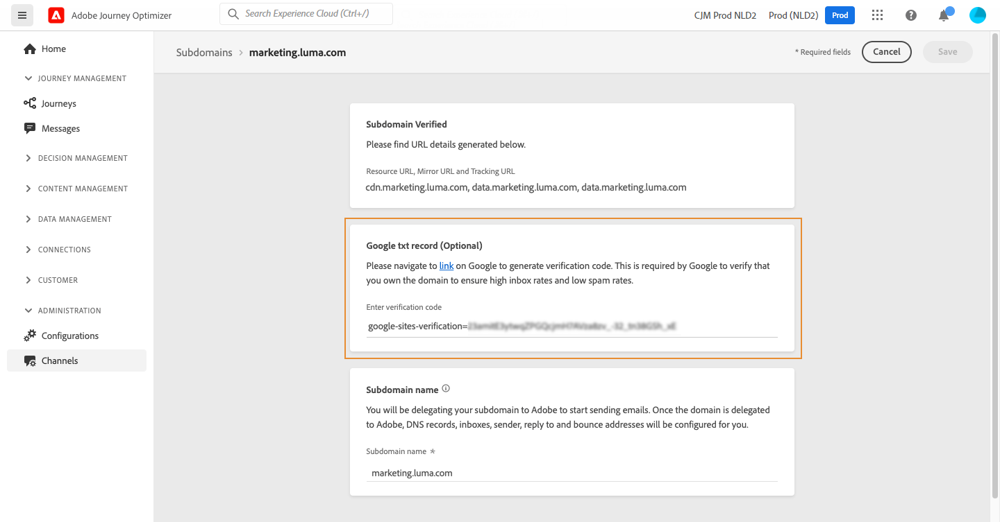

# Adicionar um registro TXT do Google a um subdomínio {#google-txt-record}

>[!CONTEXTUALHELP]
>id="ajo_admin_subdomain_google"
>title="Registros TXT do Google"
>abstract="Para garantir o delivery bem-sucedido de emails para endereços Gmail, você pode adicionar registros TXT de verificação de site do Google ao seu subdomínio para garantir que eles sejam verificados."

Os registros TXT são um tipo de registro DNS usado para fornecer informações de texto sobre um domínio, que pode ser lido por fontes externas.

Para garantir o delivery ideal e o delivery bem-sucedido de emails para endereços Gmail, [!DNL Journey Optimizer] O permite adicionar registros especiais TXT de verificação do site do Google ao seu subdomínio para garantir que ele seja verificado.

>[!CAUTION]
>
> Essa operação só pode ser executada depois que um subdomínio tiver a variável **[!UICONTROL Success]** status. Para obter mais informações sobre os status dos subdomínios, consulte [esta seção](access-subdomains.md).

Para adicionar um registro TXT do Google ao seu subdomínio, siga estas etapas:

1. Abra o subdomínio do **[!UICONTROL Channels]** / **[!UICONTROL Subdomains]** menu.

1. No **[!UICONTROL Google txt record]** , digite o código de verificação gerado a partir de [Google Workspace](https://support.google.com/a/answer/183895){target=&quot;_blank&quot;}<!--G Suite Admin tools-->, depois clique em **[!UICONTROL Save]**.

   

1. Depois de adicionado, o registro TXT deve ser verificado pelo Google. Para fazer isso, navegue até [Google Workspace](https://support.google.com/a/answer/183895){target=&quot;_blank&quot;}<!--G Suite Admin tools-->e inicie a etapa de verificação.
