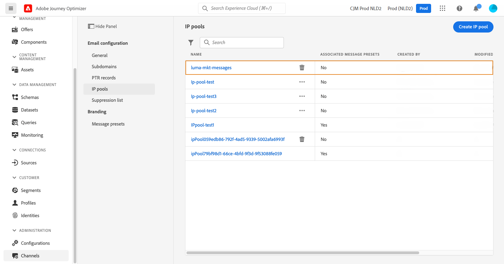

# Criar pools de IP

## Sobre pools de IP

Com o Journey Optimizer, você pode criar pools de IP para agrupar os endereços IP dos subdomínios.

A criação de pools de IP é altamente recomendável para a capacidade de delivery de email. Ao fazer isso, é possível evitar que a reputação de um subdomínio afete seus outros subdomínios.

Por exemplo, uma prática recomendada é ter um pool de IP para suas mensagens de marketing e outro para suas mensagens transacionais. Dessa forma, se uma de suas mensagens de marketing tiver um desempenho ruim e for declarada como spam por um cliente, isso não afetará as mensagens transacionais enviadas para esse mesmo cliente, que ainda receberá mensagens transacionais (confirmações de compra, mensagens de recuperação de senha etc.).

## Criar um pool IP

Para criar um pool IP, siga estas etapas:

1. Acesse o menu **[!UICONTROL Channels]** / **[!UICONTROL IP pools]** e clique em **[!UICONTROL Create IP Pool]**.

   

1. Forneça um nome e uma descrição (opcional) para o pool de IP.

   >[!NOTE]
   >
   >O nome do subdomínio deve começar com uma letra (A-Z) e incluir somente caracteres alfanuméricos ou caracteres especiais ( _, ., - ).

1. Selecione os endereços IP a serem incluídos no pool na lista suspensa e clique em **[!UICONTROL Submit]**.

   

   >[!NOTE]
   >
   >Todos os endereços IP provisionados com sua instância estão disponíveis na lista.

O pool IP agora é criado e exibido na lista. Você pode selecioná-la para acessar suas propriedades e exibir a predefinição de mensagem associada. Para obter mais informações sobre como associar uma predefinição de mensagem a um pool de IP, consulte [esta seção](message-presets.md)).

Para editar um pool IP, abra-o e edite suas propriedades conforme desejado.

>[!NOTE]
>
>Se uma predefinição de mensagem tiver sido associada ao pool de IP, primeiro é necessário removê-la antes de editar o pool de IP. Depois que as modificações forem feitas, você poderá associar a predefinição de mensagem novamente.
