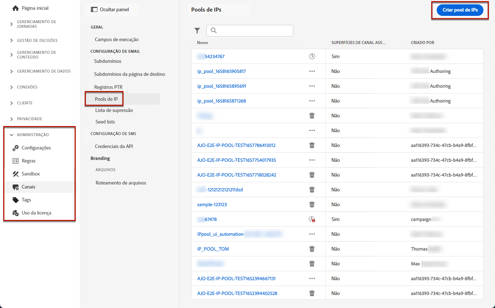

# Criar pools de IP {#create-ip-pools}

>[!CONTEXTUALHELP]
>id="ajo_admin_ip_pool"
>title="Configurar um pool IP"
>abstract="Você pode criar pools de IP para agrupar os endereços IP de seus subdomínios para melhorar a capacidade de delivery de email."

## Sobre pools de IP {#about-ip-pools}

Com [!DNL Journey Optimizer], é possível criar pools de IP para agrupar os endereços IP dos subdomínios.

A criação de pools de IP é altamente recomendável para a capacidade de delivery de email. Ao fazer isso, é possível evitar que a reputação de um subdomínio afete seus outros subdomínios.

Por exemplo, uma prática recomendada é ter um pool de IP para suas mensagens de marketing e outro para suas mensagens transacionais. Dessa forma, se uma de suas mensagens de marketing tiver um desempenho ruim e for declarada como spam por um cliente, isso não afetará as mensagens transacionais enviadas para esse mesmo cliente, que ainda receberá mensagens transacionais (confirmações de compra, mensagens de recuperação de senha etc.).

## Criar um pool IP {#create-ip-pool}

Para criar um pool IP, siga estas etapas:

1. Acesse o **[!UICONTROL Administration]** > **[!UICONTROL Channels]** > **[!UICONTROL IP pools]** , em seguida, clique em **[!UICONTROL Create IP Pool]**.

   

1. Forneça um nome e uma descrição (opcional) para o pool de IP.

   >[!NOTE]
   >
   >O nome deve começar com uma letra (A-Z) e incluir somente caracteres alfanuméricos ou caracteres especiais ( _, ., - ).

1. Selecione os endereços IP a serem incluídos no pool na lista suspensa e clique em **[!UICONTROL Submit]**.

   

   >[!NOTE]
   >
   >Todos os endereços IP provisionados com sua instância estão disponíveis na lista.

O pool IP agora é criado e exibido na lista. Você pode selecioná-lo para acessar suas propriedades e exibir a superfície do canal associada (ou seja, predefinição de mensagem). Para obter mais informações sobre como associar uma superfície de canal a um pool de IP, consulte [esta seção](message-presets.md).

## Editar um pool de IP {#edit-ip-pool}

Para editar um pool IP:

1. Na lista, clique no nome do pool de IP para abri-lo.

   

1. Edite as propriedades conforme desejado. Você pode modificar a descrição e adicionar ou remover endereços IP.

   >[!NOTE]
   >
   >O nome do pool IP não é editável. Se quiser modificá-lo, é necessário excluir o pool de IP e criar outro com o nome de sua escolha.

   

   >[!CAUTION]
   >
   >Continue com muito cuidado ao considerar a exclusão de um IP, pois isso colocará carga adicional nos outros IPs e poderá ter impactos graves na capacidade de entrega. Em caso de dúvidas, entre em contato com um especialista em capacidade de delivery.

1. Salve as alterações.

A atualização entra em vigor imediatamente ou de forma assíncrona, dependendo do pool de IP que está sendo associado a um [superfície do canal](message-presets.md) ou não:

* Se o pool IP for **not** associada a qualquer superfície do canal, a atualização é instantânea (**[!UICONTROL Success]** status).
* Se o pool IP **é** associada a uma superfície de canal, a atualização pode levar até 3 horas (**[!UICONTROL Processing]** status).

>[!NOTE]
>
>When [criação de uma superfície de canal](message-presets.md#create-message-preset), se você selecionar um pool IP sob edição (**[!UICONTROL Processing]** ) e nunca tiver sido associado ao subdomínio selecionado para essa superfície, você não poderá continuar com a criação da superfície. [Saiba mais](message-presets.md#subdomains-and-ip-pools)

Para verificar o status de atualização do pool de IP, clique no botão **[!UICONTROL More actions]** e selecione **[!UICONTROL Recent updates]**.

>[!NOTE]
>
>Depois que um Pool de IP for atualizado com êxito, talvez seja necessário aguardar:
>* alguns minutos antes de ser consumido pelas mensagens unitárias,
>* até o próximo lote para que o pool de IP seja eficaz em mensagens em lote.

Também é possível usar a variável **[!UICONTROL Delete]** para excluir um pool IP. Observe que não é possível excluir um pool IP que foi associado a uma superfície de canal.

