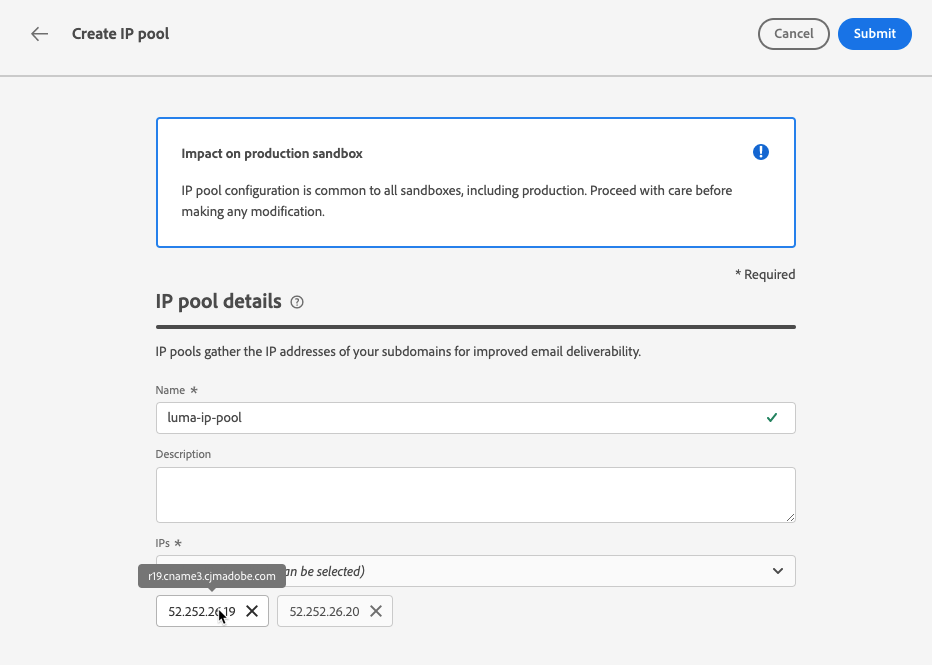

# Criar pools de IP {#create-ip-pools}

>[!CONTEXTUALHELP]
>id="ajo_admin_ip_pool_header"
>title="Configurar um pool de IP"
>abstract="Os pools de IP coletam os endereços IP de seus subdomínios para melhorar a capacidade de entrega de email."

>[!CONTEXTUALHELP]
>id="ajo_admin_ip_pool"
>title="Configurar um pool de IP"
>abstract="Com o Journey Optimizer, você pode criar pools de IP para agrupar os endereços IP dos subdomínios. Esses pools podem melhorar bastante a capacidade de entrega de email, porque você pode impedir que a reputação de um subdomínio afete seus outros subdomínios."

## Sobre pools de IP {#about-ip-pools}

Com [!DNL Journey Optimizer], você poderá criar pools de IP para agrupar os endereços IP de seus subdomínios.

A criação de pools de IP é altamente recomendada para a capacidade de entrega de email. Ao fazer isso, você pode impedir que a reputação de um subdomínio afete seus outros subdomínios.

Por exemplo, uma prática recomendada é ter um pool de IP para suas mensagens de marketing e outro para suas mensagens transacionais. Dessa forma, se uma de suas mensagens de marketing funcionar mal e for declarada como spam por um cliente, isso não afetará as mensagens transacionais enviadas para esse mesmo cliente, que ainda receberá mensagens transacionais (confirmações de compra, mensagens de recuperação de senha etc.).

>[!CAUTION]
>
>A configuração do pool de IP é comum a todos os ambientes. Portanto, qualquer criação ou edição de pool de IP também afetará as sandboxes de produção.

## Criar um pool de IPs {#create-ip-pool}

Para criar um pool de IPs, siga estas etapas:

1. Acesse o **[!UICONTROL Administração]** > **[!UICONTROL Canais]** > **[!UICONTROL Pools de IP]** e clique em **[!UICONTROL Criar pool de IPs]**.

   

1. Forneça um nome e uma descrição (opcional) para o pool de IP.

   >[!NOTE]
   >
   >O nome deve começar com uma letra (A-Z) e incluir apenas caracteres alfanuméricos ou caracteres especiais ( _, ., - ).

1. Selecione os endereços IP a serem incluídos no pool na lista suspensa e clique em **[!UICONTROL Enviar]**.

   

   >[!NOTE]
   >
   >Todos os endereços IP provisionados com sua instância estão disponíveis na lista.

Ao selecionar IPs, você pode ver na lista os registros PTR associados aos IPs. Isso permite verificar as informações de marca de cada IP ao criar um pool de IPs e selecionar IPs com as mesmas informações de marca, por exemplo. [Saiba mais sobre registros PTR](ptr-records.md)

>[!NOTE]
>
>Se nenhum registro PTR estiver configurado para um IP, não será possível selecionar esse IP. Entre em contato com o representante da Adobe para configurar o registro PTR desse IP.

Após a criação de um pool de IP, as informações de PTR ficam visíveis ao passar o mouse sobre os endereços IP exibidos abaixo da lista suspensa Pool de IPs.

O pool de IPs agora é criado e exibido na lista. Você pode selecioná-la para acessar suas propriedades e exibir a superfície de canal associada (ou seja, predefinição de mensagem). Para obter mais informações sobre como associar uma superfície de canal a um pool de IP, consulte [nesta seção](channel-surfaces.md).

## Editar um pool de IPs {#edit-ip-pool}

Para editar um pool de IPs, siga as etapas abaixo.

1. Na lista, clique no nome do pool de IPs para abri-lo.

   

1. Edite as propriedades conforme desejado. Você pode modificar a descrição e adicionar ou remover endereços IP.

   >[!NOTE]
   >
   >O nome do pool de IPs não pode ser editado. Se quiser modificá-lo, exclua o pool de IPs e crie outro com o nome de sua escolha.

   

   >[!CAUTION]
   >
   >Continue com muito cuidado ao considerar a exclusão de um IP, pois isso colocará carga adicional nos outros IPs e poderá ter graves impactos na sua capacidade de delivery. Em caso de dúvidas, entre em contato com um especialista em capacidade de entrega.

1. Salve as alterações.

A atualização é efetiva imediatamente ou de forma assíncrona, dependendo do pool de IP que está associado a um [superfície de canal](channel-surfaces.md) ou não:

* Se o pool de IPs estiver **não** associada a qualquer superfície de canal, a atualização é instantânea (**[!UICONTROL Sucesso]** status).
* Se o pool de IP **é** associada a uma superfície de canal, a atualização pode levar até 3 horas (**[!UICONTROL Processando]** status).

>[!NOTE]
>
>Quando [criação de uma superfície de canal](channel-surfaces.md#create-channel-surface), se você selecionar um pool de IP que esteja em edição (**[!UICONTROL Processando]** e nunca foi associado ao subdomínio selecionado para essa superfície, você não pode continuar com a criação da superfície. [Saiba mais](channel-surfaces.md#subdomains-and-ip-pools)

Para verificar o status de atualização do pool de IPs, clique na guia **[!UICONTROL Mais ações]** e selecione **[!UICONTROL Atualizações recentes]**.

>[!NOTE]
>
>Depois que um Pool de IP for atualizado com êxito, talvez seja necessário aguardar:
>* alguns minutos antes de ser consumido pelas mensagens unitárias,
>* até o próximo lote para que o pool de IP seja efetivo em mensagens em lote.

Você também pode usar a variável **[!UICONTROL Excluir]** botão para excluir um pool de IPs. Observe que não é possível excluir um pool de IP que foi associado a uma superfície de canal.

