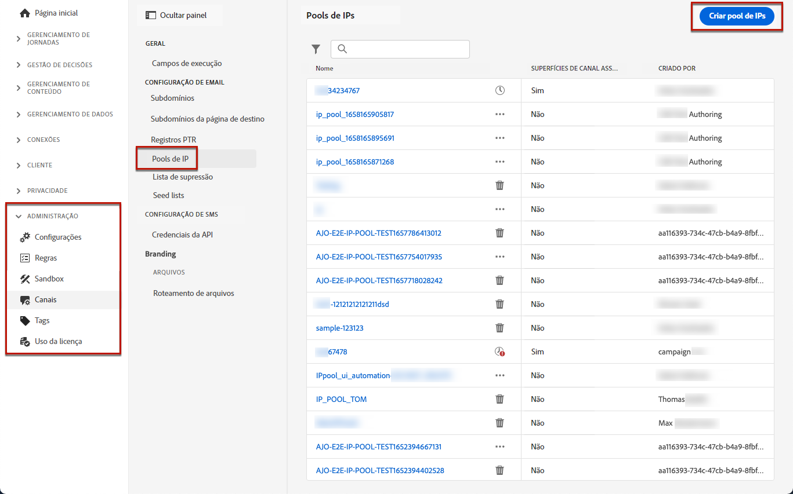

# Criar pools de IP {#create-ip-pools}

>[!BEGINSHADEBOX]

**Nesta página:** Saiba como criar, editar e excluir pools de IP que agrupam seus endereços IP de subdomínio para melhorar a capacidade de entrega de emails e proteger a reputação do remetente.

>[!ENDSHADEBOX]

>[!CONTEXTUALHELP]
>id="ajo_admin_ip_pool_header"
>title="Configurar um pool de IP"
>abstract="Os pools de IP coletam os endereços IP de seus subdomínios para melhorar a capacidade de entrega de email."

>[!CONTEXTUALHELP]
>id="ajo_admin_ip_pool"
>title="Configurar um pool de IP"
>abstract="Com o Journey Optimizer, você pode criar pools de IP para agrupar os endereços IP dos subdomínios. Esses pools podem melhorar bastante a capacidade de entrega de email, porque você pode impedir que a reputação de um subdomínio afete seus outros subdomínios."

## Sobre pools de IP {#about-ip-pools}

Com o [!DNL Journey Optimizer], você pode criar pools de IP para agrupar os endereços IP de seus subdomínios.

A criação de pools de IP é altamente recomendada para a capacidade de entrega de email. Ao fazer isso, você pode impedir que a reputação de um subdomínio afete seus outros subdomínios.

Por exemplo, uma prática recomendada é ter um pool de IP para suas mensagens de marketing e outro para suas mensagens transacionais. Dessa forma, se uma de suas mensagens de marketing funcionar mal e for declarada como spam por um cliente, isso não afetará as mensagens transacionais enviadas para esse mesmo cliente, que ainda receberá mensagens transacionais (confirmações de compra, mensagens de recuperação de senha etc.).

>[!CAUTION]
>
>A configuração do pool de IP é comum a todos os ambientes. Portanto, qualquer criação ou edição de pool de IP também afetará as sandboxes de produção.

## Criar um pool de IPs {#create-ip-pool}

Para criar um pool de IPs, siga estas etapas:

1. Acesse o menu **[!UICONTROL Administração]** > **[!UICONTROL Canais]** > **[!UICONTROL Configurações de email]** > **[!UICONTROL Pools de IP]** e clique em **[!UICONTROL Criar Pool de IP]**.

   

1. Forneça um nome e uma descrição (opcional) para o pool de IP.

   >[!NOTE]
   >
   >O nome deve começar com uma letra (A-Z) e incluir apenas caracteres alfanuméricos ou caracteres especiais ( _, ., - ).

1. Selecione os endereços IP a serem incluídos no pool na lista suspensa e clique em **[!UICONTROL Enviar]**. Todos os endereços IP provisionados com sua instância estão disponíveis na lista.

   

Ao selecionar IPs, você pode ver na lista os registros PTR associados aos IPs. Isso permite verificar as informações de marca de cada IP ao criar um pool de IPs e selecionar IPs com as mesmas informações de marca, por exemplo. [Saiba mais sobre registros PTR](ptr-records.md)

>[!NOTE]
>
>Se nenhum registro PTR estiver configurado para um IP, não será possível selecionar esse IP. Entre em contato com o representante da Adobe para configurar o registro PTR desse IP.<!--Now this only happens when first subdomain delegated to Adobe is with CNAME method.-->

Após a criação de um pool de IP, as informações de PTR ficam visíveis ao passar o mouse sobre os endereços IP exibidos abaixo da lista suspensa Pool de IPs.

O pool de IPs agora é criado e exibido na lista. É possível selecioná-la para acessar suas propriedades e exibir a configuração de canal associada (ou seja, predefinição de mensagem). Para obter mais informações sobre como associar uma configuração de canal a um pool de IP, consulte [esta seção](channel-surfaces.md).

## Editar um pool de IPs {#edit-ip-pool}

Para editar um pool de IPs, siga as etapas abaixo.

1. Na lista, clique no nome do pool de IPs para abri-lo.

1. Edite as propriedades conforme desejado. Você pode modificar a descrição e adicionar ou remover endereços IP. Observe que o nome do pool de IPs não é editável. Para renomeá-lo, exclua o pool e crie um novo.

   

   >[!CAUTION]
   >
   >Continue com muito cuidado ao considerar a exclusão de um IP, pois isso colocará carga adicional nos outros IPs e poderá ter graves impactos na sua capacidade de delivery. Em caso de dúvidas, entre em contato com um especialista em capacidade de entrega.

1. Salve as alterações.

A atualização entra em vigor imediatamente ou de forma assíncrona, dependendo do pool de IP que está associado a uma [configuração de canal](channel-surfaces.md) ou não:

* Se o pool de IPs estiver **não** associado a qualquer configuração de canal, a atualização será instantânea (status **[!UICONTROL Success]**).
* Se o pool de IP **estiver** associado a uma configuração de canal, a atualização poderá levar até 3 horas (status **[!UICONTROL Processando]**).

>[!NOTE]
>
>* Ao [criar uma configuração de canal](channel-surfaces.md#create-channel-surface), se você selecionar um pool de IP no status **[!UICONTROL Processando]** que nunca foi associado ao subdomínio selecionado, não será possível continuar com a criação da configuração. [Saiba mais](channel-surfaces.md#create-channel-surface)
>* Depois que um pool de IP for atualizado com êxito, aguarde alguns minutos para que ele entre em vigor para mensagens em tempo real ou até o próximo trabalho em lote para mensagens em lote.

Para verificar o status de atualização do pool de IP, clique no botão **[!UICONTROL Mais ações]** e selecione **[!UICONTROL Atualizações recentes]**.

Você também pode usar o botão **[!UICONTROL Excluir]** para excluir um pool de IPs. Observe que não é possível excluir um pool de IPs que foi associado a uma configuração de canal.

