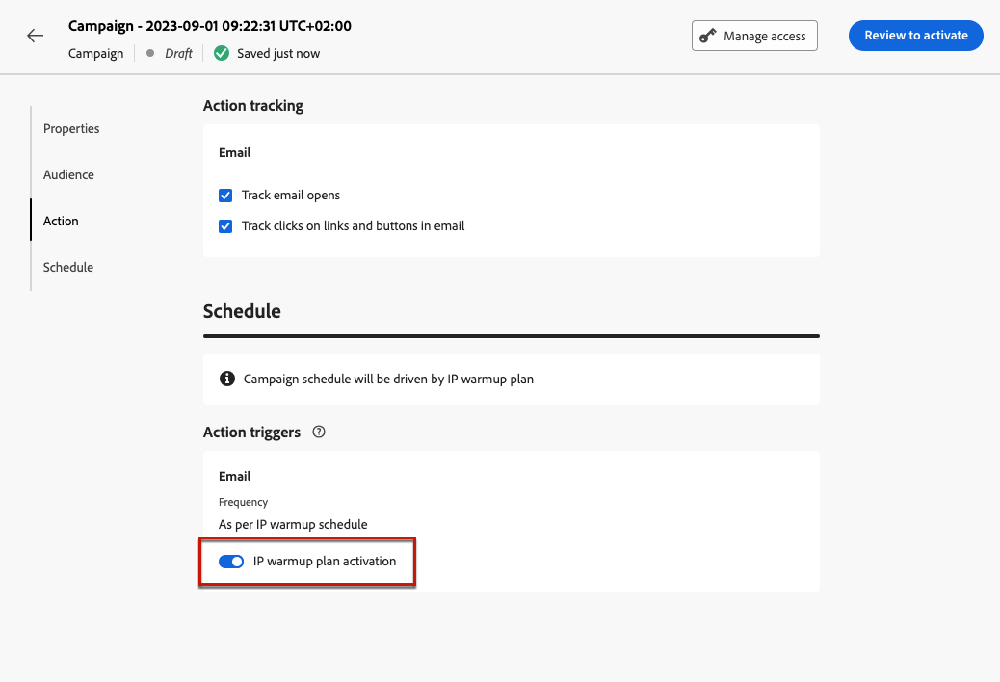

# Criar campanhas de aquecimento de IP {#create-ip-warmup-campaign}

>[!CONTEXTUALHELP]
>id="ajo_campaign_ip_warmup"
>title="Opção Ativar o plano de aquecimento de IP"
>abstract="Ao selecionar essa opção, a campanha pode ser usada em um plano de aquecimento de IP. A programação da campanha será determinada pelo plano de aquecimento de IP ao qual está associada."

>[!BEGINSHADEBOX]

O que há neste guia de documentação:

* [Introdução aos planos de aquecimento de IP](ip-warmup-gs.md)
* **[Criar campanhas de aquecimento de IP](ip-warmup-campaign.md)**
* [Criar um plano de aquecimento de IP](ip-warmup-plan.md)
* [Executar o plano de aquecimento de IP](ip-warmup-execution.md)

>[!ENDSHADEBOX]

Antes de criar o plano de aquecimento de IP em si [!DNL Journey Optimizer], primeiro é necessário criar uma ou mais campanhas especificamente projetadas para uso em um plano de aquecimento de IP<!--through a dedicated option-->.

Para criar uma campanha de aquecimento de IP, siga as etapas abaixo.

1. Criar um [email](../email/email-settings.md) channel [superfície](channel-surfaces.md) para o domínio e os IPs identificados para o seu plano de aquecimento.

   >[!NOTE]
   >
   >Saiba como selecionar o domínio e os IPs a serem usados em uma superfície de email no [nesta seção](../email/email-settings.md#subdomains-and-ip-pools).
   >
   >Trabalhe com seu consultor de entrega para identificar o domínio e os IPs a serem usados para o seu plano de aquecimento de IP.<!--TBC-->

1. Criar um marketing agendado [campaign](../campaigns/create-campaign.md) e selecione o [E-mail](../email/create-email.md#create-email-journey-campaign) ação.

   <!--Select the Marketing category. The IP warmup plan activation option is only available for  marketing-type campaigns.-->

1. Selecione a superfície criada para aquecimento de IP.

   

   <!--You must use the same surface as the one that will be used for the asociated IP warmup plan. [Learn how to create an IP warmup plan](#create-ip-warmup-plan)-->

1. Clique em **[!UICONTROL Criar]**.

1. No **[!UICONTROL Agendar]** , selecione **[!UICONTROL Ativação do plano de aquecimento de IP]**.

   

   A campanha [programação](../campaigns/create-campaign.md#schedule) será orientada pelo plano de aquecimento de IP ao qual será associado, o que significa que a programação não será mais definida na própria campanha.

1. Conclua as etapas para criar uma campanha de email, como definir as propriedades da campanha, [público](../audience/about-audiences.md)<!--best practices for IP warmup in terms of audience?-->, e [conteúdo](../email/get-started-email-design.md#key-steps).

   >[!NOTE]
   >
   >Para obter mais informações sobre como configurar uma campanha, consulte [esta página](../campaigns/get-started-with-campaigns.md).

1. [Ativar](../campaigns/review-activate-campaign.md) a campanha. Seu status muda para **[!UICONTROL Ao vivo]**.

   >[!NOTE]
   >
   >Para uma campanha ativa com o plano de aquecimento de IP ativado, a variável **[!UICONTROL Excluir]** estará disponível até ser associado a um plano de aquecimento de IP. Depois de usada em um plano, a campanha não pode mais ser excluída.

1. A campanha é exibida na janela **[!UICONTROL Campanhas]** lista. Para recuperar facilmente todas as campanhas de aquecimento de IP criadas na sandbox atual, você pode filtrar no **[!UICONTROL Aquecimento de IP]** opção de campanha.

   

Uma vez ativa, a campanha estará pronta para uso em um plano de aquecimento de IP. [Saiba mais](ip-warmup-plan.md)

Uma campanha de aquecimento de IP só pode ser usada em um plano de aquecimento de IP. No entanto, a mesma campanha pode ser usada em uma ou mais fases do mesmo plano de aquecimento de IP. [Saiba mais](ip-warmup-plan.md#define-phases)

>[!NOTE]
>
>Quando uma campanha ao vivo é usada em um plano de aquecimento de IP, depois que o plano é [marcado como concluído](ip-warmup-execution.md#mark-as-completed), o status dessa campanha muda para **[!UICONTROL Parado]**.

