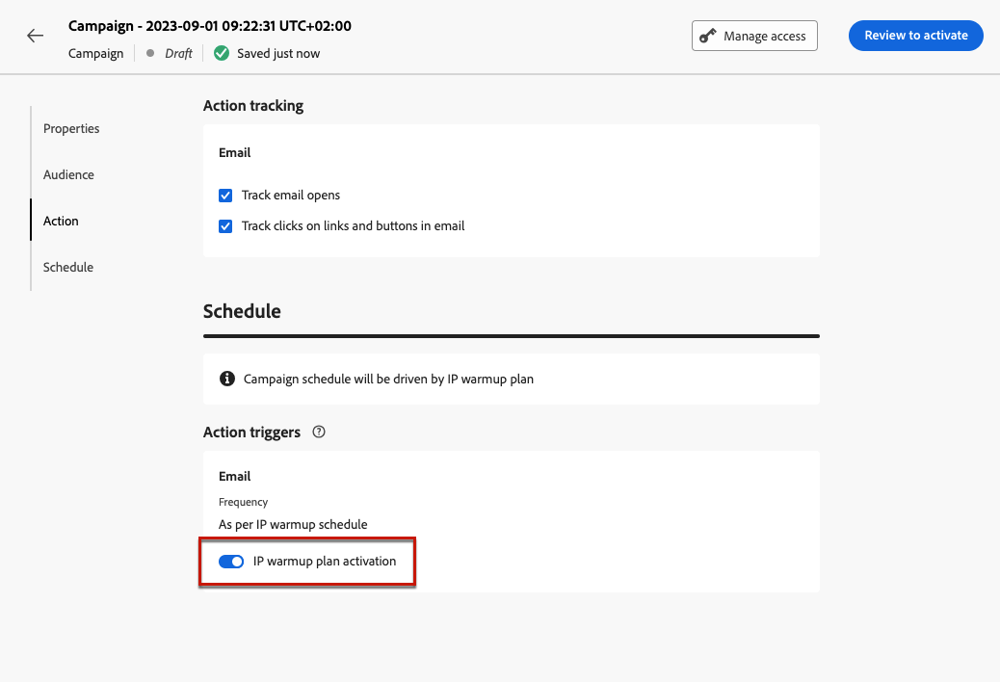
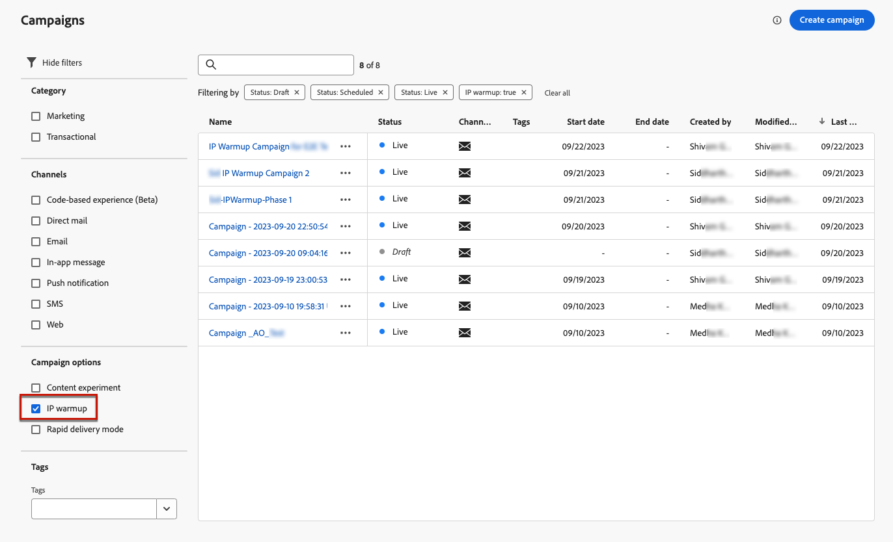

# Criar campanhas de aquecimento de IP {#create-ip-warmup-campaign}

>[!BEGINSHADEBOX]

**Nesta página:** saiba como criar e ativar campanhas de email dedicadas ao aquecimento de IP para que elas possam ser agendadas e usadas em um plano de aquecimento de IP.

>[!ENDSHADEBOX]

>[!CONTEXTUALHELP]
>id="ajo_campaign_ip_warmup"
>title="Opção Ativar o plano de aquecimento de IP"
>abstract="Ao selecionar essa opção, a campanha pode ser usada em um plano de aquecimento de IP. A programação da campanha será determinada pelo plano de aquecimento de IP ao qual está associada."

Antes de criar o plano de aquecimento de IP em si no [!DNL Journey Optimizer], primeiro é necessário criar uma ou mais campanhas especificamente projetadas para uso em um plano de aquecimento de IP<!--through a dedicated option-->.

Para criar uma campanha de aquecimento de IP, siga as etapas abaixo.

1. Crie uma [configuração](channel-surfaces.md) de canal de email para o domínio e os IPs identificados para o seu plano de aquecimento.

   Trabalhe com seu consultor de entrega para identificar o domínio e os IPs a serem usados. Saiba como selecioná-los em uma configuração de email em [esta seção](../email/email-settings.md#ip-pools).

   >[!CAUTION]
   >
   >Não edite a configuração do canal de email depois que o plano de aquecimento de IP tiver [iniciado](ip-warmup-execution.md).

1. Crie uma [campanha](../campaigns/create-campaign.md) de marketing agendado e selecione a ação [Email](../email/create-email.md#create-email).

   <!--Select the Marketing category. The IP warmup plan activation option is only available for  marketing-type campaigns.-->

1. Selecione a configuração criada para o aquecimento de IP.

   

   <!--You must use the same configuration as the one that will be used for the asociated IP warmup plan. [Learn how to create an IP warmup plan](#create-ip-warmup-plan)-->

1. Clique em **[!UICONTROL Criar]**.

1. Na seção **[!UICONTROL Agendar]**, selecione **[!UICONTROL Ativação do plano de aquecimento de IP]**.

   

   A campanha [agenda](../campaigns/campaign-schedule.md) será orientada pelo plano de aquecimento de IP ao qual será associada, o que significa que a agenda não está mais definida na própria campanha.

1. Conclua as etapas para criar uma campanha de email, como definir as propriedades da campanha, [público](../audience/about-audiences.md)<!--best practices for IP warmup in terms of audience?--> e [conteúdo](../email/get-started-email-design.md#key-steps).

   >[!IMPORTANT]
   >
   >Os públicos permitidos em uma campanha de aquecimento de IP devem ser [baseados em segmentos](../audience/creating-a-segment-definition.md) e criados usando a [política de mesclagem padrão](https://experienceleague.adobe.com/pt-br/docs/experience-platform/profile/merge-policies/overview#default-merge-policy){target="_blank"}.
   >
   >Os públicos-alvo de upload de CSV não são compatíveis com campanhas de aquecimento de IP e resultarão em um erro na ativação da campanha.

   Para obter mais informações sobre como configurar uma campanha, consulte [esta página](../campaigns/get-started-with-campaigns.md).

1. Opcionalmente, na seção **[!UICONTROL Otimização]**, adicione regras de direcionamento para fornecer conteúdo diferente a subconjuntos de público com base em atributos de perfil. [Saiba mais](../content-management/optimization-targeting.md)

   Se estiver usando regras de direcionamento, lembre-se do seguinte:

   * O público da campanha de aquecimento de IP é avaliado **uma vez** por meio do ciclo diário de segmentação em lotes. A associação do perfil é corrigida na ativação de execução e não é reavaliada por execução.
   * Os atributos de perfil usados nas regras de direcionamento são lidos no momento em que cada execução é executada, refletindo os dados do perfil em lote assimilados mais recentemente — não as atualizações de perfil em tempo real.

1. [Ativar](../campaigns/review-activate-campaign.md) a campanha. Seu status muda para **[!UICONTROL Live]**.

   >[!NOTE]
   >
   >[Regras de negócio](../conflict-prioritization/rule-sets.md#rule-sets) não devem ser usadas em planos de aquecimento de IP. A aplicação dessas regras pode impedir que se atinja o número desejado de perfis direcionados para campanhas.

   Para uma campanha ativa com o plano de aquecimento de IP ativado, o botão **[!UICONTROL Excluir]** estará disponível até ser associado a um plano de aquecimento de IP. Depois de usada em um plano, a campanha não pode mais ser excluída.

1. A campanha é exibida na lista **[!UICONTROL Campanhas]**. Para recuperar facilmente todas as campanhas de aquecimento de IP criadas na sandbox atual, você pode filtrar na opção de campanha **[!UICONTROL Warmup de IP]**.

   

Uma vez ativa, a campanha estará pronta para uso em um plano de aquecimento de IP. [Saiba mais](ip-warmup-plan.md)

Uma campanha de aquecimento de IP só pode ser usada em um plano de aquecimento de IP. No entanto, a mesma campanha pode ser usada em uma ou mais fases do mesmo plano de aquecimento de IP. [Saiba mais](ip-warmup-plan.md#ip-warmup-plan-tab)

>[!NOTE]
>
>Quando uma campanha em tempo real é usada em um plano de aquecimento de IP, depois que o plano é [marcado como concluído](ip-warmup-execution.md#mark-as-completed), o [status](../campaigns/manage-campaigns.md#statuses) dessa campanha muda para **[!UICONTROL Parado]**.

