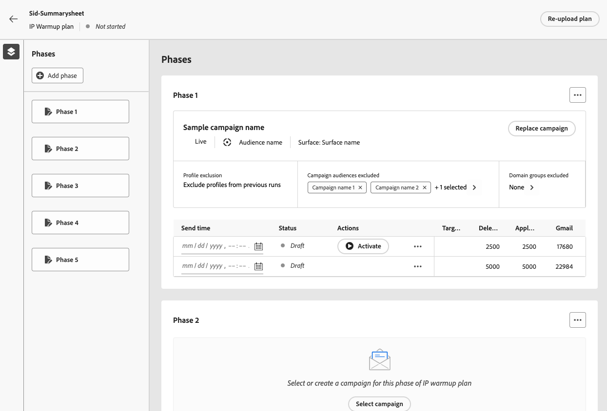

# Executar o plano de aquecimento de IP {#ip-warmup-running}

Depois de [criar um plano de aquecimento de IP](ip-warmup-plan.md) e carregar o arquivo preparado com seu consultor de entrega, você poderá definir as fases e execuções em seu plano.

Cada fase é composta por várias execuções, às quais você atribui uma única campanha.

## Definir as fases {#define-phases}

>[!CONTEXTUALHELP]
>id="ajo_admin_ip_warmup_campaigns_excluded"
>title="Excluir públicos-alvo da campanha"
>abstract="Selecione campanhas para excluir públicos-alvo delas da fase atual. Isso evita que perfis contatados anteriormente sejam direcionados novamente. Somente aqueles que receberam comunicação através da jornada serão excluídos."

>[!CONTEXTUALHELP]
>id="ajo_admin_ip_warmup_domains_excluded"
>title="Excluir grupos de domínio"
>abstract="Selecione os domínios que deseja excluir da fase atual. A exclusão de domínios requer uma fase não executada, portanto, talvez seja necessário dividir uma fase em execução para adicionar exclusões."
>additional-url="https://experienceleague.adobe.com/docs/journey-optimizer/using/configuration/implement-ip-warmup-plan/ip-warmup-execution.html?lang=pt-BR#split-phase" text="Dividir uma fase"

>[!CONTEXTUALHELP]
>id="ajo_admin_ip_warmup_phases"
>title="Definir as fases do plano"
>abstract="Cada fase é composta por várias execuções, às quais você atribui uma única campanha."

<!--You need to associate the campaign and audience at phase level and turns on some settings as needed for all runs associated with a single creative/campaign

At phase level, system ensures that previously targeted + new profiles are picked up AND at iteration level, system ensures that each run is having unique profiles and the count matches what is stated in plan-->

<!---->

1. Selecione a campanha que deseja associar à primeira fase do plano de aquecimento de IP.

   >[!NOTE]
   >
   >Não é possível selecionar uma campanha que já esteja em uso em outro plano de aquecimento de IP. No entanto, a mesma campanha pode ser usada em uma ou mais fases do mesmo plano de aquecimento de IP.

   

   >[!IMPORTANT]
   >
   >* Somente as campanhas com a opção **[!UICONTROL Ativação do plano de aquecimento de IP]** habilitada estão disponíveis para seleção. [Saiba mais](#create-ip-warmup-campaign)
   >
   >* Somente campanhas que usam a mesma superfície que o plano de aquecimento de IP selecionado estão disponíveis para seleção.

1. Depois que uma campanha é selecionada para a fase atual, as seções que excluem perfis, públicos da campanha e grupos de domínio são exibidas.

   >[!NOTE]
   >
   >Depois que uma execução é ativada, as exclusões não podem mais ser modificadas a menos que você [divida a execução](#split-phase) para uma nova fase.

   1. Na seção **[!UICONTROL Grupos de domínio excluídos]**, selecione os domínios que deseja excluir dessa fase.

      >[!NOTE]
      >
      >A exclusão de domínio requer uma fase não executada, portanto, pode ser necessário [dividir uma fase em execução](#split-phase) para adicionar exclusões.

      

      Por exemplo, após executar o aquecimento de IP por alguns dias, você percebe que a reputação do ISP com um domínio (por exemplo, Adobe) não é boa e deseja resolvê-la sem interromper o plano de aquecimento de IP. Nesse caso, você pode excluir o grupo de domínio Adobe.

      >[!NOTE]
      >
      >Você só pode excluir um grupo de domínios personalizado que foi adicionado ao [modelo de plano de aquecimento de IP](ip-warmup-plan.md#prepare-file). Se esse não for o caso, atualize o modelo com o grupo de domínio personalizado que deseja excluir e [carregue novamente o plano](#re-upload-plan).

   1. Na seção **[!UICONTROL Campanha para exclusão de perfis]**, selecione as campanhas que deseja excluir da fase atual.

      

      Por exemplo, ao executar a Fase 1, você tinha que [dividi-la](#split-phase) por qualquer motivo. Portanto, você pode excluir a campanha usada na Fase 1 para que os perfis contatados anteriormente da Fase 1 não sejam incluídos na Fase 2. Você também pode excluir campanhas de outros planos de aquecimento de IP.

   1. Na seção **[!UICONTROL Jornadas para exclusão de perfis]**, selecione as jornadas com os públicos que deseja excluir da fase atual.

+++ Para usar a opção Jornada for exclusion of profiles, é necessário estabelecer uma relação entre os esquemas AJO Message Feedback Event e AJO Entity Record.

      1. Crie um **Namespace** personalizado que servirá como tipo de identidade para as etapas abaixo.

      1. Acesse o Adobe Experience Platform, no menu **Esquemas**, selecione o **Esquema de Registro de Entidade da AJO** e defina o campo **_id** como a identidade principal, e selecione o namespace criado anteriormente como o **Namespace de identidade**.

      1. No menu **Esquemas**, selecione o **Esquema do Evento de Feedback de Mensagens do AJO** e navegue até o campo **_messageID**. Selecione **Adicionar relacionamento** e escolha **Esquema de Registro de Entidade do AJO** como o **Esquema de referência** e seu namespace criado anteriormente como o **Namespace de identidade de referência**.
+++

   1. Na seção **[!UICONTROL Perfis direcionados em execuções anteriores]**, é possível ver que os perfis das execuções anteriores dessa fase são sempre excluídos. Por exemplo, se em Run #1 um perfil foi coberto nas primeiras 4.800 pessoas que foram alvos, o sistema garantirá automaticamente que o mesmo perfil não receba o email em Run #2.

      >[!NOTE]
      >
      >Esta seção não é editável.

1. Se necessário, você poderá substituir a campanha usando o botão **[!UICONTROL Substituir]**. Você também pode **[!UICONTROL Limpar]** a campanha selecionada usando o botão **[!UICONTROL Limpar]**. Essa ação não só limpará a campanha, como também outras propriedades no nível da fase, como Exclusão de grupo do domínio, Campanha, Exclusão de Jornada e outras. Depois de limpar, você pode escolher uma nova campanha imediatamente ou em um momento posterior.

   

   >[!NOTE]
   >
   >Essa ação só é possível antes da ativação da primeira execução da fase. Uma vez ativada a execução, a campanha não poderá ser substituída, a menos que você [divida a execução](#split-phase) para uma nova fase.

1. Você pode adicionar uma fase, se necessário. Ele será adicionado após a última fase.

   

1. Use o botão **[!UICONTROL Excluir fase]** para remover qualquer fase não desejada. Essa ação só estará disponível se nenhuma execução for executada em uma fase. <!--Once a run is executed, deletion is not allowed.-->

   >[!CAUTION]
   >
   >Você não pode desfazer a ação **[!UICONTROL Excluir fase]**.

   

   >[!NOTE]
   >
   >Se você excluir todas as fases do plano de aquecimento de IP, é recomendável fazer upload de um plano novamente. [Saiba mais](#re-upload-plan)

## Definir as execuções {#define-runs}

>[!CONTEXTUALHELP]
>id="ajo_admin_ip_warmup_run"
>title="Definir cada execução"
>abstract="Defina e ative cada execução para todas as fases."

>[!CONTEXTUALHELP]
>id="ajo_admin_ip_warmup_last_engagement"
>title="Filtrar no engajamento"
>abstract="Essa coluna é um filtro que direciona somente os usuários engajados com sua marca nos últimos 20 dias, por exemplo. Também é possível alterar essa configuração por meio da opção **Editar execução**."

>[!CONTEXTUALHELP]
>id="ajo_admin_ip_warmup_retry"
>title="Definir uma janela de tempo"
>abstract="Você pode definir uma janela de tempo durante a qual a campanha de aquecimento de IP poderá ser executada, caso haja atrasos no processo de segmentação."

>[!CONTEXTUALHELP]
>id="ajo_admin_ip_warmup_pause"
>title="Cancelar execuções com erros de público-alvo"
>abstract="Selecione essa opção para cancelar uma execução se os perfis qualificados forem menores que os perfis direcionados após o público-alvo ter sido avaliado para a execução."

>[!CONTEXTUALHELP]
>id="ajo_admin_ip_warmup_qualified"
>title="Exibir os perfis qualificados"
>abstract="Essa coluna exibe o número de perfis qualificados. Caso haja mais perfis direcionados do que perfis qualificados após o público-alvo ser avaliado para uma execução, ela ainda é executada, a menos que a opção **Cancelar execuções ativadas em caso de erros** esteja habilitada. Nesse caso, a execução é cancelada."

1. Selecione uma programação para cada execução para garantir que ela seja executada no horário especificado.

   

1. Como opção, você pode definir uma janela de tempo durante a qual a campanha de aquecimento de IP poderá ser executada caso haja atrasos na [avaliação do público-alvo](https://experienceleague.adobe.com/docs/experience-platform/segmentation/home.html#how-segmentation-works){target="_blank"}. Para fazer isso, clique no ícone Propriedades na parte superior esquerda, ao lado do nome do plano e use a lista suspensa **[!UICONTROL Tentar novamente o tempo de execução]** para selecionar uma duração - até 240 minutos (4 horas).

   >[!NOTE]
   >
   >Ocorrem tentativas a cada 30 minutos até o final da janela de tempo definida.

   

   Por exemplo, se você definir um horário de envio em um determinado dia às 9h e selecionar 120 minutos como o tempo de execução de repetição, isso permitirá que uma janela de oportunidade de 2 horas (9h - 11h) para a execução seja executada para qualquer atraso inesperado na avaliação do público-alvo.

   >[!NOTE]
   >
   >Se nenhuma janela de tempo for especificada, a execução será tentada no momento do envio e falhará se a avaliação do público-alvo não for concluída.

1. Se necessário, selecione **[!UICONTROL Editar execução]** no ícone Mais ações. Lá é possível atualizar os números de endereços em cada coluna. Você também pode atualizar o campo **[!UICONTROL Último engajamento]** para direcionar somente os usuários engajados com sua marca nos últimos 20 dias, por exemplo.

   >[!NOTE]
   >
   >É recomendável modificar esses números após consultar seu especialista em capacidade de delivery.

   

   >[!NOTE]
   >
   >Para não aplicar nenhum período de envolvimento a uma execução, digite 0 no campo **[!UICONTROL Último envolvimento]**.

1. Selecione a opção **[!UICONTROL Cancelar execuções ativadas em caso de erros]** para cancelar uma execução se os perfis qualificados forem menores que os perfis direcionados depois que o público-alvo tiver sido avaliado para essa execução. Nesse caso, a execução recebe o status **[!UICONTROL Falha]**.

   

1. **[!UICONTROL Ativar]** a execução. [Saiba mais](#activate-run)

1. O status desta execução muda para **[!UICONTROL Live]**, significando que o sistema aceitou a solicitação para agendar a execução.

   >[!NOTE]
   >
   >Os diferentes status de execução estão listados em [esta seção](#monitor-plan).

1. Se a execução da campanha não tiver sido iniciada, é possível cancelar uma execução em tempo real. Na verdade, essa ação cancela o agendamento de execução - não interrompe o envio.

   

1. Para duplicar qualquer execução de rascunho, ativa ou concluída, selecione **[!UICONTROL Duplicar execução]**. Após a duplicação, o menu Editar executar é exibido, permitindo que os usuários ajustem o **[!UICONTROL Total de perfis de destino]** e o **[!UICONTROL Tempo de envio]** conforme necessário.

   

## Ativar execuções {#activate-run}

Para ativar uma execução, selecione o botão **[!UICONTROL Ativar]**. Em seguida, você pode ativar as próximas execuções diariamente.

Ao executar vários planos de aquecimento de IP simultaneamente, todos direcionados ao mesmo pool de IP e domínios, é fundamental antecipar as possíveis consequências. Por exemplo, se um ISP impor um limite diário de 100 emails, a execução de vários planos direcionados aos mesmos domínios poderá ultrapassar esse limite.

Certifique-se de ter agendado tempo suficiente para permitir que a [avaliação de público-alvo](https://experienceleague.adobe.com/docs/experience-platform/segmentation/home.html#how-segmentation-works){target="_blank"} seja executada.

>[!CAUTION]
>
>Cada execução deve ser ativada pelo menos 12 horas antes da hora real de envio. Caso contrário, a avaliação do público-alvo pode não ser concluída.

Quando você ativa uma execução, vários públicos são criados automaticamente.

* Se ativar a primeira execução de uma fase:

   * Um [público-alvo](https://experienceleague.adobe.com/docs/experience-platform/segmentation/ui/segment-builder.html?lang=pt-br){target="_blank"} é criado para os públicos da campanha excluídos (se houver), com a seguinte convenção de nomenclatura: `<warmupName>-Phase<phaseNo>-Audience Exclusion `.

   * Uma audiência é criada para os grupos de domínio excluídos (se houver), com a seguinte convenção de nomenclatura: `<warmupName>-Phase<phaseNo>-Domain Exclusion`.

   * Outro público-alvo é criado para os públicos-alvo do jornada excluídos (se houver), com a seguinte convenção de nomenclatura: `<warmupName>-Phase<phaseNo>-Journey Audience Exclusion`.

  >[!NOTE]
  >
  >Os públicos-alvo são limpos depois que o plano de aquecimento é marcado como concluído.
  >
  >O sistema não cria um novo público-alvo caso não haja alteração nos públicos-alvo de campanha excluídos, nos públicos-alvo de jornada excluídos ou nos grupos de domínio para as fases subsequentes.

* Ao ativar qualquer execução:

   * Outro público é criado para o último filtro de participação, com a seguinte convenção de nomenclatura: `<warmupName>-Phase<phaseNo>_Run<runNo>-Engagement Filter`.

     >[!NOTE]
     >
     >O público-alvo é limpo depois que o plano de aquecimento é marcado como concluído.
     >
     >O sistema não cria um novo público-alvo caso não haja alteração no último filtro de engajamento para as fases subsequentes.

   * Uma [composição de público-alvo](https://experienceleague.adobe.com/docs/experience-platform/segmentation/ui/audience-composition.html?lang=pt-BR){target="_blank"} é criada e corresponde ao público para o qual a campanha será enviada, com a seguinte convenção de nomenclatura: `<warmupName>-Phase<phaseNo>-Run<runNo>`.

     >[!NOTE]
     >
     >Uma nova composição de público-alvo é criada para cada execução. Com um limite de 10, os usuários que executam várias campanhas, jornadas e planos de aquecimento de IP simultaneamente usando composições de público publicadas devem planejar com antecedência para ficar dentro desse limite para operações paralelas.
     >
     >A composição do público-alvo (e, portanto, o público-alvo de saída) é limpa quando a próxima iteração é ativada.

   * Um público de saída é criado com a seguinte convenção de nomenclatura: `IP Warmup Audience-<warmupName>-Phase<phaseNo>-Run<runNo>`.

<!--How do you know when segmentation is complete? Is there a way to prevent user from scheduling less than 12 hours before the segmentation job?-->

<!--Sart to execute on every day basis by simply clicking the play button > for each run? do you have to come back every day to activate each run? or can you schedule them one after the other?)-->

<!--Upon activation, when the segment evaluation happens, more segments will be created by the IP warmup service and will be leveraged in an audience composition and a new audience will be created for each run splitted into the different selected domains.-->

## Monitorar o plano {#monitor-plan}

Para executar com êxito o plano de aquecimento de IP, é necessário monitorar os relatórios, ativar execuções e verificar o status diariamente.

### Usar a seção Destaques {#highlights}

Uma vez que a primeira execução é ativada para uma fase, a seção **[!UICONTROL Destaques]** é exibida.

Ele fornece uma visão geral rápida da execução atual e da próxima execução. Nesta seção, também é possível editar e ativar a próxima execução.

### Verificar os status de execução {#run-statuses}

O próprio plano de aquecimento de IP serve como um relatório consolidado em um único local. Você pode verificar elementos como o número de execuções do **[!UICONTROL Live]** ou **[!UICONTROL Concluídas]** para cada fase e ver como está progredindo seu plano de aquecimento de IP.

>[!NOTE]
>
>Como prática recomendada, é recomendável monitorar o plano de aquecimento de IP diariamente.

Uma execução pode ter os seguintes status:

* **[!UICONTROL Rascunho]** : sempre que uma execução é criada, ao [criar um novo plano](ip-warmup-plan.md) ou [adicionar uma execução](#define-runs) da interface do usuário, ele recebe o status **[!UICONTROL Rascunho]**.
* **[!UICONTROL Ao vivo]**: sempre que você ativar uma execução, ela receberá o status **[!UICONTROL Ao vivo]**. Significa que o sistema aceitou a solicitação para agendar a execução, não que o envio tenha começado. Nesse estágio, você pode observar o status da execução ao clicar no botão **[!UICONTROL Exibir status]** dentro da tabela. Isso permite rastrear quantos perfis segmentados foram realmente qualificados.
* **[!UICONTROL Concluído]**: a execução da campanha para esta execução foi concluída. Você pode acessar um relatório de execução detalhado clicando no botão **[!UICONTROL Exibir relatório]** na tabela. Essa opção permite rastrear o status do delivery de email da execução, incluindo detalhamentos específicos para grupos de domínio para monitoramento aprimorado. Observe que a Campanha associada a ela será definida como Parada.[Saiba mais](#reports)
* **[!UICONTROL Cancelado]**: uma execução do **[!UICONTROL Live]** foi cancelada com o botão **[!UICONTROL Cancelar]**.[Saiba mais](#define-runs)
* **[!UICONTROL Falha]**: o sistema encontrou um erro, a campanha usada para a fase atual foi interrompida ou você habilitou a opção **[!UICONTROL Cancelar execuções ativadas em caso de erros]** e ocorreu um erro. Se uma execução falhar, você poderá programar outra execução para o dia seguinte.

### Usar relatórios {#reports}

Em geral, para medir o impacto do seu plano, você pode verificar o desempenho de suas campanhas de aquecimento de IP usando os relatórios de campanha do [!DNL Journey Optimizer]. Para fazer isso, para cada execução concluída, você pode clicar no botão **[!UICONTROL Exibir relatórios]**. Saiba mais sobre o [relatório ao vivo](../reports/campaign-live-report.md#email-live) e o [relatório global](../reports/campaign-global-report.md#email-global) do email da campanha.

Você também pode acessar os relatórios do [menu Campanhas](../campaigns/modify-stop-campaign.md#access), pois seu plano pode usar campanhas diferentes.

## Gerencie seu plano {#manage-plan}

A qualquer momento, se o seu plano de aquecimento de IP não estiver funcionando como o esperado, você poderá executar as ações abaixo.

### Dividir uma fase {#split-phase}

Se quiser adicionar uma nova fase começando de uma execução específica, selecione a opção **[!UICONTROL Dividir execuções para uma nova fase]** no ícone Mais ações.

Uma nova fase é criada para as execuções restantes da fase atual.

Por exemplo, se você selecionar esta opção para Run #4, as execuções #4 para #8 serão movidas para uma nova fase logo após a fase atual.

Siga as etapas [acima](#define-phases) para definir a nova fase.

* Você pode usar as opções **[!UICONTROL Substituir]** ou **[!UICONTROL Limpar]** para essa nova fase.

* Você também pode excluir a campanha anterior ou um domínio que não esteja apresentando um bom desempenho. Saiba mais em [esta seção](#define-phases).

<!--
You don't have to decide the campaign upfront. You can do a split later. It's a work in progress plan: you activate one run at a time with a campaign and you always have the flexibility to modify it while working on it.

But need to explain in which case you want to modify campaigns, provide examples
-->

### Recarregar um plano de aquecimento de IP {#re-upload-plan}

Se o plano de aquecimento de IP não estiver funcionando como esperado (por exemplo, se você observar que alguns ISPs estão marcando suas mensagens como spam), você pode pedir ao seu especialista de capacidade de entrega para configurar outro arquivo de plano de aquecimento de IP e fazer upload novamente usando o botão correspondente.

Todas as execuções executadas anteriormente serão somente leitura. O novo plano é exibido abaixo do primeiro plano.

Siga as etapas [acima](#define-phases) para definir as fases do novo plano.

>[!NOTE]
>
>Os detalhes do plano de aquecimento de IP serão alterados conforme o arquivo recém-carregado. As execuções executadas anteriormente (independentemente do [status](#monitor-plan)) não são afetadas.

Vejamos um exemplo:

* Com o plano inicial de aquecimento de IP, a Fase 2 tinha 9 execuções.

* 4 execuções foram executadas (não importa se falharam, foram concluídas ou canceladas<!--as long as a run has been attempted, it is an executed run-->).

* Se você fizer upload novamente de um novo plano, a Fase 2 com as primeiras 4 execuções executadas entrará no modo somente leitura.

* As 5 execuções restantes (que estão em estado de rascunho) são movidas para uma nova fase (Fase 3) que é exibida de acordo com o plano recém-carregado.

### Marcar um plano como concluído {#mark-as-completed}

Se seus IPs foram aquecidos com o volume desejado, se seu plano não estiver funcionando bem o suficiente ou se você quiser descartá-lo para criar outro, poderá marcá-lo como concluído.

Para fazer isso, clique no botão **[!UICONTROL Mais]** na parte superior direita do plano de aquecimento de IP e selecione **[!UICONTROL Marcar como concluído]**.

Esta opção só estará disponível se todas as execuções no plano estiverem no status **[!UICONTROL Concluído]** ou **[!UICONTROL Rascunho]**. Se uma execução estiver **[!UICONTROL Ativa]**, a opção ficará esmaecida.

Os diferentes status de execução estão listados em [esta seção](#monitor-plan).

