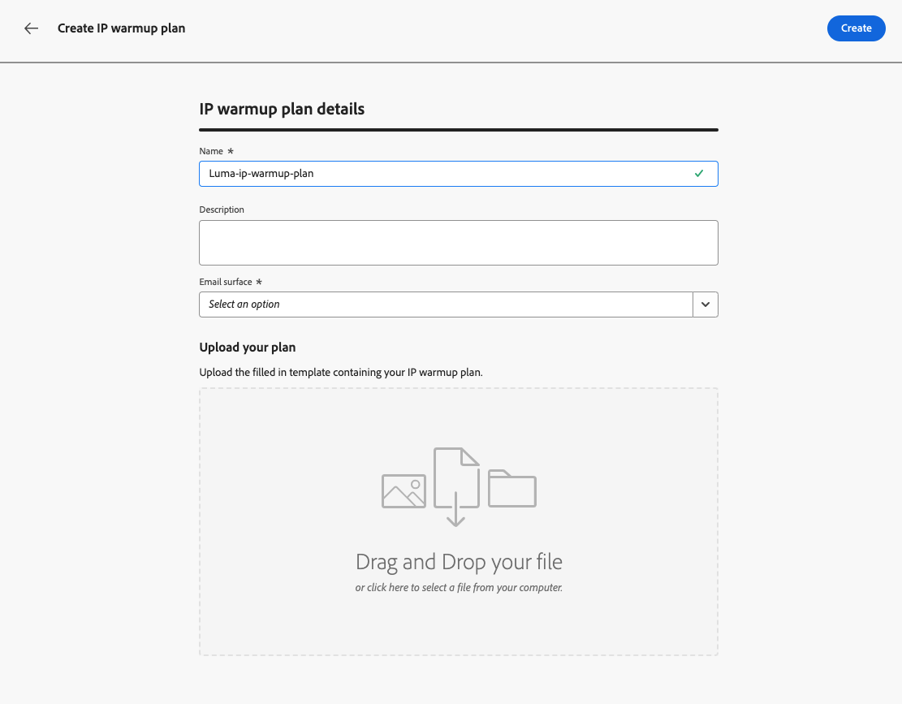

# Criar um plano de aquecimento de IP {#ip-warmup}

>[!BEGINSHADEBOX]

O que há neste guia de documentação:

* [Introdução ao aquecimento de IP](ip-warmup-gs.md)
* [Criar campanhas de aquecimento de IP](ip-warmup-campaign.md)
* **[Criar um plano de aquecimento de IP](ip-warmup-plan.md)**
* [Executar o plano de aquecimento de IP](ip-warmup-execution.md)

>[!ENDSHADEBOX]

Depois de criar um ou mais [Campanhas de aquecimento de IP](ip-warmup-campaign.md) com uma superfície dedicada e a opção correspondente ativada, você pode começar a criar seu plano de aquecimento de IP.

## Preparar o arquivo de plano de aquecimento de IP {#prepare-file}

O aquecimento de IP é uma atividade que consiste em aumentar gradualmente o volume de emails que saem de seus IPs e domínios para os principais provedores de serviços de Internet (ISPs), a fim de estabelecer sua reputação como remetente legítimo.

Essa atividade é normalmente realizada com a ajuda de um especialista em capacidade de entrega que ajuda a preparar um plano bem pensado com base nos domínios do setor, casos de uso, regiões, ISPs e vários outros fatores.

Ao trabalhar com a [!DNL Journey Optimizer] Recurso de aquecimento de IP, esse plano assume a forma de um arquivo do Excel que deve conter várias colunas predefinidas. Antes de poder criar um plano de aquecimento de IP no [!DNL Journey Optimizer] é necessário preencher esse template com todos os dados que alimentarão seu plano.

>[!CAUTION]
>
>Trabalhe com seu consultor de entrega para garantir que seu arquivo de plano de aquecimento de IP esteja configurado corretamente.

Veja abaixo um exemplo de um arquivo contendo um plano de aquecimento de IP.

### Guia Plano de aquecimento de IP

* Neste exemplo, um plano foi preparado abrangendo mais de 17 dias (chamado de &quot;**execuções**&quot;) para atingir um volume-alvo de mais de 1 milhão de perfis.

* Este planejado é executado até 6 **fases**, cada um deles contendo pelo menos uma execução.

* Você pode ter quantas colunas quiser para os domínios que deseja entregar. Neste exemplo, o plano é dividido em 6 colunas: 5 delas correspondem à variável **grupos de domínio principais** para usar no seu plano (Gmail, Microsoft, Yahoo, Orange e Apple) e na sexta coluna, **Outros**, contém todos os endereços restantes de outros domínios.
* A variável **Dias de engajamento** A coluna mostra que somente os perfis envolvidos com sua marca nos últimos 30 dias são direcionados.

A ideia é aumentar progressivamente o número de endereços direcionados em cada execução, enquanto reduz o número de execuções para cada fase.

Os grupos de domínio principais predefinidos que você pode adicionar ao seu plano estão listados abaixo:

* Gmail
* Adobe
* WP
* Comcast
* Yahoo
* Bigpond
* Laranja
* Softbank
* Docomo
* Internet Unificada
* Microsoft
* KDDI
* Italia Online
* La Poste
* Apple

### Guia Grupo de domínio personalizado

Você também pode adicionar mais colunas ao seu plano, incluindo grupos de domínio personalizados.

Use o **[!UICONTROL Grupo de domínio personalizado]** para definir um novo grupo de domínio. Para cada domínio, você pode adicionar todos os subdomínios que ele abrange.<!--TBC-->

Por exemplo, se você adicionar o domínio personalizado Luma, desejará que os seguintes subdomínios sejam incluídos: luma.com, luma.co.uk, luma.it, luma.fr, luma.de, etc.

## Acessar e gerenciar planos de aquecimento de IP {#manage-ip-warmup-plans}

1. Acesse o **[!UICONTROL Administração]** > **[!UICONTROL Canais]** > **[!UICONTROL Planos de aquecimento de IP]** menu. Todos os planos de aquecimento de IP criados até o momento são exibidos.

   

1. Você pode filtrar pelo status. Os diferentes status são:

   * **Não iniciado**: nenhuma execução foi ativada ainda. [Saiba mais](ip-warmup-execution.md#define-runs)
   * **Ao vivo**: o plano muda para esse status assim que a primeira execução na primeira fase é ativada com sucesso. [Saiba mais](ip-warmup-execution.md#define-runs)
   * **Concluído**: o plano foi marcado como concluído. Essa opção só estará disponível se todas as execuções no plano estiverem em **[!UICONTROL Com êxito]** ou **[!UICONTROL Rascunho]** status (nenhuma execução pode ser **[!UICONTROL Ao vivo]**). [Saiba mais](ip-warmup-execution.md#define-runs#mark-as-completed)
     <!--* **Paused**: to check (user action)-->

1. Para excluir um plano de aquecimento de IP, selecione o **[!UICONTROL Excluir]** ícone ao lado do nome de um plano e confirmar a exclusão.

   

   >[!CAUTION]
   >
   >O plano de aquecimento de IP selecionado será excluído permanentemente.

## Criar um plano de aquecimento de IP {#create-ip-warmup-plan}

>[!CONTEXTUALHELP]
>id="ajo_admin_ip_warmup_upload"
>title="Especificar seu plano de aquecimento de IP"
>abstract="Baixe o modelo CSV e preencha-o com os dados das fases de aquecimento de IP e o número alvo de perfis."

>[!CONTEXTUALHELP]
>id="ajo_admin_ip_warmup_surface"
>title="Selecionar uma superfície de marketing"
>abstract="Você deve selecionar a mesma superfície que a selecionada na campanha que deseja associar ao plano de aquecimento de IP."
>additional-url="https://experienceleague.adobe.com/docs/journey-optimizer/using/configuration/channel-surfaces.html?lang=pt-BR" text="Configurar superfícies de canais"
>additional-url="https://experienceleague.adobe.com/docs/journey-optimizer/using/configuration/channel-surfaces.html?lang=pt-BR" text="Criar campanhas de aquecimento de IP"

Quando uma ou mais campanhas ativas com o **[!UICONTROL Ativação do plano de aquecimento de IP]** estiver ativada, você poderá associá-los a um plano de aquecimento de IP.

>[!CAUTION]
>
>Para criar, editar e excluir os planos de aquecimento de IP, você deve ter a **[!UICONTROL Consultor de avaliação de entrega]** permissão. <!--Learn more on managing [!DNL Journey Optimizer] users' access rights in [this section](../administration/permissions-overview.md).-->

1. Acesse o **[!UICONTROL Administração]** > **[!UICONTROL Canais]** > **[!UICONTROL Planos de aquecimento de IP]** e clique em **[!UICONTROL Criar plano de aquecimento de IP]**.

   

1. Preencha os detalhes do plano de aquecimento de IP: dê a ele um nome e uma descrição.

   

1. Selecione um [superfície](channel-surfaces.md). Somente as superfícies de marketing estão disponíveis para seleção. [Saiba mais sobre tipo de email](../email/email-settings.md#email-type)

   >[!CAUTION]
   >
   >Você deve selecionar a mesma superfície que a selecionada na campanha que deseja associar ao plano de aquecimento de IP. [Saiba como criar uma campanha de aquecimento de IP](ip-warmup-campaign.md)

1. Carregue o arquivo do Excel que contém seu plano de aquecimento de IP. [Saiba mais](#prepare-file)

   <!--
    You can also download the Excel template from the [!DNL Journey Optimizer] user interface and upload it after filling it with the IP warmup details.-->

   

1. Clique em **[!UICONTROL Criar]**. Todas as fases, execuções, colunas e seu conteúdo definido no arquivo que você carregou são automaticamente exibidas na [!DNL Journey Optimizer] interface. [Saiba mais](ip-warmup-execution.md)

   
